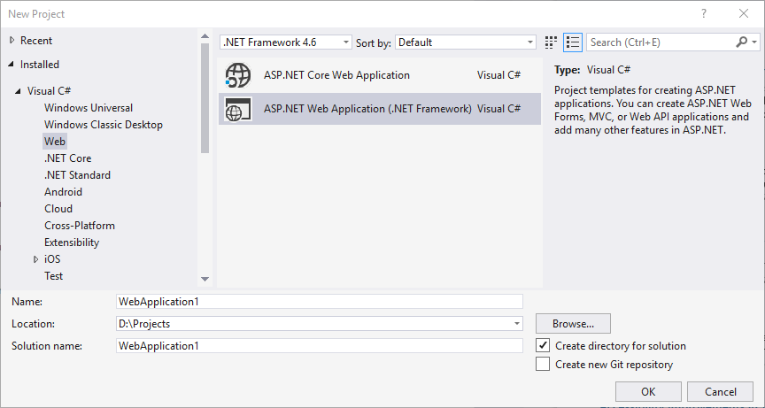
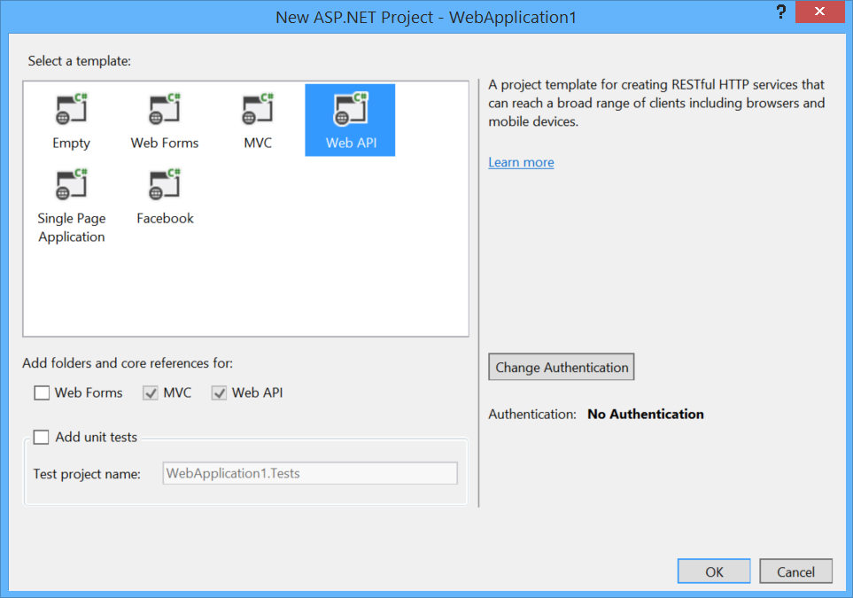
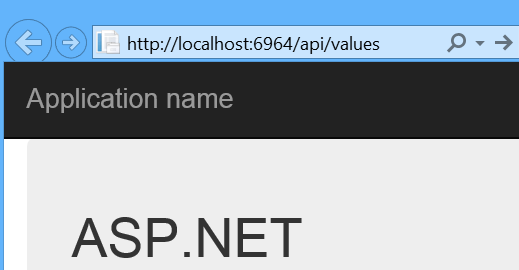

Tracing in ASP.NET Web API 2
====================
by [Mike Wasson](https://github.com/MikeWasson)

> When you are trying to debug a web-based application, there is no substitute for a good set of trace logs. This tutorial shows how to enable tracing in ASP.NET Web API. You can use this feature to trace what the Web API framework does before and after it invokes your controller. You can also use it to trace your own code.
> 
> ## Software versions used in the tutorial
> 
> 
> - [Visual Studio 2017](https://www.visualstudio.com/downloads/) (also works with Visual Studio 2015)
> - Web API 2
> - [Microsoft.AspNet.WebApi.Tracing](http://www.nuget.org/packages/Microsoft.AspNet.WebApi.Tracing)

## Enable System.Diagnostics Tracing in Web API

First, we'll create a new ASP.NET Web Application project. In Visual Studio, from the **File** menu, select **New**, then **Project**. Under **Templates**, **Web**, select **ASP.NET Web Application**.

Choose the Web API project template.

From the **Tools** menu, select **Library Package Manager**, then **Package Manage Console**.

In the Package Manager Console window, type the following commands.

[!code-console[Main](tracing-in-aspnet-web-api/samples/sample1.cmd)]

The first command installs the latest Web API tracing package. It also updates the core Web API packages. The second command updates the WebApi.WebHost package to the latest version.

> [!NOTE]
> If you want to target a specific version of Web API, use the -Version flag when you install the tracing package.

Open the file WebApiConfig.cs in the App\_Start folder. Add the following code to the **Register** method.

[!code-csharp[Main](tracing-in-aspnet-web-api/samples/sample2.cs?highlight=6)]

This code adds the [SystemDiagnosticsTraceWriter](https://msdn.microsoft.com/en-us/library/system.web.http.tracing.systemdiagnosticstracewriter.aspx) class to the Web API pipeline. The **SystemDiagnosticsTraceWriter** class writes traces to [System.Diagnostics.Trace](https://msdn.microsoft.com/en-us/library/system.diagnostics.trace).

To see the traces, run the application in the debugger. In the browser, navigate to `/api/values`.

The trace statements are written to the Output window in Visual Studio. (From the **View** menu, select **Output**).

Because **SystemDiagnosticsTraceWriter** writes traces to **System.Diagnostics.Trace**, you can register additional trace listeners; for example, to write traces to a log file. For more information about trace writers, see the [Trace Listeners](https://msdn.microsoft.com/en-us/library/4y5y10s7.aspx) topic on MSDN.

### Configuring SystemDiagnosticsTraceWriter

The following code shows how to configure the trace writer.

[!code-csharp[Main](tracing-in-aspnet-web-api/samples/sample3.cs)]

There are two settings that you can control:

- IsVerbose: If false, each trace contains minimal information. If true, traces include more information.
- MinimumLevel: Sets the minimum trace level. Trace levels, in order, are Debug, Info, Warn, Error, and Fatal.

## Adding Traces to Your Web API Application

Adding a trace writer gives you immediate access to the traces created by the Web API pipeline. You can also use the trace writer to trace your own code:

[!code-csharp[Main](tracing-in-aspnet-web-api/samples/sample4.cs)]

To get the trace writer, call **HttpConfiguration.Services.GetTraceWriter**. From a controller, this method is accessible through the **ApiController.Configuration** property.

To write a trace, you can call the **ITraceWriter.Trace** method directly, but the [ITraceWriterExtensions](https://msdn.microsoft.com/en-us/library/system.web.http.tracing.itracewriterextensions.aspx) class defines some extension methods that are more friendly. For example, the **Info** method shown above creates a trace with trace level **Info**.

## Web API Tracing Infrastructure

This section describes how to write a custom trace writer for Web API.

The Microsoft.AspNet.WebApi.Tracing package is built on top of a more general tracing infrastructure in Web API. Instead of using Microsoft.AspNet.WebApi.Tracing, you can also plug in some other tracing/loggin library, such as [NLog](http://nlog-project.org/) or [log4net](http://logging.apache.org/log4net/).

To collect traces, implement the **ITraceWriter** interface. Here is a simple example:

[!code-csharp[Main](tracing-in-aspnet-web-api/samples/sample5.cs)]

The **ITraceWriter.Trace** method creates a trace. The caller specifies a category and trace level. The category can be any user-defined string. Your implementation of **Trace** should do the following:

1. Create a new **TraceRecord**. Initialize it with the request, category, and trace level, as shown. These values are provided by the caller.
2. Invoke the *traceAction* delegate. Inside this delegate, the caller is expected to fill in the rest of the **TraceRecord**.
3. Write the **TraceRecord**, using any logging technique that you like. The example shown here simply calls into **System.Diagnostics.Trace**.

## Setting the Trace Writer

To enable tracing, you must configure Web API to use your **ITraceWriter** implementation. You do this through the **HttpConfiguration** object, as shown in the following code:

[!code-csharp[Main](tracing-in-aspnet-web-api/samples/sample6.cs)]

Only one trace writer can be active. By default, Web API sets a &quot;no-op&quot; tracer that does nothing. (The &quot;no-op&quot; tracer exists so that tracing code does not have to check whether the trace writer is **null** before writing a trace.)

## How Web API Tracing Works

Tracing in Web API uses a in Web API uses a *facade* pattern: When tracing is enabled, Web API wraps various parts of the request pipeline with classes that perform trace calls.

For example, when selecting a controller, the pipeline uses the **IHttpControllerSelector** interface. With tracing enabled, the pipleline inserts a class that implements **IHttpControllerSelector** but calls through to the real implementation:

The benefits of this design include:

- If you do not add a trace writer, the tracing components are not instantiated and have no performance impact.
- If you replace default services such as **IHttpControllerSelector** with your own custom implementation, tracing is not affected, because tracing is done by the wrapper object.

You can also replace the entire Web API trace framework with your own custom framework, by replacing the default **ITraceManager** service:

[!code-csharp[Main](tracing-in-aspnet-web-api/samples/sample7.cs)]

Implement **ITraceManager.Initialize** to initialize your tracing system. Be aware that this replaces the *entire* trace framework, including all of the tracing code that is built into Web API.