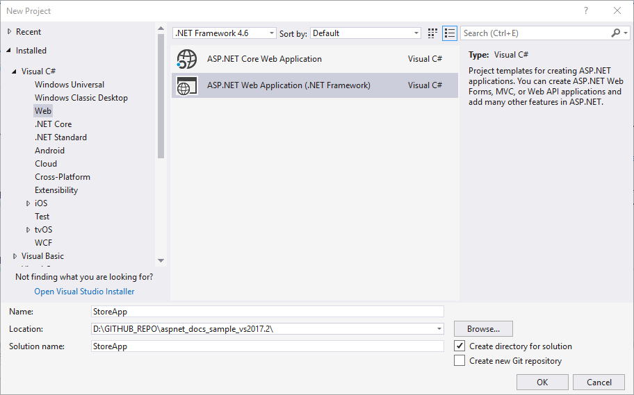
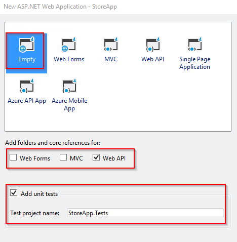
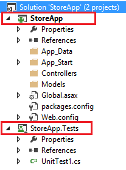
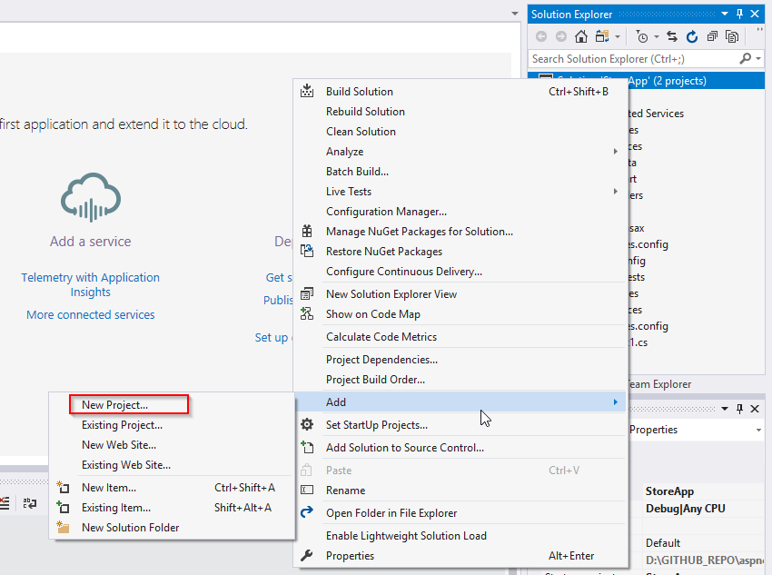
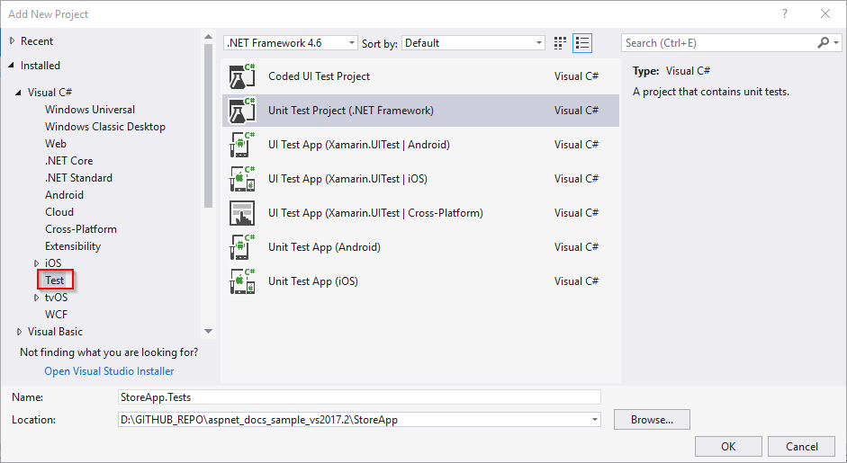
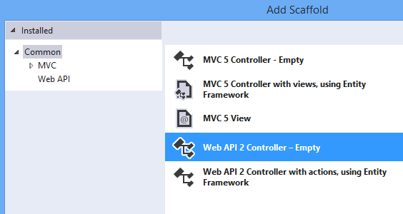
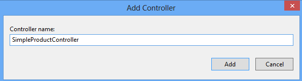
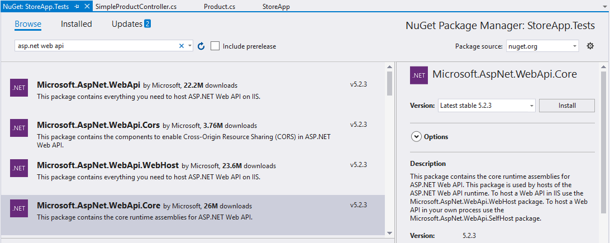
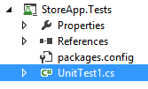
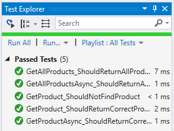

Unit Testing ASP.NET Web API 2
====================
by [Tom FitzMacken](https://github.com/tfitzmac)

[Download Completed Project](http://code.msdn.microsoft.com/Unit-Testing-with-ASPNET-e2867d4d)

> This guidance and application demonstrate how to create simple unit tests for your Web API 2 application. This tutorial shows how to include a unit test project in your solution, and write test methods that check the returned values from a controller method.
> 
> This tutorial assumes you are familiar with the basic concepts of ASP.NET Web API. For an introductory tutorial, see [Getting Started with ASP.NET Web API 2](../getting-started-with-aspnet-web-api/tutorial-your-first-web-api.md).
> 
> The unit tests in this topic are intentionally limited to simple data scenarios. For unit testing more advanced data scenarios, see [Mocking Entity Framework when Unit Testing ASP.NET Web API 2](mocking-entity-framework-when-unit-testing-aspnet-web-api-2.md).
> 
> ## Software versions used in the tutorial
> 
> 
> - [Visual Studio 2013](https://www.microsoft.com/visualstudio/eng/2013-downloads)
> - Web API 2

## In this topic

This topic contains the following sections:

- [Prerequisites](#prereqs)
- [Download code](#download)
- [Create application with unit test project](#appwithunittest)

    - [Add unit test project when creating the application](#whencreate)
    - [Add unit test project to an existing application](#addtoexisting)
- [Set up the Web API 2 application](#setupproject)
- [Install NuGet packages in test project](#testpackages)
- [Create tests](#tests)
- [Run tests](#runtests)

## Prerequisites

Visual Studio 2013 or Visual Studio Express 2013 for Web

## Download code

Download the [completed project](https://code.msdn.microsoft.com/Unit-Testing-with-ASPNET-e2867d4d). The downloadable project includes unit test code for this topic and for the [Mocking Entity Framework when Unit Testing ASP.NET Web API](mocking-entity-framework-when-unit-testing-aspnet-web-api-2.md) topic.

## Create application with unit test project

You can either create a unit test project when creating your application or add a unit test project to an existing application. This tutorial shows both methods for creating a unit test project. To follow this tutorial, you can use either approach.

### Add unit test project when creating the application

Create a new ASP.NET Web Application named **StoreApp**.

In the New ASP.NET Project windows, select the **Empty** template and add folders and core references for Web API. Select the **Add unit tests** option. The unit test project is automatically named **StoreApp.Tests**. You can keep this name.

After creating the application, you will see it contains two projects.

### Add unit test project to an existing application

If you did not create the unit test project when you created your application, you can add one at any time. For example, suppose you already have an application named StoreApp, and you want to add unit tests. To add a unit test project, right-click your solution and select **Add** and **New Project**.

Select **Test** in the left pane, and select **Unit Test Project** for the project type. Name the project **StoreApp.Tests**.

You will see the unit test project in your solution.

In the unit test project, add a project reference to the original project.

## Set up the Web API 2 application

In your StoreApp project, add a class file to the **Models** folder named **Product.cs**. Replace the contents of the file with the following code.

[!code-csharp[Main](unit-testing-with-aspnet-web-api/samples/sample1.cs)]

Build the solution.

Right-click the Controllers folder and select **Add** and **New Scaffolded Item**. Select **Web API 2 Controller - Empty**.

Set the controller name to **SimpleProductController**, and click **Add**.

Replace the existing code with the following code. To simplify this example, the data is stored in a list rather than a database. The list defined in this class represents the production data. Notice that the controller includes a constructor that takes as a parameter a list of Product objects. This constructor enables you to pass test data when unit testing. The controller also includes two **async** methods to illustrate unit testing asynchronous methods. These async methods were implemented by calling **Task.FromResult** to minimize extraneous code, but normally the methods would include resource-intensive operations.

[!code-csharp[Main](unit-testing-with-aspnet-web-api/samples/sample2.cs)]

The GetProduct method returns an instance of the **IHttpActionResult** interface. IHttpActionResult is one of the new features in Web API 2, and it simplifies unit test development. Classes that implement the IHttpActionResult interface are found in the [System.Web.Http.Results](https://msdn.microsoft.com/en-us/library/system.web.http.results.aspx) namespace. These classes represent possible responses from an action request, and they correspond to HTTP status codes.

Build the solution.

You are now ready to set up the test project.

## Install NuGet packages in test project

When you use the Empty template to create an application, the unit test project (StoreApp.Tests) does not include any installed NuGet packages. Other templates, such as the Web API template, include some NuGet packages in the unit test project. For this tutorial, you must include the Microsoft ASP.NET Web API 2 Core package to the test project.

Right-click the StoreApp.Tests project and select **Manage NuGet Packages**. You must select the StoreApp.Tests project to add the packages to that project.

Find and install Microsoft ASP.NET Web API 2 Core package.

Close the Manage NuGet Packages window.

## Create tests

By default, your test project includes an empty test file named UnitTest1.cs. This file shows the attributes you use to create test methods. For your unit tests, you can either use this file or create your own file.

For this tutorial, you will create your own test class. You can delete the UnitTest1.cs file. Add a class named **TestSimpleProductController.cs**, and replace the code with the following code.

[!code-csharp[Main](unit-testing-with-aspnet-web-api/samples/sample3.cs)]

## Run tests

You are now ready to run the tests. All of the method that are marked with the **TestMethod** attribute will be tested. From the **Test** menu item, run the tests.

Open the **Test Explorer** window, and notice the results of the tests.

## Summary

You have completed this tutorial. The data in this tutorial was intentionally simplified to focus on unit testing conditions. For unit testing more advanced data scenarios, see [Mocking Entity Framework when Unit Testing ASP.NET Web API 2](mocking-entity-framework-when-unit-testing-aspnet-web-api-2.md).