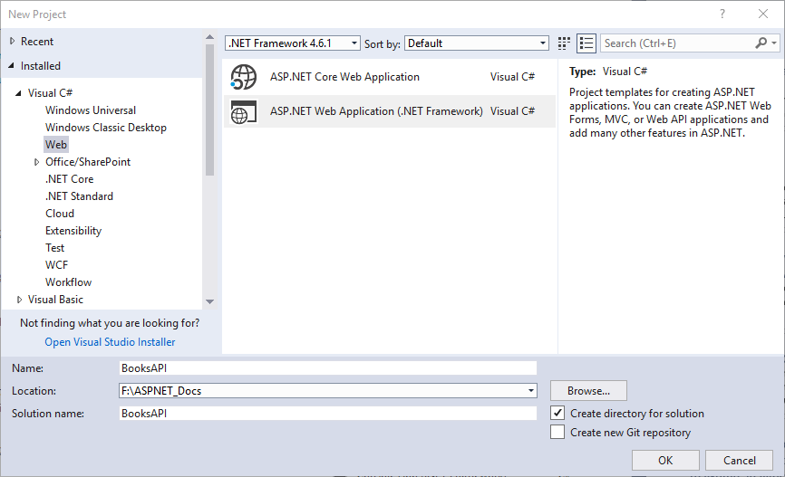
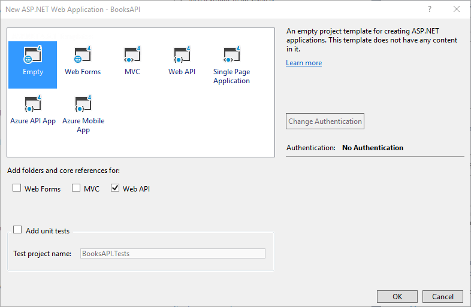
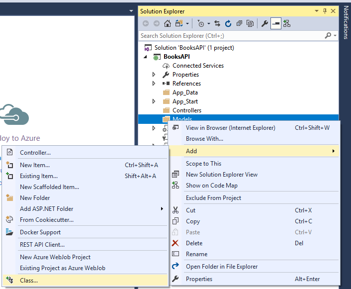
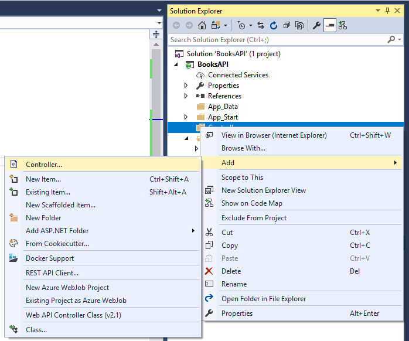
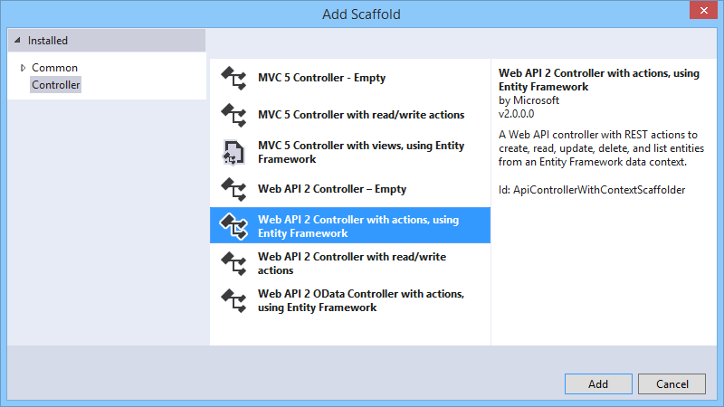
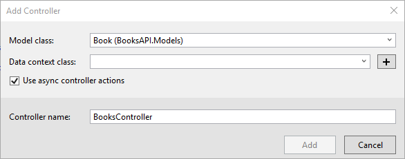
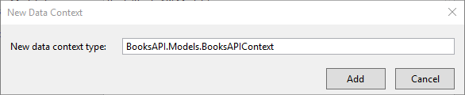
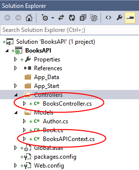
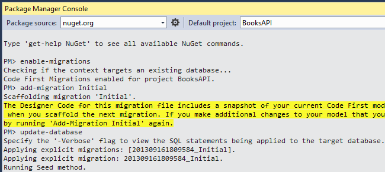

Create a REST API with Attribute Routing in ASP.NET Web API 2
====================
by [Mike Wasson](https://github.com/MikeWasson)

Web API 2 supports a new type of routing, called *attribute routing*. For a general overview of attribute routing, see [Attribute Routing in Web API 2](attribute-routing-in-web-api-2.md). In this tutorial, you will use attribute routing to create a REST API for a collection of books. The API will support the following actions:

| Action | Example URI |
| --- | --- |
| Get a list of all books. | /api/books |
| Get a book by ID. | /api/books/1 |
| Get the details of a book. | /api/books/1/details |
| Get a list of books by genre. | /api/books/fantasy |
| Get a list of books by publication date. | /api/books/date/2013-02-16 /api/books/date/2013/02/16 (alternate form) |
| Get a list of books by a particular author. | /api/authors/1/books |

All methods are read-only (HTTP GET requests).

For the data layer, we'll use Entity Framework. Book records will have the following fields:

- ID
- Title
- Genre
- Publication date
- Price
- Description
- AuthorID (foreign key to an Authors table)

For most requests, however, the API will return a subset of this data (title, author, and genre). To get the complete record, the client requests `/api/books/{id}/details`.

## Prerequisites

[Visual Studio 2013](https://www.microsoft.com/visualstudio/eng/2013-downloads) or [Visual Studio Express 2013](https://www.microsoft.com/visualstudio/eng/2013-downloads#d-2013-express)

## Create the Visual Studio Project

Start by running Visual Studio. From the **File** menu, select **New** and then select **Project**.

In the **Templates** pane, select **Installed Templates** and expand the **Visual C#** node. Under **Visual C#**, select **Web**. In the list of project templates, select **ASP.NET MVC 4 Web Application**. Name the project &quot;BooksAPI&quot;.

In the **New ASP.NET Project** dialog, select the **Empty** template. Under "Add folders and core references for", select the **Web API** checkbox. Click **Create Project**.

This creates a skeleton project that is configured for Web API functionality.

### Domain Models

Next, add classes for domain models. In Solution Explorer, right-click the Models folder. Select **Add**, then select **Class**. Name the class `Author`.

Replace the code in Author.cs with the following:

[!code-csharp[Main](create-a-rest-api-with-attribute-routing/samples/sample1.cs)]

Now add another class named `Book`.

[!code-csharp[Main](create-a-rest-api-with-attribute-routing/samples/sample2.cs)]

### Add a Web API Controller

In this step, we'll add a Web API controller that uses Entity Framework as the data layer.

Press CTRL+SHIFT+B to build the project. Entity Framework uses reflection to discover the properties of the models, so it requires a compiled assembly to create the database schema.

In Solution Explorer, right-click the Controllers folder. Select **Add**, then select **Controller**.

In the **Add Scaffold** dialog, select "Web API 2 Controller with read/write actions, using Entity Framework."

In the **Add Controller** dialog, for **Controller name**, enter &quot;BooksController&quot;. Select the &quot;Use async controller actions&quot; checkbox. For **Model class**, select &quot;Book&quot;. (If you don't see the `Book` class listed in the dropdown, make sure that you built the project.) Then click the "&lt;New data context...&gt;" button.

Click **Add** in the **New Data Context** dialog.

Click **Add** in the **Add Controller** dialog. The scaffolding adds a class named `BooksController` that defines the API controller. It also adds a class named `BooksAPIContext` in the Models folder, which defines the data context for Entity Framework.

### Seed the Database

From the Tools menu, select **Library Package Manager**, and then select **Package Manager Console**.

In the Package Manager Console window, enter the following command:

[!code-powershell[Main](create-a-rest-api-with-attribute-routing/samples/sample3.ps1)]

This command creates a Migrations folder and adds a new code file named Configuration.cs. Open this file and add the following code to the `Configuration.Seed` method.

[!code-csharp[Main](create-a-rest-api-with-attribute-routing/samples/sample4.cs)]

In the Package Manager Console window, type the following commands.

[!code-powershell[Main](create-a-rest-api-with-attribute-routing/samples/sample5.ps1)]

These commands create a local database and invoke the Seed method to populate the database.

## Add DTO Classes

If you run the application now and send a GET request to /api/books/1, the response looks similar to the following. (I added indentation for readability.)

[!code-json[Main](create-a-rest-api-with-attribute-routing/samples/sample6.json)]

Instead, I want this request to return a subset of the fields. Also, I want it to return the author's name, rather than the author ID. To accomplish this, we'll modify the controller methods to return a *data transfer object* (DTO) instead of the EF model. A DTO is an object that is designed only to carry data.

In Solution Explorer, right-click the project and select **Add** | **New Folder**. Name the folder &quot;DTOs&quot;. Add a class named `BookDto` to the DTOs folder, with the following definition:

[!code-csharp[Main](create-a-rest-api-with-attribute-routing/samples/sample7.cs)]

Add another class named `BookDetailDto`.

[!code-csharp[Main](create-a-rest-api-with-attribute-routing/samples/sample8.cs)]

Next, update the `BooksController` class to return `BookDto` instances. We'll use the [Queryable.Select](https://msdn.microsoft.com/en-us/library/system.linq.queryable.select.aspx) method to project `Book` instances to `BookDto` instances. Here is the updated code for the controller class.

[!code-csharp[Main](create-a-rest-api-with-attribute-routing/samples/sample9.cs)]

> [!NOTE]
> I deleted the `PutBook`, `PostBook`, and `DeleteBook` methods, because they aren't needed for this tutorial.

Now if you run the application and request /api/books/1, the response body should look like this:

[!code-json[Main](create-a-rest-api-with-attribute-routing/samples/sample10.json)]

## Add Route Attributes

Next, we'll convert the controller to use attribute routing. First, add a **RoutePrefix** attribute to the controller. This attribute defines the initial URI segments for all methods on this controller.

[!code-csharp[Main](create-a-rest-api-with-attribute-routing/samples/sample11.cs?highlight=1)]

Then add **[Route]** attributes to the controller actions, as follows:

[!code-csharp[Main](create-a-rest-api-with-attribute-routing/samples/sample12.cs?highlight=1,7)]

The route template for each controller method is the prefix plus the string specified in the **Route** attribute. For the `GetBook` method, the route template includes the parameterized string &quot;{id:int}&quot;, which matches if the URI segment contains an integer value.

| Method | Route Template | Example URI |
| --- | --- | --- |
| `GetBooks` | "api/books" | `http://localhost/api/books` |
| `GetBook` | "api/books/{id:int}" | `http://localhost/api/books/5` |

## Get Book Details

To get book details, the client will send a GET request to `/api/books/{id}/details`, where *{id}* is the ID of the book.

Add the following method to the `BooksController` class.

[!code-csharp[Main](create-a-rest-api-with-attribute-routing/samples/sample13.cs)]

If you request `/api/books/1/details`, the response looks like this:

[!code-json[Main](create-a-rest-api-with-attribute-routing/samples/sample14.json)]

## Get Books By Genre

To get a list of books in a specific genre, the client will send a GET request to `/api/books/genre`, where *genre* is the name of the genre. (For example, `/get/books/fantasy`.)

Add the following method to `BooksController`.

[!code-csharp[Main](create-a-rest-api-with-attribute-routing/samples/sample15.cs)]

Here we are defining a route that contains a {genre} parameter in the URI template. Notice that Web API is able to distinguish these two URIs and route them to different methods:

`/api/books/1`

`/api/books/fantasy`

That's because the `GetBook` method includes a constraint that the "id" segment must be an integer value:

[!code-csharp[Main](create-a-rest-api-with-attribute-routing/samples/sample16.cs?highlight=1)]

If you request /api/books/fantasy, the response looks like this:

`[ { "Title": "Midnight Rain", "Author": "Ralls, Kim", "Genre": "Fantasy" }, { "Title": "Maeve Ascendant", "Author": "Corets, Eva", "Genre": "Fantasy" }, { "Title": "The Sundered Grail", "Author": "Corets, Eva", "Genre": "Fantasy" } ]`

## Get Books By Author

To get a list of a books for a particular author, the client will send a GET request to `/api/authors/id/books`, where *id* is the ID of the author.

Add the following method to `BooksController`.

[!code-csharp[Main](create-a-rest-api-with-attribute-routing/samples/sample17.cs)]

This example is interesting because &quot;books&quot; is treated a child resource of &quot;authors&quot;. This pattern is quite common in RESTful APIs.

The tilde (~) in the route template overrides the route prefix in the **RoutePrefix** attribute.

## Get Books By Publication Date

To get a list of books by publication date, the client will send a GET request to `/api/books/date/yyyy-mm-dd`, where *yyyy-mm-dd* is the date.

Here is one way to do this:

[!code-csharp[Main](create-a-rest-api-with-attribute-routing/samples/sample18.cs)]

The `{pubdate:datetime}` parameter is constrained to match a **DateTime** value. This works, but it's actually more permissive than we'd like. For example, these URIs will also match the route:

`/api/books/date/Thu, 01 May 2008`

`/api/books/date/2000-12-16T00:00:00`

There's nothing wrong with allowing these URIs. However, you can restrict the route to a particular format by adding a regular-expression constraint to the route template:

[!code-csharp[Main](create-a-rest-api-with-attribute-routing/samples/sample19.cs?highlight=1)]

Now only dates in the form &quot;yyyy-mm-dd&quot; will match. Notice that we don't use the regex to validate that we got a real date. That is handled when Web API tries to convert the URI segment into a **DateTime** instance. An invalid date such as '2012-47-99' will fail to be converted, and the client will get a 404 error.

You can also support a slash separator (`/api/books/date/yyyy/mm/dd`) by adding another **[Route]** attribute with a different regex.

[!code-html[Main](create-a-rest-api-with-attribute-routing/samples/sample20.html)]

There is a subtle but important detail here. The second route template has a wildcard character (\*) at the start of the {pubdate} parameter:

[!code-json[Main](create-a-rest-api-with-attribute-routing/samples/sample21.json)]

This tells the routing engine that {pubdate} should match the rest of the URI. By default, a template parameter matches a single URI segment. In this case, we want {pubdate} to span several URI segments:

`/api/books/date/2013/06/17`

## Controller Code

Here is the complete code for the BooksController class.

[!code-csharp[Main](create-a-rest-api-with-attribute-routing/samples/sample22.cs)]

## Summary

Attribute routing gives you more control and greater flexibility when designing the URIs for your API.
