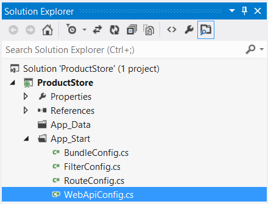

Routing in ASP.NET Web API
====================
by [Mike Wasson](https://github.com/MikeWasson)

This article describes how ASP.NET Web API routes HTTP requests to controllers.

> [!NOTE]
> If you are familiar with ASP.NET MVC, Web API routing is very similar to MVC routing. The main difference is that Web API uses the HTTP method, not the URI path, to select the action. You can also use MVC-style routing in Web API. This article does not assume any knowledge of ASP.NET MVC.

## Routing Tables

In ASP.NET Web API, a *controller* is a class that handles HTTP requests. The public methods of the controller are called *action methods* or simply *actions*. When the Web API framework receives a request, it routes the request to an action.

To determine which action to invoke, the framework uses a *routing table*. The Visual Studio project template for Web API creates a default route:

[!code-csharp[Main](routing-in-aspnet-web-api/samples/sample1.cs)]

This route is defined in the WebApiConfig.cs file, which is placed in the App\_Start directory:

For more information about the **WebApiConfig** class, see [Configuring ASP.NET Web API](../advanced/configuring-aspnet-web-api.md).

If you self-host Web API, you must set the routing table directly on the **HttpSelfHostConfiguration** object. For more information, see [Self-Host a Web API](../older-versions/self-host-a-web-api.md).

Each entry in the routing table contains a *route template*. The default route template for Web API is &quot;api/{controller}/{id}&quot;. In this template, &quot;api&quot; is a literal path segment, and {controller} and {id} are placeholder variables.

When the Web API framework receives an HTTP request, it tries to match the URI against one of the route templates in the routing table. If no route matches, the client receives a 404 error. For example, the following URIs match the default route:

- /api/contacts
- /api/contacts/1
- /api/products/gizmo1

However, the following URI does not match, because it lacks the &quot;api&quot; segment:

- /contacts/1

> [!NOTE]
> The reason for using "api" in the route is to avoid collisions with ASP.NET MVC routing. That way, you can have &quot;/contacts&quot; go to an MVC controller, and &quot;/api/contacts&quot; go to a Web API controller. Of course, if you don't like this convention, you can change the default route table.

Once a matching route is found, Web API selects the controller and the action:

- To find the controller, Web API adds &quot;Controller&quot; to the value of the *{controller}* variable.
- To find the action, Web API looks at the HTTP method, and then looks for an action whose name begins with that HTTP method name. For example, with a GET request, Web API looks for an action that starts with &quot;Get...&quot;, such as &quot;GetContact&quot; or &quot;GetAllContacts&quot;. This convention applies only to GET, POST, PUT, and DELETE methods. You can enable other HTTP methods by using attributes on your controller. We'll see an example of that later.
- Other placeholder variables in the route template, such as *{id},* are mapped to action parameters.

Let's look at an example. Suppose that you define the following controller:

[!code-csharp[Main](routing-in-aspnet-web-api/samples/sample2.cs)]

Here are some possible HTTP requests, along with the action that gets invoked for each:

| HTTP Method | URI Path | Action | Parameter |
| --- | --- | --- | --- |
| GET | api/products | GetAllProducts | *(none)* |
| GET | api/products/4 | GetProductById | 4 |
| DELETE | api/products/4 | DeleteProduct | 4 |
| POST | api/products | *(no match)* |  |

Notice that the *{id}* segment of the URI, if present, is mapped to the *id* parameter of the action. In this example, the controller defines two GET methods, one with an *id* parameter and one with no parameters.

Also, note that the POST request will fail, because the controller does not define a &quot;Post...&quot; method.

## Routing Variations

The previous section described the basic routing mechanism for ASP.NET Web API. This section describes some variations.

### HTTP Methods

Instead of using the naming convention for HTTP methods, you can explicitly specify the HTTP method for an action by decorating the action method with the **HttpGet**, **HttpPut**, **HttpPost**, or **HttpDelete** attribute.

In the following example, the FindProduct method is mapped to GET requests:

[!code-csharp[Main](routing-in-aspnet-web-api/samples/sample3.cs)]

To allow multiple HTTP methods for an action, or to allow HTTP methods other than GET, PUT, POST, and DELETE, use the **AcceptVerbs** attribute, which takes a list of HTTP methods.

[!code-csharp[Main](routing-in-aspnet-web-api/samples/sample4.cs)]

### Routing by Action Name

With the default routing template, Web API uses the HTTP method to select the action. However, you can also create a route where the action name is included in the URI:

[!code-csharp[Main](routing-in-aspnet-web-api/samples/sample5.cs)]

In this route template, the *{action}* parameter names the action method on the controller. With this style of routing, use attributes to specify the allowed HTTP methods. For example, suppose your controller has the following method:

[!code-csharp[Main](routing-in-aspnet-web-api/samples/sample6.cs)]

In this case, a GET request for "api/products/details/1" would map to the Details method. This style of routing is similar to ASP.NET MVC, and may be appropriate for an RPC-style API.

You can override the action name by using the **ActionName** attribute. In the following example, there are two actions that map to &quot;api/products/thumbnail/*id*. One supports GET and the other supports POST:

[!code-csharp[Main](routing-in-aspnet-web-api/samples/sample7.cs)]

### Non-Actions

To prevent a method from getting invoked as an action, use the **NonAction** attribute. This signals to the framework that the method is not an action, even if it would otherwise match the routing rules.

[!code-csharp[Main](routing-in-aspnet-web-api/samples/sample8.cs)]

## Further Reading

This topic provided a high-level view of routing. For more detail, see [Routing and Action Selection](routing-and-action-selection.md), which describes exactly how the framework matches a URI to a route, selects a controller, and then selects the action to invoke.
