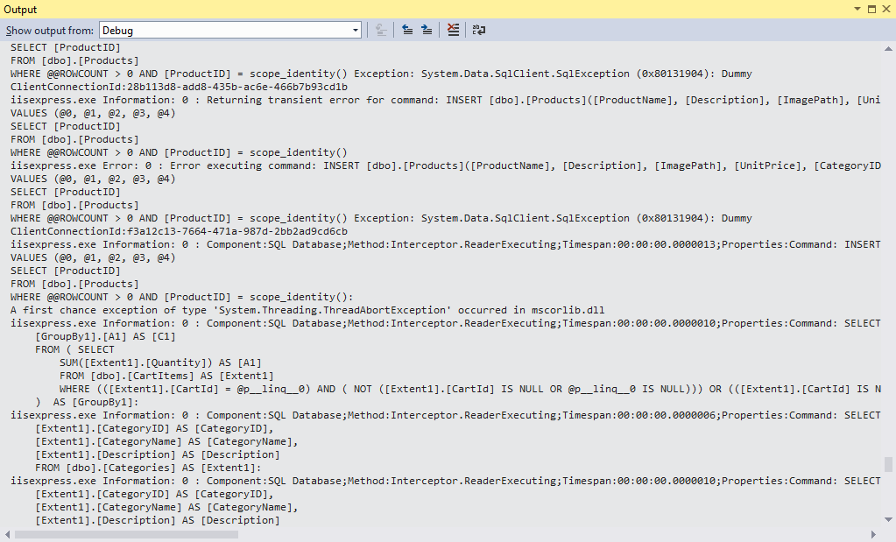
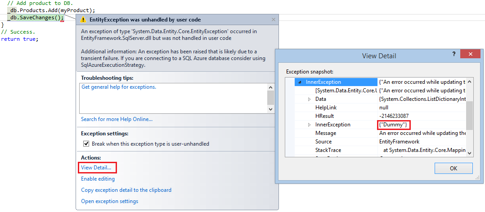

ASP.NET Web Forms Connection Resiliency and Command Interception
====================
by [Erik Reitan](https://github.com/Erikre)

In this tutorial, you will modify the Wingtip Toys sample application to support connection resiliency and command interception. By enabling connection resiliency, the Wingtip Toys sample application will automatically retry data calls when transient errors typical of a cloud environment occur. Also, by implementing command interception, the Wingtip Toys sample application will catch all SQL queries sent to the database in order to log or change them.

> [!NOTE] 
> 
> This Web Forms tutorial was based on Tom Dykstra's following MVC tutorial:  
> [Connection Resiliency and Command Interception with the Entity Framework in an ASP.NET MVC Application](../../../mvc/overview/getting-started/getting-started-with-ef-using-mvc/connection-resiliency-and-command-interception-with-the-entity-framework-in-an-asp-net-mvc-application.md)

## What you'll learn:

- How to provide connection resiliency.
- How to implement command interception.

## Prerequisites

Before you start, make sure that you have the following software installed on your computer:

- [Microsoft Visual Studio 2013](https://www.microsoft.com/visualstudio/11/en-us/downloads#vs) or [Microsoft Visual Studio Express 2013 for Web](https://www.microsoft.com/visualstudio/11/en-us/downloads#express-web). The .NET Framework is installed automatically.
- The Wingtip Toys sample project, so that you can implement the functionality mentioned in this tutorial within the Wingtip Toys project. The following link provides download details:

    - [Getting Started with ASP.NET 4.5.1 Web Forms - Wingtip Toys](https://go.microsoft.com/fwlink/?LinkID=389434&amp;clcid=0x409) (C#)
- Prior to completing this tutorial, consider reviewing the related tutorial series, [Getting Started with ASP.NET 4.5 Web Forms and Visual Studio 2013](../getting-started/getting-started-with-aspnet-45-web-forms/introduction-and-overview.md). The tutorial series will help you become familiar with the **WingtipToys** project and code.

## Connection resiliency

When you consider deploying an application to Windows Azure, one option to consider is deploying the database to **Windows** **Azure SQL Database**, a cloud database service. Transient connection errors are typically more frequent when you connect to a cloud database service than when your web server and your database server are directly connected together in the same data center. Even if a cloud web server and a cloud database service are hosted in the same data center, there are more network connections between them that can have problems, such as load balancers.

Also a cloud service is typically shared by other users, which means its responsiveness can be affected by them. And your access to the database might be subject to throttling. Throttling means the database service throws exceptions when you try to access it more frequently than is allowed in your *Service Level Agreement* (SLA).

Many or most connection problems that occur when you're accessing a cloud service are transient, that is, they resolve themselves in a short period of time. So when you try a database operation and get a type of error that is typically transient, you could try the operation again after a short wait, and the operation might be successful. You can provide a much better experience for your users if you handle transient errors by automatically trying again, making most of them invisible to the customer. The connection resiliency feature in Entity Framework 6 automates that process of retrying failed SQL queries.

The connection resiliency feature must be configured appropriately for a particular database service:

1. It has to know which exceptions are likely to be transient. You want to retry errors caused by a temporary loss in network connectivity, not errors caused by program bugs, for example.
2. It has to wait an appropriate amount of time between retries of a failed operation. You can wait longer between retries for a batch process than you can for an online web page where a user is waiting for a response.
3. It has to retry an appropriate number of times before it gives up. You might want to retry more times in a batch process that you would in an online application.

You can configure these settings manually for any database environment supported by an Entity Framework provider.

All you have to do to enable connection resiliency is create a class in your assembly that derives from the `DbConfiguration` class, and in that class set the SQL Database execution strategy, which in Entity Framework is another term for retry policy.

### Implementing connection resiliency

1. Download and open the [WingtipToys](https://go.microsoft.com/fwlink/?LinkID=389434&amp;clcid=0x409) sample Web Forms application in Visual Studio.
2. In the *Logic* folder of the **WingtipToys** application, add a class file named *WingtipToysConfiguration.cs*.
3. Replace the existing code with the following code:  

    [!code-csharp[Main](aspnet-web-forms-connection-resiliency-and-command-interception/samples/sample1.cs)]

The Entity Framework automatically runs the code it finds in a class that derives from `DbConfiguration`. You can use the `DbConfiguration` class to do configuration tasks in code that you would otherwise do in the *Web.config* file. For more information, see [EntityFramework Code-Based Configuration](https://msdn.microsoft.com/data/jj680699).

1. In the *Logic* folder, open the *AddProducts.cs* file.
2. Add a `using` statement for `System.Data.Entity.Infrastructure` as shown highlighted in yellow:  

    [!code-csharp[Main](aspnet-web-forms-connection-resiliency-and-command-interception/samples/sample2.cs?highlight=6)]
3. Add a `catch` block to the `AddProduct` method so that the `RetryLimitExceededException` is logged as highlighted in yellow:   

    [!code-csharp[Main](aspnet-web-forms-connection-resiliency-and-command-interception/samples/sample3.cs?highlight=14-15,17-22)]

By adding the `RetryLimitExceededException` exception, you can provide better logging or display an error message to the user where they can choose to try the process again. By catching the `RetryLimitExceededException` exception, the only errors likely to be transient will already have been tried and failed several times. The actual exception returned will be wrapped in the `RetryLimitExceededException` exception. In addition, you also added a general catch block. For more information about the `RetryLimitExceededException` exception, see [Entity Framework Connection Resiliency / Retry Logic](https://msdn.microsoft.com/en-us/data/dn456835).

## Command interception

Now that you've turned on a retry policy, how do you test to verify that it is working as expected? It's not so easy to force a transient error to happen, especially when you're running locally, and it would be especially difficult to integrate actual transient errors into an automated unit test. To test the connection resiliency feature, you need a way to intercept queries that Entity Framework sends to SQL Server and replace the SQL Server response with an exception type that is typically transient.

You can also use query interception in order to implement a best practice for cloud applications: log the latency and success or failure of all calls to external services such as database services.

In this section of the tutorial you'll use the Entity Framework's [*interception feature*](https://msdn.microsoft.com/data/dn469464) both for logging and for simulating transient errors.

### Create a logging interface and class

A best practice for logging is to do it by using an [`interface`](https://msdn.microsoft.com/library/ms173156.aspx) rather than hard-coding calls to `System.Diagnostics.Trace` or a logging class. That makes it easier to change your logging mechanism later if you ever need to do that. So in this section, you'll create the logging interface and a class to implement it.

Based on the above procedure, you have downloaded and opened the **WingtipToys** sample application in Visual Studio.

1. Create a folder in the **WingtipToys** project and name it *Logging*.
2. In the *Logging* folder, create a class file named *ILogger.cs* and replace the default code with the following code:  

    [!code-csharp[Main](aspnet-web-forms-connection-resiliency-and-command-interception/samples/sample4.cs)]

 The interface provides three tracing levels to indicate the relative importance of logs, and one designed to provide latency information for external service calls such as database queries. The logging methods have overloads that let you pass in an exception. This is so that exception information including stack trace and inner exceptions is reliably logged by the class that implements the interface, instead of relying on that being done in each logging method call throughout the application.  
  
 The `TraceApi` methods enable you to track the latency of each call to an external service such as SQL Database.
3. In the *Logging* folder, create a class file named *Logger.cs* and replace the default code with the following code:  

    [!code-csharp[Main](aspnet-web-forms-connection-resiliency-and-command-interception/samples/sample5.cs)]

The implementation uses `System.Diagnostics` to do the tracing. This is a built-in feature of .NET which makes it easy to generate and use tracing information. There are many &quot;listeners&quot; you can use with `System.Diagnostics` tracing, to write logs to files, for example, or to write them to blob storage in Windows Azure. See some of the options, and links to other resources for more information, in [Troubleshooting Windows Azure Web Sites in Visual Studio](https://www.windowsazure.com/en-us/develop/net/tutorials/troubleshoot-web-sites-in-visual-studio/). For this tutorial, you'll only look at logs in the Visual Studio **Output** window.

In a production application you might want to consider using tracing frameworks other than `System.Diagnostics`, and the `ILogger` interface makes it relatively easy to switch to a different tracing mechanism if you decide to do that.

### Create interceptor classes

Next, you'll create the classes that the Entity Framework will call into every time it is going to send a query to the database, one to simulate transient errors and one to do logging. These interceptor classes must derive from the `DbCommandInterceptor` class. In them, you write method overrides that are automatically called when the query is about to be executed. In these methods you can examine or log the query that is being sent to the database, and you can change the query before it's sent to the database or return something to Entity Framework yourself without even passing the query to the database.

1. To create the interceptor class that will log every SQL query before it is sent to the database, create a class file named *InterceptorLogging.cs* in the *Logic* folder and replace the default code with the following code:  

    [!code-csharp[Main](aspnet-web-forms-connection-resiliency-and-command-interception/samples/sample6.cs)]

 For successful queries or commands, this code writes an Information log with latency information. For exceptions, it creates an Error log.
2. To create the interceptor class that will generate dummy transient errors when you enter &quot;Throw&quot; in the **Name** textbox on the page named *AdminPage.aspx*, create a class file named *InterceptorTransientErrors.cs* in the *Logic* folder and replace the default code with the following code:  

    [!code-csharp[Main](aspnet-web-forms-connection-resiliency-and-command-interception/samples/sample7.cs)]

    This code only overrides the `ReaderExecuting` method, which is called for queries that can return multiple rows of data. If you wanted to check connection resiliency for other types of queries, you could also override the `NonQueryExecuting` and `ScalarExecuting` methods, as the logging interceptor does.  
  
 Later, you will log in as the "Admin" and select the **Admin** link on the top navigation bar. Then, on the *AdminPage.aspx* page you will add a product named &quot;Throw&quot;. The code creates a dummy SQL Database exception for error number 20, a type known to be typically transient. Other error numbers currently recognized as transient are 64, 233, 10053, 10054, 10060, 10928, 10929, 40197, 40501, and 40613, but these are subject to change in new versions of SQL Database. The product will be renamed to "TransientErrorExample", which you can follow in the code of the *InterceptorTransientErrors.cs* file.  
  
 The code returns the exception to Entity Framework instead of running the query and passing back results. The transient exception is returned *four* times, and then the code reverts to the normal procedure of passing the query to the database.

    Because everything is logged, you'll be able to see that Entity Framework tries to execute the query four times before finally succeeding, and the only difference in the application is that it takes longer to render a page with query results.  
  
 The number of times the Entity Framework will retry is configurable; the code specifies four times because that's the default value for the SQL Database execution policy. If you change the execution policy, you'd also change the code here that specifies how many times transient errors are generated. You could also change the code to generate more exceptions so that Entity Framework will throw the `RetryLimitExceededException` exception.
3. In *Global.asax*, add the following using statements:  

    [!code-csharp[Main](aspnet-web-forms-connection-resiliency-and-command-interception/samples/sample8.cs)]
4. Then, add the highlighted lines to the `Application_Start` method:  

    [!code-csharp[Main](aspnet-web-forms-connection-resiliency-and-command-interception/samples/sample9.cs?highlight=17-20)]

These lines of code are what causes your interceptor code to be run when Entity Framework sends queries to the database. Notice that because you created separate interceptor classes for transient error simulation and logging, you can independently enable and disable them.   
  
 You can add interceptors using the `DbInterception.Add` method anywhere in your code; it doesn't have to be in the `Application_Start` method. Another option, if you didn't add interceptors in the `Application_Start` method, would be to update or add the class named *WingtipToysConfiguration.cs* and put the above code at the end of the constructor of the `WingtipToysbConfiguration` class.

Wherever you put this code, be careful not to execute `DbInterception.Add` for the same interceptor more than once, or you'll get additional interceptor instances. For example, if you add the logging interceptor twice, you'll see two logs for every SQL query.

Interceptors are executed in the order of registration (the order in which the `DbInterception.Add` method is called). The order might matter depending on what you're doing in the interceptor. For example, an interceptor might change the SQL command that it gets in the `CommandText` property. If it does change the SQL command, the next interceptor will get the changed SQL command, not the original SQL command.

You've written the transient error simulation code in a way that lets you cause transient errors by entering a different value in the UI. As an alternative, you could write the interceptor code to always generate the sequence of transient exceptions without checking for a particular parameter value. You could then add the interceptor only when you want to generate transient errors. If you do this, however, don't add the interceptor until after database initialization has completed. In other words, do at least one database operation such as a query on one of your entity sets before you start generating transient errors. The Entity Framework executes several queries during database initialization, and they aren't executed in a transaction, so errors during initialization could cause the context to get into an inconsistent state.

## Test logging and connection resiliency

1. In Visual Studio, press **F5** to run the application in debug mode, and then login as "Admin" using "Pa$$word" as the password.
2. Select **Admin** from the navigation bar at the top.
3. Enter a new product named "Throw" with appropriate description, price and image file.
4. Press the **Add Product** button.  
 You'll notice that the browser seems to hang for several seconds while Entity Framework is retrying the query several times. The first retry happens very quickly, then the wait increases before each additional retry. This process of waiting longer before each retry is called *exponential backoff* .
5. Wait until the page is no longer atttempting to load.
6. Stop the project and look at the Visual Studio **Output** window to see the tracing output. You can find the **Output** window by selecting **Debug** -&gt; **Windows** -&gt; **Output**. You might have to scroll past several other logs written by your logger.  
  
 Notice that you can see the actual SQL queries sent to the database. You see some initial queries and commands that Entity Framework does to get started, checking the database version and migration history table.   
       
 Note that you can't repeat this test unless you stop the application and restart it. If you wanted to be able to test connection resiliency multiple times in a single run of the application, you could write code to reset the error counter in `InterceptorTransientErrors` .
7. To see the difference the execution strategy (retry policy) makes, comment out the `SetExecutionStrategy` line in *WingtipToysConfiguration.cs* file in the *Logic* folder, run the **Admin** page in debug mode again, and add the product named &quot;Throw&quot; again.  
  
 This time the debugger stops on the first generated exception immediately when it tries to execute the query the first time.  
    
8. Uncomment the `SetExecutionStrategy` line in the *WingtipToysConfiguration.cs* file.

## Summary

In this tutorial you've seen how to modify a Web Forms sample application to support connection resiliency and command interception.

## Next Steps

After you have reviewed connection resiliency and command interception in ASP.NET Web Forms, review the ASP.NET Web Forms topic [Asynchronous Methods in ASP.NET 4.5](../performance-and-caching/using-asynchronous-methods-in-aspnet-45.md). The topic will teach you the basics of building an asynchronous ASP.NET Web Forms application using Visual Studio.