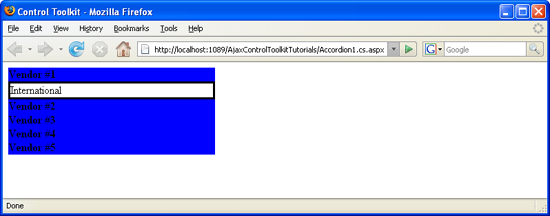

Databinding to an Accordion (C#)
====================
by [Christian Wenz](https://github.com/wenz)

[Download Code](http://download.microsoft.com/download/5/6/d/56d50cef-2011-4c8f-9891-7edc6dc57df9/Accordion1.cs.zip) or [Download PDF](http://download.microsoft.com/download/6/7/1/6718d452-ff89-4d3f-a90e-c74ec2d636a3/accordion1CS.pdf)

> The Accordion control in the AJAX Control Toolkit provides multiple panes and allows the user to display one of them at a time. Panels are usually declared within the page itself, but binding to a data source offers more flexibility.

## Overview

The Accordion control in the AJAX Control Toolkit provides multiple panes and allows the user to display one of them at a time. Panels are usually declared within the page itself, but binding to a data source offers more flexibility.

## Steps

First of all, a data source is required. This sample uses the AdventureWorks database and the Microsoft SQL Server 2005 Express Edition. The database is an optional part of a Visual Studio installation (including express edition) and is also available as a separate download under [https://go.microsoft.com/fwlink/?LinkId=64064](https://go.microsoft.com/fwlink/?LinkId=64064). The AdventureWorks database is part of the SQL Server 2005 Samples and Sample Databases (download at [https://www.microsoft.com/downloads/details.aspx?FamilyID=e719ecf7-9f46-4312-af89-6ad8702e4e6e&amp;DisplayLang=en](https://www.microsoft.com/downloads/details.aspx?FamilyID=e719ecf7-9f46-4312-af89-6ad8702e4e6e&amp;DisplayLang=en)). The easiest way to set the database up is to use the Microsoft SQL Server Management Studio Express ([https://www.microsoft.com/downloads/details.aspx?FamilyID=c243a5ae-4bd1-4e3d-94b8-5a0f62bf7796&amp;DisplayLang=en](https://www.microsoft.com/downloads/details.aspx?FamilyID=c243a5ae-4bd1-4e3d-94b8-5a0f62bf7796&amp;DisplayLang=en)) and attach the `AdventureWorks.mdf` database file.

For this sample, we assume that the instance of the SQL Server 2005 Express Edition is called `SQLEXPRESS` and resides on the same machine as the web server; this is also the default setup. If your setup differs, you have to adapt the connection information for the database.

In order to activate the functionality of ASP.NET AJAX and the Control Toolkit, the `ScriptManager` control must be put anywhere on the page (but within the `<form>` element):

[!code-aspx[Main](databinding-to-an-accordion-cs/samples/sample1.aspx)]

Then, add a data source to the page. In order to use a limited amount of data, we only select the first five entries in the Vendor table of the AdventureWorks database. If you are using the Visual Studio assistant to create the data source, mind that a bug in the current version does not prefix the table name (`Vendor`) with `Purchasing`. The following markup shows the correct syntax:

[!code-aspx[Main](databinding-to-an-accordion-cs/samples/sample2.aspx)]

Remember the name (ID) of the data source. This very identification must then be used in the `DataSourceID` property of the Accordion control:

[!code-aspx[Main](databinding-to-an-accordion-cs/samples/sample3.aspx)]

Within the Accordion control, you can provide templates for various parts of the control, including the header (`<HeaderTemplate>`) and the content (`<ContentTemplate>`). Within these elements, just output the data from the data source, using the `DataBinder.Eval()` method:

[!code-aspx[Main](databinding-to-an-accordion-cs/samples/sample4.aspx)]

When the page is loaded, the data source must be bound to the accordion with this server-side code:

[!code-aspx[Main](databinding-to-an-accordion-cs/samples/sample5.aspx)]

To conclude this sample, you need to define the two CSS classes that are referenced in the Accordion control (in its properties `HeaderCssClass` and `ContentCssClass`). Put the following markup in the `<head>` section of the page:

[!code-css[Main](databinding-to-an-accordion-cs/samples/sample6.css)]

The data in the accordion comes directly from the data source ([Click to view full-size image](databinding-to-an-accordion-cs/_static/image3.png))

>[!div class="step-by-step"]
[Next](dynamically-adding-an-accordion-pane-cs.md)