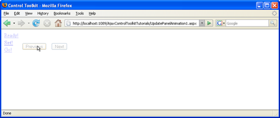

Animating an UpdatePanel Control (VB)
====================
by [Christian Wenz](https://github.com/wenz)

[Download Code](http://download.microsoft.com/download/9/3/f/93f8daea-bebd-4821-833b-95205389c7d0/UpdatePanelAnimation1.vb.zip) or [Download PDF](http://download.microsoft.com/download/b/6/a/b6ae89ee-df69-4c87-9bfb-ad1eb2b23373/updatepanelanimation1VB.pdf)

> The Animation control in the ASP.NET AJAX Control Toolkit is not just a control but a whole framework to add animations to a control. For the contents of an UpdatePanel, a special extender exists that relies heavily on the animation framework: UpdatePanelAnimation. This tutorial shows how to set up such an animation for an UpdatePanel.

## Overview

The Animation control in the ASP.NET AJAX Control Toolkit is not just a control but a whole framework to add animations to a control. For the contents of an `UpdatePanel`, a special extender exists that relies heavily on the animation framework: `UpdatePanelAnimation`. This tutorial shows how to set up such an animation for an `UpdatePanel`.

## Steps

The first step is as usual to include the `ScriptManager` in the page so that the ASP.NET AJAX library is loaded and the Control Toolkit can be used:

[!code-aspx[Main](animating-an-updatepanel-control-vb/samples/sample1.aspx)]

The animation in this scenario will be applied to an ASP.NET `Wizard` web control residing in an `UpdatePanel`. Three (arbitrary) steps provide enough options to trigger postbacks:

[!code-aspx[Main](animating-an-updatepanel-control-vb/samples/sample2.aspx)]

The markup necessary for the `UpdatePanelAnimationExtender` control is quite similar to the markup used for the `AnimationExtender`. In the `TargetControlID` attribute we provide the `ID` of the `UpdatePanel` to animate; within the `UpdatePanelAnimationExtender` control, the `<Animations>` element holds XML markup for the animation(s). However there is one difference: The amount of events and event handlers is limited in comparison to `AnimationExtender`. For `UpdatePanels`, only two of them exist:

- `<OnUpdated>` when the UpdatePanel has been updated
- `<OnUpdating>` when the UpdatePanel starts updating

In this scenario, the new content of the `UpdatePanel` (after the postback) shall fade in. This is the necessary markup for that:

[!code-aspx[Main](animating-an-updatepanel-control-vb/samples/sample3.aspx)]

Now whenever a postback occurs within the UpdatePanel, the new contents of the panel fade in smoothly.

The next wizard step is fading in ([Click to view full-size image](animating-an-updatepanel-control-vb/_static/image3.png))

>[!div class="step-by-step"]
[Previous](changing-an-animation-using-client-side-code-vb.md)
[Next](dynamically-controlling-updatepanel-animations-vb.md)