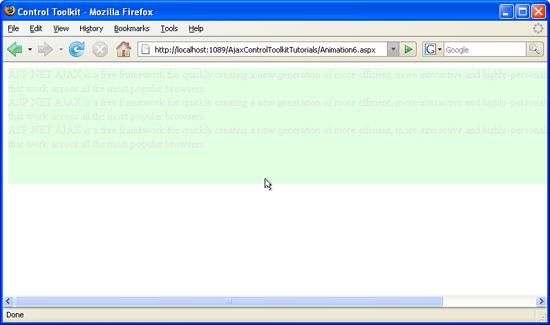

Animating in Response To User Interaction (C#)
====================
by [Christian Wenz](https://github.com/wenz)

[Download Code](http://download.microsoft.com/download/f/9/a/f9a26acd-8df4-4484-8a18-199e4598f411/Animation6.cs.zip) or [Download PDF](http://download.microsoft.com/download/6/7/1/6718d452-ff89-4d3f-a90e-c74ec2d636a3/animation6CS.pdf)

> The Animation control in the ASP.NET AJAX Control Toolkit is not just a control but a whole framework to add animations to a control. The animations can start automatically or may be triggered by user interaction, e.g. by clicking with the mouse.

## Overview

The Animation control in the ASP.NET AJAX Control Toolkit is not just a control but a whole framework to add animations to a control. The animations can start automatically or may be triggered by user interaction, e.g. by clicking with the mouse.

## Steps

First of all, include the `ScriptManager` in the page; then, the ASP.NET AJAX library is loaded, making it possible to use the Control Toolkit:

[!code-aspx[Main](animating-in-response-to-user-interaction-cs/samples/sample1.aspx)]

The animation will be applied to a panel of text which looks like this:

[!code-aspx[Main](animating-in-response-to-user-interaction-cs/samples/sample2.aspx)]

In the associated CSS class for the panel, define a nice background color and also set a fixed width for the panel:

[!code-css[Main](animating-in-response-to-user-interaction-cs/samples/sample3.css)]

Then, add the `AnimationExtender` to the page, providing an `ID`, the `TargetControlID` attribute and the obligatory `runat="server"`:

[!code-aspx[Main](animating-in-response-to-user-interaction-cs/samples/sample4.aspx)]

Within the `<Animations>` node, there are five ways to start the animation via user interaction (the missing element is `<OnLoad>` which is executed once the whole page has been fully loaded):

- `<OnClick>` (mouse click on the control)
- `<OnHoverOut>` (mouse leaves the control)
- `<OnHoverOver>` (mouse hovers over a control, stopping the `<OnHoverOut>` animation)
- `<OnMouseOut>` (mouse leaves a control)
- `<OnMouseOver>` (mouse hovers over a control, not stopping the `<OnMouseOut>` animation)

In this scenario, `<OnClick>` is used. When the user clicks on the panel, it is resized and fades out at the same time.

[!code-aspx[Main](animating-in-response-to-user-interaction-cs/samples/sample5.aspx)]

A mouse click starts the animation ([Click to view full-size image](animating-in-response-to-user-interaction-cs/_static/image3.png))

>[!div class="step-by-step"]
[Previous](picking-one-animation-out-of-a-list-cs.md)
[Next](disabling-actions-during-animation-cs.md)