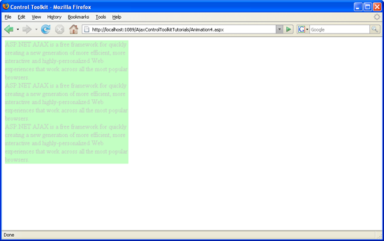

[Edit .md file](C:\Projects\msc\dev\Msc.Www\Web.ASP\App_Data\github\web-forms\overview\ajax-control-toolkit\animation\animation-depending-on-a-condition-cs.md) | [Edit dev content](http://www.aspdev.net/umbraco#/content/content/edit/24782) | [View dev content](http://docs.aspdev.net/tutorials/web-forms/overview/ajax-control-toolkit/animation/animation-depending-on-a-condition-cs.html) | [View prod content](http://www.asp.net/web-forms/overview/ajax-control-toolkit/animation/animation-depending-on-a-condition-cs) | Picker: 33082

Animation Depending On a Condition (C#)
====================
by [Christian Wenz](https://github.com/wenz)

[Download Code](http://download.microsoft.com/download/f/9/a/f9a26acd-8df4-4484-8a18-199e4598f411/Animation4.cs.zip) or [Download PDF](http://download.microsoft.com/download/6/7/1/6718d452-ff89-4d3f-a90e-c74ec2d636a3/animation4CS.pdf)

> The Animation control in the ASP.NET AJAX Control Toolkit is not just a control but a whole framework to add animations to a control. Whether an animation is run or not can also depend on a condition in form of some JavaScript code.

## Overview

The Animation control in the ASP.NET AJAX Control Toolkit is not just a control but a whole framework to add animations to a control. Whether an animation is run or not can also depend on a condition in form of some JavaScript code.

## Steps

First of all, include the `ScriptManager` in the page; then, the ASP.NET AJAX library is loaded, making it possible to use the Control Toolkit:

    <asp:ScriptManager ID="asm" runat="server" />

The animation will be applied to a panel of text which looks like this:

    <asp:Panel ID="panelShadow" runat="server" CssClass="panelClass">    
     ASP.NET AJAX is a free framework for quickly creating a new generation of more    
     efficient, more interactive and highly-personalized Web experiences that work    
     across all the most popular browsers.     
     ASP.NET AJAX is a free framework for quickly creating a new generation of more     
     efficient, more interactive and highly-personalized Web experiences that work   
     across all the most popular browsers.     
     ASP.NET AJAX is a free framework for quickly creating a new generation of more     
     efficient, more interactive and highly-personalized Web experiences that work    
     across all the most popular browsers.     
    </asp:Panel>

In the associated CSS class for the panel, define a nice background color and also set a fixed width for the panel:

    

Then, add the `AnimationExtender` to the page, providing an `ID`, the `TargetControlID` attribute and the obligatory `runat="server":`

    <ajaxToolkit:AnimationExtender ID="ae" runat="server" TargetControlID="Panel1">

Within the `<Animations>` node, use `<OnLoad>` to run the animations once the page has been fully loaded. Instead of one of the regular animations, the `<Condition>` element comes into play. The JavaScript code provided as the value of the `ConditionScript` attribute is executed at runtime. If it evaluates to true, the animation is executed, otherwise not. The following markup provides two animations, each of them being executed in 50% of cases upon random. Since there may only be one animation within `<OnLoad>`, the two `<Condition>` animations are joined together using the `<Sequence>` element:

    <ajaxToolkit:AnimationExtender ID="ae" runat="server"
     TargetControlID="Panel1">
     <Animations>
     <OnLoad>
     <Sequence>
     <Condition ConditionScript="Math.random()   0.5">
     <Resize Width="1000" Height="150" Unit="px" />
     </Condition>
     <Condition ConditionScript="Math.random()   0.5">
     <FadeOut Duration="1.5" Fps="24" />
     </Condition>
     </Sequence>
     </OnLoad>
     </Animations>
    </ajaxToolkit:AnimationExtender>

Note that the less than sign (`<`) in the `ConditionScript` attribute must be escaped (``). When you run this script, either no animation runs, or one of the two does, or both do.

The panel is fading out without resizing, so the second animation runs, the first one didn't ([Click to view full-size image](animation-depending-on-a-condition-cs/_static/image3.png))

>[!div class="step-by-step"] [Previous](executing-several-animations-after-each-other-cs.md) [Next](picking-one-animation-out-of-a-list-cs.md)