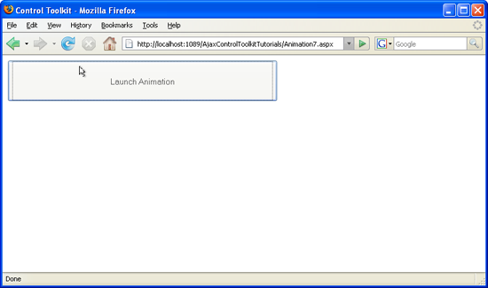

Disabling Actions during Animation (VB)
====================
by [Christian Wenz](https://github.com/wenz)

[Download Code](http://download.microsoft.com/download/f/9/a/f9a26acd-8df4-4484-8a18-199e4598f411/Animation7.vb.zip) or [Download PDF](http://download.microsoft.com/download/6/7/1/6718d452-ff89-4d3f-a90e-c74ec2d636a3/animation7VB.pdf)

> The Animation control in the ASP.NET AJAX Control Toolkit is not just a control but a whole framework to add animations to a control. It also supports actions, like mouse clicks. However when a mouse click starts an animation, it is desirable to disable mouse clicks during the animation.

## Overview

The Animation control in the ASP.NET AJAX Control Toolkit is not just a control but a whole framework to add animations to a control. It also supports actions, like mouse clicks. However when a mouse click starts an animation, it is desirable to disable mouse clicks during the animation.

## Steps

First of all, include the `ScriptManager` in the page; then, the ASP.NET AJAX library is loaded, making it possible to use the Control Toolkit:

[!code-aspx[Main](disabling-actions-during-animation-vb/samples/sample1.aspx)]

The animation will be applied to an HTML button like this:

[!code-aspx[Main](disabling-actions-during-animation-vb/samples/sample2.aspx)]

Note that an HTML Control is used instead of a Web Control since we do not want the button to create a postback; it shall just launch the client-side animation for us.

Then, add the `AnimationExtender` to the page, providing an `ID`, the `TargetControlID` attribute and the obligatory `runat="server"`:

[!code-aspx[Main](disabling-actions-during-animation-vb/samples/sample3.aspx)]

Within the `<Animations>` node, `<OnClick>` is the right element to handle the mouse click. However, the button could be clicked during the animation, as well. The `<EnableAction>` element can take care of that. Setting `Enabled="false"` disables the button as part of the animation. Since we are using several individual animations (disabling the button and the actual animations), the `<Parallel>` element is required to glue the single animations together into one. Here is the complete markup for `AnimationExtender`:

[!code-aspx[Main](disabling-actions-during-animation-vb/samples/sample4.aspx)]

It would also be possible to re-enable to button after the animation, using the following XML element at the end of the list:

[!code-xml[Main](disabling-actions-during-animation-vb/samples/sample5.xml)]

However in the given scenario this would be useless since the button fades out and is not visible at the end of the animation.

The button is disabled as soon as the animation runs ([Click to view full-size image](disabling-actions-during-animation-vb/_static/image3.png))

>[!div class="step-by-step"]
[Previous](animating-in-response-to-user-interaction-vb.md)
[Next](triggering-an-animation-in-another-control-vb.md)