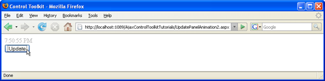

Dynamically Controlling UpdatePanel Animations (VB)
====================
by [Christian Wenz](https://github.com/wenz)

[Download Code](http://download.microsoft.com/download/9/3/f/93f8daea-bebd-4821-833b-95205389c7d0/UpdatePanelAnimation2.vb.zip) or [Download PDF](http://download.microsoft.com/download/b/6/a/b6ae89ee-df69-4c87-9bfb-ad1eb2b23373/updatepanelanimation2VB.pdf)

> The Animation control in the ASP.NET AJAX Control Toolkit is not just a control but a whole framework to add animations to a control. For the contents of an UpdatePanel, a special extender exists that relies heavily on the animation framework: UpdatePanelAnimation. It can also work together with UpdatePanel triggers.

## Overview

The Animation control in the ASP.NET AJAX Control Toolkit is not just a control but a whole framework to add animations to a control. For the contents of an `UpdatePanel`, a special extender exists that relies heavily on the animation framework: `UpdatePanelAnimation`. It can also work together with `UpdatePanel` triggers.

## Steps

The first step is as usual to include the `ScriptManager` in the page so that the ASP.NET AJAX library is loaded and the Control Toolkit can be used:

[!code-aspx[Main](dynamically-controlling-updatepanel-animations-vb/samples/sample1.aspx)]

The animation in this scenario will be applied to a display of the current time. This information can be written into a label using the `Page_Load()` method, or (for the sake of simplicity) the following inline code is used:

[!code-aspx[Main](dynamically-controlling-updatepanel-animations-vb/samples/sample2.aspx)]

Also, a button to trigger updating the time is created:

[!code-aspx[Main](dynamically-controlling-updatepanel-animations-vb/samples/sample3.aspx)]

This code is then put into the `<ContentTemplate>` section of an `UpdatePanel` element. The panel's `UpdateMode` attribute must be set to `"Conditional"`, since only triggers may update the panel's contents. In the `<Triggers>` section of the `UpdatePanel`, an asynchronous postback trigger is created and tied to the `Click` event of the button. Thus, if the user clicks on the button, the `UpdatePanel` is refreshed. Here is the markup for the `UpdatePanel` control:

[!code-aspx[Main](dynamically-controlling-updatepanel-animations-vb/samples/sample4.aspx)]

Finally, the `UpdatePanelAnimationExtender` must be configured: Set the `TargetControlID` attribute to the ID of the panel, and define an animation within the extender. Fading in makes sense, which creates a nice visual emphasis on the updated time. Your extender markup may then look like this:

[!code-aspx[Main](dynamically-controlling-updatepanel-animations-vb/samples/sample5.aspx)]

Run the file in the browser. Whenever you click on the button, the current time is shown in the panel, always fading in for the duration of one second.

The current time is fading in ([Click to view full-size image](dynamically-controlling-updatepanel-animations-vb/_static/image3.png))

>[!div class="step-by-step"]
[Previous](animating-an-updatepanel-control-vb.md)