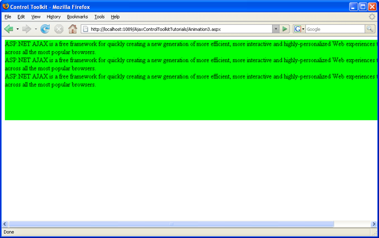
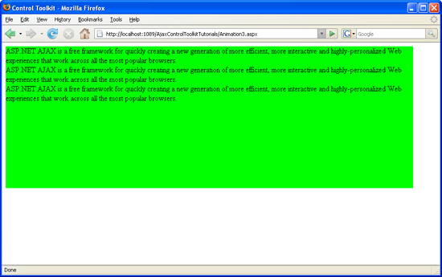

Executing Several Animations after Each Other (C#)
====================
by [Christian Wenz](https://github.com/wenz)

[Download Code](http://download.microsoft.com/download/f/9/a/f9a26acd-8df4-4484-8a18-199e4598f411/Animation3.cs.zip) or [Download PDF](http://download.microsoft.com/download/6/7/1/6718d452-ff89-4d3f-a90e-c74ec2d636a3/animation3CS.pdf)

> The Animation control in the ASP.NET AJAX Control Toolkit is not just a control but a whole framework to add animations to a control. It allows to run several animations one after the other.

The Animation control in the ASP.NET AJAX Control Toolkit is not just a control but a whole framework to add animations to a control. It allows to run several animations one after the other.

## Steps

First of all, include the `ScriptManager` in the page; then, the ASP.NET AJAX library is loaded, making it possible to use the Control Toolkit:

[!code-aspx[Main](executing-several-animations-after-each-other-cs/samples/sample1.aspx)]

The animation will be applied to a panel of text which looks like this:

[!code-aspx[Main](executing-several-animations-after-each-other-cs/samples/sample2.aspx)]

In the associated CSS class for the panel, define a nice background color and also set a fixed width for the panel:

[!code-css[Main](executing-several-animations-after-each-other-cs/samples/sample3.css)]

Then, add the `AnimationExtender` to the page, providing an `ID`, the `TargetControlID` attribute and the obligatory `runat="server":`

[!code-aspx[Main](executing-several-animations-after-each-other-cs/samples/sample4.aspx)]

Within the `<Animations>` node, use `<OnLoad>` to run the animations once the page has been fully loaded. Generally, `<OnLoad>` only accepts one animation. The Animation framework allows you to join several animations into one using the `<Sequence>` element. All animations within `<Sequence>` are executed one after the other. Here is the a possible markup for the `AnimationExtender` control, first making the panel wider and then decreasing its height:

[!code-aspx[Main](executing-several-animations-after-each-other-cs/samples/sample5.aspx)]

When you run this script, the panel first gets wider and then smaller.

First the width is increased ([Click to view full-size image](executing-several-animations-after-each-other-cs/_static/image3.png))

Then the height is decreased ([Click to view full-size image](executing-several-animations-after-each-other-cs/_static/image6.png))

>[!div class="step-by-step"]
[Previous](executing-several-animations-at-the-same-time-cs.md)
[Next](animation-depending-on-a-condition-cs.md)