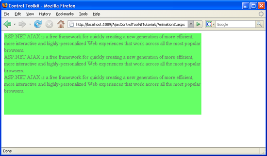

Executing Several Animations at The Same Time (VB)
====================
by [Christian Wenz](https://github.com/wenz)

[Download Code](http://download.microsoft.com/download/f/9/a/f9a26acd-8df4-4484-8a18-199e4598f411/Animation2.vb.zip) or [Download PDF](http://download.microsoft.com/download/6/7/1/6718d452-ff89-4d3f-a90e-c74ec2d636a3/animation2VB.pdf)

> The Animation control in the ASP.NET AJAX Control Toolkit is not just a control but a whole framework to add animations to a control. It allows to run several animations in a parallel fashion.

## Overview

The Animation control in the ASP.NET AJAX Control Toolkit is not just a control but a whole framework to add animations to a control. It allows to run several animations in a parallel fashion.

## Steps

First of all, include the `ScriptManager` in the page; then, the ASP.NET AJAX library is loaded, making it possible to use the Control Toolkit:

[!code-aspx[Main](executing-several-animations-at-the-same-time-vb/samples/sample1.aspx)]

The animation will be applied to a panel of text which looks like this:

[!code-aspx[Main](executing-several-animations-at-the-same-time-vb/samples/sample2.aspx)]

In the associated CSS class for the panel, define a nice background color and also set a fixed width for the panel:

[!code-css[Main](executing-several-animations-at-the-same-time-vb/samples/sample3.css)]

Then, add the `AnimationExtender` to the page, providing an `ID`, the `TargetControlID` attribute and the obligatory `runat="server"`:

[!code-aspx[Main](executing-several-animations-at-the-same-time-vb/samples/sample4.aspx)]

Within the `<Animations>` node, use `<OnLoad>` to run the animations once the page has been fully loaded. Generally, `<OnLoad>` only accepts one animation. The Animation framework allows you to join several animations into one using the `<Parallel>` element. All animations within `<Parallel>` are executed at the same time.

Here is the a possible markup for the `AnimationExtender` control, fading out and resizing the panel at the same time:

[!code-aspx[Main](executing-several-animations-at-the-same-time-vb/samples/sample5.aspx)]

And indeed: when you run this script, the panel is displayed, then resizes (more than threefolding its width and halfing its height) and fades out at the same time.

The panel is fading out and resizing (including its content, thanks to the browser's rendering engine) ([Click to view full-size image](executing-several-animations-at-the-same-time-vb/_static/image3.png))

>[!div class="step-by-step"]
[Previous](adding-animation-to-a-control-vb.md)
[Next](executing-several-animations-after-each-other-vb.md)