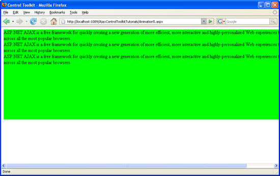

Picking One Animation Out Of a List (VB)
====================
by [Christian Wenz](https://github.com/wenz)

[Download Code](http://download.microsoft.com/download/f/9/a/f9a26acd-8df4-4484-8a18-199e4598f411/Animation5.vb.zip) or [Download PDF](http://download.microsoft.com/download/6/7/1/6718d452-ff89-4d3f-a90e-c74ec2d636a3/animation5VB.pdf)

> The Animation control in the ASP.NET AJAX Control Toolkit is not just a control but a whole framework to add animations to a control. The framework also allows the programmer to pick one animation out of a list of animations, depending on the evaluation of some JavaScript code.

## Overview

The Animation control in the ASP.NET AJAX Control Toolkit is not just a control but a whole framework to add animations to a control. The framework also allows the programmer to pick one animation out of a list of animations, depending on the evaluation of some JavaScript code.

## Steps

First of all, include the `ScriptManager` in the page; then, the ASP.NET AJAX library is loaded, making it possible to use the Control Toolkit:

[!code-aspx[Main](picking-one-animation-out-of-a-list-vb/samples/sample1.aspx)]

The animation will be applied to a panel of text which looks like this:

[!code-aspx[Main](picking-one-animation-out-of-a-list-vb/samples/sample2.aspx)]

In the associated CSS class for the panel, define a nice background color and also set a fixed width for the panel:

[!code-css[Main](picking-one-animation-out-of-a-list-vb/samples/sample3.css)]

Then, add the `AnimationExtender` to the page, providing an `ID`, the `TargetControlID` attribute and the obligatory `runat="server":`

[!code-aspx[Main](picking-one-animation-out-of-a-list-vb/samples/sample4.aspx)]

Within the `<Animations>` node, use `<OnLoad>` to run the animations once the page has been fully loaded. Instead of one of the regular animations, the `<Case>` element comes into play. The value of its SelectScript attribute is evaluated; the return value must be numerical. Depending on this number, one of the subanimations within &lt;Case&gt; is executed. For instance, if SelectScript evaluates to 2, the Control Toolkit runs the third animation within &lt;Case&gt; (counting starts at 0).

The following markup defines three subanimations: Resizing the width, resizing the height, and fading out. The JavaScript code (`Math.floor(3 * Math.random())`) then picks a number between 0 and 2, so that one of the three animations is run:

[!code-aspx[Main](picking-one-animation-out-of-a-list-vb/samples/sample5.aspx)]

One of the possible three animations: The panel gets wider ([Click to view full-size image](picking-one-animation-out-of-a-list-vb/_static/image3.png))

>[!div class="step-by-step"]
[Previous](animation-depending-on-a-condition-vb.md)
[Next](animating-in-response-to-user-interaction-vb.md)