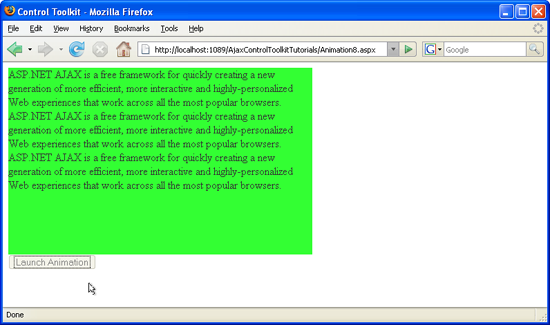

[Edit .md file](C:\Projects\msc\dev\Msc.Www\Web.ASP\App_Data\github\web-forms\overview\ajax-control-toolkit\animation\triggering-an-animation-in-another-control-cs.md) | [Edit dev content](http://www.aspdev.net/umbraco#/content/content/edit/24790) | [View dev content](http://docs.aspdev.net/tutorials/web-forms/overview/ajax-control-toolkit/animation/triggering-an-animation-in-another-control-cs.html) | [View prod content](http://www.asp.net/web-forms/overview/ajax-control-toolkit/animation/triggering-an-animation-in-another-control-cs) | Picker: 33090

Triggering an Animation in another Control (C#)
====================
by [Christian Wenz](https://github.com/wenz)

[Download Code](http://download.microsoft.com/download/f/9/a/f9a26acd-8df4-4484-8a18-199e4598f411/Animation8.cs.zip) or [Download PDF](http://download.microsoft.com/download/6/7/1/6718d452-ff89-4d3f-a90e-c74ec2d636a3/animation8CS.pdf)

> The Animation control in the ASP.NET AJAX Control Toolkit is not just a control but a whole framework to add animations to a control. Generally, launching an animation is triggered by user interaction with the same control. It is however also possible to interact with one control and then animation another control.

## Overview

The Animation control in the ASP.NET AJAX Control Toolkit is not just a control but a whole framework to add animations to a control. Generally, launching an animation is triggered by user interaction with the same control. It is however also possible to interact with one control and then animation another control.

## Steps

First of all, include the `ScriptManager` in the page; then, the ASP.NET AJAX library is loaded, making it possible to use the Control Toolkit:

    <asp:ScriptManager ID="asm" runat="server" />

The animation will be applied to a panel of text which looks like this:

    <asp:Panel ID="panelShadow" runat="server" CssClass="panelClass">
     ASP.NET AJAX is a free framework for quickly creating a new generation of more 
     efficient, more interactive and highly-personalized Web experiences that work 
     across all the most popular browsers. 
     ASP.NET AJAX is a free framework for quickly creating a new generation of more 
     efficient, more interactive and highly-personalized Web experiences that work 
     across all the most popular browsers. 
     ASP.NET AJAX is a free framework for quickly creating a new generation of more 
     efficient, more interactive and highly-personalized Web experiences that work 
     across all the most popular browsers. 
    </asp:Panel>

In the associated CSS class for the panel, define a nice background color and also set a fixed width for the panel:

    

In order to start animating the panel, an HTML button is used. Note that `<input type="button" />` is favoured over `<asp:Button />` since we do not want a postback when the user clicks on that button.

    <input type="button" id="Button1" runat="server" Value="Launch Animation" />

Then, add the `AnimationExtender` to the page, providing an `ID`, the `TargetControlID` attribute and the obligatory `runat="server"`. It is important to set `TargetControlID` to the ID of the button (the element triggering the animation), not to the ID of the panel (the element being animated)

    <ajaxToolkit:AnimationExtender ID="ae" runat="server" TargetControlID="Button1">

Within the `<Animations>` node, place animations as usual. In order to make them change the panel, not the button, set the `AnimationTarget` attribute for every animation element within `AnimationExtender`. The value for `AnimationTarget` is the ID of the panel, of course. That way, the animations happen with the panel, not with the triggering button. Here is the `AnimationExtender` markup for this scenario:

    <ajaxToolkit:AnimationExtender ID="ae" runat="server" TargetControlID="Panel1">
     <Animations>
     <OnClick>
     <Sequence>
     <EnableAction Enabled="false" />
     <Parallel>
     <FadeOut Duration="1.5" Fps="24" AnimationTarget="Panel1" />
     <Resize Width="1000" Height="150" Unit="px" 
     AnimationTarget="Panel1" />
     </Parallel>
     </Sequence>
     </OnClick>
     </Animations>
    </ajaxToolkit:AnimationExtender>

Note the special order in which the individual animations appear. First of all, the button gets deactivated once the animation runs. Since there is no `AnimationTarget` attribute in the `<EnableAction>` element, this animation is applied to the originating control: the button. The next two animation steps shall be carried out parallelly (`<Parallel>` element). Both have their `AnimationTarget` attributes set to `"Panel1"`, thus animating the panel, not the button.

A mouse click on the button starts the panel animation ([Click to view full-size image](triggering-an-animation-in-another-control-cs/_static/image3.png))

>[!div class="step-by-step"] [Previous](disabling-actions-during-animation-cs.md) [Next](modifying-animations-from-the-server-side-cs.md)