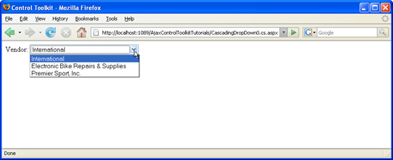

[Edit .md file](C:\Projects\msc\dev\Msc.Www\Web.ASP\App_Data\github\web-forms\overview\ajax-control-toolkit\cascadingdropdown\filling-a-list-using-cascadingdropdown-vb.md) | [Edit dev content](http://www.aspdev.net/umbraco#/content/content/edit/24799) | [View dev content](http://docs.aspdev.net/tutorials/web-forms/overview/ajax-control-toolkit/cascadingdropdown/filling-a-list-using-cascadingdropdown-vb.html) | [View prod content](http://www.asp.net/web-forms/overview/ajax-control-toolkit/cascadingdropdown/filling-a-list-using-cascadingdropdown-vb) | Picker: 33099

Filling a List Using CascadingDropDown (VB)
====================
by [Christian Wenz](https://github.com/wenz)

[Download Code](http://download.microsoft.com/download/9/0/7/907760b1-2c60-4f81-aeb6-ca416a573b0d/cascadingdropdown0.vb.zip) or [Download PDF](http://download.microsoft.com/download/2/d/c/2dc10e34-6983-41d4-9c08-f78f5387d32b/cascadingdropdown0VB.pdf)

> The CascadingDropDown control in the AJAX Control Toolkit extends a DropDownList control so that changes in one DropDownList loads associated values in another DropDownList. (For instance, one list provides a list of US states, and the next list is then filled with major cities in that state.) The first challenge to solve is to actually fill a dropdown list using this control.

## Overview

The CascadingDropDown control in the AJAX Control Toolkit extends a DropDownList control so that changes in one DropDownList loads associated values in another DropDownList. (For instance, one list provides a list of US states, and the next list is then filled with major cities in that state.) The first challenge to solve is to actually fill a dropdown list using this control.

## Steps

In order to activate the functionality of ASP.NET AJAX and the Control Toolkit, the `ScriptManager` control must be put anywhere on the page (but within the `<form>` element):

    <asp:ScriptManager ID="asm" runat="server" />

Then, a DropDownList control is required:

    

     Vendor: <asp:DropDownList ID="VendorsList" runat="server" />
    

For this list, a CascadingDropDown extender is added. It will send an asynchronous request to a web service which will then return a list of entries to be displayed in the list. For this to work, the following CascadingDropDown attributes need to be set:

- `ServicePath`: URL of a web service delivering the list entries
- `ServiceMethod`: Web method delivering the list entries
- `TargetControlID`: ID of the dropdown list
- `Category`: Category information that is submitted to the web method when called
- `PromptText`: Text displayed when asynchronously loading list data from the server

Here is the markup for the `CascadingDropDown` element. The only difference between C# and VB is the name of the associated web service:

    <ajaxToolkit:CascadingDropDown ID="ccd1" runat="server"
     ServicePath="CascadingDropdown0.vb.asmx" ServiceMethod="GetVendors"
     TargetControlID="VendorsList" Category="Vendor" />

The JavaScript code coming from the `CascadingDropDown` extender calls a web service method with the following signature:

    Public Function MethodNameHere(ByVal knownCategoryValues As String, ByVal category As String) As CascadingDropDownNameValue()

So the important aspect is that the method needs to return an array of type `CascadingDropDownNameValue` (defined by the ASP.NET AJAX Control Toolkit). In the `CascadingDropDownNameValue` contructor, first the list entry's text and then its value must be provided, just as `<option value="VALUE">NAME</option>` would do in HTML. Here is some sample data:

    <%@ WebService Language="VB" Class="CascadingDropDown0" %>
    Imports System.Web.Script.Services
    Imports AjaxControlToolkit
    Imports System.Web
    Imports System.Web.Services
    Imports System.Web.Services.Protocols
    Imports System.Collections.Generic
    <ScriptService()> _
    Public Class CascadingDropDown0
     Inherits System.Web.Services.WebService
     <WebMethod()> _
     Public Function GetVendors(ByVal knownCategoryValues As String, ByVal category As String) As CascadingDropDownNameValue()
     Dim l As New List(Of CascadingDropDownNameValue)
     l.Add(New CascadingDropDownNameValue("International", "1"))
     l.Add(New CascadingDropDownNameValue("Electronic Bike Repairs & Supplies","2"))
     l.Add(New CascadingDropDownNameValue("Premier Sport, Inc.", "3"))
     Return l.ToArray()
     End Function
    End Class

Loading the page in the browser will trigger the list to be filled with three vendors.

The list is filled automatically ([Click to view full-size image](filling-a-list-using-cascadingdropdown-vb/_static/image3.png))

>[!div class="step-by-step"] [Previous](using-auto-postback-with-cascadingdropdown-cs.md) [Next](using-cascadingdropdown-with-a-database-vb.md)