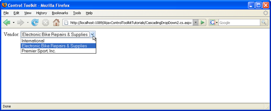

Presetting List Entries with CascadingDropDown (VB)
====================
by [Christian Wenz](https://github.com/wenz)

[Download Code](http://download.microsoft.com/download/9/0/7/907760b1-2c60-4f81-aeb6-ca416a573b0d/cascadingdropdown2.vb.zip) or [Download PDF](http://download.microsoft.com/download/2/d/c/2dc10e34-6983-41d4-9c08-f78f5387d32b/CascadingDropDown2VB.pdf)

> The CascadingDropDown control in the AJAX Control Toolkit extends a DropDownList control so that changes in one DropDownList loads associated values in another DropDownList. With a little bit of code it is possible that a list element is preselected once the data has been dynamically loaded.

## Overview

The CascadingDropDown control in the AJAX Control Toolkit extends a DropDownList control so that changes in one DropDownList loads associated values in another DropDownList. (For instance, one list provides a list of US states, and the next list is then filled with major cities in that state.) With a little bit of code it is possible that a list element is preselected once the data has been dynamically loaded.

## Steps

In order to activate the functionality of ASP.NET AJAX and the Control Toolkit, the `ScriptManager` control must be put anywhere on the page (but within the `<form>` element):

[!code-aspx[Main](presetting-list-entries-with-cascadingdropdown-vb/samples/sample1.aspx)]

Then, a DropDownList control is required:

[!code-aspx[Main](presetting-list-entries-with-cascadingdropdown-vb/samples/sample2.aspx)]

For this list, a CascadingDropDown extender is added, providing web service URL and method information:

[!code-aspx[Main](presetting-list-entries-with-cascadingdropdown-vb/samples/sample3.aspx)]

The CascadingDropDown extender then asynchronously calls a web service with the following method signature:

[!code-vb[Main](presetting-list-entries-with-cascadingdropdown-vb/samples/sample4.vb)]

The method returns an array of type CascadingDropDown value. The type's constructor expects first the list entry's caption and then the value (HTML `value` attribute). If the third argument is set to true, the list element is automatically selected in the browser.

[!code-aspx[Main](presetting-list-entries-with-cascadingdropdown-vb/samples/sample5.aspx)]

Loading the page in the browser will fill the dropdown list with three vendors, the second one being preselected.

The list is filled and preselected automatically ([Click to view full-size image](presetting-list-entries-with-cascadingdropdown-vb/_static/image3.png))

>[!div class="step-by-step"]
[Previous](using-cascadingdropdown-with-a-database-vb.md)
[Next](using-auto-postback-with-cascadingdropdown-vb.md)