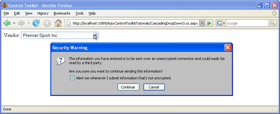

Using Auto-Postback with CascadingDropDown (C#)
====================
by [Christian Wenz](https://github.com/wenz)

[Download Code](http://download.microsoft.com/download/9/0/7/907760b1-2c60-4f81-aeb6-ca416a573b0d/cascadingdropdown3.cs.zip) or [Download PDF](http://download.microsoft.com/download/2/d/c/2dc10e34-6983-41d4-9c08-f78f5387d32b/cascadingdropdown3CS.pdf)

> The CascadingDropDown control in the AJAX Control Toolkit extends a DropDownList control so that changes in one DropDownList loads associated values in another DropDownList. However when using the CascadingDropDown control, ASP.NET's DropDownList control's AutoPostBack feature does not work, since asynchronously loading data into the list generates an (unnecessary) postback itself. With some JavaScript code, this effect can be avoided.

## Overview

The CascadingDropDown control in the AJAX Control Toolkit extends a DropDownList control so that changes in one DropDownList loads associated values in another DropDownList. (For instance, one list provides a list of US states, and the next list is then filled with major cities in that state.) However when using the CascadingDropDown control, ASP.NET's DropDownList control's AutoPostBack feature does not work, since asynchronously loading data into the list generates an (unnecessary) postback itself. With some JavaScript code, this effect can be avoided.

## Steps

In order to activate the functionality of ASP.NET AJAX and the Control Toolkit, the `ScriptManager` control must be put anywhere on the page (but within the &lt;`form`&gt; element):

[!code-aspx[Main](using-auto-postback-with-cascadingdropdown-cs/samples/sample1.aspx)]

Then, a DropDownList control is required:

[!code-aspx[Main](using-auto-postback-with-cascadingdropdown-cs/samples/sample2.aspx)]

For this list, a CascadingDropDown extender is added, providing web service URL and method information:

[!code-aspx[Main](using-auto-postback-with-cascadingdropdown-cs/samples/sample3.aspx)]

The CascadingDropDown extender then asynchronously calls a web service with the following method signature:

[!code-csharp[Main](using-auto-postback-with-cascadingdropdown-cs/samples/sample4.cs)]

The method returns an array of type CascadingDropDown value. The type's constructor expects first the list entry's caption and then the value (HTML `value` attribute).

[!code-aspx[Main](using-auto-postback-with-cascadingdropdown-cs/samples/sample5.aspx)]

Loading the page in the browser will fill the dropdown list with three vendors, the second one being preselected. Also, ASP.NET defines the `__doPostBack()` JavaScript method. Once the page has been loaded, this JavaScript call is added to the dropdown list, but only if there are elements in it. If there are no elements in the list, the Control Toolkit is currently loading them, so the JavaScript code uses a timeout and tries again in a half second.

[!code-html[Main](using-auto-postback-with-cascadingdropdown-cs/samples/sample6.html)]

This way, a postback is only executed when there are actually elements in the list and the user selects an entry.

Selecting a list element causes a postback ([Click to view full-size image](using-auto-postback-with-cascadingdropdown-cs/_static/image3.png))

>[!div class="step-by-step"]
[Previous](presetting-list-entries-with-cascadingdropdown-cs.md)
[Next](filling-a-list-using-cascadingdropdown-vb.md)