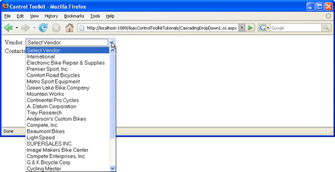
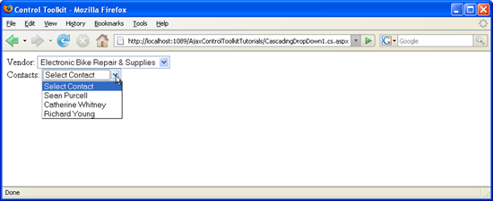

Using CascadingDropDown with a Database (C#)
====================
by [Christian Wenz](https://github.com/wenz)

[Download Code](http://download.microsoft.com/download/9/0/7/907760b1-2c60-4f81-aeb6-ca416a573b0d/cascadingdropdown1.cs.zip) or [Download PDF](http://download.microsoft.com/download/2/d/c/2dc10e34-6983-41d4-9c08-f78f5387d32b/cascadingdropdown1CS.pdf)

> The CascadingDropDown control in the AJAX Control Toolkit extends a DropDownList control so that changes in one DropDownList loads associated values in another DropDownList. In order for this to work, a special web service must be created.

## Overview

The CascadingDropDown control in the AJAX Control Toolkit extends a DropDownList control so that changes in one DropDownList loads associated values in another DropDownList. (For instance, one list provides a list of US states, and the next list is then filled with major cities in that state.) In order for this to work, a special web service must be created.

## Steps

First of all, a data source is required. This sample uses the AdventureWorks database and the Microsoft SQL Server 2005 Express Edition. The database is an optional part of a Visual Studio installation (including express edition) and is also available as a separate download under [https://go.microsoft.com/fwlink/?LinkId=64064](https://go.microsoft.com/fwlink/?LinkId=64064). The AdventureWorks database is part of the SQL Server 2005 Samples and Sample Databases (download at [https://www.microsoft.com/downloads/details.aspx?FamilyID=e719ecf7-9f46-4312-af89-6ad8702e4e6e&amp;DisplayLang=en](https://www.microsoft.com/downloads/details.aspx?FamilyID=e719ecf7-9f46-4312-af89-6ad8702e4e6e&amp;DisplayLang=en)). The easiest way to set the database up is to use the Microsoft SQL Server Management Studio Express ([https://www.microsoft.com/downloads/details.aspx?FamilyID=c243a5ae-4bd1-4e3d-94b8-5a0f62bf7796&amp;DisplayLang=en](https://www.microsoft.com/downloads/details.aspx?FamilyID=c243a5ae-4bd1-4e3d-94b8-5a0f62bf7796&amp;DisplayLang=en)) and attach the `AdventureWorks.mdf` database file.

For this sample, we assume that the instance of the SQL Server 2005 Express Edition is called `SQLEXPRESS` and resides on the same machine as the web server; this is also the default setup. If your setup differs, you have to adapt the connection information for the database.

In order to activate the functionality of ASP.NET AJAX and the Control Toolkit, the `ScriptManager` control must be put anywhere on the page (but within the &lt;`form`&gt; element):

[!code-aspx[Main](using-cascadingdropdown-with-a-database-cs/samples/sample1.aspx)]

In the next step, two DropDownList controls are required. In this sample, we use the vendor and contact information from AdventureWorks, thus we create one list for the available vendors and one for the available contacts:

[!code-aspx[Main](using-cascadingdropdown-with-a-database-cs/samples/sample2.aspx)]

Then, two CascadingDropDown extenders must be added to the page. One fills the first (vendors) list, and the other one fills the second (contacts) list. The following attributes must be set:

- `ServicePath`: URL of a web service delivering the list entries
- `ServiceMethod`: Web method delivering the list entries
- `TargetControlID`: ID of the dropdown list
- `Category`: Category information that is submitted to the web method when called
- `PromptText`: Text displayed when asynchronously loading list data from the server
- `ParentControlID`: (optional) parent dropdown list that triggers loading of the current list

Depending on the programming language used, the name of the web service in question changes, but all other attribute values are the same. Here is the CascadingDropDown element for the first dropdown list:

[!code-aspx[Main](using-cascadingdropdown-with-a-database-cs/samples/sample3.aspx)]

The control extenders for the second list need to set the `ParentControlID` attribute so that selecting an entry in the vendors list triggers loading associated elements in the contacts list.

[!code-aspx[Main](using-cascadingdropdown-with-a-database-cs/samples/sample4.aspx)]

The actual work is then done in the web service, which is set up as follows. Note that the `[ScriptService]` attribute is used, otherwise ASP.NET AJAX cannot create the JavaScript proxy to access the web methods from client-side script code.

[!code-aspx[Main](using-cascadingdropdown-with-a-database-cs/samples/sample5.aspx)]

The signature of the web methods called by CascadingDropDown is as follows:

[!code-csharp[Main](using-cascadingdropdown-with-a-database-cs/samples/sample6.cs)]

So the return value must be an array of type `CascadingDropDownNameValue` which is defined by the Control Toolkit. The `GetVendors()` method is quite easy to implement: The code connects to the AdventureWorks database and queries the first 25 vendors. The first parameter in the `CascadingDropDownNameValue` constructor is the caption of the list entry, the second one its value (value attribute in HTML's &lt;`option`&gt; element). Here is the code:

[!code-csharp[Main](using-cascadingdropdown-with-a-database-cs/samples/sample7.cs)]

Getting the associated contacts for a vendor (method name: `GetContactsForVendor()`) is a bit trickier. First of all, the vendor which has been selected in the first dropdown list must be determined. The Control Toolkit defines a helper method for that task: The `ParseKnownCategoryValuesString()` method returns a `StringDictionary` element with the dropdown data:

[!code-csharp[Main](using-cascadingdropdown-with-a-database-cs/samples/sample8.cs)]

For security reasons, this data must be validated first. So if there is a Vendor entry (because the `Category` property of the first CascadingDropDown element is set to `"Vendor"`), the ID of the selected vendor may be retrieved:

[!code-csharp[Main](using-cascadingdropdown-with-a-database-cs/samples/sample9.cs)]

The rest of the method is fairly straight-forward, then. The vendor's ID is used as a parameter for an SQL query that retrieves all associated contacts for that vendor. Once again, the method returns an array of type `CascadingDropDownNameValue`.

[!code-csharp[Main](using-cascadingdropdown-with-a-database-cs/samples/sample10.cs)]

Load the ASP.NET page, and after a short while the vendor list is filled with 25 entries. Pick one entry and notice how the second dropdown list is filled with data.

The first list is filled automatically ([Click to view full-size image](using-cascadingdropdown-with-a-database-cs/_static/image3.png))

The second list is filled according to the selection in the first list ([Click to view full-size image](using-cascadingdropdown-with-a-database-cs/_static/image6.png))

>[!div class="step-by-step"]
[Previous](filling-a-list-using-cascadingdropdown-cs.md)
[Next](presetting-list-entries-with-cascadingdropdown-cs.md)