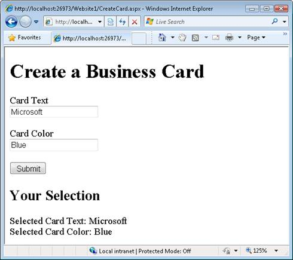
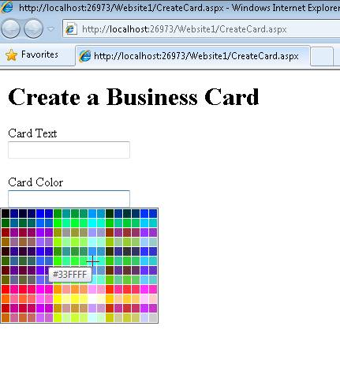
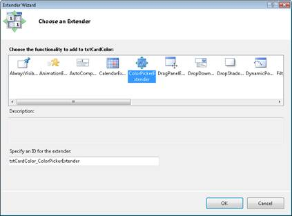

Using the ColorPicker Control Extender (C#)
====================
by [Microsoft](https://github.com/microsoft)

> ColorPicker is an ASP.NET AJAX extender that provides client-side color-picking functionality with UI in a popup control. It can be attached to any ASP.NET TextBox control. It.

The goal of this tutorial is to explain how you can use the AJAX Control Toolkit ColorPicker control extender. The ColorPicker control extender displays a popup dialog that enables you to select a color. The ColorPicker is useful whenever you want to provide an intuitive user interface for a user to pick a color.

## Extending a TextBox Control with the ColorPicker Control Extender

Imagine, for example, that you want to create a website that enables visitors to create customized business cards. Visitors can enter the text for a business card and pick the color. The ASP.NET page in Listing 1 contains two TextBox controls named txtCardText and txtCardColor. When you submit the form, the selected values are displayed (see Figure 1).

**Figure 01**: Simple form for creating a business card ([Click to view full-size image](using-the-colorpicker-control-extender-cs/_static/image2.png))

**Listing 1 - CreateCard.aspx**

[!code-aspx[Main](using-the-colorpicker-control-extender-cs/samples/sample1.aspx)]

The form in Listing 1 works, but it does not provide a great user experience. The user has to type a color into the textbox. If the user wants a specialized color - for example, just the right shade of pea green - then the user must figure out the HTML color code without any help.

You can use the ColorPicker control extender to create a better user experience. The ColorPicker displays a color dialog when you move focus to a TextBox control (see Figure 2).

**Figure 02**: The ColorPicker Control Extender ([Click to view full-size image](using-the-colorpicker-control-extender-cs/_static/image4.png))

You need to complete two steps to use the ColorPicker control extender with the form in Listing 1:

1. Add a ScriptManager control to the page
2. Add the ColorPicker control extender to the page

Before you can use the ColorPicker, you must add a ScriptManager to your page. A good place to add the ScriptManager is right below the opening server-side &lt;form&gt; tag. You can drag the ScriptManager onto the page from the toolbox (the ScriptManager is located under the AJAX Extensions tab). Alternatively, you can type the following tag into Source View beneath the opening server-side form tag:

&lt;asp:ScriptManager ID="ScriptManager1" runat="server" /&gt;

The easiest way to add the ColorPicker control extender to the page is in Design View. If you hover your mouse over the txtCardColor TextBox, a smart task option appears the enables you to add an extender (see Figure 3). If you pick this option, the Extender Wizard appears (see Figure 4).

**Figure 03**: Adding an extender ([Click to view full-size image](using-the-colorpicker-control-extender-cs/_static/image6.png))

**Figure 04**: Selecting a control extender with the Extender Wizard ([Click to view full-size image](using-the-colorpicker-control-extender-cs/_static/image8.png))

You can pick the ColorPicker extender to extend the txtCardColor TextBox with the ColorPicker extender. Click OK to close the dialog.

After you make these changes, the source for the page looks like Listing 2.

Listing 2 - CreateCard.aspx (with ColorPicker)

[!code-aspx[Main](using-the-colorpicker-control-extender-cs/samples/sample2.aspx)]

Notice that the page now contains a ColorPickerExtender control that appears directly below the txtCardColor TextBox control. The ColorPickerExtender control extends the txtCardColor control so that it displays a color picker dialog.

## Using a Button to Launch the Color Picker Dialog

The ColorPicker extender supports the following properties:

- PopupButtonId - The ID of a button on the page that causes the color picker dialog to appear.
- PopupPosition - The position, relative to the target control, of the color picker dialog. Possible values are Absolute, Center, BottomLeft, BottomRight, TopLeft, TopRight, Right, and Left (the default is BottomLeft).
- SampleControlId - The ID of a control that displays the selected color.
- SelectedColor - The initial color selected by the ColorPicker.

You can use these properties to customize how the color picker dialog is displayed and how the selected color is displayed. The page in Listing 3 illustrates how you can use several of these properties.

**Listing 3 - CreateCardButton.aspx**

[!code-aspx[Main](using-the-colorpicker-control-extender-cs/samples/sample3.aspx)]

The page in Listing 3 includes a Pick Color button (see Figure 5). When you click this button, the color picker dialog appears above the TextBox. If you select a color from the dialog then the selected color appears as the background color of the lblSample Label control.

The ColorPicker PopupButtonID property is used to associate the Pick Color button with the ColorPicker extender. When you supply a value for the PopupButtonID property, the color picker dialog no longer appears when the target control has focus. You must click the button to display the dialog.

The SampleControlID property is used to associate a control that displays the selected color with the ColorPicker. The ColorPicker changes the background color of this control to the currently selected color.

**Figure 05**: Displaying the color picker dialog with a button ([Click to view full-size image](using-the-colorpicker-control-extender-cs/_static/image10.png))

## Summary

In this tutorial, you learned how to use the ColorPicker control extender to display a popup color picker dialog. First, we examined how you can display the dialog when focus is moved to a TextBox control. Next, you learned how to create a button that displays the color picker dialog when the button is clicked.

>[!div class="step-by-step"]
[Next](using-the-colorpicker-control-extender-vb.md)