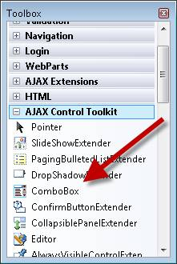
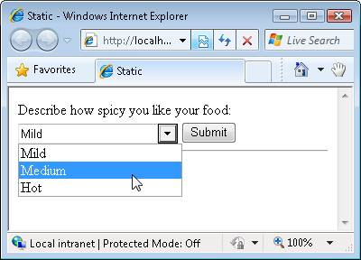
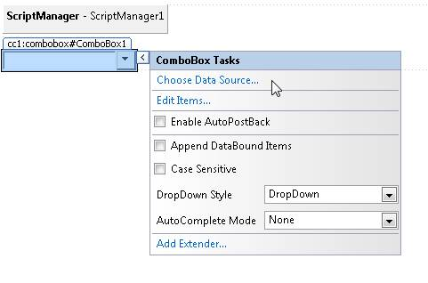
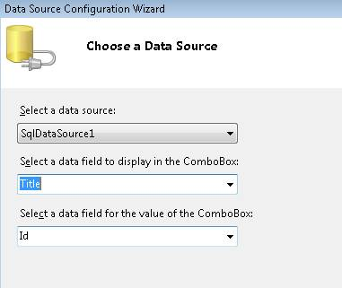
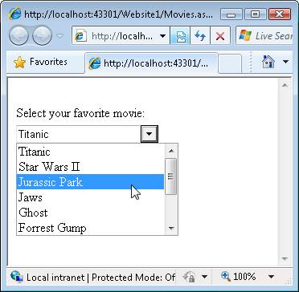
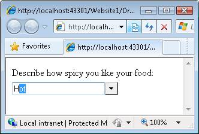

How do I use the ComboBox Control? (VB)
====================
by [Microsoft](https://github.com/microsoft)

> ComboBox is an ASP.NET AJAX control that combines the flexibility of a TextBox with a list of options from which users can choose.

The goal of this tutorial is to explain the AJAX Control Toolkit ComboBox control. The ComboBox works like a combination between a standard ASP.NET DropDownList control and a TextBox control. You can either select from a pre-existing list of items or enter a new item.

The ComboBox is similar to the AutoComplete control extender, but the controls are used in different scenarios. The AutoComplete extender queries a web service to get matching entries. The ComboBox control, in contrast, is initialized with a set of items. Using the AutoComplete extender makes sense when you are working with a large set of data (millions of car parts) while using the ComboBox control makes sense when working with a small set of data (dozens of car parts).

## Selecting from a Static List of Items

Let�s start with a simple sample of using the ComboBox control. Imagine that you want to display a static list of items in a dropdown list. However, you want to leave open the possibility that the list is not complete. You want to allow a user to enter a custom value into the list.

We�ll create a new ASP.NET Web Forms page and use the ComboBox control in the page. Add the new ASP.NET page to your project and switch to Design view.

If you want to use the ComboBox control in the page then you must add a ScriptManager control to the page. Drag the ScriptManager control from beneath the AJAX Extensions tab onto the Designer surface. You should add the ScriptManager control at the top of the page; you can add it immediately below the opening server-side &lt;form&gt; tag.

Next, drag the ComboBox control onto the page. You can find the ComboBox control in the Toolbox with the other AJAX Control Toolkit controls and control extenders (see figure1).

**Figure 01**: Selecting the ComboBox control from the toolbox ([Click to view full-size image](how-do-i-use-the-combobox-control-vb/_static/image2.png))

We�ll use the ComboBox control to display a static list of choices. The user can select a particular level of spiciness for their food from a list of three choices: Mild, Medium, and Hot (see Figure 2).

**Figure 02**: Selecting from a static list of items([Click to view full-size image](how-do-i-use-the-combobox-control-vb/_static/image4.png))

There are two ways that you can add these choices to the ComboBox control. First, you select the Edit Options task option when hovering your mouse over the control in Design view and open the Item Editor (see Figure 3).

**Figure 03**: Editing ComboBox items([Click to view full-size image](how-do-i-use-the-combobox-control-vb/_static/image6.png))

The second option is to add the list of items in between the opening and closing &lt;asp:ComboBox&gt; tags in Source view. The page in Listing 1 contains the updated ComboBox that has the list of items.

**Listing 1 - Static.aspx**

[!code-aspx[Main](how-do-i-use-the-combobox-control-vb/samples/sample1.aspx)]

When you open the page in Listing 1, you can select one of the pre-existing options from the ComboBox. In other words, the ComboBox works just like a DropDownList control.

However, you also have the option of entering a new choice (for example, Super Spicy) that is not in the existing list. So, the ComboBox also works like a TextBox control.

Regardless of whether you pick a pre-existing item or you enter a custom item, when you submit the form, your choice appears in the label control. When you submit the form, the btnSubmit\_Click handler executes and updates the label (see Figure 4).

**Figure 04**: Displaying the selected item([Click to view full-size image](how-do-i-use-the-combobox-control-vb/_static/image8.png))

The ComboBox supports the same properties as the DropDownList control for retrieving the selected item after a form is submitted:

- SelectedItem.Text - Displays the value of the Text property of the selected item.
- SelectedItem.Value - Displays the value of the Value property of the selected item or displays the text typed into the ComboBox.
- SelectedValue - Same as SelectedItem.Value except that this property enables you to specify the default (initial) selected item.

If you type a custom choice into the ComboBox then the custom choice is assigned to both the SelectedItem.Text and SelectedItem.Value properties.

## Selecting the List of Items from the Database

You can retrieve the list of items that the ComboBox displays from a database. For example, you can bind the ComboBox to a SqlDataSource control, an ObjectDataSource control, a LinqDataSource, or an EntityDataSource.

Imagine that you want to display a list of movies in a ComboBox. You want to retrieve the list of movies from the Movies database table. Follow these steps:

1. Create a page named Movies.aspx
2. Add a ScriptManager control to the page by dragging the ScriptManager from under the AJAX Extensions tab in the Toolbox onto the page.
3. Add a ComboBox control to the page by dragging the ComboBox onto the page.
4. In Design view, hover your mouse over the ComboBox control and select the **Choose Data Source** task option (see Figure 5). The Data Source Configuration Wizard is launched.
5. In the **Choose a Data Source** step, select the &lt;New data source�&gt; option.
6. In the **Choose a Data Source Type** step, select Database.
7. In the **Choose Your Data Connection** step, select your database (for example, MoviesDB.mdf).
8. In the **Save the Connection String to the Application Configuration File** step, select the option to save your connection string.
9. In the **Configure the Select Statement** step, select the Movies database table and select all of the columns.
10. In the **Test Query** step, click the Finish button.
11. Back in the **Choose Data Source** step, select the Title column for the field to display and the Id column for the data field (see Figure).
12. Click the OK button to close the wizard.

**Figure 05**: Choosing a data source([Click to view full-size image](how-do-i-use-the-combobox-control-vb/_static/image10.png))

**Figure 06**: Choosing the data text and value fields([Click to view full-size image](how-do-i-use-the-combobox-control-vb/_static/image12.png))

After you complete the steps above, the ComboBox is bound to a SqlDataSource control that represents the movies from the Movies database table. The source for the page looks like Listing 2 (I cleaned up the formatting a little bit).

**Listing 2 - Movies.aspx**

[!code-aspx[Main](how-do-i-use-the-combobox-control-vb/samples/sample2.aspx)]

Notice that the ComboBox control has a DataSourceID property that points to the SqlDataSource control. When you open the page in a browser, the list of movies from the database is displayed (see Figure 7). You can either a pick a movie from the list or enter a new movie by typing the movie into the ComboBox.

**Figure 07**: Displaying a list of movies([Click to view full-size image](how-do-i-use-the-combobox-control-vb/_static/image14.png))

## Setting the DropDownStyle

You can use the ComboBox DropDownStyle property to change the behavior of the ComboBox. This property accepts there possible values:

- DropDown - (default value) The ComboBox displays a dropdown list when you click the arrow and you can enter a custom value.
- Simple - The ComboBox displays a dropdown list automatically and you can enter a custom value.
- DropDownList - The ComboBox works just like a DropDownList control.

The different between DropDown and Simple is when the list of items is displayed. In the case of Simple, the list is displayed immediately when you move focus to the ComboBox. In the case of DropDown, you must click the arrow to see the list of items.

The DropDownList value causes the ComboBox control to work just like a standard DropDownList control. However, there is an important difference here. Older versions of Internet Explorer display a DropDownList control with an infinite z-index so the control will appear in front of any control placed in front of it. Because the ComboBox renders an HTML &lt;div&gt; tag instead of an HTML &lt;select&gt; tag, the ComboBox correctly respects z-ordering.

## Setting the AutoCompleteMode

You use the ComboBox AutoCompleteMode property to specify what happens when someone types text into the ComboBox. This property accepts the following possible values:

- None - (default value) The ComboBox does not provide any auto-complete behavior.
- Suggest - The ComboBox displays the list and it highlights the matching item in the list (see Figure 8).
- Append - The ComboBox does not display the list and it appends the matching item from the list onto what you have typed (see Figure 9).
- SuggestAppend - The ComboBox both displays the list and appends the matching item from the list onto what you have typed (see Figure 10).

**Figure 08**: The ComboBox makes a suggestion([Click to view full-size image](how-do-i-use-the-combobox-control-vb/_static/image16.png))

**Figure 09**: ComboBox appends matching text([Click to view full-size image](how-do-i-use-the-combobox-control-vb/_static/image18.png))

**Figure 10**: The ComboBox suggests and appends([Click to view full-size image](how-do-i-use-the-combobox-control-vb/_static/image20.png))

## Summary

In this tutorial, you learned how to use the ComboBox control to display a fixed set of items. We bound the ComboBox control both to a static set of items and to a database table. Finally, you learned how to modify the behavior of the ComboBox by setting its DropDownStyle and AutoCompleteMode properties.

>[!div class="step-by-step"]
[Previous](how-do-i-use-the-combobox-control-cs.md)