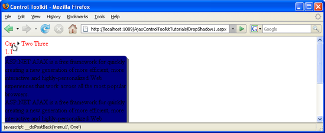

Adjusting the Z-Index of a DropShadow (C#)
====================
by [Christian Wenz](https://github.com/wenz)

[Download Code](http://download.microsoft.com/download/5/1/6/51652a81-500b-4f6b-88d3-617103e7941e/DropShadow1.cs.zip) or [Download PDF](http://download.microsoft.com/download/b/6/a/b6ae89ee-df69-4c87-9bfb-ad1eb2b23373/dropshadow1CS.pdf)

> The DropShadow control in the AJAX Control Toolkit extends a panel with a drop shadow. However this shadow sometimes conflicts with other controls, for instance the ASP.NET Menu control. When a menu entry pops up, it appears behind the drop shadow.

## Overview

The DropShadow control in the AJAX Control Toolkit extends a panel with a drop shadow. However this shadow sometimes conflicts with other controls, for instance the ASP.NET Menu control. When a menu entry pops up, it appears behind the drop shadow.

## Steps

The code commences with the Panel itself, containing enough text so that the panel contains enough text for the effect to be visible:

[!code[Main](adjusting-the-z-index-of-a-dropshadow-cs/samples/sample1.xml)]

Another panel is placed directly before the `panelShadow` panel. It contains a menu with horizontal orientation so that menu entries appear over (or rather: under) the `dropShadow` panel):

[!code[Main](adjusting-the-z-index-of-a-dropshadow-cs/samples/sample2.xml)]

Then, the `DropShadowExtender` is added to extend the `panelShadow` panel with a drop shadow effect:

[!code[Main](adjusting-the-z-index-of-a-dropshadow-cs/samples/sample3.xml)]

Finally, the ASP.NET AJAX `ScriptManager` control enables the Control Toolkit to work:

[!code[Main](adjusting-the-z-index-of-a-dropshadow-cs/samples/sample4.xml)]

When you run this script, the menu entries appear underneath the panel. However the menu uses the CSS class `panel` where you just have to define two things to make elements appear in front of the other panel:

- Relative positioning
- A positive z-index

[!code[Main](adjusting-the-z-index-of-a-dropshadow-cs/samples/sample5.xml)]

Then, the `DropShadowExtender` control does not conflict any longer with the Menu control.

Before: The menu entry is not visible ([Click to view full-size image](adjusting-the-z-index-of-a-dropshadow-cs/_static/image3.png))

After: The menu entry appears ([Click to view full-size image](adjusting-the-z-index-of-a-dropshadow-cs/_static/image6.png))

>[!div class="step-by-step"]
[Next](manipulating-dropshadow-properties-from-client-code-cs.md)