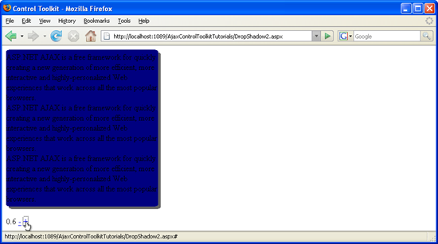

Manipulating DropShadow Properties from Client Code (C#)
====================
by [Christian Wenz](https://github.com/wenz)

[Download Code](http://download.microsoft.com/download/5/1/6/51652a81-500b-4f6b-88d3-617103e7941e/DropShadow2.cs.zip) or [Download PDF](http://download.microsoft.com/download/b/6/a/b6ae89ee-df69-4c87-9bfb-ad1eb2b23373/dropshadow2CS.pdf)

> The DropShadow control in the AJAX Control Toolkit extends a panel with a drop shadow. Properties of this extender can also be changed using client JavaScript code.

## Overview

The DropShadow control in the AJAX Control Toolkit extends a panel with a drop shadow. Properties of this extender can also be changed using client JavaScript code.

## Steps

The code starts with a panel containing some lines of text:

[!code-aspx[Main](manipulating-dropshadow-properties-from-client-code-cs/samples/sample1.aspx)]

The associated CSS class gives the panel a nice background color:

[!code-css[Main](manipulating-dropshadow-properties-from-client-code-cs/samples/sample2.css)]

The `DropShadowExtender` is added to extend the panel with a drop shadow effect, opacity set to 50%:

[!code-aspx[Main](manipulating-dropshadow-properties-from-client-code-cs/samples/sample3.aspx)]

Then, the ASP.NET AJAX `ScriptManager` control enables the Control Toolkit to work:

[!code-aspx[Main](manipulating-dropshadow-properties-from-client-code-cs/samples/sample4.aspx)]

Another panel contains two JavaScript links for setting the opacity of the drop shadow: the minus link decreases the shadow's opacity, the plus link increases it.

[!code-aspx[Main](manipulating-dropshadow-properties-from-client-code-cs/samples/sample5.aspx)]

The JavaScript function `changeOpacity()` must then first find the `DropShadowExtender` control on the page. ASP.NET AJAX defines the `$find()` method for exactly that task. Then, the `get_Opacity()` method retrieves the current opacity, the `set_Opacity()` method sets it. The JavaScript code then puts the current opacity value in the `<label>` element:

[!code-html[Main](manipulating-dropshadow-properties-from-client-code-cs/samples/sample6.html)]

The opacity is changed on the client side ([Click to view full-size image](manipulating-dropshadow-properties-from-client-code-cs/_static/image3.png))

>[!div class="step-by-step"]
[Previous](adjusting-the-z-index-of-a-dropshadow-cs.md)
[Next](adjusting-the-z-index-of-a-dropshadow-vb.md)