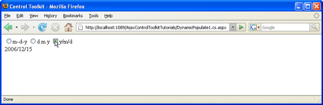

Dynamically Populating a Control Using JavaScript Code (C#)
====================
by [Christian Wenz](https://github.com/wenz)

[Download Code](http://download.microsoft.com/download/d/8/f/d8f2f6f9-1b7c-46ad-9252-e1fc81bdea3e/dynamicpopulate1.cs.zip) or [Download PDF](http://download.microsoft.com/download/b/6/a/b6ae89ee-df69-4c87-9bfb-ad1eb2b23373/dynamicpopulate1CS.pdf)

> The DynamicPopulate control in the ASP.NET AJAX Control Toolkit calls a web service (or page method) and fills the resulting value into a target control on the page, without a page refresh. It is also possible to trigger the population using custom client-side JavaScript code.

## Overview

The `DynamicPopulate` control in the ASP.NET AJAX Control Toolkit calls a web service (or page method) and fills the resulting value into a target control on the page, without a page refresh. It is also possible to trigger the population using custom client-side JavaScript code.

## Steps

First of all, you need an ASP.NET Web Service which implements the method to be called by the `DynamicPopulateExtender` control. The web service implements the method `getDate()` that expects one argument of type string, called `contextKey`, since the `DynamicPopulate` control sends one piece of context information with each web service call. Here is the code (file `DynamicPopulate.cs.asmx`) which retrieves the current date in one of three formats:

[!code-aspx[Main](dynamically-populating-a-control-using-javascript-code-cs/samples/sample1.aspx)]

In the next step, create a new ASP.NET site and start with the ASP.NET AJAX ScriptManager control:

[!code-aspx[Main](dynamically-populating-a-control-using-javascript-code-cs/samples/sample2.aspx)]

Then, add a label control (for instance using the HTML control of the same name, or the `<asp:Label />` web control) which will later show the result of the web service call.

[!code-aspx[Main](dynamically-populating-a-control-using-javascript-code-cs/samples/sample3.aspx)]

Next, include a `DynamicPopulateExtender` control and provide web service information, target control, but not the name of the control which triggers the population this will be done later on, using custom JavaScript!

[!code-aspx[Main](dynamically-populating-a-control-using-javascript-code-cs/samples/sample4.aspx)]

Now to the JavaScript part. The `$find()` function, defined by the ASP.NET AJAX library, returns a reference to server-side objects of the ASP.NET AJAX Control Toolkit such as `DynamicPopulateExtender`. In the current file, `$find("dpe")` returns a reference to the one `DynamicPopulateExtender` control in the page. It exposes a method called `populate()` which triggers the dynamic population process. The `populate()` method requires one argument: the context key which will serve as argument to the `getDate()` web method. So for instance, `$find("dpe").populate("format1")` would populate the label with the current date in month-day-year format.

In order to make the sample a bit more flexible, the user may now choose between several date formats. For each one of them, a radio button is displayed. Once the user clicks on a radio button, JavaScript code dynamically populates the label with the selected date format. Here are those radio buttons:

[!code-aspx[Main](dynamically-populating-a-control-using-javascript-code-cs/samples/sample5.aspx)]

Note that within the context of a radio button, the JavaScript expression `this.value` refers to the value of the current button, which happens to be exactly the same information the `getDate()` method can work with.

A click on the button retrieves the date from the server, in the format specified ([Click to view full-size image](dynamically-populating-a-control-using-javascript-code-cs/_static/image3.png))

>[!div class="step-by-step"]
[Previous](dynamically-populating-a-control-cs.md)
[Next](using-dynamicpopulate-with-a-user-control-and-javascript-cs.md)