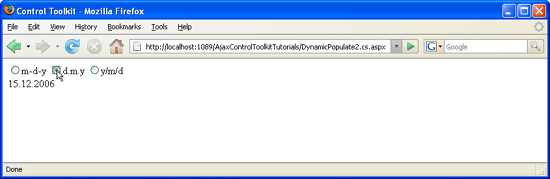

Using DynamicPopulate with a User Control And JavaScript (C#)
====================
by [Christian Wenz](https://github.com/wenz)

[Download Code](http://download.microsoft.com/download/d/8/f/d8f2f6f9-1b7c-46ad-9252-e1fc81bdea3e/dynamicpopulate2.cs.zip) or [Download PDF](http://download.microsoft.com/download/b/6/a/b6ae89ee-df69-4c87-9bfb-ad1eb2b23373/dynamicpopulate2CS.pdf)

> The DynamicPopulate control in the ASP.NET AJAX Control Toolkit calls a web service (or page method) and fills the resulting value into a target control on the page, without a page refresh. It is also possible to trigger the population using custom client-side JavaScript code. However special care has to be taken when the extender resides in a user control.

## Overview

The `DynamicPopulate` control in the ASP.NET AJAX Control Toolkit calls a web service (or page method) and fills the resulting value into a target control on the page, without a page refresh. It is also possible to trigger the population using custom client-side JavaScript code. However special care has to be taken when the extender resides in a user control.

## Steps

First of all, you need an ASP.NET Web Service which implements the method to be called by the `DynamicPopulateExtender` control. The web service implements the method `getDate()` that expects one argument of type string, called `contextKey`, since the `DynamicPopulate` control sends one piece of context information with each web service call. Here is the code (file `DynamicPopulate.cs.asmx`) which retrieves the current date in one of three formats:

[!code-aspx[Main](using-dynamicpopulate-with-a-user-control-and-javascript-cs/samples/sample1.aspx)]

In the next step, create a new user control (`.ascx` file), denoted by the following declaration in its first line:

[!code-aspx[Main](using-dynamicpopulate-with-a-user-control-and-javascript-cs/samples/sample2.aspx)]

A &lt;`label`&gt; element will be used to display the data coming from the server.

[!code-aspx[Main](using-dynamicpopulate-with-a-user-control-and-javascript-cs/samples/sample3.aspx)]

Also in the user control file, we will use three radio buttons, each one representing one of the three possible date formats supported by the web service. When the user clicks on one of the radio buttons, the browser will execute JavaScript code which looks like this:

[!code-powershell[Main](using-dynamicpopulate-with-a-user-control-and-javascript-cs/samples/sample4.ps1)]

This code accesses the `DynamicPopulateExtender` (do not worry about the strange ID yet, this will be covered later on) and triggers the dynamic population with data. In the context of the current radio button, `this.value` refers to its value which is `format1`, `format2` or `format3` exactly what the web method expects.

The only thing missing in the user control yet is the `DynamicPopulateExtender` control which links the radio buttons to the web service.

[!code-aspx[Main](using-dynamicpopulate-with-a-user-control-and-javascript-cs/samples/sample5.aspx)]

Again you may note the strange ID used in the control: `mcd1$myDate` instead of `myDate`. Previously, the JavaScript code used `mcd1_dpe1` to access the `DynamicPopulateExtender` instead of `dpe1`.This naming strategy is a special requirement when using `DynamicPopulateExtender` within a user control. Furthermore, you have to embed the user contol in a specific way to make it all work. Create a new ASP.NET page and register a tag prefix for the user control you have just implemented:

[!code-aspx[Main](using-dynamicpopulate-with-a-user-control-and-javascript-cs/samples/sample6.aspx)]

Then, include the ASP.NET AJAX `ScriptManager` control on the new page:

[!code-aspx[Main](using-dynamicpopulate-with-a-user-control-and-javascript-cs/samples/sample7.aspx)]

Finally, add the user control to the page. You only have to set its `ID` attribute (and `runat="server"`, of course), but you also have to set it to a specific name: `mcd1` since this is the prefix used within the user control to access it using JavaScript.

[!code-aspx[Main](using-dynamicpopulate-with-a-user-control-and-javascript-cs/samples/sample8.aspx)]

And that's it! The page behaves as expected: A user clicks on on of the radio buttons, the control in the Toolkit calls the web service and displays the current date in the desired format.

The radio buttons reside in a user control ([Click to view full-size image](using-dynamicpopulate-with-a-user-control-and-javascript-cs/_static/image3.png))

>[!div class="step-by-step"]
[Previous](dynamically-populating-a-control-using-javascript-code-cs.md)
[Next](dynamically-populating-a-control-vb.md)