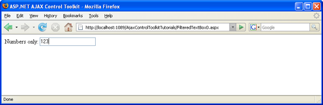

Allowing Only Certain Characters in a Text Box (VB)
====================
by [Christian Wenz](https://github.com/wenz)

[Download Code](http://download.microsoft.com/download/4/c/2/4c2def7a-0d23-4055-91f9-1f18504167d7/FilteredTextBox0.vb.zip) or [Download PDF](http://download.microsoft.com/download/b/6/a/b6ae89ee-df69-4c87-9bfb-ad1eb2b23373/filteredtextbox0VB.pdf)

> ASP.NET validation controls can ensure that only certain characters are allowed in user input. However this still does not prevent users from typing invalid characters and trying to submit the form.

## Overview

ASP.NET validation controls can ensure that only certain characters are allowed in user input. However this still does not prevent users from typing invalid characters and trying to submit the form.

## Steps

The ASP.NET AJAX Control Toolkit contains the `FilteredTextBox` control which extends a text box. Once activated, only a certain set of characters may be entered into the field.

For this to work, we first need as usual the ASP.NET AJAX `ScriptManager` which loads the JavaScript libraries which are also used by the ASP.NET AJAX Control Toolkit:

[!code-aspx[Main](allowing-only-certain-characters-in-a-text-box-vb/samples/sample1.aspx)]

Then, we need a text box:

[!code-aspx[Main](allowing-only-certain-characters-in-a-text-box-vb/samples/sample2.aspx)]

Finally, the `FilteredTextBoxExtender` control takes care of restricting the characters the user is allowed to type. First, set the `TargetControlID` attribute to the `ID` of the `TextBox` control. Then, choose one of the available `FilterType` values:

- `Custom` default; you have to provide a list of valid chars
- `LowercaseLetters` lowercase letters only
- `Numbers` digits only
- `UppercaseLetters` uppercase letters only

If the `Custom FilterType` is used, the `ValidChars` property must be set and provide a list of characters that may be typed. By the way: if you try to paste text into the text box, all invalid chars are removed.

Here is the markup for the `FilteredTextBoxExtender` control that only allows digits (something that would also have been possible with `FilterType="Numbers"`):

[!code-aspx[Main](allowing-only-certain-characters-in-a-text-box-vb/samples/sample3.aspx)]

Run the page and try to enter a letter if JavaScript is enabled, it will not work; digits however appear on the page. However note that the protection `FilteredTextBox` provides is not bullet-proof: If JavaScript is enabled, any data may be entered in the text box, so you have to use additional validation means, i.e. ASP.NET's validation controls.

Only digits may be entered ([Click to view full-size image](allowing-only-certain-characters-in-a-text-box-vb/_static/image3.png))

>[!div class="step-by-step"]
[Previous](allowing-only-certain-characters-in-a-text-box-cs.md)