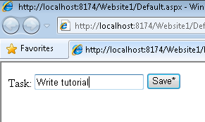

Creating a Custom AJAX Control Toolkit Control Extender (C#)
====================
by [Microsoft](https://github.com/microsoft)

> Custom Extenders enable you to customize and extend the capabilities of ASP.NET controls without having to create new classes.

In this tutorial, you learn how to create a custom AJAX Control Toolkit control extender. We create a simple, but useful, new extender that changes the state of a Button from disabled to enabled when you type text into a TextBox. After reading this tutorial, you will be able to extend the ASP.NET AJAX Toolkit with your own control extenders.

You can create custom control extenders using either Visual Studio or Visual Web Developer (make sure that you have the latest version of Visual Web Developer).

## Overview of the DisabledButton Extender

Our new control extender is named the DisabledButton extender. This extender will have three properties:

- TargetControlID - The TextBox that the control extends.
- TargetButtonIID - The Button that is disabled or enabled.
- DisabledText - The text that is initially displayed in the Button. When you start typing, the Button displays the value of the Button Text property.

You hook the DisabledButton extender to a TextBox and Button control. Before you type any text, the Button is disabled and the TextBox and Button look like this:

([Click to view full-size image](creating-a-custom-ajax-control-toolkit-control-extender-cs/_static/image3.png))

After you start typing text, the Button is enabled and the TextBox and Button look like this:

([Click to view full-size image](creating-a-custom-ajax-control-toolkit-control-extender-cs/_static/image6.png))

To create our control extender, we need to create the following three files:

- DisabledButtonExtender.cs - This file is the server-side control class that will manage creating your extender and allow you to set the properties at design-time. It also defines the properties that can be set on your extender. These properties are accessible via code and at design time and match properties defined in the DisableButtonBehavior.js file.
- DisabledButtonBehavior.js -- This file is where you will add all of your client script logic.
- DisabledButtonDesigner.cs - This class enables design-time functionality. You need this class if you want the control extender to work correctly with the Visual Studio/Visual Web Developer Designer.

So a control extender consists of a server-side control, a client-side behavior, and a server-side designer class. You learn how to create all three of these files in the following sections.

## Creating the Custom Extender Website and Project

The first step is to create a class library project and website in Visual Studio/Visual Web Developer. We�ll create the custom extender in the class library project and test the custom extender in the website.

Let�s start with the website. Follow these steps to create the website:

1. Select the menu option **File, New Web Site**.
2. Select the **ASP.NET Web Site** template.
3. Name the new website *Website1*.
4. Click the **OK** button.

Next, we need to create the class library project that will contain the code for the control extender:

1. Select the menu option **File, Add, New Project**.
2. Select the **Class Library** template.
3. Name the new class library with the name **CustomExtenders**.
4. Click the **OK** button.

After you complete these steps, your Solution Explorer window should look like Figure 1.

**Figure 01**: Solution with website and class library project([Click to view full-size image](creating-a-custom-ajax-control-toolkit-control-extender-cs/_static/image9.png))

Next, you need to add all of the necessary assembly references to the class library project:

1. Right-click the CustomExtenders project and select the menu option **Add Reference**.
2. Select the .NET tab.
3. Add references to the following assemblies:

    1. System.Web.dll
    2. System.Web.Extensions.dll
    3. System.Design.dll
    4. System.Web.Extensions.Design.dll
4. Select the Browse tab.
5. Add a reference to the AjaxControlToolkit.dll assembly. This assembly is located in the folder where you downloaded the AJAX Control Toolkit.

After you complete these steps, your class library project References folder should look like Figure 2.

**Figure 02**: References folder with required references([Click to view full-size image](creating-a-custom-ajax-control-toolkit-control-extender-cs/_static/image12.png))

## Creating the Custom Control Extender

Now that we have our class library, we can start building our extender control. Let�s start with the bare bones of a custom extender control class (see Listing 1).

**Listing 1 - MyCustomExtender.cs**

[!code-csharp[Main](creating-a-custom-ajax-control-toolkit-control-extender-cs/samples/sample1.cs)]

There are several things that you notice about the control extender class in Listing 1. First, notice that the class inherits from the base ExtenderControlBase class. All AJAX Control Toolkit extender controls derive from this base class. For example, the base class includes the TargetID property that is a required property of every control extender.

Next, notice that the class includes the following two attributes related to client script:

- WebResource - Causes a file to be included as an embedded resource in an assembly.
- ClientScriptResource - Causes a script resource to be retrieved from an assembly.

The WebResource attribute is used to embed the MyControlBehavior.js JavaScript file into the assembly when the custom extender is compiled. The ClientScriptResource attribute is used to retrieve the MyControlBehavior.js script from the assembly when the custom extender is used in a web page.

In order for the WebResource and ClientScriptResource attributes to work, you must compile the JavaScript file as an embedded resource. Select the file in the Solution Explorer window, open the property sheet, and assign the value *Embedded Resource* to the **Build Action** property.

Notice that the control extender also includes a TargetControlType attribute. This attribute is used to specify the type of control that is extended by the control extender. In the case of Listing 1, the control extender is used to extend a TextBox.

Finally, notice that the custom extender includes a property named MyProperty. The property is marked with the ExtenderControlProperty attribute. The GetPropertyValue() and SetPropertyValue() methods are used to pass the property value from the server-side control extender to the client-side behavior.

Let�s go ahead and implement the code for our DisabledButton extender. The code for this extender can be found in Listing 2.

**Listing 2 - DisabledButtonExtender.cs**

[!code-csharp[Main](creating-a-custom-ajax-control-toolkit-control-extender-cs/samples/sample2.cs)]

The DisabledButton extender in Listing 2 has two properties named TargetButtonID and DisabledText. The IDReferenceProperty applied to the TargetButtonID property prevents you from assigning anything other than the ID of a Button control to this property.

The WebResource and ClientScriptResource attributes associate a client-side behavior located in a file named DisabledButtonBehavior.js with this extender. We discuss this JavaScript file in the next section.

## Creating the Custom Extender Behavior

The client-side component of a control extender is called a behavior. The actual logic for disabling and enabling the Button is contained in the DisabledButton behavior. The JavaScript code for the behavior is included in Listing 3.

**Listing 3 - DisabledButton.js**

[!code-javascript[Main](creating-a-custom-ajax-control-toolkit-control-extender-cs/samples/sample3.js)]

The JavaScript file in Listing 3 contains a client-side class named DisabledButtonBehavior. This class, like its server-side twin, includes two properties named TargetButtonID and DisabledText which you can access using get\_TargetButtonID/set\_TargetButtonID and get\_DisabledText/set\_DisabledText.

The initialize() method associates a keyup event handler with the target element for the behavior. Each time you type a letter into the TextBox associated with this behavior, the keyup handler executes. The keyup handler either enables or disables the Button depending on whether the TextBox associated with the behavior contains any text.

Remember that you must compile the JavaScript file in Listing 3 as an embedded resource. Select the file in the Solution Explorer window, open the property sheet, and assign the value *Embedded Resource* to the **Build Action** property (see Figure 3). This option is available in both Visual Studio and Visual Web Developer.

**Figure 03**: Adding a JavaScript file as an embedded resource([Click to view full-size image](creating-a-custom-ajax-control-toolkit-control-extender-cs/_static/image15.png))

## Creating the Custom Extender Designer

There is one last class that we need to create to complete our extender. We need to create the designer class in Listing 4. This class is required to make the extender behave correctly with the Visual Studio/Visual Web Developer Designer.

**Listing 4 - DisabledButtonDesigner.cs**

[!code-csharp[Main](creating-a-custom-ajax-control-toolkit-control-extender-cs/samples/sample4.cs)]

You associate the designer in Listing 4 with the DisabledButton extender with the Designer attribute.You need to apply the Designer attribute to the DisabledButtonExtender class like this:

[!code-csharp[Main](creating-a-custom-ajax-control-toolkit-control-extender-cs/samples/sample5.cs)]

## Using the Custom Extender

Now that we have finished creating the DisabledButton control extender, it is time to use it in our ASP.NET website. First, we need to add the custom extender to the toolbox. Follow these steps:

1. Open an ASP.NET page by double-clicking the page in the Solution Explorer window.
2. Right-click the toolbox and select the menu option **Choose Items**.
3. In the Choose Toolbox Items dialog, browse to the CustomExtenders.dll assembly.
4. Click the **OK** button to close the dialog.

After you complete these steps, the DisabledButton control extender should appear in the toolbox (see Figure 4).

**Figure 04**: DisabledButton in the toolbox([Click to view full-size image](creating-a-custom-ajax-control-toolkit-control-extender-cs/_static/image18.png))

Next, we need to create a new ASP.NET page. Follow these steps:

1. Create a new ASP.NET page named ShowDisabledButton.aspx.
2. Drag a ScriptManager onto the page.
3. Drag a TextBox control onto the page.
4. Drag a Button control onto the page.
5. In the Properties window, change the Button ID property to the value *btnSave* and the Text property to the value *Save\**.
  

We created a page with a standard ASP.NET TextBox and Button control.

Next, we need to extend the TextBox control with the DisabledButton extender:

1. Select the **Add Extender** task option to open the Extender Wizard dialog (see Figure 5). Notice that the dialog includes our custom DisabledButton extender.
2. Select the DisabledButton extender and click the **OK** button.

**Figure 05**: The Extender Wizard dialog([Click to view full-size image](creating-a-custom-ajax-control-toolkit-control-extender-cs/_static/image21.png))

Finally, we can set the properties of the DisabledButton extender. You can modify the properties of the DisabledButton extender by modifying the properties of the TextBox control:

1. Select the TextBox in the Designer.
2. In the Properties window, expand the Extenders node (see Figure 6).
3. Assign the value *Save* to the DisabledText property and the value *btnSave* to the TargetButtonID property.

**Figure 06**: Setting extender properties([Click to view full-size image](creating-a-custom-ajax-control-toolkit-control-extender-cs/_static/image24.png))

When you run the page (by hitting F5), the Button control is initially disabled. As soon as you start entering text into the TextBox, the Button control is enabled (see Figure 7).

**Figure 07**: The DisabledButton extender in action([Click to view full-size image](creating-a-custom-ajax-control-toolkit-control-extender-cs/_static/image27.png))

## Summary

The goal of this tutorial was to explain how you can extend the AJAX Control Toolkit with custom extender controls. In this tutorial, we created a simple DisabledButton control extender. We implemented this extender by creating a DisabledButtonExtender class, a DisabledButtonBehavior JavaScript behavior, and a DisabledButtonDesigner class. You follow a similar set of steps whenever you create a custom control extender.

>[!div class="step-by-step"]
[Previous](using-ajax-control-toolkit-controls-and-control-extenders-cs.md)
[Next](get-started-with-the-ajax-control-toolkit-vb.md)