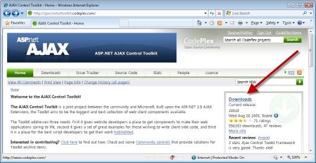
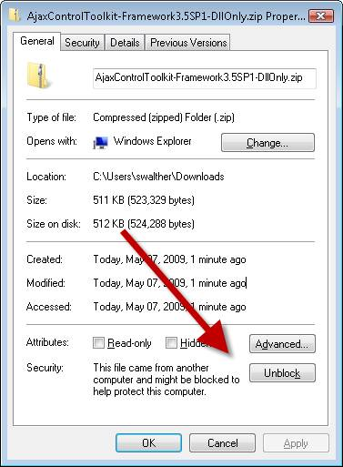

Get Started with the AJAX Control Toolkit (VB)
====================
by [Microsoft](https://github.com/microsoft)

> Learn all you need to know to get started using the AJAX Control Toolkit.

The AJAX Control Toolkit contains more than 30 free controls that you can use in your ASP.NET applications. In this tutorial, you learn how to download the AJAX Control Toolkit and add the toolkit controls to your Visual Studio/Visual Web Developer Express toolbox.

## Downloading the AJAX Control Toolkit

The AJAX Control Toolkit is an open source project developed by the members of the ASP.NET community and the ASP.NET team. The AJAX Control Toolkit is hosted at CodePlex.com which is the Microsoft website for hosting open source projects.

Navigate to the following URL to go directly to the AJAX Control Toolkit CodePlex page:

[http://AjaxControlToolkit.CodePlex.com](http://AjaxControlToolkit.CodePlex.com)

Click the Downloads link (see Figure 1) to see a list of different versions of the AJAX Control Toolkit. For example, you can download the version of the toolkit that contains the AJAX Control Toolkit controls. Alternatively, you can download the full version of the Toolkit that contains the controls, a sample site, and the source code for the controls.

**Figure 01**: Downloading the AJAX Control Toolkit([Click to view full-size image](get-started-with-the-ajax-control-toolkit-vb/_static/image2.png))

After you download the file, you need to unblock the file. Right-click the file, select Properties, and click the **Unblock** button (see Figure 2).

**Figure 02**: Unblocking the AJAX Control Toolkit ZIP file([Click to view full-size image](get-started-with-the-ajax-control-toolkit-vb/_static/image4.png))

After you unblock the file, you can unzip the file: Right-click the file and select the **Extract All** menu option. Now, we are ready to add the toolkit to the Visual Studio/Visual Web Developer toolbox.

## Adding the AJAX Control Toolkit to the Toolbox

The easiest way to use the AJAX Control Toolkit is to add the toolkit to your Visual Studio/Visual Web Developer toolbox (see Figure 3). That way, you can simply drag a toolkit control onto a page when you want to use it.

**Figure 03**: AJAX Control Toolkit appears in toolbox([Click to view full-size image](get-started-with-the-ajax-control-toolkit-vb/_static/image6.png))

First, you need to add an AJAX Control Toolkit tab to the toolbox. Follow these steps.

1. Create a new ASP.NET Website by selecting the menu option File, New Website. Double-click the Default.aspx in the Solution Explorer window to open the file in the editor.
2. Right-click the Toolbox beneath the General Tab and select the menu option **Add Tab** (see Figure 4).
3. Enter a new tab named AJAX Control Toolkit.

**Figure 04**: Adding a new tab([Click to view full-size image](get-started-with-the-ajax-control-toolkit-vb/_static/image8.png))

Next, you need to add the AJAX Control Toolkit controls to the new tab. Follow these steps:

- Right-click beneath the AJAX Control Toolkit tab and select the menu option **Choose Items (see Figure 5)**.
- Browse to the location where you unzipped the AJAX Control Toolkit and select the AjaxControlToolkit.dll assembly.

**Figure 05**: Choose items to add to the toolbox([Click to view full-size image](get-started-with-the-ajax-control-toolkit-vb/_static/image10.png))

After you complete these steps, all of the toolkit controls will appear in your toolbox.

## Upgrading to a New Version of the Toolkit

If you were using an older release of the Toolkit and now need to move to a later version here are the recommended steps:

- Binaries - Delete the old version of the AjaxControlToolkit.dll assembly from your website Bin folder.
- Toolbox Items - Delete the AJAX Control Toolkit tab and follow the steps above to re-create the tab with the new version of the AjaxControlToolkit.dll assembly.

>[!div class="step-by-step"]
[Previous](creating-a-custom-ajax-control-toolkit-control-extender-cs.md)
[Next](using-ajax-control-toolkit-controls-and-control-extenders-vb.md)