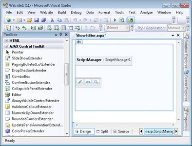
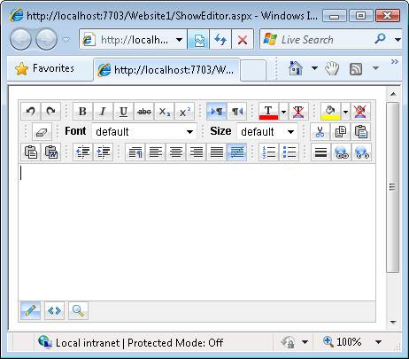
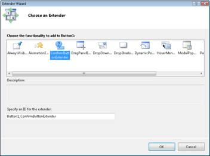

Using AJAX Control Toolkit Controls and Control Extenders (C#)
====================
by [Microsoft](https://github.com/microsoft)

> Learn how to add AJAX Control Toolkit controls and extenders to your ASP.NET pages.

The AJAX Control Toolkit contains a set of controls and control extenders. In this brief tutorial, you learn how to add both controls and control extenders to an ASP.NET page.

> [!NOTE] 
> 
> For instructions on installing the AJAX Control Toolkit and adding the AJAX Control Toolkit to the Visual Studio/Visual Web Developer toolbox, see the tutorial [Get Started with the AJAX Control Toolkit](get-started-with-the-ajax-control-toolkit-cs.md).

## Using AJAX Control Toolkit Controls

An AJAX Control Toolkit control works just like a normal ASP.NET control. You can drag the control from the toolbox onto an ASP.NET page. You can add the control to the page in either Design view or Source view.

There is one special requirement when using the controls from the AJAX Control Toolkit. The page must contain a ScriptManager control. The ScriptManager control is responsible for including all of the necessary JavaScript required by the AJAX Control Toolkit controls.

For example, the AJAX Control Toolkit tab includes a control named the Editor control. This control displays a rich HTML editor. Follow these steps to add the Editor control to a page:

1. Create a new ASP.NET page named ShowEditor.aspx
2. Select the ScriptManager control from beneath the AJAX Extensions tab in the toolbox and drag the control onto the page.
3. Select the Editor control from beneath the AJAX Control Toolkit tab in the toolbox and drag the control onto the page (see Figure 1). The Designer should look like Figure 2.
4. Run the web site by selecting the menu option **Debug, Start Debugging** or hitting the F5 key.
5. You should see the page in Figure 3.

**Figure 01**: Selecting the HTML Editor control([Click to view full-size image](using-ajax-control-toolkit-controls-and-control-extenders-cs/_static/image2.png))

**Figure 02**: Visual Studio Designer with ScriptManager and Edit control([Click to view full-size image](using-ajax-control-toolkit-controls-and-control-extenders-cs/_static/image4.png))

**Figure 03**: The DisplayEditor.aspx page([Click to view full-size image](using-ajax-control-toolkit-controls-and-control-extenders-cs/_static/image6.png))

## Using AJAX Control Toolkit Control Extenders

The AJAX Control Toolkit also contains control extenders. As its name suggests, a control extender extends the functionality of an existing control. For example, the ConfirmButton control extender extends the standard ASP.NET Button control. The extender changes the Button control�s behavior so that the Button displays a confirmation dialog when you click it.

A control extender, just like an AJAX Control Toolkit control, requires a ScriptManager control. You must add a ScriptManager control to a page before you start using control extenders in the page.

Follow these steps to use the ConfirmButton control extender:

1. Create a new ASP.NET page named ShowConfirmButton.aspx
2. Add a ScriptManager control to the page by dragging the control onto the page from beneath the AJAX Extensions tab.
3. Add a standard Button control to the page by dragging the Button from beneath the Standard tab in the toolbox onto the Designer surface.
4. Click the **Add Extender** task option (see Figure 4).
5. In the Choose Extender dialog, select ConfirmButtonExtender (see Figure 5) and click the OK button.
6. Select the Button control in the Designer and expand the Extenders, Button1\_ConfirmButtonExtender node in the Properties window (see Figure 6). Assign the value *�Really?�* to the ConfirmText property.
7. Run the page by selecting the menu option **Debug, Start Debugging** or hit the F5 key.

**Figure 04**: The Add Extender task option([Click to view full-size image](using-ajax-control-toolkit-controls-and-control-extenders-cs/_static/image8.png))

**Figure 05**: Selecting the ConfirmButton control extender([Click to view full-size image](using-ajax-control-toolkit-controls-and-control-extenders-cs/_static/image10.png))

**Figure 06**: Setting a ConfirmButton property([Click to view full-size image](using-ajax-control-toolkit-controls-and-control-extenders-cs/_static/image12.png))

When the page opens, you should see a button. When you click the button, you get the confirmation dialog in Figure 7.

**Figure 07**: Displaying the confirmation dialog([Click to view full-size image](using-ajax-control-toolkit-controls-and-control-extenders-cs/_static/image14.png))

Notice that you normally do not drag a control extender onto a page. Instead, you use the **Add Extender** task option to add an extender to a control that you have already added to a page. Notice, furthermore, that you set control extender properties by opening the property sheet for the control being extended.

A single ASP.NET control can be extended by multiple control extenders. The property sheet for the control being extended will list all of the control extenders associated with the control.

>[!div class="step-by-step"]
[Previous](get-started-with-the-ajax-control-toolkit-cs.md)
[Next](creating-a-custom-ajax-control-toolkit-control-extender-cs.md)