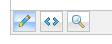
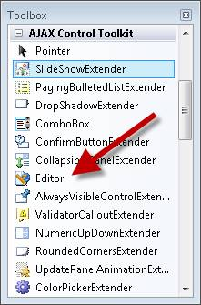
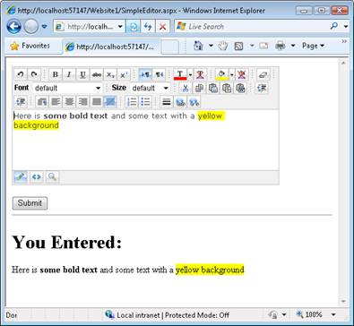
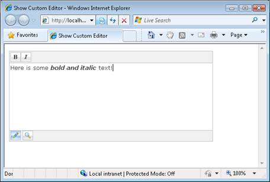

How do I use the HTML Editor Control? (C#)
====================
by [Microsoft](https://github.com/microsoft)

> HTMLEditor is an ASP.NET AJAX Control that allows you to easily create and edit HTML content via buttons in a toolbar.

The goal of this tutorial is to provide you with an overview of the HTML Editor control included with the AJAX Control Toolkit. The HTML Editor includes options for changing font size, selecting a font, changing background color, modifying the foreground color, adding links, adding images, changing text alignment, and performing cut, copy, and paste operations (see Figure 1).

**Figure 01**: The HTML Editor([Click to view full-size image](how-do-i-use-the-html-editor-control-cs/_static/image2.png))

The HTML editor enables you to enter content using a design mode or you can enter HTML directly. You also are provided with the option to preview your HTML content (see Figure 2).

**Figure 02**: Design, HTML, and Preview buttons([Click to view full-size image](how-do-i-use-the-html-editor-control-cs/_static/image4.png))

In this tutorial, you learn how to display the HTML Editor, how to customize the toolbar buttons that appear in the HTML Editor, and how to avoid Cross-Site Scripting Attacks.

## Displaying the HTML Editor

Before you can use the HTML Editor in an ASP.NET page, you must first add a ScriptManager control to the page. The ScriptManager control is located beneath the AJAX Extensions tab in the Visual Studio/Visual Web Developer Express toolbox.

You should place the ScriptManager control at the top of the page before any other controls on the page. For example, you can place it immediately below the opening server-side &lt;form&gt; tag.

The HTML Editor control is located in the toolbox with the rest of the AJAX Control Toolkit controls. It is named the Editor control (see Figure 3).

**Figure 03**: The HTML Editor control([Click to view full-size image](how-do-i-use-the-html-editor-control-cs/_static/image6.png))

After you drag the HTML Editor onto a page, you can set its properties in the property sheet. For example, you normally want to set the Width and Height properties. Listing 1 contains the source for an ASP.NET page that contains an HTML editor.

**Listing 1 - SimpleEditor.aspx**

[!code-aspx[Main](how-do-i-use-the-html-editor-control-cs/samples/sample1.aspx)]

The page in Listing 1 contains an HTML Editor control, a Button control, and a Literal control. When you click the button, the contents of the HTML Editor appear in the Literal control (see Figure 4).

**Figure 04**: Submitting a form with an HTML Editor([Click to view full-size image](how-do-i-use-the-html-editor-control-cs/_static/image8.png))

The HTML Editor Content property is used to retrieve the HTML content entered into the HTML Editor. Be aware that this HTML content can contain JavaScript. In the next section, we discuss how you can prevent JavaScript Injection Attacks.

## Customizing the HTML Editor Toolbar

You can customize exactly which buttons appear in the editor. For example, you might want to remove the HTML tab to prevent users from switching the HTML Editor into HTML mode. Or, you might want to remove the font size dropdown list to prevent users from creating overly large text in a forum message post (see Figure 5).

**Figure 05**: A customized HTML Editor([Click to view full-size image](how-do-i-use-the-html-editor-control-cs/_static/image10.png))

You customize the toolbar buttons by deriving a new HTML Editor from the base Editor class. For example, the custom editor in Listing 2 only contains toolbar buttons for bold and italic. All other toolbar buttons have been removed. Furthermore, the HTML tab has been removed from the bottom of the editor (but the Design and Preview tabs are still there).

**Listing 2 - App\_Code\CustomEditor.cs**

[!code-csharp[Main](how-do-i-use-the-html-editor-control-cs/samples/sample2.cs)]

You must add the class in Listing 2 to your App\_Code folder so that the class will be compiled automatically. If the App\_Code folder does not exist in your website then you can simply add the folder.

After you create a custom editor, you can add it to an ASP.NET page in the same way as you add the normal HTML Editor (see Listing 3).

**Listing 3 - ShowCustomEditor.aspx**

[!code-aspx[Main](how-do-i-use-the-html-editor-control-cs/samples/sample3.aspx)]

## Avoiding Cross-Site Scripting (XSS) Attacks

Whenever you accept input from a user, and redisplay that input on your website, you potentially open your website to Cross-Site Scripting (XSS) Attacks. In theory, a malicious hacker could submit JavaScript code that gets executed when the input is redisplayed. The JavaScript could be used to steal user passwords or other sensitive information.

Normally, you can defeat XSS attacks by HTML encoding whatever input you retrieve from a user before displaying it in a web page. However, HTML encoding the output of the HTML Editor would not only encode &lt;script&gt; tags, it would also encode all HTML tags. In other words, you would lose all of the formatting such as the font type, font size, and background color.

If you are collecting sensitive information from your users -- such as passwords, credit-card numbers, and social security numbers - then you should not display un-encoded content that you retrieve from a user with the HTML Editor. You should use the HTML Editor only in situations in which you are not redisplaying the HTML content, or the HTML content is being submitted to your website by a trusted party.

Imagine, for example, that you are creating a blog application. In this situation, it makes sense to use the HTML Editor when composing blog posts. You are the only one who submits a blog post and, presumably, you can trust yourself not to submit malicious JavaScript. However, it does not make sense to use the HTML Editor when allowing anonymous users to post comments. You should be especially careful in situations in which users submit sensitive information such as passwords. Potentially, a malicious user could post a comment that contains the right JavaScript for stealing a password.

## Summary

In this tutorial, you were provided with a brief overview of the HTML Editor control included in the AJAX Control Toolkit. You learned how to use the HTML Editor to accept rich content from a user and submit the content to the server. We also discussed how you can customize the toolbar buttons that are displayed by the HTML Editor. Finally, you learned how to avoid Cross-Site Scripting Attacks when using the HTML Editor to accept potentially malicious input.

>[!div class="step-by-step"]
[Next](how-do-i-use-the-html-editor-control-vb.md)