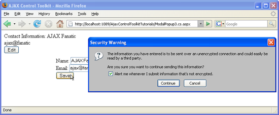

Handling Postbacks from a ModalPopup (VB)
====================
by [Christian Wenz](https://github.com/wenz)

[Download Code](http://download.microsoft.com/download/2/4/0/24052038-f942-4336-905b-b60ae56f0dd5/ModalPopup3.vb.zip) or [Download PDF](http://download.microsoft.com/download/b/6/a/b6ae89ee-df69-4c87-9bfb-ad1eb2b23373/modalpopup3VB.pdf)

> The ModalPopup control in the AJAX Control Toolkit offers a simple way to create a modal popup using client-side means. Special care must be taken when a postback is created from within the popup.

## Overview

The ModalPopup control in the AJAX Control Toolkit offers a simple way to create a modal popup using client-side means. Special care must be taken when a postback is created from within the popup.

## Steps

In order to activate the functionality of ASP.NET AJAX and the Control Toolkit, the `ScriptManager` control must be put anywhere on the page (but within the `<form>` element):

[!code-aspx[Main](handling-postbacks-from-a-modalpopup-vb/samples/sample1.aspx)]

Next, add a panel which serves as the modal popup. There, the user can enter a name and an email address. A button is used to close the popup and save the information. Note that the `OnClick` attribute is set so that a postback occurs when this button is clicked:

[!code-aspx[Main](handling-postbacks-from-a-modalpopup-vb/samples/sample2.aspx)]

The page itself consists of two labels for exactly the same information: name and email address. A button is used to trigger the modal popup:

[!code-aspx[Main](handling-postbacks-from-a-modalpopup-vb/samples/sample3.aspx)]

In order to make the popup appear, add the `ModalPopupExtender` control. Set the `PopupControlID` attribute to the panel's ID and `TargetControlID` to the button's ID:

[!code-aspx[Main](handling-postbacks-from-a-modalpopup-vb/samples/sample4.aspx)]

Now whenever the `Save` button within the modal popup is clicked, the server-side `SaveData()` method is executed. There, you could save the entered data in a data store. For the sake of simplicity, the new data is just output in the label:

[!code-vb[Main](handling-postbacks-from-a-modalpopup-vb/samples/sample5.vb)]

Also, the textbox controls within the modal popup should be filled with the current name and email. However this is only necessary when no postback occurs. If there is a postback, the ASP.NET viewstate feature will automatically fill the textboxes with the appropriate values.

[!code-vb[Main](handling-postbacks-from-a-modalpopup-vb/samples/sample6.vb)]

The modal popup causes a postback ([Click to view full-size image](handling-postbacks-from-a-modalpopup-vb/_static/image3.png))

>[!div class="step-by-step"]
[Previous](using-modalpopup-with-a-repeater-control-vb.md)
[Next](positioning-a-modalpopup-vb.md)