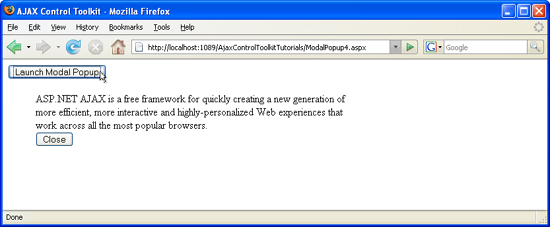

Positioning a ModalPopup (VB)
====================
by [Christian Wenz](https://github.com/wenz)

[Download Code](http://download.microsoft.com/download/2/4/0/24052038-f942-4336-905b-b60ae56f0dd5/ModalPopup4.vb.zip) or [Download PDF](http://download.microsoft.com/download/b/6/a/b6ae89ee-df69-4c87-9bfb-ad1eb2b23373/modalpopup4VB.pdf)

> The ModalPopup control in the AJAX Control Toolkit offers a simple way to create a modal popup using client-side means. However the control does not offer a built-in functionality to position the popup.

## Overview

The ModalPopup control in the AJAX Control Toolkit offers a simple way to create a modal popup using client-side means. However the control does not offer a built-in functionality to position the popup.

## Steps

In order to activate the functionality of ASP.NET AJAX and the Control Toolkit, the `ScriptManager`. control must be put anywhere on the page (but within the `<form>` element):

[!code-aspx[Main](positioning-a-modalpopup-vb/samples/sample1.aspx)]

Next, add a panel which serves as the modal popup. A button is used to close the popup:

[!code-aspx[Main](positioning-a-modalpopup-vb/samples/sample2.aspx)]

Whenever the popup is shown, it shall be positioned at a certain place in the page. For this task, a client-side JavaScript function is created. It first tries to access the panel. If it succeeds, the panel's position is set using CSS and JavaScript (change the position of the popup at will). However the `ModalPopupExtender` control also tries to position the popup. Therefore, the JavaScript code repeatedly positions the popup, every tenth of a second.

[!code-html[Main](positioning-a-modalpopup-vb/samples/sample3.html)]

As you can see, the return value of the `setTimeout()` JavaScript method is saved in a global variable. This allows to stop the repeated positioning of the popup on demand, using the `clearTimeout()` method:

[!code-javascript[Main](positioning-a-modalpopup-vb/samples/sample4.js)]

Now all that is left to do is to make the browser call these functions whenever appropriate. The `movePanel()` JavaScript function must be called when the button is clicked that triggers the panel:

[!code-aspx[Main](positioning-a-modalpopup-vb/samples/sample5.aspx)]

And the `stopMoving()` function comes into play when the popup is closed this can be triggered in the `ModalPopupExtender` control:

[!code-aspx[Main](positioning-a-modalpopup-vb/samples/sample6.aspx)]

The modal popup appears at the designated position ([Click to view full-size image](positioning-a-modalpopup-vb/_static/image3.png))

>[!div class="step-by-step"]
[Previous](handling-postbacks-from-a-modalpopup-vb.md)