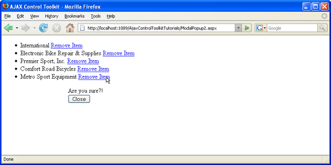

Using ModalPopup with a Repeater Control (VB)
====================
by [Christian Wenz](https://github.com/wenz)

[Download Code](http://download.microsoft.com/download/2/4/0/24052038-f942-4336-905b-b60ae56f0dd5/ModalPopup2.vb.zip) or [Download PDF](http://download.microsoft.com/download/b/6/a/b6ae89ee-df69-4c87-9bfb-ad1eb2b23373/modalpopup2VB.pdf)

> The ModalPopup control in the AJAX Control Toolkit offers a simple way to create a modal popup using client-side means. It is also possible to use this control within a repeater.

## Overview

The ModalPopup control in the AJAX Control Toolkit offers a simple way to create a modal popup using client-side means. It is also possible to use this control within a repeater.

## Steps

First of all, a data source is required. This sample uses the AdventureWorks database and the Microsoft SQL Server 2005 Express Edition. The database is an optional part of a Visual Studio installation (including express edition) and is also available as a separate download under [https://go.microsoft.com/fwlink/?LinkId=64064](https://go.microsoft.com/fwlink/?LinkId=64064). The AdventureWorks database is part of the SQL Server 2005 Samples and Sample Databases (download at [https://www.microsoft.com/downloads/details.aspx?FamilyID=e719ecf7-9f46-4312-af89-6ad8702e4e6e&amp;DisplayLang=en](https://www.microsoft.com/downloads/details.aspx?FamilyID=e719ecf7-9f46-4312-af89-6ad8702e4e6e&amp;DisplayLang=en)). The easiest way to set the database up is to use the Microsoft SQL Server Management Studio Express ([https://www.microsoft.com/downloads/details.aspx?FamilyID=c243a5ae-4bd1-4e3d-94b8-5a0f62bf7796&amp;DisplayLang=en](https://www.microsoft.com/downloads/details.aspx?FamilyID=c243a5ae-4bd1-4e3d-94b8-5a0f62bf7796&amp;DisplayLang=en)) and attach the `AdventureWorks.mdf` database file. For this sample, we assume that the instance of the SQL Server 2005 Express Edition is called `SQLEXPRESS` and resides on the same machine as the web server; this is also the default setup. If your setup differs, you have to adapt the connection information for the database. In order to activate the functionality of ASP.NET AJAX and the Control Toolkit, the `ScriptManager` control must be put anywhere on the page (but within the `<form>` element):

[!code-aspx[Main](using-modalpopup-with-a-repeater-control-vb/samples/sample1.aspx)]

Then, add a data source to the page. In order to use a limited amount of data, we only select the first five entries in the Vendor table of the AdventureWorks database. If you are using the Visual Studio assistant to create the data source, mind that a bug in the current version does not prefix the table name (`Vendor`) with `Purchasing`. The following markup shows the correct syntax:

[!code-aspx[Main](using-modalpopup-with-a-repeater-control-vb/samples/sample2.aspx)]

Next, add a panel which serves as the modal popup. It contains a `Button` control to close the popup again:

[!code-aspx[Main](using-modalpopup-with-a-repeater-control-vb/samples/sample3.aspx)]

In order to make the popup work within the repeater, the `ModalPopupExtender` control must be put within the `<ItemTemplate>` section of the repeater. So the panel is outside the repeater, but the extender is inside. Here is the markup for the repeater:

[!code-aspx[Main](using-modalpopup-with-a-repeater-control-vb/samples/sample4.aspx)]

Then, every item in the data source is displayed with a button next to it that triggers the modal popup.

The modal popup can be triggered for every data source entry ([Click to view full-size image](using-modalpopup-with-a-repeater-control-vb/_static/image3.png))

>[!div class="step-by-step"]
[Previous](launching-a-modal-popup-window-from-server-code-vb.md)
[Next](handling-postbacks-from-a-modalpopup-vb.md)