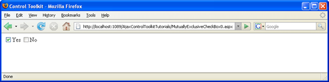

Creating Mutually Exclusive Checkboxes (VB)
====================
by [Christian Wenz](https://github.com/wenz)

[Download Code](http://download.microsoft.com/download/9/3/f/93f8daea-bebd-4821-833b-95205389c7d0/MutuallyExclusiveCheckBox0.vb.zip) or [Download PDF](http://download.microsoft.com/download/b/6/a/b6ae89ee-df69-4c87-9bfb-ad1eb2b23373/mutuallyexclusivecheckbox0VB.pdf)

> When only one of a set of options may be selected, radio buttons are usually used. There is a drawback, though: Once one radio button in a group is selected, it is not possible to uncheck all radio buttons. Check boxes can be unchecked at any time, however are not mutually exclusive. This tutorial provides the best of both approaches: check boxes that are mutually exclusive.

## Overview

When only one of a set of options may be selected, radio buttons are usually used. There is a drawback, though: Once one radio button in a group is selected, it is not possible to uncheck all radio buttons. Check boxes can be unchecked at any time, however are not mutually exclusive. This tutorial provides the best of both approaches: check boxes that are mutually exclusive.

## Steps

The ASP.NET AJAX Control Toolkit contains the MutuallyExclusiveCheckBox extender. This enables programmers to assign any checkbox to a group name (`Key` attribute). From all check boxes within the same group, only one may be selected at one time.

Let's start with putting two check boxes on a new ASP.NET page. There can be more, but two of them suffice to demonstrate the principle:

[!code-aspx[Main](creating-mutually-exclusive-checkboxes-vb/samples/sample1.aspx)]

For both checkboxes, a MutuallyExclusiveCheckBoxExtender control must be put on the page. Both Key attributes need to have the same value, just as the value attributes of HTML radio button elements must be identical to denote the group they belong to. The TargetControlID property of the extender points to the ID of the check box.

[!code-aspx[Main](creating-mutually-exclusive-checkboxes-vb/samples/sample2.aspx)]

Finally, include the ASP.NET AJAX `ScriptManager` which is required by all elements of the ASP.NET AJAX Control Toolkit:

[!code-aspx[Main](creating-mutually-exclusive-checkboxes-vb/samples/sample3.aspx)]

Save and run the page: You can check and uncheck both check boxes, however at no time can both check boxes be checked.

Only one checkbox can be checked at a time ([Click to view full-size image](creating-mutually-exclusive-checkboxes-vb/_static/image3.png))

>[!div class="step-by-step"]
[Previous](creating-mutually-exclusive-checkboxes-cs.md)