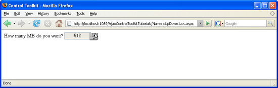

[Edit .md file](C:\Projects\msc\dev\Msc.Www\Web.ASP\App_Data\github\web-forms\overview\ajax-control-toolkit\numericupdown\creating-a-numeric-up-down-control-with-a-web-service-backend-cs.md) | [Edit dev content](http://www.aspdev.net/umbraco#/content/content/edit/24836) | [View dev content](http://docs.aspdev.net/tutorials/web-forms/overview/ajax-control-toolkit/numericupdown/creating-a-numeric-up-down-control-with-a-web-service-backend-cs.html) | [View prod content](http://www.asp.net/web-forms/overview/ajax-control-toolkit/numericupdown/creating-a-numeric-up-down-control-with-a-web-service-backend-cs) | Picker: 33136

Creating a Numeric Up/Down Control with a Web Service Backend (C#)
====================
by [Christian Wenz](https://github.com/wenz)

[Download Code](http://download.microsoft.com/download/9/3/f/93f8daea-bebd-4821-833b-95205389c7d0/numericupdown1.cs.zip) or [Download PDF](http://download.microsoft.com/download/2/d/c/2dc10e34-6983-41d4-9c08-f78f5387d32b/numericupdown1CS.pdf)

> Instead of letting a user type a value into a check box, a numeric up/down control (that exists on Windows and other operating systems) could prove as more comfortable. By default, the NumericUpDown control always increases or decreases a value by 1, but a web service proves more flexibility.

## Overview

Instead of letting a user type a value into a check box, a numeric up/down control (that exists on Windows and other operating systems) could prove as more comfortable. By default, the `NumericUpDown` control always increases or decreases a value by 1, but a web service proves more flexibility.

## Steps

The ASP.NET AJAX Control Toolkit contains the `NumericUpDown` extender which automatically adds two buttons to a text box: One for increasing its value, one for decreasing it. However the control also supports a web service call (or page method call). Whenever the up or down button is clicked, the JavaScript code connects to the web server and executes a method there. The method signature is the following one:

    public int MethodName(int current, string tag) {}

The `current` argument is the current value in the text box; the `tag` attribute is additional context data that can be set as a property of the `NumericUpDown` extender (but is not required).

For this sample, the numeric up/down control shall only allow values that are powers of two: 1, 2, 4, 8, 16, 32, 64, and so on. Therefore, the method executed when the user wants to increase the value must double the old value; the other method must divide value by two. So here is the complete web service:

    <%@ WebService Language="C#" Class="NumericUpDown1" %>
    using System;
    using System.Web;
    using System.Web.Services;
    using System.Web.Services.Protocols;
    [System.Web.Script.Services.ScriptService]
    public class NumericUpDown1 : System.Web.Services.WebService
    {
     [WebMethod]
     public int Up(int current, string tag)
     {
     if (current <= 536870912)
     {
     return current * 2;
     }
     else
     {
     return current;
     }
     }
     [WebMethod]
     public int Down(int current, string tag)
     {
     if (current >= 2)
     {
     return (int)(current / 2);
     }
     else
     {
     return current;
     };
     }
    }

Finally, create a new ASP.NET page. As usual, you need a `ScriptManager` control, a `TextBox` control and a `NumericUpDownExtender` control. For the latter, you have to provide the web service information:

- `ServiceDownMethod` name of the down web method or page method
- `ServiceDownPath` path to the web service with the down service method; omit if you are using a page method
- `ServiceUpMethod` name of the up web method or page method
- `ServiceUpPath` path to the web service with the up service method; omit if you are using a page method

Here is the complete markup for the page:

    <%@ Page Language="C#" %>
    <!DOCTYPE html PUBLIC "-//W3C//DTD XHTML 1.0 Transitional//EN" "http://www.w3.org/TR/xhtml1/DTD/xhtml1-transitional.dtd">
    <html xmlns="http://www.w3.org/1999/xhtml">
    <head id="Head1" runat="server">
     <title>Control Toolkit</title>
    </head>
    <body>
     <form id="form1" runat="server">
     <asp:ScriptManager ID="asm" runat="server" />
     

     How many MB do you want? <asp:TextBox ID="TextBox1" Text="32" runat="server" />
     <ajaxToolkit:NumericUpDownExtender ID="nud" runat="server"
     TargetControlID="TextBox1" Width="100"
     ServiceUpPath="NumericUpDown1.cs.asmx" 
     ServiceDownPath="NumericUpDown1.cs.asmx"
     ServiceUpMethod="Up" ServiceDownMethod="Down" />
     

     </form>
    </body>
    </html>

If you run the page, notice how the value in the text box always doubles when you click on the upper button, and is halved when you click on the lower button.

Only numbers that are a power of 2 appear ([Click to view full-size image](creating-a-numeric-up-down-control-with-a-web-service-backend-cs/_static/image3.png))

>[!div class="step-by-step"] [Next](creating-a-numeric-up-down-control-with-a-web-service-backend-vb.md)