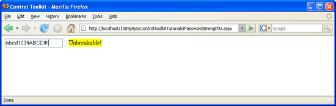

Testing the Strength of a Password (VB)
====================
by [Christian Wenz](https://github.com/wenz)

[Download Code](http://download.microsoft.com/download/9/3/f/93f8daea-bebd-4821-833b-95205389c7d0/PasswordStrength0.vb.zip) or [Download PDF](http://download.microsoft.com/download/2/d/c/2dc10e34-6983-41d4-9c08-f78f5387d32b/passwordstrength0VB.pdf)

> Passwords are required almost anywhere, so that lazy users tend to choose simple passwords which are easy to break. The PasswordStrength control in the ASP.NET AJAX Control Toolkit can check how good a password is.

## Overview

Passwords are required almost anywhere, so that lazy users tend to choose simple passwords which are easy to break. The `PasswordStrength` control in the ASP.NET AJAX Control Toolkit can check how good a password is.

## Steps

The `PasswordStrength` control extends a text box and checks whether the password in it is good enough. It offers a wealth of options via attributes; here are just some of them:

- `MinimumNumericCharacters` minimum number of numeric characters required in the password
- `MinimumSymbolCharacters` minimum number of symbol characters (not letters and digits) required in the password
- `PreferredPasswordLength` minimum length of the password
- `RequiresUpperAndLowerCaseCharacters` whether the password needs to use both uppercase and lowercase characters

The `StrengthIndicatorType` provides the information how to present the strength of the password, as text (value `"Text"`) or as a kind of progress bar (value `"BarIndicator"`). In the `DisplayPosition` attribute, you configure where the information appears. Here is a complete example, including the ASP.NET AJAX `ScriptManager` control, the `PasswordStrength` control and of course a text box where the user may enter a password. For the sake of demonstration, the latter form field is a regular text field and not a password field so that you can see during development what you are typing.

[!code-aspx[Main](testing-the-strength-of-a-password-vb/samples/sample1.aspx)]

Run the page and type away: Only after you have entered lowercase letters, uppercase letters, digits and symbols, the password is deemed as unbreakable .

Now the password is (quite) good ([Click to view full-size image](testing-the-strength-of-a-password-vb/_static/image3.png))

>[!div class="step-by-step"]
[Previous](testing-the-strength-of-a-password-cs.md)