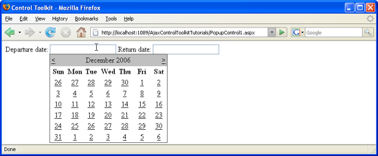

Using Multiple Popup Controls (C#)
====================
by [Christian Wenz](https://github.com/wenz)

[Download Code](http://download.microsoft.com/download/9/3/f/93f8daea-bebd-4821-833b-95205389c7d0/PopupControl1.cs.zip) or [Download PDF](http://download.microsoft.com/download/2/d/c/2dc10e34-6983-41d4-9c08-f78f5387d32b/popupcontrol1CS.pdf)

> The PopupControl extender in the AJAX Control Toolkit offers an easy way to trigger a popup when any other control is activated. It is also possible to use more than one popup control on one page.

## Overview

The PopupControl extender in the AJAX Control Toolkit offers an easy way to trigger a popup when any other control is activated. It is also possible to use more than one popup control on one page.

## Steps

In order to activate the functionality of ASP.NET AJAX and the Control Toolkit, the `ScriptManager` control must be put anywhere on the page (but within the `<form>` element):

[!code-aspx[Main](using-multiple-popup-controls-cs/samples/sample1.aspx)]

Next, add a panel which serves as the popup. In the current scenario, the panel contains a `Calendar` control. In order to avoid the page refreshes caused by the Calendar's postbacks, the panel is put within an `UpdatePanel` control:

[!code-aspx[Main](using-multiple-popup-controls-cs/samples/sample2.aspx)]

The page also contains two text boxes. For each text box, the calendar popup shall appear once the text box is activated.

[!code-aspx[Main](using-multiple-popup-controls-cs/samples/sample3.aspx)]

Now extend each of the two text boxes with a `PopupControlExtender`. The `TargetControlID` attribute provides the ID of the control tied to the extender. The `PopupControlID` attribute contains the ID of the popup panel. In this case, both extenders show the same panel, but different panels are possible, as well.

[!code-aspx[Main](using-multiple-popup-controls-cs/samples/sample4.aspx)]

Now whenever you click within a text field, a calendar appears below the field, allowing you to select a date. (Getting the selected date back into the text boxes will be covered in a different tutorial.)

The Calendar appears when the user clicks into the textbox ([Click to view full-size image](using-multiple-popup-controls-cs/_static/image3.png))

>[!div class="step-by-step"]
[Next](handling-postbacks-from-a-popup-control-with-an-updatepanel-cs.md)