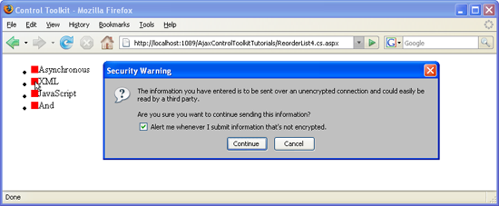

Using Postbacks with ReorderList (VB)
====================
by [Christian Wenz](https://github.com/wenz)

[Download Code](http://download.microsoft.com/download/9/3/f/93f8daea-bebd-4821-833b-95205389c7d0/ReorderList4.vb.zip) or [Download PDF](http://download.microsoft.com/download/2/d/c/2dc10e34-6983-41d4-9c08-f78f5387d32b/reorderlist4VB.pdf)

> The ReorderList control in the AJAX Control Toolkit provides a list that can be reordered by the user via drag and drop. Whenever the list is reordered, a postback shall inform the server of the change.

## Overview

The `ReorderList` control in the AJAX Control Toolkit provides a list that can be reordered by the user via drag and drop. Whenever the list is reordered, a postback shall inform the server of the change.

## Steps

There are several possible data sources for the `ReorderList` control. One is to use an `XmlDataSource` control:

[!code-aspx[Main](using-postbacks-with-reorderlist-vb/samples/sample1.aspx)]

In order to bind this XML to a `ReorderList` control and enable postbacks, the following attributes must be set:

- `DataSourceID`: The ID of the data source
- `SortOrderField`: The property to sort by
- `AllowReorder`: Whether to allow the user to reorder the list elements
- `PostBackOnReorder`: Whether to create a postback whenever the list is rearranged

Here is the appropriate markup for the control:

[!code-aspx[Main](using-postbacks-with-reorderlist-vb/samples/sample2.aspx)]

Within the `ReorderList` control, specific data from the data source may be bound using the `Eval()` method:

[!code-aspx[Main](using-postbacks-with-reorderlist-vb/samples/sample3.aspx)]

At an arbitrary position on the page, a label will hold the information when the last reordering occurred:

[!code-aspx[Main](using-postbacks-with-reorderlist-vb/samples/sample4.aspx)]

This label is filled with text in the server-side code, handling the postback:

[!code-aspx[Main](using-postbacks-with-reorderlist-vb/samples/sample5.aspx)]

Finally, in order to activate the functionality of ASP.NET AJAX and the Control Toolkit, the `ScriptManager` control must be put on the page:

[!code-aspx[Main](using-postbacks-with-reorderlist-vb/samples/sample6.aspx)]

Each reordering triggers a postback ([Click to view full-size image](using-postbacks-with-reorderlist-vb/_static/image3.png))

>[!div class="step-by-step"]
[Previous](drag-and-drop-via-reorderlist-cs.md)
[Next](drag-and-drop-via-reorderlist-vb.md)