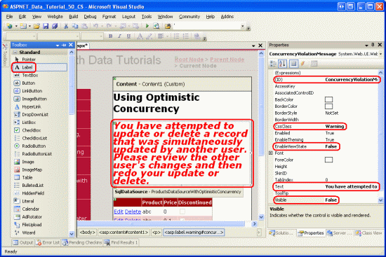
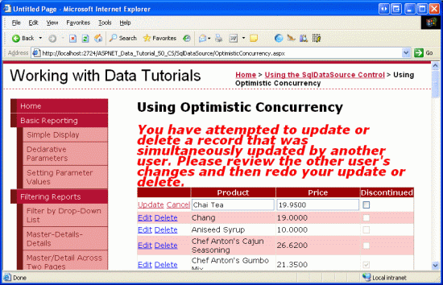

Implementing Optimistic Concurrency with the SqlDataSource (VB)
====================
by [Scott Mitchell](https://twitter.com/ScottOnWriting)

[Download Sample App](http://download.microsoft.com/download/4/a/7/4a7a3b18-d80e-4014-8e53-a6a2427f0d93/ASPNET_Data_Tutorial_50_VB.exe) or [Download PDF](implementing-optimistic-concurrency-with-the-sqldatasource-vb/_static/datatutorial50vb1.pdf)

> In this tutorial we review the essentials of optimistic concurrency control and then explore how to implement it using the SqlDataSource control.

## Introduction

In the preceding tutorial we examined how to add inserting, updating, and deleting capabilities to the SqlDataSource control. In short, to provide these features we needed to specify the corresponding `INSERT`, `UPDATE`, or `DELETE` SQL statement in the control s `InsertCommand`, `UpdateCommand`, or `DeleteCommand` properties, along with the appropriate parameters in the `InsertParameters`, `UpdateParameters`, and `DeleteParameters` collections. While these properties and collections can be specified manually, the Configure Data Source wizard s Advanced button offers a Generate `INSERT`, `UPDATE`, and `DELETE` statements checkbox that will auto-create these statements based on the `SELECT` statement.

Along with the Generate `INSERT`, `UPDATE`, and `DELETE` statements checkbox, the Advanced SQL Generation Options dialog box includes a Use optimistic concurrency option (see Figure 1). When checked, the `WHERE` clauses in the autogenerated `UPDATE` and `DELETE` statements are modified to only perform the update or delete if the underlying database data hasn t been modified since the user last loaded the data into the grid.

**Figure 1**: You Can Add Optimistic Concurrency Support from the Advanced SQL Generation Options Dialog Box

Back in the [Implementing Optimistic Concurrency](../editing-inserting-and-deleting-data/implementing-optimistic-concurrency-vb.md) tutorial we examined the fundamentals of optimistic concurrency control and how to add it to the ObjectDataSource. In this tutorial we'll retouch on the essentials of optimistic concurrency control and then explore how to implement it using the SqlDataSource.

## A Recap of Optimistic Concurrency

For web applications that allow multiple, simultaneous users to edit or delete the same data, there exists a possibility that one user may accidentally overwrite another s changes. In the [Implementing Optimistic Concurrency](../editing-inserting-and-deleting-data/implementing-optimistic-concurrency-vb.md) tutorial I provided the following example:

Imagine that two users, Jisun and Sam, were both visiting a page in an application that allowed visitors to update and delete products through a GridView control. Both click the Edit button for Chai around the same time. Jisun changes the product name to Chai Tea and clicks the Update button. The net result is an `UPDATE` statement that is sent to the database, which sets *all* of the product s updateable fields (even though Jisun only updated one field, `ProductName`). At this point in time, the database has the values Chai Tea, the category Beverages, the supplier Exotic Liquids, and so on for this particular product. However, the GridView on Sam s screen still shows the product name in the editable GridView row as Chai. A few seconds after Jisun s changes have been committed, Sam updates the category to Condiments and clicks Update. This results in an `UPDATE` statement sent to the database that sets the product name to Chai, the `CategoryID` to the corresponding Condiments category ID, and so on. Jisun s changes to the product name have been overwritten.

Figure 2 illustrates this interaction.

**Figure 2**: When Two Users Simultaneously Update a Record There s Potential for One User s Changes to Overwrite the Other s ([Click to view full-size image](implementing-optimistic-concurrency-with-the-sqldatasource-vb/_static/image2.png))

To prevent this scenario from unfolding, a form of [concurrency control](http://en.wikipedia.org/wiki/Concurrency_control) must be implemented. [Optimistic concurrency](http://en.wikipedia.org/wiki/Optimistic_concurrency_control) the focus of this tutorial works on the assumption that while there may be concurrency conflicts every now and then, the vast majority of the time such conflicts won t arise. Therefore, if a conflict does arise, optimistic concurrency control simply informs the user that their changes can t be saved because another user has modified the same data.

> [!NOTE]
> For applications where it is assumed that there will be many concurrency conflicts or if such conflicts are not tolerable, then pessimistic concurrency control can be used instead. Refer back to the [Implementing Optimistic Concurrency](../editing-inserting-and-deleting-data/implementing-optimistic-concurrency-vb.md) tutorial for a more thorough discussion on pessimistic concurrency control.

Optimistic concurrency control works by ensuring that the record being updated or deleted has the same values as it did when the updating or deleting process started. For example, when clicking the Edit button in an editable GridView, the record s values are read from the database and displayed in TextBoxes and other Web controls. These original values are saved by the GridView. Later, after the user makes her changes and clicks the Update button, the `UPDATE` statement used must take into account the original values plus the new values and only update the underlying database record if the original values that the user started editing are identical to the values still in the database. Figure 3 depicts this sequence of events.

**Figure 3**: For the Update or Delete to Succeed, the Original Values Must Be Equal to the Current Database Values ([Click to view full-size image](implementing-optimistic-concurrency-with-the-sqldatasource-vb/_static/image4.png))

There are various approaches to implementing optimistic concurrency (see [Peter A. Bromberg](http://peterbromberg.net/) s [Optmistic Concurrency Updating Logic](http://www.eggheadcafe.com/articles/20050719.asp) for a brief look at a number of options). The technique used by the SqlDataSource (as well as by the ADO.NET Typed DataSets used in our Data Access Layer) augments the `WHERE` clause to include a comparison of all of the original values. The following `UPDATE` statement, for example, updates the name and price of a product only if the current database values are equal to the values that were originally retrieved when updating the record in the GridView. The `@ProductName` and `@UnitPrice` parameters contain the new values entered by the user, whereas `@original_ProductName` and `@original_UnitPrice` contain the values that were originally loaded into the GridView when the Edit button was clicked:

[!code-sql[Main](implementing-optimistic-concurrency-with-the-sqldatasource-vb/samples/sample1.sql)]

As we'll see in this tutorial, enabling optimistic concurrency control with the SqlDataSource is as simple as checking a checkbox.

## Step 1: Creating a SqlDataSource that Supports Optimistic Concurrency

Start by opening the `OptimisticConcurrency.aspx` page from the `SqlDataSource` folder. Drag a SqlDataSource control from the Toolbox onto the Designer, settings its `ID` property to `ProductsDataSourceWithOptimisticConcurrency`. Next, click on the Configure Data Source link from the control s smart tag. From the first screen in the wizard, choose to work with the `NORTHWINDConnectionString` and click Next.

**Figure 4**: Choose to Work with the `NORTHWINDConnectionString` ([Click to view full-size image](implementing-optimistic-concurrency-with-the-sqldatasource-vb/_static/image6.png))

For this example we'll be adding a GridView that enables users to edit the `Products` table. Therefore, from the Configure the Select Statement screen, choose the `Products` table from the drop-down list and select the `ProductID`, `ProductName`, `UnitPrice`, and `Discontinued` columns, as shown in Figure 5.

**Figure 5**: From the `Products` Table, Return the `ProductID`, `ProductName`, `UnitPrice`, and `Discontinued` Columns ([Click to view full-size image](implementing-optimistic-concurrency-with-the-sqldatasource-vb/_static/image8.png))

After picking the columns, click the Advanced button to bring up the Advanced SQL Generation Options dialog box. Check the Generate `INSERT`, `UPDATE`, and `DELETE` statements and Use optimistic concurrency checkboxes and click OK (refer back to Figure 1 for a screenshot). Complete the wizard by clicking Next, then Finish.

After completing the Configure Data Source wizard, take a moment to examine the resulting `DeleteCommand` and `UpdateCommand` properties and the `DeleteParameters` and `UpdateParameters` collections. The easiest way to do this is to click on the Source tab in the lower left corner to see the page s declarative syntax. There you will find an `UpdateCommand` value of:

[!code-sql[Main](implementing-optimistic-concurrency-with-the-sqldatasource-vb/samples/sample2.sql)]

With seven parameters in the `UpdateParameters` collection:

[!code-aspx[Main](implementing-optimistic-concurrency-with-the-sqldatasource-vb/samples/sample3.aspx)]

Similarly, the `DeleteCommand` property and `DeleteParameters` collection should look like the following:

[!code-sql[Main](implementing-optimistic-concurrency-with-the-sqldatasource-vb/samples/sample4.sql)]

[!code-aspx[Main](implementing-optimistic-concurrency-with-the-sqldatasource-vb/samples/sample5.aspx)]

In addition to augmenting the `WHERE` clauses of the `UpdateCommand` and `DeleteCommand` properties (and adding the additional parameters to the respective parameter collections), selecting the Use optimistic concurrency option adjusts two other properties:

- Changes the [`ConflictDetection` property](https://msdn.microsoft.com/en-US/library/system.web.ui.webcontrols.sqldatasource.conflictdetection.aspx) from `OverwriteChanges` (the default) to `CompareAllValues`
- Changes the [`OldValuesParameterFormatString` property](https://msdn.microsoft.com/en-us/library/system.web.ui.webcontrols.sqldatasource.oldvaluesparameterformatstring.aspx) from {0} (the default) to original\_{0} .

When the data Web control invokes the SqlDataSource s `Update()` or `Delete()` method, it passes in the original values. If the SqlDataSource s `ConflictDetection` property is set to `CompareAllValues`, these original values are added to the command. The `OldValuesParameterFormatString` property provides the naming pattern used for these original value parameters. The Configure Data Source wizard uses original\_{0} and names each original parameter in the `UpdateCommand` and `DeleteCommand` properties and `UpdateParameters` and `DeleteParameters` collections accordingly.

> [!NOTE]
> Since we re not using the SqlDataSource control s inserting capabilities, feel free to remove the `InsertCommand` property and its `InsertParameters` collection.

## Correctly Handling`NULL`Values

Unfortunately, the augmented `UPDATE` and `DELETE` statements autogenerated by the Configure Data Source wizard when using optimistic concurrency do *not* work with records that contain `NULL` values. To see why, consider our SqlDataSource s `UpdateCommand`:

[!code-sql[Main](implementing-optimistic-concurrency-with-the-sqldatasource-vb/samples/sample6.sql)]

The `UnitPrice` column in the `Products` table can have `NULL` values. If a particular record has a `NULL` value for `UnitPrice`, the `WHERE` clause portion `[UnitPrice] = @original_UnitPrice` will *always* evaluate to False because `NULL = NULL` always returns False. Therefore, records that contain `NULL` values cannot be edited or deleted, as the `UPDATE` and `DELETE` statements `WHERE` clauses won t return any rows to update or delete.

> [!NOTE]
> This bug was first reported to Microsoft in June of 2004 in [SqlDataSource Generates Incorrect SQL Statements](https://connect.microsoft.com/VisualStudio/feedback/ViewFeedback.aspx?FeedbackID=93937) and is reportedly scheduled to be fixed in the next version of ASP.NET.

To fix this, we have to manually update the `WHERE` clauses in both the `UpdateCommand` and `DeleteCommand` properties for **all** columns that can have `NULL` values. In general, change `[ColumnName] = @original_ColumnName` to:

[!code-sql[Main](implementing-optimistic-concurrency-with-the-sqldatasource-vb/samples/sample7.sql)]

This modification can be made directly through the declarative markup, via the UpdateQuery or DeleteQuery options from the Properties window, or through the UPDATE and DELETE tabs in the Specify a custom SQL statement or stored procedure option in the Configure Data Source wizard. Again, this modification must be made for *every* column in the `UpdateCommand` and `DeleteCommand` s `WHERE` clause that can contain `NULL` values.

Applying this to our example results in the following modified `UpdateCommand` and `DeleteCommand` values:

[!code-sql[Main](implementing-optimistic-concurrency-with-the-sqldatasource-vb/samples/sample8.sql)]

## Step 2: Adding a GridView with Edit and Delete Options

With the SqlDataSource configured to support optimistic concurrency, all that remains is to add a data Web control to the page that utilizes this concurrency control. For this tutorial, let s add a GridView that provides both edit and delete functionality. To accomplish this, drag a GridView from the Toolbox onto the Designer and set its `ID` to `Products`. From the GridView s smart tag, bind it to the `ProductsDataSourceWithOptimisticConcurrency` SqlDataSource control added in Step 1. Finally, check the Enable Editing and Enable Deleting options from the smart tag.

**Figure 6**: Bind the GridView to the SqlDataSource and Enable Editing and Deleting ([Click to view full-size image](implementing-optimistic-concurrency-with-the-sqldatasource-vb/_static/image10.png))

After adding the GridView, configure its appearance by removing the `ProductID` BoundField, changing the `ProductName` BoundField s `HeaderText` property to Product, and updating the `UnitPrice` BoundField so that its `HeaderText` property is simply Price. Ideally, we d enhance the editing interface to include a RequiredFieldValidator for the `ProductName` value and a CompareValidator for the `UnitPrice` value (to ensure it s a properly formatted numeric value). Refer to the [Customizing the Data Modification Interface](../editing-inserting-and-deleting-data/customizing-the-data-modification-interface-vb.md) tutorial for a more in-depth look at customizing the GridView s editing interface.

> [!NOTE]
> The GridView s view state must be enabled since the original values passed from the GridView to the SqlDataSource are stored in view state.

After making these modifications to the GridView, the GridView and SqlDataSource declarative markup should look similar to the following:

[!code-aspx[Main](implementing-optimistic-concurrency-with-the-sqldatasource-vb/samples/sample9.aspx)]

To see the optimistic concurrency control in action, open two browser windows and load the `OptimisticConcurrency.aspx` page in both. Click on the Edit buttons for the first product in both browsers. In one browser, change the product name and click Update. The browser will postback and the GridView will return to its pre-editing mode, showing the new product name for the record just edited.

In the second browser window, change the price (but leave the product name as its original value) and click Update. On postback, the grid returns to its pre-editing mode, but the change to the price is not recorded. The second browser shows the same value as the first one the new product name with the old price. The changes made in the second browser window were lost. Moreover, the changes were lost rather quietly, as there was no exception or message indicating that a concurrency violation just occurred.

**Figure 7**: The Changes in the Second Browser Window Were Silently Lost ([Click to view full-size image](implementing-optimistic-concurrency-with-the-sqldatasource-vb/_static/image12.png))

The reason why the second browser s changes were not committed was because the `UPDATE` statement s `WHERE` clause filtered out all records and therefore did not affect any rows. Let s look at the `UPDATE` statement again:

[!code-sql[Main](implementing-optimistic-concurrency-with-the-sqldatasource-vb/samples/sample10.sql)]

When the second browser window updates the record, the original product name specified in the `WHERE` clause doesn t match up with the existing product name (since it was changed by the first browser). Therefore, the statement `[ProductName] = @original_ProductName` returns False, and the `UPDATE` does not affect any records.

> [!NOTE]
> Delete works in the same manner. With two browser windows open, start by editing a given product with one, and then saving its changes. After saving the changes in the one browser, click the Delete button for the same product in the other. Since the original values don t match up in the `DELETE` statement s `WHERE` clause, the delete silently fails.

From the end user s perspective in the second browser window, after clicking the Update button the grid returns to the pre-editing mode, but their changes were lost. However, there s no visual feedback that their changes didn t stick. Ideally, if a user s changes are lost to a concurrency violation, we d notify them and, perhaps, keep the grid in edit mode. Let s look at how to accomplish this.

## Step 3: Determining When a Concurrency Violation Has Occurred

Since a concurrency violation rejects the changes one has made, it would be nice to alert the user when a concurrency violation has occurred. To alert the user, let s add a Label Web control to the top of the page named `ConcurrencyViolationMessage` whose `Text` property displays the following message: You have attempted to update or delete a record that was simultaneously updated by another user. Please review the other user's changes and then redo your update or delete. Set the Label control s `CssClass` property to Warning, which is a CSS class defined in `Styles.css` that displays text in a red, italic, bold, and large font. Finally, set the Label s `Visible` and `EnableViewState` properties to `False`. This will hide the Label except for only those postbacks where we explicitly set its `Visible` property to `True`.

**Figure 8**: Add a Label Control to the Page to Display the Warning ([Click to view full-size image](implementing-optimistic-concurrency-with-the-sqldatasource-vb/_static/image14.png))

When performing an update or delete, the GridView s `RowUpdated` and `RowDeleted` event handlers fire after its data source control has performed the requested update or delete. We can determine how many rows were affected by the operation from these event handlers. If zero rows were affected, we want to display the `ConcurrencyViolationMessage` Label.

Create an event handler for both the `RowUpdated` and `RowDeleted` events and add the following code:

[!code-vb[Main](implementing-optimistic-concurrency-with-the-sqldatasource-vb/samples/sample11.vb)]

In both event handlers we check the `e.AffectedRows` property and, if it equals 0, set the `ConcurrencyViolationMessage` Label s `Visible` property to `True`. In the `RowUpdated` event handler, we also instruct the GridView to stay in edit mode by setting the `KeepInEditMode` property to true. In doing so, we need to rebind the data to the grid so that the other user s data is loaded into the editing interface. This is accomplished by calling the GridView s `DataBind()` method.

As Figure 9 shows, with these two event handlers, a very noticeable message is displayed whenever a concurrency violation occurs.

**Figure 9**: A Message is Displayed in the Face of a Concurrency Violation ([Click to view full-size image](implementing-optimistic-concurrency-with-the-sqldatasource-vb/_static/image16.png))

## Summary

When creating a web application where multiple, concurrent users may be editing the same data, it is important to consider concurrency control options. By default, the ASP.NET data Web controls and data source controls do not employ any concurrency control. As we saw in this tutorial, implementing optimistic concurrency control with the SqlDataSource is relatively quick and easy. The SqlDataSource handles most of the legwork for your adding augmented `WHERE` clauses to the autogenerated `UPDATE` and `DELETE` statements but there are a few subtleties in handling `NULL` value columns, as discussed in the Correctly Handling `NULL` Values section.

This tutorial concludes our examination of the SqlDataSource. Our remaining tutorials will return to working with data using the ObjectDataSource and tiered architecture.

Happy Programming!

## About the Author

[Scott Mitchell](http://www.4guysfromrolla.com/ScottMitchell.shtml), author of seven ASP/ASP.NET books and founder of [4GuysFromRolla.com](http://www.4guysfromrolla.com), has been working with Microsoft Web technologies since 1998. Scott works as an independent consultant, trainer, and writer. His latest book is [*Sams Teach Yourself ASP.NET 2.0 in 24 Hours*](https://www.amazon.com/exec/obidos/ASIN/0672327384/4guysfromrollaco). He can be reached at [mitchell@4GuysFromRolla.com.](mailto:mitchell@4GuysFromRolla.com) or via his blog, which can be found at [http://ScottOnWriting.NET](http://ScottOnWriting.NET).

>[!div class="step-by-step"]
[Previous](inserting-updating-and-deleting-data-with-the-sqldatasource-vb.md)