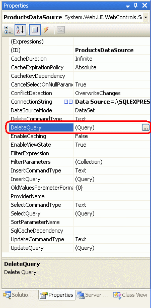
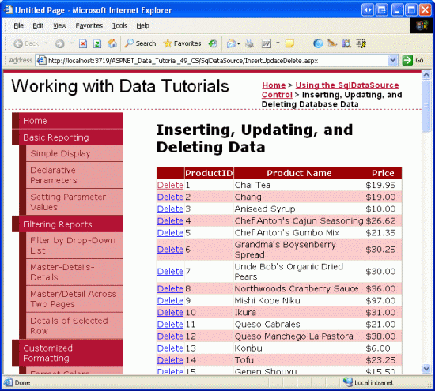

Inserting, Updating, and Deleting Data with the SqlDataSource (C#)
====================
by [Scott Mitchell](https://twitter.com/ScottOnWriting)

[Download Sample App](http://download.microsoft.com/download/4/a/7/4a7a3b18-d80e-4014-8e53-a6a2427f0d93/ASPNET_Data_Tutorial_49_CS.exe) or [Download PDF](inserting-updating-and-deleting-data-with-the-sqldatasource-cs/_static/datatutorial49cs1.pdf)

> In previous tutorials we learned how the ObjectDataSource control allowed for inserting, updating, and deleting of data. The SqlDataSource control supports the same operations, but the approach is different, and this tutorial shows how to configure the SqlDataSource to insert, update, and delete data.

## Introduction

As discussed in [An Overview of Inserting, Updating, and Deleting](../editing-inserting-and-deleting-data/an-overview-of-inserting-updating-and-deleting-data-cs.md), the GridView control provides built-in updating and deleting capabilities, while the DetailsView and FormView controls include inserting support along with editing and deleting functionality. These data modification capabilities can be plugged directly into a data source control without a line of code needing to be written. [An Overview of Inserting, Updating, and Deleting](../editing-inserting-and-deleting-data/an-overview-of-inserting-updating-and-deleting-data-cs.md) examined using the ObjectDataSource to facilitate inserting, updating, and deleting with the GridView, DetailsView, and FormView controls. Alternatively, the SqlDataSource can be used in place of the ObjectDataSource.

Recall that to support inserting, updating, and deleting, with the ObjectDataSource we needed to specify the object layer methods to invoke to perform the insert, update, or delete action. With the SqlDataSource, we need to provide `INSERT`, `UPDATE`, and `DELETE` SQL statements (or stored procedures) to execute. As we'll see in this tutorial, these statements can be created manually or can be automatically generated by the SqlDataSource s Configure Data Source wizard.

> [!NOTE]
> Since we ve already discussed the inserting, editing, and deleting capabilities of the GridView, DetailsView, and FormView controls, this tutorial will focus on configuring the SqlDataSource control to support these operations. If you need to brush up on implementing these features within the GridView, DetailsView, and FormView, return to the Editing, Inserting, and Deleting Data tutorials, starting with [An Overview of Inserting, Updating, and Deleting](../editing-inserting-and-deleting-data/an-overview-of-inserting-updating-and-deleting-data-cs.md).

## Step 1: Specifying`INSERT`,`UPDATE`, and`DELETE`Statements

As we ve seen in the past two tutorials, to retrieve data from a SqlDataSource control we need to set two properties:

1. `ConnectionString`, which specifies what database to send the query to, and
2. `SelectCommand`, which specifies the ad-hoc SQL statement or stored procedure name to execute to return the results.

For `SelectCommand` values with parameters, the parameter values are specified via the SqlDataSource s `SelectParameters` collection and can include hard-coded values, common parameter source values (querystring fields, session variables, Web control values, and so on), or can be programmatically assigned. When the SqlDataSource control s `Select()` method is invoked either programmatically or automatically from a data Web control a connection to the database is established, the parameter values are assigned to the query, and the command is shuttled off to the database. The results are then returned as either a DataSet or DataReader, depending on the value of the control s `DataSourceMode` property.

Along with selecting data, the SqlDataSource control can be used to insert, update, and delete data by supplying `INSERT`, `UPDATE`, and `DELETE` SQL statements in much the same way. Simply assign the `InsertCommand`, `UpdateCommand`, and `DeleteCommand` properties the `INSERT`, `UPDATE`, and `DELETE` SQL statements to execute. If the statements have parameters (as they most always will), include them in the `InsertParameters`, `UpdateParameters`, and `DeleteParameters` collections.

Once an `InsertCommand`, `UpdateCommand`, or `DeleteCommand` value has been specified, the Enable Inserting, Enable Editing, or Enable Deleting option in the corresponding data Web control s smart tag will become available. To illustrate this, let s take an example from the `Querying.aspx` page we created in the [Querying Data with the SqlDataSource Control](querying-data-with-the-sqldatasource-control-cs.md) tutorial and augment it to include delete capabilities.

Start by opening the `InsertUpdateDelete.aspx` and `Querying.aspx` pages from the `SqlDataSource` folder. From the Designer on the `Querying.aspx` page, select the SqlDataSource and GridView from the first example (the `ProductsDataSource` and `GridView1` controls). After selecting the two controls, go to the Edit menu and choose Copy (or just hit Ctrl+C). Next, go to the Designer of `InsertUpdateDelete.aspx` and paste in the controls. After you have moved the two controls over to `InsertUpdateDelete.aspx`, test out the page in a browser. You should see the values of the `ProductID`, `ProductName`, and `UnitPrice` columns for all of the records in the `Products` database table.

**Figure 1**: All of the Products are Listed, Ordered by `ProductID` ([Click to view full-size image](inserting-updating-and-deleting-data-with-the-sqldatasource-cs/_static/image2.png))

## Adding the SqlDataSource s`DeleteCommand`and`DeleteParameters`Properties

At this point we have a SqlDataSource that simply returns all of the records from the `Products` table and a GridView that renders this data. Our goal is to extend this example to allow for the user to delete products via the GridView. To accomplish this we need to specify values for the SqlDataSource control s `DeleteCommand` and `DeleteParameters` properties and then configure the GridView to support deleting.

The `DeleteCommand` and `DeleteParameters` properties can be specified in a number of ways:

- Through the declarative syntax
- From the Properties window in the Designer
- From the Specify a custom SQL statement or stored procedure screen in the Configure Data Source wizard
- Via the Advanced button in the Specify columns from a table of view screen in the Configure Data Source wizard, which will actually automatically generate the `DELETE` SQL statement and parameter collection used in the `DeleteCommand` and `DeleteParameters` properties

We'll examine how to automatically have the `DELETE` statement created in Step 2. For now, let s use the Properties window in the Designer, although the Configure Data Source wizard or declarative syntax option would work just as well.

From the Designer in `InsertUpdateDelete.aspx`, click on the `ProductsDataSource` SqlDataSource and then bring up the Properties window (from the View menu, choose Properties window, or simply hit F4). Select the DeleteQuery property, which will bring up a set of ellipses.

**Figure 2**: Select the DeleteQuery Property from the Properties Window

> [!NOTE]
> The SqlDataSource doesn t have a DeleteQuery property. Rather, DeleteQuery is a combination of the `DeleteCommand` and `DeleteParameters` properties and is only listed in the Properties window when viewing the window through the Designer. If you are looking at the Properties window in the Source view, you'll find the `DeleteCommand` property instead.

Click the ellipses in the DeleteQuery property to bring up the Command and Parameter Editor dialog box (see Figure 3). From this dialog box you can specify the `DELETE` SQL statement and specify the parameters. Enter the following query into the `DELETE` command textbox (either manually or using the Query Builder, if you prefer):

[!code-sql[Main](inserting-updating-and-deleting-data-with-the-sqldatasource-cs/samples/sample1.sql)]

Next, click the Refresh Parameters button to add the `@ProductID` parameter to the list of parameters below.

**Figure 3**: Select the DeleteQuery Property from the Properties Window ([Click to view full-size image](inserting-updating-and-deleting-data-with-the-sqldatasource-cs/_static/image4.png))

Do *not* provide a value for this parameter (leave its Parameter source at None ). Once we add deleting support to the GridView, the GridView will automatically supply this parameter value, using the value of its `DataKeys` collection for the row whose Delete button was clicked.

> [!NOTE]
> The parameter name used in the `DELETE` query *must* be the same as the name of the `DataKeyNames` value in the GridView, DetailsView, or FormView. That is, the parameter in the `DELETE` statement is purposefully named `@ProductID` (instead of, say, `@ID`), because the primary key column name in the Products table (and therefore the DataKeyNames value in the GridView) is `ProductID`.

If the parameter name and `DataKeyNames` value doesn t match, the GridView cannot automatically assign the parameter the value from the `DataKeys` collection.

After entering the delete-related information into the Command and Parameter Editor dialog box click OK and go to the Source view to examine the resulting declarative markup:

[!code-aspx[Main](inserting-updating-and-deleting-data-with-the-sqldatasource-cs/samples/sample2.aspx)]

Note the addition of the `DeleteCommand` property as well as the `<DeleteParameters>` section and the Parameter object named `productID`.

## Configuring the GridView for Deleting

With the `DeleteCommand` property added, the GridView s smart tag now contains the Enable Deleting option. Go ahead and check this checkbox. As discussed in [An Overview of Inserting, Updating, and Deleting](../editing-inserting-and-deleting-data/an-overview-of-inserting-updating-and-deleting-data-cs.md), this causes the GridView to add a CommandField with its `ShowDeleteButton` property set to `true`. As Figure 4 shows, when the page is visited through a browser a Delete button is included. Test this page out by deleting some products.

**Figure 4**: Each GridView Row Now Includes a Delete Button ([Click to view full-size image](inserting-updating-and-deleting-data-with-the-sqldatasource-cs/_static/image6.png))

Upon clicking a Delete button, a postback occurs, the GridView assigns the `ProductID` parameter the value of the `DataKeys` collection value for the row whose Delete button was clicked, and invokes the SqlDataSource s `Delete()` method. The SqlDataSource control then connects to the database and executes the `DELETE` statement. The GridView then rebinds to the SqlDataSource, getting back and displaying the current set of products (which no longer includes the just-deleted record).

> [!NOTE]
> Since the GridView uses its `DataKeys` collection to populate the SqlDataSource parameters, it s vital that the GridView s `DataKeyNames` property be set to the column(s) that constitute the primary key and that the SqlDataSource s `SelectCommand` returns these columns. Moreover, it s important that the parameter name in the SqlDataSource s `DeleteCommand` is set to `@ProductID`. If the `DataKeyNames` property is not set or the parameter is not named `@ProductsID`, clicking the Delete button will cause a postback, but won t actually delete any record.

Figure 5 depicts this interaction graphically. Refer back to the [Examining the Events Associated with Inserting, Updating, and Deleting](../editing-inserting-and-deleting-data/examining-the-events-associated-with-inserting-updating-and-deleting-cs.md) tutorial for a more detailed discussion on the chain of events associated with inserting, updating, and deleting from a data Web control.

**Figure 5**: Clicking the Delete Button in the GridView Invokes the SqlDataSource s `Delete()` Method

## Step 2: Automatically Generating the`INSERT`,`UPDATE`, and`DELETE`Statements

As Step 1 examined, `INSERT`, `UPDATE`, and `DELETE` SQL statements can be specified through the Properties window or the control s declarative syntax. However, this approach requires that we manually write out the SQL statements by hand, which can be monotonous and error-prone. Fortunately, the Configure Data Source wizard provides an option to have the `INSERT`, `UPDATE`, and `DELETE` statements automatically generated when using the Specify columns from a table of view screen.

Let s explore this automatic generation option. Add a DetailsView to the Designer in `InsertUpdateDelete.aspx` and set its `ID` property to `ManageProducts`. Next, from the DetailsView s smart tag, choose to create a new data source and create a SqlDataSource named `ManageProductsDataSource`.

**Figure 6**: Create a New SqlDataSource Named `ManageProductsDataSource` ([Click to view full-size image](inserting-updating-and-deleting-data-with-the-sqldatasource-cs/_static/image8.png))

From the Configure Data Source wizard, opt to use the `NORTHWINDConnectionString` connection string and click Next. From the Configure the Select Statement screen, leave the Specify columns from a table or view radio button selected and pick the `Products` table from the drop-down list. Select the `ProductID`, `ProductName`, `UnitPrice`, and `Discontinued` columns from the checkbox list.

**Figure 7**: Using the `Products` Table, Return the `ProductID`, `ProductName`, `UnitPrice`, and `Discontinued` Columns ([Click to view full-size image](inserting-updating-and-deleting-data-with-the-sqldatasource-cs/_static/image10.png))

To automatically generate `INSERT`, `UPDATE`, and `DELETE` statements based on the selected table and columns, click the Advanced button and check the Generate `INSERT`, `UPDATE`, and `DELETE` statements checkbox.

**Figure 8**: Check the Generate `INSERT`, `UPDATE`, and `DELETE` statements Checkbox

The Generate `INSERT`, `UPDATE`, and `DELETE` statements checkbox will only be checkable if the table selected has a primary key and the primary key column (or columns) are included in the list of returned columns. The Use optimistic concurrency checkbox, which becomes selectable once the Generate `INSERT`, `UPDATE`, and `DELETE` statements checkbox has been checked, will augment the `WHERE` clauses in the resulting `UPDATE` and `DELETE` statements to provide optimistic concurrency control. For now, leave this checkbox unchecked; we'll examine optimistic concurrency with the SqlDataSource control in the next tutorial.

After checking the Generate `INSERT`, `UPDATE`, and `DELETE` statements checkbox, click OK to return to the Configure Select Statement screen, then click Next, and then Finish, to complete the Configure Data Source wizard. Upon completing the wizard, Visual Studio will add BoundFields to the DetailsView for the `ProductID`, `ProductName`, and `UnitPrice` columns and a CheckBoxField for the `Discontinued` column. From the DetailsView s smart tag, check the Enable Paging option so that the user visiting this page can step through the products. Also clear out the DetailsView s `Width` and `Height` properties.

Notice that the smart tag has the Enable Inserting, Enable Editing, and Enable Deleting options available. This is because the SqlDataSource contains values for its `InsertCommand`, `UpdateCommand`, and `DeleteCommand`, as the following declarative syntax shows:

[!code-aspx[Main](inserting-updating-and-deleting-data-with-the-sqldatasource-cs/samples/sample3.aspx)]

Note how the SqlDataSource control has had values automatically set for its `InsertCommand`, `UpdateCommand`, and `DeleteCommand` properties. The set of columns referenced in the `InsertCommand` and `UpdateCommand` properties are based on those in the `SELECT` statement. That is, rather than having *every* Products column in the `InsertCommand` and `UpdateCommand`, there are only those columns specified in the `SelectCommand` (less `ProductID`, which is omitted because it s an [`IDENTITY` column](http://www.sqlteam.com/item.asp?ItemID=102), whose value cannot be changed when edited and which is automatically assigned when inserting). Moreover, for each parameter in the `InsertCommand`, `UpdateCommand`, and `DeleteCommand` properties there are corresponding parameters in the `InsertParameters`, `UpdateParameters`, and `DeleteParameters` collections.

To turn on the DetailsView s data modification features, check the Enable Inserting, Enable Editing, and Enable Deleting options in its smart tag. This adds a CommandField with its `ShowInsertButton`, `ShowEditButton`, and `ShowDeleteButton` properties set to `true`.

Visit the page in a browser and note the Edit, Delete, and New buttons included in the DetailsView. Clicking the Edit button turns the DetailsView into edit mode, which displays each BoundField whose `ReadOnly` property is set to `false` (the default) as a TextBox, and the CheckBoxField as a checkbox.

**Figure 9**: The DetailsView s Default Editing Interface ([Click to view full-size image](inserting-updating-and-deleting-data-with-the-sqldatasource-cs/_static/image12.png))

Similarly, you can delete the currently selected product or add a new product to the system. Since the `InsertCommand` statement only works with the `ProductName`, `UnitPrice`, and `Discontinued` columns, the other columns have either `NULL` or their default value assigned by the database upon insert. Just like with the ObjectDataSource, if the `InsertCommand` is missing any database table columns that don t allow `NULL` s and don t have a default value, a SQL error will occur when attempting to execute the `INSERT` statement.

> [!NOTE]
> The DetailsView s inserting and editing interfaces lack any sort of customization or validation. To add validation controls or to customize the interfaces, you need to convert the BoundFields to TemplateFields. Refer to the [Adding Validation Controls to the Editing and Inserting Interfaces](../editing-inserting-and-deleting-data/adding-validation-controls-to-the-editing-and-inserting-interfaces-cs.md) and [Customizing the Data Modification Interface](../editing-inserting-and-deleting-data/customizing-the-data-modification-interface-cs.md) tutorials for more information.

Also, keep in mind that for updating and deleting, the DetailsView uses the current product s `DataKey` value, which is only present if the `DataKeyNames` property is configured. If editing or deleting appears to have no effect, ensure that the `DataKeyNames` property is set.

## Limitations of Automatically Generating SQL Statements

Since the Generate `INSERT`, `UPDATE`, and `DELETE` statements option is only available when picking columns from a table, for more complex queries you will have to write your own `INSERT`, `UPDATE`, and `DELETE` statements like we did in Step 1. Commonly, SQL `SELECT` statements use `JOIN` s to bring back data from one or more lookup tables for display purposes (such as bringing back the `Categories` table s `CategoryName` field when displaying product information). At the same time, we might want to allow the user to edit, update, or insert data into the core table (`Products`, in this case).

While the `INSERT`, `UPDATE`, and `DELETE` statements can be entered manually, consider the following time-saving tip. Initially setup the SqlDataSource so that it pulls back data just from the `Products` table. Use the Configure Data Source wizard s Specify columns from a table or view screen so that you can automatically generate the `INSERT`, `UPDATE`, and `DELETE` statements. Then, after completing the wizard, choose to configure the SelectQuery from the Properties window (or, alternatively, go back to the Configure Data Source wizard, but use the Specify a custom SQL statement or stored procedure option). Then update the `SELECT` statement to include the `JOIN` syntax. This technique offers the time-saving benefits of the automatically generated SQL statements and allows for a more customized `SELECT` statement.

Another limitation of automatically generating the `INSERT`, `UPDATE`, and `DELETE` statements is that the columns in the `INSERT` and `UPDATE` statements are based on the columns returned by the `SELECT` statement. We may need to update or insert more or fewer fields, however. For example, in the example from Step 2, maybe we want to have the `UnitPrice` BoundField be read-only. In that case, it shouldn t appear in the `UpdateCommand`. Or we may want to set the value of a table field that does not appear in the GridView. For example, when adding a new record we may want the `QuantityPerUnit` value set to TODO .

If such customizations are required, you need to make them manually, either through the Properties window, the Specify a custom SQL statement or stored procedure option in the wizard, or via the declarative syntax.

> [!NOTE]
> When adding parameters that do not have corresponding fields in the data Web control, keep in mind that these parameters values will need to be assigned values in some manner. These values can be: hard-coded directly in the `InsertCommand` or `UpdateCommand`; can come from some pre-defined source (the querystring, session state, Web controls on the page, and so on); or can be assigned programmatically, as we saw in the preceding tutorial.

## Summary

In order for the data Web controls to utilize their built-in inserting, editing, and deleting capabilities, the data source control they are bound to must offer such functionality. For the SqlDataSource, this means that `INSERT`, `UPDATE`, and `DELETE` SQL statements must be assigned to the `InsertCommand`, `UpdateCommand`, and `DeleteCommand` properties. These properties, and the corresponding parameters collections, can be added manually or generated automatically through the Configure Data Source wizard. In this tutorial we examined both techniques.

We examined using optimistic concurrency with the ObjectDataSource in the [Implementing Optimistic Concurrency](../editing-inserting-and-deleting-data/implementing-optimistic-concurrency-cs.md) tutorial. The SqlDataSource control also provides optimistic concurrency support. As noted in Step 2, when automatically generating the `INSERT`, `UPDATE`, and `DELETE` statements, the wizard offers a Use optimistic concurrency option. As we'll see in the next tutorial, using optimistic concurrency with the SqlDataSource modifies the `WHERE` clauses in the `UPDATE` and `DELETE` statements to ensure that the values for the other columns haven t changed since the data was last displayed on the page.

Happy Programming!

## About the Author

[Scott Mitchell](http://www.4guysfromrolla.com/ScottMitchell.shtml), author of seven ASP/ASP.NET books and founder of [4GuysFromRolla.com](http://www.4guysfromrolla.com), has been working with Microsoft Web technologies since 1998. Scott works as an independent consultant, trainer, and writer. His latest book is [*Sams Teach Yourself ASP.NET 2.0 in 24 Hours*](https://www.amazon.com/exec/obidos/ASIN/0672327384/4guysfromrollaco). He can be reached at [mitchell@4GuysFromRolla.com.](mailto:mitchell@4GuysFromRolla.com) or via his blog, which can be found at [http://ScottOnWriting.NET](http://ScottOnWriting.NET).

>[!div class="step-by-step"]
[Previous](using-parameterized-queries-with-the-sqldatasource-cs.md)
[Next](implementing-optimistic-concurrency-with-the-sqldatasource-cs.md)