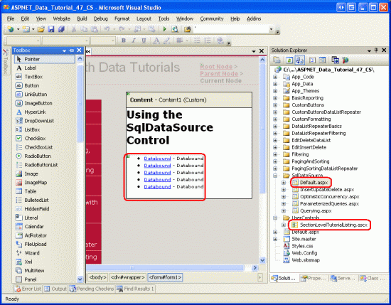
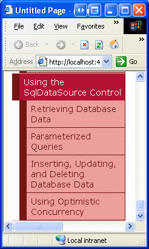
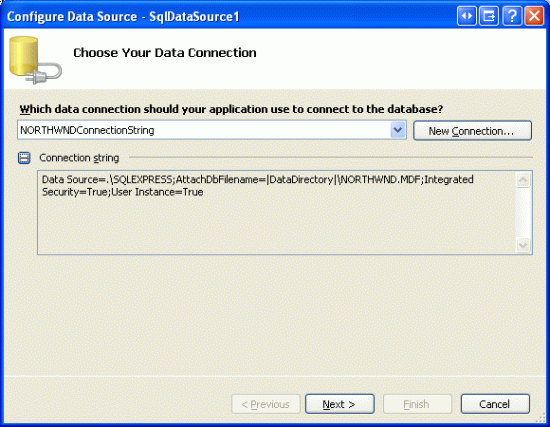
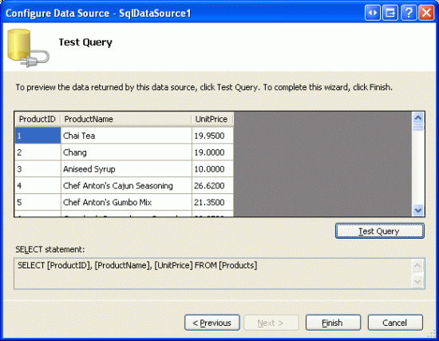
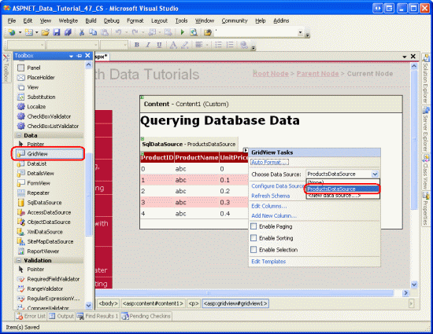
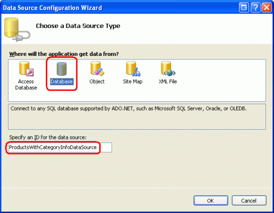
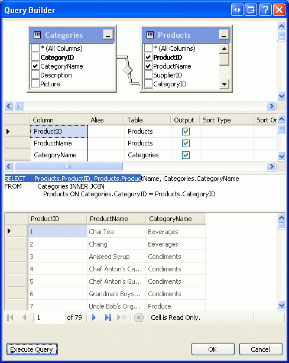
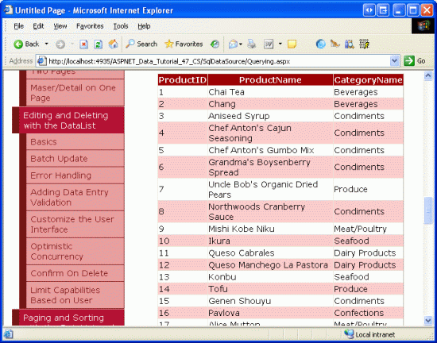

Querying Data with the SqlDataSource Control (C#)
====================
by [Scott Mitchell](https://twitter.com/ScottOnWriting)

[Download Sample App](http://download.microsoft.com/download/4/a/7/4a7a3b18-d80e-4014-8e53-a6a2427f0d93/ASPNET_Data_Tutorial_47_CS.exe) or [Download PDF](querying-data-with-the-sqldatasource-control-cs/_static/datatutorial47cs1.pdf)

> In the preceding tutorials we used the ObjectDataSource control to fully separate the presentation layer from the Data Access layer. Starting with this tutorial, we learn how the SqlDataSource control can be used for simple applications that do not require such a strict separation of presentation and data access.

## Introduction

All of the tutorials we ve examined so far have used a tiered architecture consisting of presentation, Business Logic, and Data Access layers. The Data Access Layer (DAL) was crafted in the first tutorial ([Creating a Data Access Layer](../introduction/creating-a-data-access-layer-cs.md)) and the Business Logic Layer in the second ([Creating a Business Logic Layer](../introduction/creating-a-business-logic-layer-cs.md)). Starting with the [Displaying Data With the ObjectDataSource](../basic-reporting/displaying-data-with-the-objectdatasource-cs.md) tutorial, we saw how to use ASP.NET 2.0 s new ObjectDataSource control to declaratively interface with the architecture from the presentation layer.

While all of the tutorials so far have used the architecture to work with data, it is also possible to access, insert, update, and delete database data directly from an ASP.NET page, bypassing the architecture. Doing so places the specific database queries and business logic directly in the web page. For sufficiently large or complex applications, designing, implementing, and using a tiered architecture is vitally important for the success, updatability, and maintainability of the application. Developing a robust architecture, however, may be unnecessary when creating exceedingly simple, one-off applications.

ASP.NET 2.0 provides five built-in data source controls [SqlDataSource](https://msdn.microsoft.com/en-us/library/dz12d98w%28vs.80%29.aspx), [AccessDataSource](https://msdn.microsoft.com/en-us/library/8e5545e1.aspx), [ObjectDataSource](https://msdn.microsoft.com/en-us/library/9a4kyhcx.aspx), [XmlDataSource](https://msdn.microsoft.com/en-us/library/e8d8587a%28en-US,VS.80%29.aspx), and [SiteMapDataSource](https://msdn.microsoft.com/en-us/library/5ex9t96x%28en-US,VS.80%29.aspx). The SqlDataSource can be used to access and modify data directly from a relational database, including Microsoft SQL Server, Microsoft Access, Oracle, MySQL, and others. In this tutorial and the next three, we'll examine how to work with the SqlDataSource control, exploring how to query and filter database data, as well as how to use the SqlDataSource to insert, update, and delete data.

**Figure 1**: ASP.NET 2.0 Includes Five Built-In Data Source Controls

## Comparing the ObjectDataSource and SqlDataSource

Conceptually, both the ObjectDataSource and SqlDataSource controls are simply proxies to data. As discussed in the [Displaying Data With the ObjectDataSource](../basic-reporting/displaying-data-with-the-objectdatasource-cs.md) tutorial, the ObjectDataSource has properties that indicate the object type that provides the data and the methods to invoke to select, insert, update, and delete data from the underlying object type. Once the ObjectDataSource s properties have been configured, a data Web control such as a GridView, DetailsView, or DataList can be bound to the control, using the ObjectDataSource s `Select()`, `Insert()`, `Delete()`, and `Update()` methods to interact with the underlying architecture.

The SqlDataSource provides the same functionality, but operates against a relational database rather than an object library. With the SqlDataSource, we must specify the database connection string and the ad-hoc SQL queries or stored procedures to execute to insert, update, delete, and retrieve data. The SqlDataSource s `Select()`, `Insert()`, `Update()`, and `Delete()` methods, when invoked, connect to the specified database and issue the appropriate SQL query. As the following diagram illustrates, the these methods do the grunt work of connecting to a database, issuing a query, and returning the results.

**Figure 2**: The SqlDataSource Serves as a Proxy to the Database

> [!NOTE]
> In this tutorial we'll focus on retrieving data from the database. In the [Inserting, Updating, and Deleteing Data with the SqlDataSource Control](inserting-updating-and-deleting-data-with-the-sqldatasource-cs.md) tutorial, we'll see how to configure the SqlDataSource to support inserting, updating, and deleting.

## The SqlDataSource and AccessDataSource Controls

In addition to the SqlDataSource control, ASP.NET 2.0 also includes an AccessDataSource control. These two different controls lead many developers new to ASP.NET 2.0 to suspect that the AccessDataSource control is designed to work exclusively with Microsoft Access with the SqlDataSource control designed to work exclusively with Microsoft SQL Server. While the AccessDataSource is designed to work specifically with Microsoft Access, the SqlDataSource control works with *any* relational database that can be accessed through .NET. This includes any OleDb- or ODBC-compliant data stores, such as Microsoft SQL Server, Microsoft Access, Oracle, Informix, MySQL, and PostgreSQL, among many others.

The sole difference between the AccessDataSource and SqlDataSource controls is how the database connection information is specified. The AccessDataSource control needs just the file path to the Access database file. The SqlDataSource, on the other hand, requires a complete connection string.

## Step 1: Creating the SqlDataSource Web Pages

Before we start exploring how to work directly with database data using the SqlDataSource control, let s first take a moment to create the ASP.NET pages in our website project that we'll need for this tutorial and the next three. Start by adding a new folder named `SqlDataSource`. Next, add the following ASP.NET pages to that folder, making sure to associate each page with the `Site.master` master page:

- `Default.aspx`
- `Querying.aspx`
- `ParameterizedQueries.aspx`
- `InsertUpdateDelete.aspx`
- `OptimisticConcurrency.aspx`

**Figure 3**: Add the ASP.NET Pages for the SqlDataSource-Related Tutorials

Like in the other folders, `Default.aspx` in the `SqlDataSource` folder will list the tutorials in its section. Recall that the `SectionLevelTutorialListing.ascx` User Control provides this functionality. Therefore, add this User Control to `Default.aspx` by dragging it from the Solution Explorer onto the page s Design view.

**Figure 4**: Add the `SectionLevelTutorialListing.ascx` User Control to `Default.aspx` ([Click to view full-size image](querying-data-with-the-sqldatasource-control-cs/_static/image6.gif))

Lastly, add these four pages as entries to the `Web.sitemap` file. Specifically, add the following markup after the Adding Custom Buttons to the DataList and Repeater `<siteMapNode>`:

[!code-sql[Main](querying-data-with-the-sqldatasource-control-cs/samples/sample1.sql)]

After updating `Web.sitemap`, take a moment to view the tutorials website through a browser. The menu on the left now includes items for the editing, inserting, and deleting tutorials.

**Figure 5**: The Site Map Now Includes Entries for the SqlDataSource Tutorials

## Step 2: Adding and Configuring the SqlDataSource Control

Start by opening the `Querying.aspx` page in the `SqlDataSource` folder and switch to Design view. Drag a SqlDataSource control from the Toolbox onto the Designer and set its `ID` to `ProductsDataSource`. As with the ObjectDataSource, the SqlDataSource does not produce any rendered output and therefore appears as a gray box on the design surface. To configure the SqlDataSource, click on the Configure Data Source link from the SqlDataSource s smart tag.

**Figure 6**: Click on the Configure Data Source Link from the SqlDataSource s Smart Tag

This brings up the SqlDataSource control s Configure Data Source wizard. While the wizard s steps differ from the ObjectDataSource control s, the end goal is the same to provide the details on how to retrieve, insert, update, and delete data through the data source. For the SqlDataSource this entails specifying the underlying database to use and providing the ad-hoc SQL statements or stored procedures.

The first wizard step prompts us for the database. The drop-down list includes those databases found in the web application s `App_Data` folder and those that have been added to the Data Connections node in the Server Explorer. Since we ve already added a connection string for the `NORTHWIND.MDF` database in the `App_Data` folder to our project s `Web.config` file, the drop-down list includes a reference to that connection string, `NORTHWINDConnectionString`. Choose this item from the drop-down list and click Next.

**Figure 7**: Choose the `NORTHWINDConnectionString` from the Drop-Down List

After choosing the database, the wizard asks for the query to return data. We can either specify the columns of a table or view to return or can enter a custom SQL statement or specify a stored procedure. You can toggle between this choice through the Specify a custom SQL statement or stored procedure and Specify columns from a table or view radio buttons.

> [!NOTE]
> For this first example, let s use the Specify columns from a table or view option. We'll return to the wizard later in this tutorial and explore the Specify a custom SQL statement or stored procedure option.

Figure 8 shows the Configure the Select Statement screen when the Specify columns from a table or view radio button is selected. The drop-down list contains the set of tables and views in the Northwind database, with the selected table or view s columns displayed in the checkbox list below. For this example, let s return the `ProductID`, `ProductName`, and `UnitPrice` columns from the `Products` table. As Figure 8 shows, after making these selections the wizard shows the resulting SQL statement `SELECT [ProductID], [ProductName], [UnitPrice] FROM [Products]`.

**Figure 8**: Return Data from the `Products` Table

Once you have configured the wizard to return the `ProductID`, `ProductName`, and `UnitPrice` columns from the `Products` table, click the Next button. This final screen provides an opportunity to examine the results of the query configured from the previous step. Clicking the Test Query button executes the configured `SELECT` statement and displays the results in a grid.

**Figure 9**: Click the Test Query Button to Review Your `SELECT` Query

To complete the wizard, click Finish.

Like with the ObjectDataSource, the SqlDataSource s wizard merely assigns values to the control s properties, namely the [`ConnectionString`](https://msdn.microsoft.com/en-us/library/system.web.ui.webcontrols.sqldatasource.connectionstring.aspx) and [`SelectCommand`](https://msdn.microsoft.com/en-us/library/system.web.ui.webcontrols.sqldatasource.selectcommand.aspx) properties. After completing the wizard, your SqlDataSource control s declarative markup should look similar to the following:

[!code-aspx[Main](querying-data-with-the-sqldatasource-control-cs/samples/sample2.aspx)]

The `ConnectionString` property provides information on how to connect to the database. This property can be assigned a complete, hard-coded connection string value or can point to a connection string in `Web.config`. To reference a connection string value in Web.config, use the syntax `<%$ expressionPrefix:expressionValue %>`. Typically, *expressionPrefix* is ConnectionStrings and *expressionValue* is the name of the connect string in the `Web.config` [`<connectionStrings>` section](https://msdn.microsoft.com/en-us/library/bf7sd233.aspx). However, the syntax can be used to reference `<appSettings>` elements or content from resource files. See [ASP.NET Expressions Overview](https://msdn.microsoft.com/en-us/library/d5bd1tad.aspx) for more on this syntax.

The `SelectCommand` property specifies the ad-hoc SQL statement or stored procedure to execute to return the data.

## Step 3: Adding a Data Web Control and Binding it to the SqlDataSource

Once the SqlDataSource has been configured, it can be bound to a data Web control, such as a GridView or DetailsView. For this tutorial, let s display the data in a GridView. From the Toolbox, drag a GridView onto the page and bind it to the `ProductsDataSource` SqlDataSource by choosing the data source from the drop-down list in the GridView s smart tag.

**Figure 10**: Add a GridView and Bind it to the SqlDataSource Control ([Click to view full-size image](querying-data-with-the-sqldatasource-control-cs/_static/image14.gif))

Once you ve selected the SqlDataSource control from the drop-down list in the GridView s smart tag, Visual Studio will automatically add a BoundField or CheckBoxField to the GridView for each of the columns returned by the data source control. Since the SqlDataSource returns three database columns `ProductID`, `ProductName`, and `UnitPrice` there are three fields in the GridView.

Take a moment to configure the GridView s three BoundFields. Change the `ProductName` field s `HeaderText` property to Product Name and the `UnitPrice` field s to Price. Also format the `UnitPrice` field as a currency. After making these modifications, your GridView s declarative markup should look similar to the following:

[!code-aspx[Main](querying-data-with-the-sqldatasource-control-cs/samples/sample3.aspx)]

Visit this page through a browser. As Figure 11 shows, the GridView lists each product s `ProductID`, `ProductName`, and `UnitPrice` values.

**Figure 11**: The GridView Displays Each Product s `ProductID`, `ProductName`, and `UnitPrice` Values ([Click to view full-size image](querying-data-with-the-sqldatasource-control-cs/_static/image17.gif))

When the page is visited the GridView invokes its data source control s `Select()` method. When we were using the ObjectDataSource control, this called the `ProductsBLL` class s `GetProducts()` method. With the SqlDataSource, however, the `Select()` method establishes a connection to the specified database and issues the `SelectCommand` (`SELECT [ProductID], [ProductName], [UnitPrice] FROM [Products]`, in this example). The SqlDataSource returns its results which the GridView then enumerates, creating a row in the GridView for each database record returned.

## The Built-In Data Web Control Features and the SqlDataSource Control

In general, the features inherent to the data Web controls paging, sorting, editing, deleting, inserting, and so on are specific to the data Web control and are not dependent on the data source control used. That is, the GridView can utilize its built-in paging, sorting, editing, and deleting whether it is bound to an ObjectDataSource or a SqlDataSource. However, certain data Web control features are sensitive to the data source control being used or to the data source control s configuration.

For example, in the [Efficiently Paging Through Large Amounts of Data](../paging-and-sorting/efficiently-paging-through-large-amounts-of-data-cs.md) tutorial we discussed how, by default, the paging logic for the data Web controls naively returns *all* records from the underlying data source and then displays only the appropriate subset of records given the current page index and the number of records to display per page. This model is highly inefficient when paging through sufficiently large result sets. Fortunately, the ObjectDataSource can be configured to support custom paging, which returns only the precise subset of records to display. The SqlDataSource control, however, lacks the properties for implementing custom paging.

Another subtlety with paging and sorting arises with the SqlDataSource. By default, the data returned from a SqlDataSource can be paged or sorted through the GridView. To demonstrate this, check the Enable Paging and Enable Sorting options in the GridView s smart tag in `Querying.aspx` and verify that this works as expected.

Sorting and paging works because the SqlDataSource retrieves the database data into a loosely-typed DataSet. The total number of records returned by the query an essential aspect to implementing paging can be ascertained from the DataSet. Additionally, the DataSet s results can be sorted through a DataView. These capabilities are automatically used by the SqlDataSource when the GridView requests paged or sorted data.

The SqlDataSource can be configured to return a DataReader instead of a DataSet by changing its [`DataSourceMode` property](https://msdn.microsoft.com/en-us/library/system.web.ui.webcontrols.sqldatasource.datasourcemode.aspx) from `DataSet` (the default) to `DataReader`. Using a DataReader might be preferred in situations when passing the SqlDataSource s results to existing code that expects a DataReader. Furthermore, since DataReaders are considerably simpler objects than DataSets, they offer better performance. If you make this change, however, the data Web control can neither sort nor page since the SqlDataSource cannot ascertain how many records are returned by the query, nor does the DataReader offer any techniques for sorting the returned data.

## Step 4: Using a Custom SQL Statement or Stored Procedure

When configuring the SqlDataSource control, the query used to return data can be specified in one of two approaches as a custom SQL statement or stored procedure, or as columns from an existing table or view. In Step 2 we examined selecting columns from the `Products` table. Let s look at using a custom SQL statement.

Add another GridView control to the `Querying.aspx` page and choose to create a new data source from the drop-down list in the smart tag. Next, indicate that the data will be pulled from a database this will create a new SqlDataSource control. Name the control `ProductsWithCategoryInfoDataSource`.

**Figure 12**: Create a New SqlDataSource Control Named `ProductsWithCategoryInfoDataSource`

The next screen asks us to specify the database. As we did back in Figure 7, select the `NORTHWINDConnectionString` from the drop-down list and click Next. In the Configure the Select Statement screen, choose the Specify a custom SQL statement or stored procedure radio button and click Next. This will bring up the Define Custom Statements or Stored Procedures screen, which offers tabs labeled SELECT, UPDATE, INSERT, and DELETE. In each tab you can enter a custom SQL statement into the textbox or choose a stored procedure from the drop-down list. In this tutorial we will look at entering a custom SQL statement; the next tutorial includes an example that uses a stored procedure.

**Figure 13**: Enter a Custom SQL Statement or Pick a Stored Procedure

The custom SQL statement can be entered by hand into the textbox or can be constructed graphically by clicking the Query Builder button. From either the Query Builder or the textbox, use the following query to return the `ProductID` and `ProductName` fields from the `Products` table using a `JOIN` to retrieve the product s `CategoryName` from the `Categories` table:

[!code-sql[Main](querying-data-with-the-sqldatasource-control-cs/samples/sample4.sql)]

**Figure 14**: You can Graphically Construct the Query Using the Query Builder

After specifying the query, click Next to proceed to the Test Query screen. Click Finish to complete the SqlDataSource wizard.

After completing the wizard, the GridView will have three BoundFields added to it displaying the `ProductID`, `ProductName`, and `CategoryName` columns returned from the query and resulting in the following declarative markup:

[!code-aspx[Main](querying-data-with-the-sqldatasource-control-cs/samples/sample5.aspx)]

**Figure 15**: The GridView Shows Each Product s ID, Name, and Associated Category Name ([Click to view full-size image](querying-data-with-the-sqldatasource-control-cs/_static/image23.gif))

## Summary

In this tutorial we saw how to query and display data using the SqlDataSource control. Like the ObjectDataSource, the SqlDataSource serves as a proxy, providing a declarative approach to accessing data. Its properties specify the database to connect to and the SQL `SELECT` query to execute; they can be specified through the Properties window or by using the Configure DataSource wizard.

The `SELECT` query examples we examined in this tutorial returned all of the records from the specified query. The SqlDataSource control, however, can include a `WHERE` clause with parameters whose values are assigned programmatically or are automatically pulled from a specified source. We'll examine how to create and use parameterized queries in the next tutorial!

Happy Programming!

## Further Reading

For more information on the topics discussed in this tutorial, refer to the following resources:

- [Accessing Relational Database Data](http://aspnet.4guysfromrolla.com/articles/022206-1.aspx)
- [SqlDataSource Control Overview](https://msdn.microsoft.com/en-us/library/dz12d98w.aspx)
- [ASP.NET Quickstart Tutorials: The SqlDataSource Control](https://quickstarts.asp.net/QuickStartv20/aspnet/doc/ctrlref/data/sqldatasource.aspx)
- [The Web.config `<connectionStrings>` Element](https://msdn.microsoft.com/en-us/library/bf7sd233.aspx)
- [Database Connection String Reference](http://www.connectionstrings.com/)

## About the Author

[Scott Mitchell](http://www.4guysfromrolla.com/ScottMitchell.shtml), author of seven ASP/ASP.NET books and founder of [4GuysFromRolla.com](http://www.4guysfromrolla.com), has been working with Microsoft Web technologies since 1998. Scott works as an independent consultant, trainer, and writer. His latest book is [*Sams Teach Yourself ASP.NET 2.0 in 24 Hours*](https://www.amazon.com/exec/obidos/ASIN/0672327384/4guysfromrollaco). He can be reached at [mitchell@4GuysFromRolla.com.](mailto:mitchell@4GuysFromRolla.com) or via his blog, which can be found at [http://ScottOnWriting.NET](http://ScottOnWriting.NET).

## Special Thanks To

This tutorial series was reviewed by many helpful reviewers. Lead reviewers for this tutorial were Susan Connery, Bernadette Leigh, and David Suru. Interested in reviewing my upcoming MSDN articles? If so, drop me a line at [mitchell@4GuysFromRolla.com.](mailto:mitchell@4GuysFromRolla.com)

>[!div class="step-by-step"]
[Next](using-parameterized-queries-with-the-sqldatasource-cs.md)