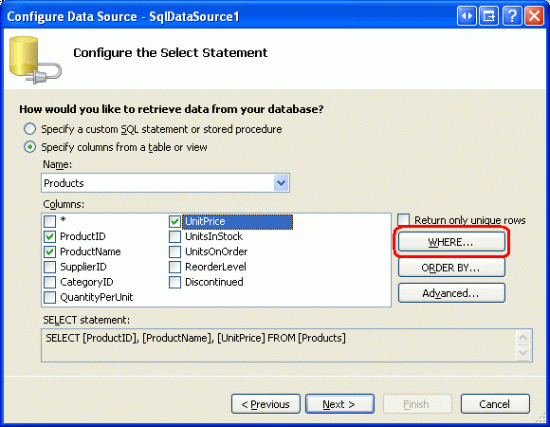
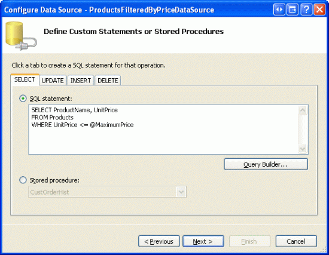
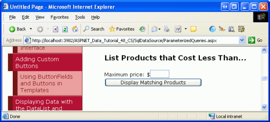
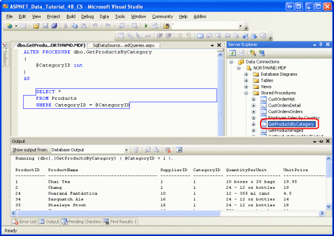
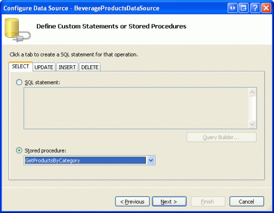
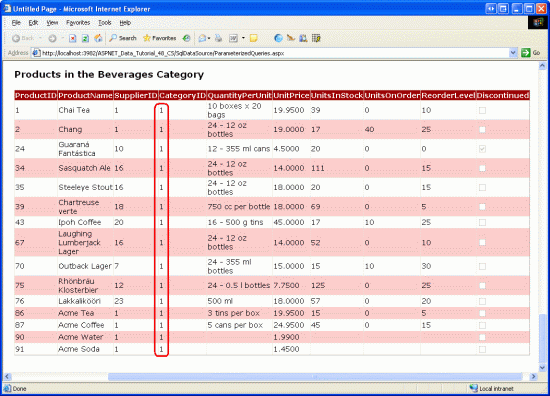

Using Parameterized Queries with the SqlDataSource (VB)
====================
by [Scott Mitchell](https://twitter.com/ScottOnWriting)

[Download Sample App](http://download.microsoft.com/download/4/a/7/4a7a3b18-d80e-4014-8e53-a6a2427f0d93/ASPNET_Data_Tutorial_48_VB.exe) or [Download PDF](using-parameterized-queries-with-the-sqldatasource-vb/_static/datatutorial48vb1.pdf)

> In this tutorial, we continue our look at the SqlDataSource control and learn how to define parameterized queries. The parameters can be specified both declaratively and programmatically, and can be pulled from a number of locations such as the querystring, Session state, other controls, and more.

## Introduction

In the previous tutorial we saw how to use the SqlDataSource control to retrieve data directly from a database. Using the Configure Data Source wizard, we could choose the database and then either: pick the columns to return from a table or view; enter a custom SQL statement; or use a stored procedure. Whether selecting columns from a table or view or entering a custom SQL statement, the SqlDataSource control s `SelectCommand` property is assigned the resulting ad-hoc SQL `SELECT` statement and it is this `SELECT` statement that is executed when the SqlDataSource s `Select()` method is invoked (either programmatically or automatically from a data Web control).

The SQL `SELECT` statements used in the previous tutorial s demos lacked `WHERE` clauses. In a `SELECT` statement, the `WHERE` clause can be used to limit the results returned. For example, to display the names of products costing more than $50.00, we could use the following query:

[!code-sql[Main](using-parameterized-queries-with-the-sqldatasource-vb/samples/sample1.sql)]

Typically, the values used in a `WHERE` clause are determine by some external source, such as a querystring value, a session variable, or user input from a Web control on the page. Ideally, such inputs are specified through the use of *parameters*. With Microsoft SQL Server, parameters are denoted using `@parameterName`, as in:

[!code-sql[Main](using-parameterized-queries-with-the-sqldatasource-vb/samples/sample2.sql)]

The SqlDataSource supports parameterized queries, both for `SELECT` statements and `INSERT`, `UPDATE`, and `DELETE` statements. Moreover, the parameter values can be automatically pulled from a variety of sources the querystring, session state, controls on the page, and so on or can be assigned programmatically. In this tutorial, we'll see how to define parameterized queries as well as how to specify the parameter values both declaratively and programmatically.

> [!NOTE]
> In the previous tutorial we compared the ObjectDataSource which has been our tool of choice over the first 46 tutorials with the SqlDataSource, noting their conceptual similarities. These similarities also extend to parameters. The ObjectDataSource s parameters mapped to the input parameters for the methods in the Business Logic Layer. With the SqlDataSource, the parameters are defined directly within the SQL query. Both controls have collections of parameters for their `Select()`, `Insert()`, `Update()`, and `Delete()` methods, and both can have these parameter values populated from pre-defined sources (querystring values, session variables, and so on) or assigned programmatically.

## Creating a Parameterized Query

The SqlDataSource control s Configure Data Source wizard offers three avenues for defining the command to execute to retrieve database records:

- By picking the columns from an existing table or view,
- By entering a custom SQL statement, or
- By choosing a stored procedure

When picking columns from an existing table or view, the parameters for the `WHERE` clause must be specified through the Add `WHERE` Clause dialog box. When creating a custom SQL statement, however, you can enter the parameters directly into the `WHERE` clause (using `@parameterName` to denote each parameter). A [stored procedure](http://www.awprofessional.com/articles/article.asp?p=25288&amp;rl=1) consists of one or more SQL statements, and these statements can be parameterized. The parameters used in the SQL statements, however, must be passed in as input parameters to the stored procedure.

Since creating a parameterized query depends on how the SqlDataSource s `SelectCommand` is specified, let s take a look at all three approaches. To get started, open the `ParameterizedQueries.aspx` page in the `SqlDataSource` folder, drag a SqlDataSource control from the Toolbox onto the Designer, and set its `ID` to `Products25BucksAndUnderDataSource`. Next, click the Configure Data Source link from the control s smart tag. Select the database to use (`NORTHWINDConnectionString`) and click Next.

## Step 1: Adding a`WHERE`Clause When Picking the Columns from a Table or View

When selecting the data to return from the database with the SqlDataSource control, the Configure Data Source wizard allows us to simply pick the columns to return from an existing table or view (see Figure 1). Doing so automatically builds up a SQL `SELECT` statement, which is what is sent to the database when the SqlDataSource s `Select()` method is invoked. As we did in the previous tutorial, select the Products table from the drop-down list and check the `ProductID`, `ProductName`, and `UnitPrice` columns.

**Figure 1**: Pick the Columns to Return from a Table or View ([Click to view full-size image](using-parameterized-queries-with-the-sqldatasource-vb/_static/image2.png))

To include a `WHERE` clause in the `SELECT` statement, click the `WHERE` button, which brings up the Add `WHERE` Clause dialog box (see Figure 2). To add a parameter to limit the results returned by the `SELECT` query, first choose the column to filter the data by. Next, choose the operator to use for filtering (=, &lt;, &lt;=, &gt;, and so on). Finally, choose the source of the parameter s value, such as from the querystring or session state. After configuring the parameter, click the Add button to include it in the `SELECT` query.

For this example, let s only return those results where the `UnitPrice` value is less than or equal to $25.00. Therefore, pick `UnitPrice` from the Column drop-down list and &lt;= from the Operator drop-down list. When using a hard-coded parameter value (such as $25.00) or if the parameter value is to be specified programmatically, select None from the Source drop-down list. Next, enter the hard-coded parameter value in the Value textbox 25.00 and complete the process by clicking the Add button.

**Figure 2**: Limit the Results Returned from the Add `WHERE` Clause Dialog Box ([Click to view full-size image](using-parameterized-queries-with-the-sqldatasource-vb/_static/image4.png))

After adding the parameter, click OK to return to the Configure Data Source wizard. The `SELECT` statement at the bottom of the wizard should now include a `WHERE` clause with a parameter named `@UnitPrice`:

[!code-sql[Main](using-parameterized-queries-with-the-sqldatasource-vb/samples/sample3.sql)]

> [!NOTE]
> If you specify multiple conditions in the `WHERE` clause from the Add `WHERE` Clause dialog box, the wizard joins them with the `AND` operator. If you need to include an `OR` in the `WHERE` clause (such as `WHERE UnitPrice <= @UnitPrice OR Discontinued = 1`) then you have to build the `SELECT` statement through the custom SQL statement screen.

Complete configuring the SqlDataSource (click Next, then Finish) and then inspect the SqlDataSource s declarative markup. The markup now includes a `<SelectParameters>` collection, which spells out the sources for the parameters in the `SelectCommand`.

[!code-aspx[Main](using-parameterized-queries-with-the-sqldatasource-vb/samples/sample4.aspx)]

When the SqlDataSource s `Select()` method is invoked, the `UnitPrice` parameter value (25.00) is applied to the `@UnitPrice` parameter in the `SelectCommand` before being sent to the database. The net result is that only those products less than or equal to $25.00 are returned from the `Products` table. To confirm this, add a GridView to the page, bind it to this data source, and then view the page through a browser. You should only see those products listed that are less than or equal to $25.00, as Figure 3 confirms.

**Figure 3**: Only Those Products Less Than or Equal to $25.00 are Displayed ([Click to view full-size image](using-parameterized-queries-with-the-sqldatasource-vb/_static/image6.png))

## Step 2: Adding Parameters to a Custom SQL Statement

When adding a custom SQL statement you can enter the `WHERE` clause explicitly or specify a value in the Filter cell of the Query Builder. To demonstrate this, let s display just those products in a GridView whose prices are less than a certain threshold. Start by adding a TextBox to the `ParameterizedQueries.aspx` page to collect this threshold value from the user. Set the TextBox s `ID` property to `MaxPrice`. Add a Button Web control and set its `Text` property to Display Matching Products .

Next, drag a GridView onto the page and from its smart tag choose to create a new SqlDataSource named `ProductsFilteredByPriceDataSource`. From the Configure Data Source wizard, proceed to the Specify a custom SQL statement or stored procedure screen (see Figure 4) and enter the following query:

[!code-sql[Main](using-parameterized-queries-with-the-sqldatasource-vb/samples/sample5.sql)]

After entering the query (either manually or through the Query Builder), click Next.

**Figure 4**: Return Only Those Products Less Than or Equal to a Parameter Value ([Click to view full-size image](using-parameterized-queries-with-the-sqldatasource-vb/_static/image8.png))

Since the query includes parameters, the next screen in the wizard prompts us for the source of the parameters values. Choose Control from the Parameter source drop-down list and `MaxPrice` (the TextBox control s `ID` value) from the ControlID drop-down list. You can also enter an optional default value to use in the case where the user has not entered any text into the `MaxPrice` TextBox. For the time being, do not enter a default value.

**Figure 5**: The `MaxPrice` TextBox s `Text` Property is Used as the Parameter Source ([Click to view full-size image](using-parameterized-queries-with-the-sqldatasource-vb/_static/image10.png))

Complete the Configure Data Source wizard by clicking Next, then Finish. The declarative markup for the GridView, TextBox, Button, and SqlDataSource follows:

[!code-aspx[Main](using-parameterized-queries-with-the-sqldatasource-vb/samples/sample6.aspx)]

Note that the parameter within the SqlDataSource s `<SelectParameters>` section is a `ControlParameter`, which includes additional properties like `ControlID` and `PropertyName`. When the SqlDataSource s `Select()` method is invoked, the `ControlParameter` grabs the value from the specified Web control property and assigns it to the corresponding parameter in the `SelectCommand`. In this example, the `MaxPrice` s Text property is used as the `@MaxPrice` parameter value.

Take a minute to view this page through a browser. When first visiting the page or whenever the `MaxPrice` TextBox lacks a value no records are displayed in the GridView.

**Figure 6**: No Records are Displayed When the `MaxPrice` TextBox is Empty ([Click to view full-size image](using-parameterized-queries-with-the-sqldatasource-vb/_static/image12.png))

The reason no products are shown is because, by default, an empty string for a parameter value is converted into a database `NULL` value. Since the comparison of `[UnitPrice] <= NULL` always evaluates as False, no results are returned.

Enter a value into the textbox, like 5.00, and click the Display Matching Products button. On postback, the SqlDataSource informs the GridView that one of its parameter sources has changed. Consequently, the GridView rebinds to the SqlDataSource, displaying those products less than or equal to $5.00.

**Figure 7**: Products Less Than or Equal to $5.00 are Displayed ([Click to view full-size image](using-parameterized-queries-with-the-sqldatasource-vb/_static/image14.png))

## Initially Displaying All Products

Rather than displaying no products when the page is first loaded, we may want to display *all* products. One way to list all products whenever the `MaxPrice` TextBox is empty is to set the parameter s default value to some insanely high value, like 1000000, since it s unlikely that Northwind Traders will ever have inventory whose unit price exceeds $1,000,000. However, this approach is shortsighted and might not work in other situations.

In previous tutorials - [Declarative Parameters](../basic-reporting/declarative-parameters-vb.md) and [Master/Detail Filtering With a DropDownList](../masterdetail/master-detail-filtering-with-a-dropdownlist-vb.md) we were faced with a similar problem. Our solution there was to put this logic in the Business Logic Layer. Specifically, the BLL examined the incoming value and, if it was `NULL` or some reserved value, the call was routed to the DAL method that returned all records. If the incoming value was a normal filtering value, a call was made to the DAL method that executed a SQL statement that used a parameterized `WHERE` clause with the supplied value.

Unfortunately, we bypass the architecture when using the SqlDataSource. Instead, we need to customize the SQL statement to intelligently grab all records if the `@MaximumPrice` parameter is `NULL` or some reserved value. For this exercise, let s have it so that if the `@MaximumPrice` parameter is equal to `-1.0`, then *all* of the records are to be returned (`-1.0` works as a reserved value since no product can have a negative `UnitPrice` value). To accomplish this we can use the following SQL statement:

[!code-sql[Main](using-parameterized-queries-with-the-sqldatasource-vb/samples/sample7.sql)]

This `WHERE` clause returns *all* records if the `@MaximumPrice` parameter equals `-1.0`. If the parameter value is not `-1.0`, only those products whose `UnitPrice` is less than or equal to the `@MaximumPrice` parameter value are returned. By setting the default value of the `@MaximumPrice` parameter to `-1.0`, on the first page load (or whenever the `MaxPrice` TextBox is empty), `@MaximumPrice` will have a value of `-1.0` and all products will be displayed.

**Figure 8**: Now All Products are Displayed When the `MaxPrice` TextBox is Empty ([Click to view full-size image](using-parameterized-queries-with-the-sqldatasource-vb/_static/image16.png))

There are a couple of caveats to note with this approach. First, realize that the parameter s data type is inferred by it s usage in the SQL query. If you change the `WHERE` clause from `@MaximumPrice = -1.0` to `@MaximumPrice = -1`, the runtime treats the parameter as an integer. If you then attempt to assign the `MaxPrice` TextBox to a decimal value (like 5.00 ), an error will occur because it cannot convert 5.00 to an integer. To remedy this, either make sure that you use `@MaximumPrice = -1.0` in the `WHERE` clause or, better yet, set the `ControlParameter` object s `Type` property to Decimal .

Secondly, by adding the `OR @MaximumPrice = -1.0` to the `WHERE` clause, the query engine cannot use an index on `UnitPrice` (assuming one exists), thereby resulting in a table scan. This can impact performance if there are a sufficiently large number of records in the `Products` table. A better approach would be to move this logic to a stored procedure where an `IF` statement would either perform a `SELECT` query from the `Products` table without a `WHERE` clause when all records need to be returned or one whose `WHERE` clause contains just the `UnitPrice` criteria, so that an index can be used.

## Step 3: Creating and Using Parameterized Stored Procedures

Stored procedures can include a set of input parameters that can then be used in the SQL statement(s) defined within the stored procedure. When configuring the SqlDataSource to use a stored procedure that accepts input parameters, these parameter values can be specified using the same techniques as with ad-hoc SQL statements.

To illustrate using stored procedures in the SqlDataSource, let s create a new stored procedure in the Northwind database named `GetProductsByCategory`, which accepts a parameter named `@CategoryID` and returns all of the columns of the products whose `CategoryID` column matches `@CategoryID`. To create a stored procedure, go to the Server Explorer and drill down into the `NORTHWND.MDF` database. (If you don t see the Server Explorer, bring it up by going to the View menu and selecting the Server Explorer option.)

From the `NORTHWND.MDF` database, right-click on the Stored Procedures folder, choose Add New Stored Procedure, and enter the following syntax:

[!code-sql[Main](using-parameterized-queries-with-the-sqldatasource-vb/samples/sample8.sql)]

Click the Save icon (or Ctrl+S) to save the stored procedure. You can test the stored procedure by right-clicking it from the Stored Procedures folder and choosing Execute. This will prompt you for the stored procedure s parameters (`@CategoryID`, in this instance), after which the results will be displayed in the Output window.

**Figure 9**: The `GetProductsByCategory` Stored Procedure when Executed with a `@CategoryID` of 1 ([Click to view full-size image](using-parameterized-queries-with-the-sqldatasource-vb/_static/image18.png))

Let s use this stored procedure to display all products in the Beverages category in a GridView. Add a new GridView to the page and bind it to a new SqlDataSource named `BeverageProductsDataSource`. Continue to the Specify a custom SQL statement or stored procedure screen, select the Stored procedure radio button, and pick the `GetProductsByCategory` stored procedure from the drop-down list.

**Figure 10**: Select the `GetProductsByCategory` Stored Procedure from the Drop-Down List ([Click to view full-size image](using-parameterized-queries-with-the-sqldatasource-vb/_static/image20.png))

Since the stored procedure accepts an input parameter (`@CategoryID`), clicking Next prompts us to specify the source for this parameter s value. The Beverages `CategoryID` is 1, so leave the Parameter source drop-down list at None and enter 1 into the DefaultValue textbox.

**Figure 11**: Use a Hard-Coded Value of 1 to Return the Products in the Beverages Category ([Click to view full-size image](using-parameterized-queries-with-the-sqldatasource-vb/_static/image22.png))

As the following declarative markup shows, when using a stored procedure, the SqlDataSource s `SelectCommand` property is set to the name of the stored procedure and the [`SelectCommandType` property](https://msdn.microsoft.com/en-us/library/system.web.ui.webcontrols.sqldatasource.selectcommandtype.aspx) is set to `StoredProcedure`, indicating that the `SelectCommand` is the name of a stored procedure rather than an ad-hoc SQL statement.

[!code-aspx[Main](using-parameterized-queries-with-the-sqldatasource-vb/samples/sample9.aspx)]

Test out the page in a browser. Only those products that belong to the Beverages category are displayed, although *all* of the product fields are displayed since the `GetProductsByCategory` stored procedure returns all of the columns from the `Products` table. We could, of course, limit or customize the fields displayed in the GridView from the GridView s Edit Columns dialog box.

**Figure 12**: All of the Beverages are Displayed ([Click to view full-size image](using-parameterized-queries-with-the-sqldatasource-vb/_static/image24.png))

## Step 4: Programmatically Invoking a SqlDataSource s`Select()`Statement

The examples we ve seen in the previous tutorial and this tutorial so far have bound SqlDataSource controls directly to a GridView. The SqlDataSource control s data, however, can be programmatically accessed and enumerated in code. This can be particularly useful when you need to query data to inspect it, but don t need to display it. Rather than having to write all of the boilerplate ADO.NET code to connect to the database, specify the command, and retrieve the results, you can let the SqlDataSource handle this monotonous code.

To illustrate working with the SqlDataSource s data programmatically, imagine that your boss has approached you with a request to create a web page that displays the name of a randomly selected category and its associated products. That is, when a user visits this page, we want to randomly choose a category from the `Categories` table, display the category name, and then list the products belonging to that category.

To accomplish this we need two SqlDataSource controls one to grab a random category from the `Categories` table and another to get the category s products. We'll build the SqlDataSource that retrieves a random category record in this step; Step 5 looks at crafting the SqlDataSource that retrieves the category s products.

Start by adding a SqlDataSource to `ParameterizedQueries.aspx` and set its `ID` to `RandomCategoryDataSource`. Configure it so that it uses the following SQL query:

[!code-sql[Main](using-parameterized-queries-with-the-sqldatasource-vb/samples/sample10.sql)]

`ORDER BY NEWID()` returns the records sorted in random order (see [Using `NEWID()` to Randomly Sort Records](http://www.sqlteam.com/item.asp?ItemID=8747)). `SELECT TOP 1` returns the first record from the result set. Put together, this query returns the `CategoryID` and `CategoryName` column values from a single, randomly selected category.

To display the category s `CategoryName` value, add a Label Web control to the page, set its `ID` property to `CategoryNameLabel`, and clear out its `Text` property. To programmatically retrieve the data from a SqlDataSource control, we need to invoke its `Select()` method. The [`Select()` method](https://msdn.microsoft.com/en-us/library/system.web.ui.webcontrols.sqldatasource.select.aspx) expects a single input parameter of type [`DataSourceSelectArguments`](https://msdn.microsoft.com/en-us/library/system.web.ui.datasourceselectarguments.aspx), which specifies how the data should be messaged before being returned. This can include instructions on sorting and filtering the data, and is used by the data Web controls when sorting or paging through the data from a SqlDataSource control. For our example, though, we don t need the data to be modified before being returned, and therefore will pass in the `DataSourceSelectArguments.Empty` object.

The `Select()` method returns an object that implements `IEnumerable`. The precise type returned depends on the value of the SqlDataSource control s [`DataSourceMode` property](https://msdn.microsoft.com/en-us/library/system.web.ui.webcontrols.sqldatasource.datasourcemode.aspx). As discussed in the previous tutorial, this property can be set to a value of either `DataSet` or `DataReader`. If set to `DataSet`, the `Select()` method returns a [DataView](https://msdn.microsoft.com/en-us/library/01s96x0z.aspx) object; if set to `DataReader`, it returns an object that implements [`IDataReader`](https://msdn.microsoft.com/en-us/library/system.data.idatareader.aspx). Since the `RandomCategoryDataSource` SqlDataSource has its `DataSourceMode` property set to `DataSet` (the default), we will be working with a DataView object.

The following code illustrates how to retrieve the records from the `RandomCategoryDataSource` SqlDataSource as a DataView as well as how to read the `CategoryName` column value from the first DataView row:

[!code-vb[Main](using-parameterized-queries-with-the-sqldatasource-vb/samples/sample11.vb)]

`randomCategoryView(0)` returns the first `DataRowView` in the DataView. `randomCategoryView(0)("CategoryName")` returns the value of the `CategoryName` column in this first row. Note that the DataView is loosely-typed. To reference a particular column value we need to pass in the name of the column as a string ( CategoryName, in this case). Figure 13 shows the message displayed in the `CategoryNameLabel` when viewing the page. Of course, the actual category name displayed is randomly selected by the `RandomCategoryDataSource` SqlDataSource on each visit to the page (including postbacks).

**Figure 13**: The Randomly Selected Category s Name is Displayed ([Click to view full-size image](using-parameterized-queries-with-the-sqldatasource-vb/_static/image26.png))

> [!NOTE]
> If the SqlDataSource control s `DataSourceMode` property had been set to `DataReader`, the return value from the `Select()` method would have needed to be cast to `IDataReader`. To read the `CategoryName` column value from the first row, we d use code like:

[!code-vb[Main](using-parameterized-queries-with-the-sqldatasource-vb/samples/sample12.vb)]

With the SqlDataSource randomly selecting a category, we re ready to add the GridView that lists the category s products.

> [!NOTE]
> Rather than using a Label Web control to display the category s name, we could have added a FormView or DetailsView to the page, binding it to the SqlDataSource. Using the Label, however, allowed us to explore how to programmatically invoke the SqlDataSource s `Select()` statement and work with its resulting data in code.

## Step 5: Assigning Parameter Values Programmatically

All of the examples we ve seen so far in this tutorial have used either a hard-coded parameter value or one taken from one of the pre-defined parameter sources (a querystring value, a Web control on the page, and so on). However, the SqlDataSource control s parameters can also be set programmatically. To complete our current example, we need a SqlDataSource that returns all of the products belonging to a specified category. This SqlDataSource will have a `CategoryID` parameter whose value needs to be set based on the `CategoryID` column value returned by the `RandomCategoryDataSource` SqlDataSource in the `Page_Load` event handler.

Start by adding a GridView to the page and bind it to a new SqlDataSource named `ProductsByCategoryDataSource`. Much like we did in Step 3, configure the SqlDataSource so that it invokes the `GetProductsByCategory` stored procedure. Leave the Parameter source drop-down list set to None, but do not enter a default value, as we will set this default value programmatically.

**Figure 14**: Do Not Specify a Parameter Source or Default Value ([Click to view full-size image](using-parameterized-queries-with-the-sqldatasource-vb/_static/image28.png))

After completing the SqlDataSource wizard, the resulting declarative markup should look similar to the following:

[!code-aspx[Main](using-parameterized-queries-with-the-sqldatasource-vb/samples/sample13.aspx)]

We can assign the `DefaultValue` of the `CategoryID` parameter programmatically in the `Page_Load` event handler:

[!code-vb[Main](using-parameterized-queries-with-the-sqldatasource-vb/samples/sample14.vb)]

With this addition, the page includes a GridView that shows the products associated with the randomly selected category.

**Figure 15**: Do Not Specify a Parameter Source or Default Value ([Click to view full-size image](using-parameterized-queries-with-the-sqldatasource-vb/_static/image30.png))

## Summary

The SqlDataSource enables page developers to define parameterized queries whose parameter values can be hard-coded, pulled from pre-defined parameter sources, or assigned programmatically. In this tutorial we saw how to craft a parameterized query from the Configure Data Source wizard for both ad-hoc SQL queries and stored procedures. We also looked at using hard-coded parameter sources, a Web control as a parameter source, and programmatically specifying the parameter value.

Like with the ObjectDataSource, the SqlDataSource also provides capabilities to modify its underlying data. In the next tutorial we'll look at how to define `INSERT`, `UPDATE`, and `DELETE` statements with the SqlDataSource. Once these statements have been added, we can utilize the built-in inserting, editing, and deleting features inherent to the GridView, DetailsView, and FormView controls.

Happy Programming!

## About the Author

[Scott Mitchell](http://www.4guysfromrolla.com/ScottMitchell.shtml), author of seven ASP/ASP.NET books and founder of [4GuysFromRolla.com](http://www.4guysfromrolla.com), has been working with Microsoft Web technologies since 1998. Scott works as an independent consultant, trainer, and writer. His latest book is [*Sams Teach Yourself ASP.NET 2.0 in 24 Hours*](https://www.amazon.com/exec/obidos/ASIN/0672327384/4guysfromrollaco). He can be reached at [mitchell@4GuysFromRolla.com.](mailto:mitchell@4GuysFromRolla.com) or via his blog, which can be found at [http://ScottOnWriting.NET](http://ScottOnWriting.NET).

## Special Thanks To

This tutorial series was reviewed by many helpful reviewers. Lead reviewers for this tutorial were Scott Clyde, Randell Schmidt, and Ken Pespisa. Interested in reviewing my upcoming MSDN articles? If so, drop me a line at [mitchell@4GuysFromRolla.com.](mailto:mitchell@4GuysFromRolla.com)

>[!div class="step-by-step"]
[Previous](querying-data-with-the-sqldatasource-control-vb.md)
[Next](inserting-updating-and-deleting-data-with-the-sqldatasource-vb.md)