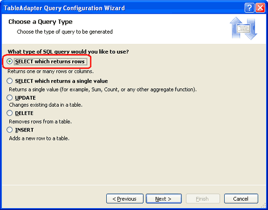
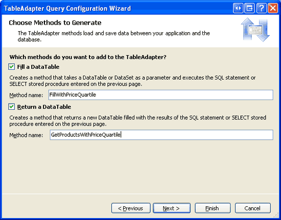
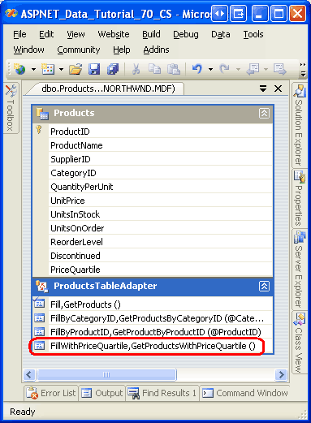
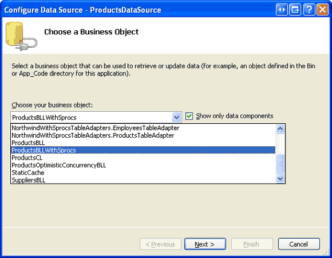
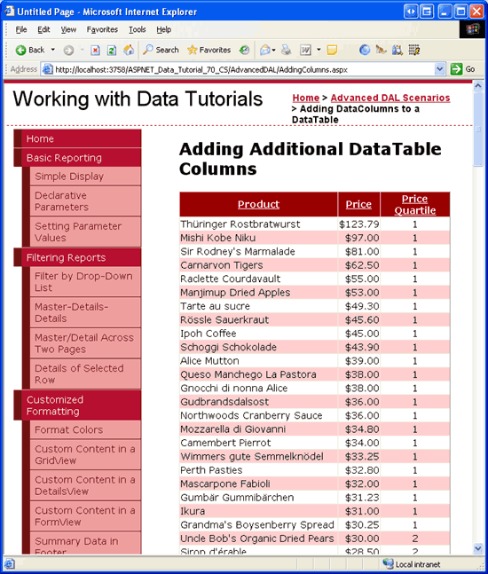

Adding Additional DataTable Columns (VB)
====================
by [Scott Mitchell](https://twitter.com/ScottOnWriting)

[Download Code](http://download.microsoft.com/download/3/9/f/39f92b37-e92e-4ab3-909e-b4ef23d01aa3/ASPNET_Data_Tutorial_70_VB.zip) or [Download PDF](adding-additional-datatable-columns-vb/_static/datatutorial70vb1.pdf)

> When using the TableAdapter Wizard to create a Typed DataSet, the corresponding DataTable contains the columns returned by the main database query. But there are occasions when the DataTable needs to include additional columns. In this tutorial we learn why stored procedures are recommended when we need additional DataTable columns.

## Introduction

When adding a TableAdapter to a Typed DataSet, the corresponding DataTable s schema is determined by the TableAdapter s main query. For example, if the main query returns data fields *A*, *B*, and *C*, the DataTable will have three corresponding columns named *A*, *B*, and *C*. In addition to its main query, a TableAdapter can include additional queries that return, perhaps, a subset of the data based on some parameter. For instance, in addition to the `ProductsTableAdapter` s main query, which returns information about all products, it also contains methods like `GetProductsByCategoryID(categoryID)` and `GetProductByProductID(productID)`, which return specific product information based on a supplied parameter.

The model of having the DataTable s schema reflect the TableAdapter s main query works well if all of the TableAdapter s methods return the same or fewer data fields than those specified in the main query. If a TableAdapter method needs to return additional data fields, then we should expand the DataTable s schema accordingly. In the [Master/Detail Using a Bulleted List of Master Records with a Details DataList](../filtering-scenarios-with-the-datalist-and-repeater/master-detail-using-a-bulleted-list-of-master-records-with-a-details-datalist-vb.md) tutorial we added a method to the `CategoriesTableAdapter` that returned the `CategoryID`, `CategoryName`, and `Description` data fields defined in the main query plus `NumberOfProducts`, an additional data field that reported the number of products associated with each category. We manually added a new column to the `CategoriesDataTable` in order to capture the `NumberOfProducts` data field value from this new method.

As discussed in the [Uploading Files](../working-with-binary-files/uploading-files-vb.md) tutorial, great care must be taken with TableAdapters that use ad-hoc SQL statements and have methods whose data fields do not precisely match the main query. If the TableAdapter Configuration wizard is re-run, it will update all of the TableAdapter s methods so that their data field list matches the main query. Consequently, any methods with customized column lists will revert to the main query s column list and not return the expected data. This issue does not arise when using stored procedures.

In this tutorial we will look at how to extend a DataTable s schema to include additional columns. Due to the brittleness of the TableAdapter when using ad-hoc SQL statements, in this tutorial we will use stored procedures. Refer to the [Creating New Stored Procedures for the Typed DataSet s TableAdapters](creating-new-stored-procedures-for-the-typed-dataset-s-tableadapters-vb.md) and [Using Existing Stored Procedures for the Typed DataSet s TableAdapters](using-existing-stored-procedures-for-the-typed-dataset-s-tableadapters-vb.md) tutorials for more information on configuring a TableAdapter to use stored procedures.

## Step 1: Adding a`PriceQuartile`Column to the`ProductsDataTable`

In the *Creating New Stored Procedures for the Typed DataSet s TableAdapters* tutorial we created a Typed DataSet named `NorthwindWithSprocs`. This DataSet currently contains two DataTables: `ProductsDataTable` and `EmployeesDataTable`. The `ProductsTableAdapter` has the following three methods:

- `GetProducts` - the main query, which returns all records from the `Products` table
- `GetProductsByCategoryID(categoryID)` - returns all products with the specified *categoryID*.
- `GetProductByProductID(productID)` - returns the particular product with the specified *productID*.

The main query and the two additional methods all return the same set of data fields, namely all of the columns from the `Products` table. There are no correlated subqueries or `JOIN` s pulling related data from the `Categories` or `Suppliers` tables. Therefore, the `ProductsDataTable` has a corresponding column for each field in the `Products` table.

For this tutorial, let s add a method to the `ProductsTableAdapter` named `GetProductsWithPriceQuartile` that returns all of the products. In addition to the standard product data fields, `GetProductsWithPriceQuartile` will also include a `PriceQuartile` data field that indicates under which quartile the product s price falls. For example, those products whose prices are in the most expensive 25% will have a `PriceQuartile` value of 1, while those whose prices fall in the bottom 25% will have a value of 4. Before we worry about creating the stored procedure to return this information, however, we first need to update the `ProductsDataTable` to include a column to hold the `PriceQuartile` results when the `GetProductsWithPriceQuartile` method is used.

Open the `NorthwindWithSprocs` DataSet and right-click on the `ProductsDataTable`. Choose Add from the context-menu and then pick Column.

**Figure 1**: Add a New Column to the `ProductsDataTable` ([Click to view full-size image](adding-additional-datatable-columns-vb/_static/image3.png))

This will add a new column to the DataTable named Column1 of type `System.String`. We need to update this column s name to PriceQuartile and its type to `System.Int32` since it will be used to hold a number between 1 and 4. Select the newly-added column in the `ProductsDataTable` and, from the Properties window, set the `Name` property to PriceQuartile and the `DataType` property to `System.Int32`.

**Figure 2**: Set the New Column s `Name` and `DataType` Properties ([Click to view full-size image](adding-additional-datatable-columns-vb/_static/image6.png))

As Figure 2 shows, there are additional properties that can be set, such as whether the values in the column must be unique, if the column is an auto-increment column, whether or not database `NULL` values are allowed, and so on. Leave these values set to their defaults.

## Step 2: Creating the`GetProductsWithPriceQuartile`Method

Now that the `ProductsDataTable` has been updated to include the `PriceQuartile` column, we are ready to create the `GetProductsWithPriceQuartile` method. Start by right-clicking on the TableAdapter and choosing Add Query from the context-menu. This brings up the TableAdapter Query Configuration wizard, which first prompts us as to whether we want to use ad-hoc SQL statements or a new or existing stored procedure. Since we don t yet have a stored procedure that returns the price quartile data, let s allow the TableAdapter to create this stored procedure for us. Select the Create new stored procedure option and click Next.

**Figure 3**: Instruct the TableAdapter Wizard to Create the Stored Procedure For Us ([Click to view full-size image](adding-additional-datatable-columns-vb/_static/image9.png))

In the subsequent screen, shown in Figure 4, the wizard asks us what type of query to add. Since the `GetProductsWithPriceQuartile` method will return all columns and records from the `Products` table, select the SELECT which returns rows option and click Next.

**Figure 4**: Our Query will be a `SELECT` Statement that Returns Multiple Rows ([Click to view full-size image](adding-additional-datatable-columns-vb/_static/image12.png))

Next we are prompted for the `SELECT` query. Enter the following query into the wizard:

[!code-sql[Main](adding-additional-datatable-columns-vb/samples/sample1.sql)]

The above query uses SQL Server 2005 s new [`NTILE` function](https://msdn.microsoft.com/en-us/library/ms175126.aspx) to divide the results into four groups where the groups are determined by the `UnitPrice` values sorted in descending order.

Unfortunately, the Query Builder does not know how to parse the `OVER` keyword and will display an error when parsing the above query. Therefore, enter the above query directly in the textbox in the wizard without using the Query Builder.

> [!NOTE]
> For more information on NTILE and SQL Server 2005 s other ranking functions, see [Returning Ranked Results with Microsoft SQL Server 2005](http://www.4guysfromrolla.com/webtech/010406-1.shtml) and the [Ranking Functions section](https://msdn.microsoft.com/en-us/library/ms189798.aspx) from the [SQL Server 2005 Books Online](https://msdn.microsoft.com/en-us/library/ms189798.aspx).

After entering the `SELECT` query and clicking Next, the wizard asks us to provide a name for the stored procedure it will create. Name the new stored procedure `Products_SelectWithPriceQuartile` and click Next.

**Figure 5**: Name the Stored Procedure `Products_SelectWithPriceQuartile` ([Click to view full-size image](adding-additional-datatable-columns-vb/_static/image15.png))

Lastly, we are prompted to name the TableAdapter methods. Leave both the Fill a DataTable and Return a DataTable checkboxes checked and name the methods `FillWithPriceQuartile` and `GetProductsWithPriceQuartile`.

**Figure 6**: Name the TableAdapter s Methods and Click Finish ([Click to view full-size image](adding-additional-datatable-columns-vb/_static/image18.png))

With the `SELECT` query specified and the stored procedure and TableAdapter methods named, click Finish to complete the wizard. At this point you may get a warning or two from the wizard saying that The `OVER` SQL construct or statement is not supported. These warnings can be ignored.

After completing the wizard, the TableAdapter should include the `FillWithPriceQuartile` and `GetProductsWithPriceQuartile` methods and the database should include a stored procedure named `Products_SelectWithPriceQuartile`. Take a moment to verify that the TableAdapter does indeed contain this new method and that the stored procedure has been correctly added to the database. When checking the database, if you do not see the stored procedure try right-clicking on the Stored Procedures folder and choosing Refresh.

**Figure 7**: Verify that a New Method Has Been Added to the TableAdapter

**Figure 8**: Ensure that the Database Contains the `Products_SelectWithPriceQuartile` Stored Procedure ([Click to view full-size image](adding-additional-datatable-columns-vb/_static/image22.png))

> [!NOTE]
> One of the benefits of using stored procedures instead of ad-hoc SQL statements is that re-running the TableAdapter Configuration wizard will not modify the stored procedures column lists. Verify this by right-clicking on the TableAdapter, choosing the Configure option from the context-menu to start the wizard, and then clicking Finish to complete it. Next, go to the database and view the `Products_SelectWithPriceQuartile` stored procedure. Note that its column list has not been modified. Had we been using ad-hoc SQL statements, re-running the TableAdapter Configuration wizard would have reverted this query s column list to match the main query column list, thereby removing the NTILE statement from the query used by the `GetProductsWithPriceQuartile` method.

When the Data Access Layer s `GetProductsWithPriceQuartile` method is invoked, the TableAdapter executes the `Products_SelectWithPriceQuartile` stored procedure and adds a row to the `ProductsDataTable` for each returned record. The data fields returned by the stored procedure are mapped to the `ProductsDataTable` s columns. Since there is a `PriceQuartile` data field returned from the stored procedure, its value is assigned to the `ProductsDataTable` s `PriceQuartile` column.

For those TableAdapter methods whose queries do not return a `PriceQuartile` data field, the `PriceQuartile` column s value is the value specified by its `DefaultValue` property. As Figure 2 shows, this value is set to `DBNull`, the default. If you would prefer a different default value, simply set the `DefaultValue` property accordingly. Just make sure that the `DefaultValue` value is valid given the column s `DataType` (i.e., `System.Int32` for the `PriceQuartile` column).

At this point we have performed the necessary steps for adding an additional column to a DataTable. To verify that this additional column works as expected, let s create an ASP.NET page that displays each product s name, price, and price quartile. Before we do that, though, we first need to update the Business Logic Layer to include a method that calls down to the DAL s `GetProductsWithPriceQuartile` method. We will update the BLL next, in Step 3, and then create the ASP.NET page in Step 4.

## Step 3: Augmenting the Business Logic Layer

Before we use the new `GetProductsWithPriceQuartile` method from the Presentation Layer, we should first add a corresponding method to the BLL. Open the `ProductsBLLWithSprocs` class file and add the following code:

[!code-vb[Main](adding-additional-datatable-columns-vb/samples/sample2.vb)]

Like the other data retrieval methods in `ProductsBLLWithSprocs`, the `GetProductsWithPriceQuartile` method simply calls the DAL s corresponding `GetProductsWithPriceQuartile` method and returns its results.

## Step 4: Displaying the Price Quartile Information in an ASP.NET Web Page

With the BLL addition complete we re ready to create an ASP.NET page that shows the price quartile for each product. Open the `AddingColumns.aspx` page in the `AdvancedDAL` folder and drag a GridView from the Toolbox onto the Designer, setting its `ID` property to `Products`. From the GridView s smart tag, bind it to a new ObjectDataSource named `ProductsDataSource`. Configure the ObjectDataSource to use the `ProductsBLLWithSprocs` class s `GetProductsWithPriceQuartile` method. Since this will be a read-only grid, set the drop-down lists in the UPDATE, INSERT, and DELETE tabs to (None) .

**Figure 9**: Configure the ObjectDataSource to Use the `ProductsBLLWithSprocs` Class ([Click to view full-size image](adding-additional-datatable-columns-vb/_static/image25.png))

**Figure 10**: Retrieve Product Information from the `GetProductsWithPriceQuartile` Method ([Click to view full-size image](adding-additional-datatable-columns-vb/_static/image28.png))

After completing the Configure Data Source wizard, Visual Studio will automatically add a BoundField or CheckBoxField to the GridView for each of the data fields returned by the method. One of these data fields is `PriceQuartile`, which is the column we added to the `ProductsDataTable` in Step 1.

Edit the GridView s fields, removing all but the `ProductName`, `UnitPrice`, and `PriceQuartile` BoundFields. Configure the `UnitPrice` BoundField to format its value as a currency and have the `UnitPrice` and `PriceQuartile` BoundFields right- and center-aligned, respectively. Finally, update the remaining BoundFields `HeaderText` properties to Product, Price, and Price Quartile, respectively. Also, check the Enable Sorting checkbox from the GridView s smart tag.

After these modifications, the GridView and ObjectDataSource s declarative markup should look like the following:

[!code-aspx[Main](adding-additional-datatable-columns-vb/samples/sample3.aspx)]

Figure 11 shows this page when visited through a browser. Note that, initially, the products are ordered by their price in descending order with each product assigned an appropriate `PriceQuartile` value. Of course this data can be sorted by other criteria with the Price Quartile column value still reflecting the product s ranking with respect to price (see Figure 12).

**Figure 11**: The Products are Ordered by their Prices ([Click to view full-size image](adding-additional-datatable-columns-vb/_static/image31.png))

**Figure 12**: The Products are Ordered by their Names ([Click to view full-size image](adding-additional-datatable-columns-vb/_static/image34.png))

> [!NOTE]
> With a few lines of code we could augment the GridView so that it colored the product rows based on their `PriceQuartile` value. We might color those products in the first quartile a light green, those in the second quartile a light yellow, and so forth. I encourage you to take a moment to add this functionality. If you need a refresher on formatting a GridView, consult the [Custom Formatting Based Upon Data](../custom-formatting/custom-formatting-based-upon-data-vb.md) tutorial.

## An Alternative Approach - Creating Another TableAdapter

As we saw in this tutorial, when adding a method to a TableAdapter that returns data fields other than those spelled out by the main query, we can add corresponding columns to the DataTable. Such an approach, however, works well only if there are a small number of methods in the TableAdapter that return different data fields and if those alternate data fields do not vary too much from the main query.

Rather than adding columns to the DataTable, you can instead add another TableAdapter to the DataSet that contains the methods from the first TableAdapter that return different data fields. For this tutorial, rather than add the `PriceQuartile` column to the `ProductsDataTable` (where it is only used by the `GetProductsWithPriceQuartile` method), we could have added an additional TableAdapter to the DataSet named `ProductsWithPriceQuartileTableAdapter` that used the `Products_SelectWithPriceQuartile` stored procedure as its main query. ASP.NET pages that needed to get product information with the price quartile would use the `ProductsWithPriceQuartileTableAdapter`, while those that did not could continue to use the `ProductsTableAdapter`.

By adding a new TableAdapter, the DataTables remain untarnished and their columns precisely mirror the data fields returned by their TableAdapter s methods. However, additional TableAdapters can introduce repetitive tasks and functionality. For example, if those ASP.NET pages that displayed the `PriceQuartile` column also needed to provide insert, update, and delete support, the `ProductsWithPriceQuartileTableAdapter` would need to have its `InsertCommand`, `UpdateCommand`, and `DeleteCommand` properties properly configured. While these properties would mirror the `ProductsTableAdapter` s, this configuration introduces an extra step. Moreover, there are now two ways to update, delete, or add a product to the database - through the `ProductsTableAdapter` and `ProductsWithPriceQuartileTableAdapter` classes.

The download for this tutorial includes a `ProductsWithPriceQuartileTableAdapter` class in the `NorthwindWithSprocs` DataSet that illustrates this alternative approach.

## Summary

In most scenarios, all of the methods in a TableAdapter will return the same set of data fields, but there are times when a particular method or two may need to return an additional field. For example, in the [Master/Detail Using a Bulleted List of Master Records with a Details DataList](../filtering-scenarios-with-the-datalist-and-repeater/master-detail-using-a-bulleted-list-of-master-records-with-a-details-datalist-vb.md) tutorial we added a method to the `CategoriesTableAdapter` that, in addition to the main query s data fields, returned a `NumberOfProducts` field that reported the number of products associated with each category. In this tutorial we looked at adding a method in the `ProductsTableAdapter` that returned a `PriceQuartile` field in addition to the main query s data fields. To capture additional data fields returned by the TableAdapter s methods we need to add corresponding columns to the DataTable.

If you plan on manually adding columns to the DataTable, it is recommended that the TableAdapter use stored procedures. If the TableAdapter uses ad-hoc SQL statements, any time the TableAdapter Configuration wizard is run all of the methods data field lists revert to the data fields returned by the main query. This problem does not extend to stored procedures, which is why they are recommended and were used in this tutorial.

Happy Programming!

## About the Author

[Scott Mitchell](http://www.4guysfromrolla.com/ScottMitchell.shtml), author of seven ASP/ASP.NET books and founder of [4GuysFromRolla.com](http://www.4guysfromrolla.com), has been working with Microsoft Web technologies since 1998. Scott works as an independent consultant, trainer, and writer. His latest book is [*Sams Teach Yourself ASP.NET 2.0 in 24 Hours*](https://www.amazon.com/exec/obidos/ASIN/0672327384/4guysfromrollaco). He can be reached at [mitchell@4GuysFromRolla.com.](mailto:mitchell@4GuysFromRolla.com) or via his blog, which can be found at [http://ScottOnWriting.NET](http://ScottOnWriting.NET).

## Special Thanks To

This tutorial series was reviewed by many helpful reviewers. Lead reviewers for this tutorial were Randy Schmidt, Jacky Goor, Bernadette Leigh, and Hilton Giesenow. Interested in reviewing my upcoming MSDN articles? If so, drop me a line at [mitchell@4GuysFromRolla.com.](mailto:mitchell@4GuysFromRolla.com)

>[!div class="step-by-step"]
[Previous](updating-the-tableadapter-to-use-joins-vb.md)
[Next](working-with-computed-columns-vb.md)