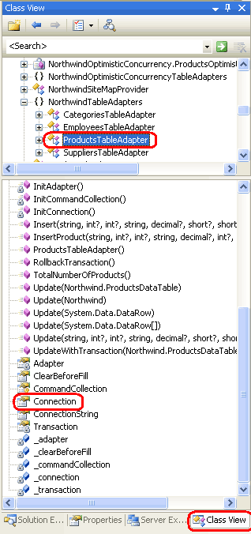
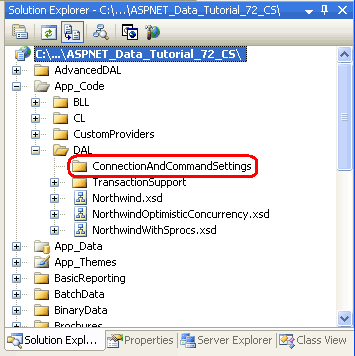

Configuring the Data Access Layer's Connection- and Command-Level Settings (VB)
====================
by [Scott Mitchell](https://twitter.com/ScottOnWriting)

[Download Code](http://download.microsoft.com/download/3/9/f/39f92b37-e92e-4ab3-909e-b4ef23d01aa3/ASPNET_Data_Tutorial_72_VB.zip) or [Download PDF](configuring-the-data-access-layer-s-connection-and-command-level-settings-vb/_static/datatutorial72vb1.pdf)

> The TableAdapters within a Typed DataSet automatically take care of connecting to the database, issuing commands, and populating a DataTable with the results. There are occasions however when we want to take care of these details ourselves, and in this tutorial we learn how to access the database connection- and command-level settings in the TableAdapter.

## Introduction

Throughout the tutorial series we have used Typed DataSets to implement the Data Access Layer and business objects of our layered architecture. As discussed in the [first tutorial](../introduction/creating-a-data-access-layer-vb.md), the Typed DataSet s DataTables serve as repositories of data whereas the TableAdapters act as wrappers to communicate with the database to retrieve and modify the underlying data. The TableAdapters encapsulate the complexity involved in working with the database and saves us from having to write code to connect to the database, issue a command, or populate the results into a DataTable.

There are times, however, when we need to burrow into the depths of the TableAdapter and write code that works directly with the ADO.NET objects. In the [Wrapping Database Modifications within a Transaction](../working-with-batched-data/wrapping-database-modifications-within-a-transaction-vb.md) tutorial, for example, we added methods to the TableAdapter for beginning, committing, and rolling back ADO.NET transactions. These methods used an internal, manually-created `SqlTransaction` object that was assigned to the TableAdapter s `SqlCommand` objects.

In this tutorial we will examine how to access the database connection- and command-level settings in the TableAdapter. In particular, we will add functionality to the `ProductsTableAdapter` that enables access to the underlying connection string and command timeout settings.

## Working with Data Using ADO.NET

The Microsoft .NET Framework contains a plethora of classes designed specifically to work with data. These classes, found within the [`System.Data` namespace](https://msdn.microsoft.com/en-us/library/system.data.aspx), are referred to as the *ADO.NET* classes. Some of the classes under the ADO.NET umbrella are tied to a particular *data provider*. You can think of a data provider as a communication channel that allows information to flow between the ADO.NET classes and the underlying data store. There are generalized providers, like OleDb and ODBC, as well as providers that are specially designed for a particular database system. For example, while it is possible to connect to a Microsoft SQL Server database using the OleDb provider, the SqlClient provider is much more efficient as it was designed and optimized specifically for SQL Server.

When programmatically accessing data, the following pattern is commonly used:

1. Establish a connection to the database.
2. Issue a command.
3. For `SELECT` queries, work with the resulting records.

There are separate ADO.NET classes for performing each of these steps. To connect to a database using the SqlClient provider, for example, use the [`SqlConnection` class](https://msdn.microsoft.com/en-us/library/system.data.sqlclient.sqlconnection(VS.80).aspx). To issue an `INSERT`, `UPDATE`, `DELETE`, or `SELECT` command to the database, use the [`SqlCommand` class](https://msdn.microsoft.com/en-us/library/system.data.sqlclient.sqlcommand.aspx).

Except for the [Wrapping Database Modifications within a Transaction](../working-with-batched-data/wrapping-database-modifications-within-a-transaction-vb.md) tutorial, we have not had to write any low-level ADO.NET code ourselves because the TableAdapters auto-generated code includes the functionality needed to connect to the database, issue commands, retrieve data, and populate that data into DataTables. However, there may be times when we need to customize these low-level settings. Over the next few steps we will examine how to tap into the ADO.NET objects used internally by the TableAdapters.

## Step 1: Examining with the Connection Property

Each TableAdapter class has a `Connection` property that specifies database connection information. This property s data type and `ConnectionString` value are determined by the selections made in the TableAdapter Configuration wizard. Recall that when we first add a TableAdapter to a Typed DataSet this wizard asks us for the database source (see Figure 1). The drop-down list in this first step includes those databases specified in the configuration file as well as any other databases in the Server Explorer s Data Connections. If the database we want to use does not exist in the drop-down list, a new database connection can be specified by clicking the New Connection button and providing the needed connection information.

**Figure 1**: The First Step of the TableAdapter Configuration Wizard ([Click to view full-size image](configuring-the-data-access-layer-s-connection-and-command-level-settings-vb/_static/image3.png))

Let s take a moment to inspect the code for the TableAdapter s `Connection` property. As noted in the [Creating a Data Access Layer](../introduction/creating-a-data-access-layer-vb.md) tutorial, we can view the auto-generated TableAdapter code by going to the Class View window, drilling down to the appropriate class, and then double-clicking the member name.

Navigate to the Class View window by going to the View menu and choosing Class View (or by typing Ctrl+Shift+C). From the top half of the Class View window, drill down to the `NorthwindTableAdapters` namespace and select the `ProductsTableAdapter` class. This will display the `ProductsTableAdapter` s members in the bottom half of the Class View, as shown in Figure 2. Double-click the `Connection` property to see its code.

**Figure 2**: Double-Click the Connection Property in the Class View to View Its Auto-Generated Code

The TableAdapter s `Connection` property and other connection-related code follows:

[!code-vb[Main](configuring-the-data-access-layer-s-connection-and-command-level-settings-vb/samples/sample1.vb)]

When the TableAdapter class is instantiated, the member variable `_connection` is equal to `Nothing`. When the `Connection` property is accessed, it first checks to see if the `_connection` member variable has been instantiated. If it has not, the `InitConnection` method is invoked, which instantiates `_connection` and sets its `ConnectionString` property to the connection string value specified from the TableAdapter Configuration wizard s first step.

The `Connection` property can also be assigned to a `SqlConnection` object. Doing so associates the new `SqlConnection` object with each of the TableAdapter s `SqlCommand` objects.

## Step 2: Exposing Connection-Level Settings

The connection information should remain encapsulated within the TableAdapter and not be accessible to other layers in the application architecture. However, there may be scenarios when the TableAdapter s connection-level information needs to be accessible or customizable for a query, user, or ASP.NET page.

Let s extend the `ProductsTableAdapter` in the `Northwind` DataSet to include a `ConnectionString` property that can be used by the Business Logic Layer to read or change the connection string used by the TableAdapter.

> [!NOTE]
> A *connection string* is a string that specifies database connection information, such as the provider to use, the location of the database, authentication credentials, and other database-related settings. For a list of connection string patterns used by a variety of data stores and providers, see [ConnectionStrings.com](http://www.connectionstrings.com/).

As discussed in the [Creating a Data Access Layer](../introduction/creating-a-data-access-layer-vb.md) tutorial, the Typed DataSet s auto-generated classes can be extended through the use of partial classes. First, create a new subfolder in the project named `ConnectionAndCommandSettings` underneath the `~/App_Code/DAL` folder.

**Figure 3**: Add a Subfolder Named `ConnectionAndCommandSettings`

Add a new class file named `ProductsTableAdapter.ConnectionAndCommandSettings.vb` and enter the following code:

[!code-vb[Main](configuring-the-data-access-layer-s-connection-and-command-level-settings-vb/samples/sample2.vb)]

This partial class adds a `Public` property named `ConnectionString` to the `ProductsTableAdapter` class that allows any layer to read or update the connection string for the TableAdapter s underlying connection.

With this partial class created (and saved), open the `ProductsBLL` class. Go to one of the existing methods and type in `Adapter` and then hit the period key to bring up IntelliSense. You should see the new `ConnectionString` property available in IntelliSense, meaning that you can programmatically read or adjust this value from the BLL.

## Exposing the Entire Connection Object

This partial class exposes just one property of the underlying connection object: `ConnectionString`. If you want to make the entire connection object available beyond the confines of the TableAdapter, you can alternatively change the `Connection` property s protection level. The auto-generated code we examined in Step 1 showed that the TableAdapter s `Connection` property is marked as `Friend`, meaning that it can only be accessed by classes in the same assembly. This can be changed, however, via the TableAdapter s `ConnectionModifier` property.

Open the `Northwind` DataSet, click on the `ProductsTableAdatper` in the Designer, and navigate to the Properties window. There you will see the `ConnectionModifier` set to its default value, `Assembly`. To make the `Connection` property available outside of the Typed DataSet s assembly, change the `ConnectionModifier` property to `Public`.

**Figure 4**: The `Connection` Property s Accessibility Level Can Be Configured via the `ConnectionModifier` Property ([Click to view full-size image](configuring-the-data-access-layer-s-connection-and-command-level-settings-vb/_static/image8.png))

Save the DataSet and then return to the `ProductsBLL` class. As before, go to one of the existing methods and type in `Adapter` and then hit the period key to bring up IntelliSense. The list should include a `Connection` property, meaning that you can now programmatically read or assign any connection-level settings from the BLL.

## Step 3: Examining the Command-Related Properties

A TableAdapter consists of a main query that, by default, has auto-generated `INSERT`, `UPDATE`, and `DELETE` statements. This main query s `INSERT`, `UPDATE`, and `DELETE` statements are implemented in the TableAdapter s code as an ADO.NET data adapter object via the `Adapter` property. Like with its `Connection` property, the `Adapter` property s data type is determined by the data provider used. Since these tutorials use the SqlClient provider, the `Adapter` property is of type [`SqlDataAdapter`](https://msdn.microsoft.com/en-us/library/system.data.sqlclient.sqldataadapter(VS.80).aspx).

The TableAdapter s `Adapter` property has three properties of type `SqlCommand` that it uses to issue the `INSERT`, `UPDATE`, and `DELETE` statements:

- `InsertCommand`
- `UpdateCommand`
- `DeleteCommand`

A `SqlCommand` object is responsible for sending a particular query to the database and has properties like: [`CommandText`](https://msdn.microsoft.com/en-us/library/system.data.sqlclient.sqlcommand.commandtext.aspx), which contains the ad-hoc SQL statement or stored procedure to execute; and [`Parameters`](https://msdn.microsoft.com/en-us/library/system.data.sqlclient.sqlcommand.parameters.aspx), which is a collection of `SqlParameter` objects. As we saw back in the [Creating a Data Access Layer](../introduction/creating-a-data-access-layer-vb.md) tutorial, these command objects can be customized through the Properties window.

In addition to its main query, the TableAdapter can include a variable number of methods that, when invoked, dispatch a specified command to the database. The main query s command object and the command objects for all additional methods are stored in the TableAdapter s `CommandCollection` property.

Let s take a moment to look at the code generated by the `ProductsTableAdapter` in the `Northwind` DataSet for these two properties and their supporting member variables and helper methods:

[!code-vb[Main](configuring-the-data-access-layer-s-connection-and-command-level-settings-vb/samples/sample3.vb)]

The code for the `Adapter` and `CommandCollection` properties closely mimics that of the `Connection` property. There are member variables that hold the objects used by the properties. The properties `Get` accessors start by checking to see if the corresponding member variable is `Nothing`. If so, an initialization method is called which creates an instance of the member variable and assigns the core command-related properties.

## Step 4: Exposing Command-Level Settings

Ideally, the command-level information should remain encapsulated within the Data Access Layer. Should this information be needed in other layers of the architecture, however, it can be exposed through a partial class, just like with the connection-level settings.

Since the TableAdapter only has a single `Connection` property, the code for exposing connection-level settings is fairly straightforward. Things are a bit more complicated when modifying command-level settings because the TableAdapter can have multiple command objects - an `InsertCommand`, `UpdateCommand`, and `DeleteCommand`, along with a variable number of command objects in the `CommandCollection` property. When updating command-level settings, these settings will need to be propagated to all of the command objects.

For example, imagine that there were certain queries in the TableAdapter that took an extraordinary long time to execute. When using the TableAdapter to execute one of those queries, we might want to increase the command object s [`CommandTimeout` property](https://msdn.microsoft.com/en-us/library/system.data.sqlclient.sqlcommand.commandtimeout.aspx). This property specifies the number of seconds to wait for the command to execute and defaults to 30.

To allow the `CommandTimeout` property to be adjusted by the BLL, add the following `Public` method to the `ProductsDataTable` using the partial class file created in Step 2 (`ProductsTableAdapter.ConnectionAndCommandSettings.vb`):

[!code-vb[Main](configuring-the-data-access-layer-s-connection-and-command-level-settings-vb/samples/sample4.vb)]

This method could be invoked from the BLL or Presentation Layer to set the command timeout for all commands issues by that TableAdapter instance.

> [!NOTE]
> The `Adapter` and `CommandCollection` properties are marked as `Private`, meaning they can only be accessed from code within the TableAdapter. Unlike the `Connection` property, these access modifiers are not configurable. Therefore, if you need to expose command-level properties to other layers in the architecture you must use the partial class approach discussed above to provide a `Public` method or property that reads or writes to the `Private` command objects.

## Summary

The TableAdapters within a Typed DataSet serve to encapsulate data access details and complexity. Using TableAdapters, we do not have to worry about writing ADO.NET code to connect to the database, issue a command, or populate the results into a DataTable. It is all handled automatically for us.

However, there may be times when we need to customize the low-level ADO.NET specifics, such as changing the connection string or the default connection or command timeout values. The TableAdapter has auto-generated `Connection`, `Adapter`, and `CommandCollection` properties, but these are either `Friend` or `Private`, by default. This internal information can be exposed by extending the TableAdapter using partial classes to include `Public` methods or properties. Alternatively, the TableAdapter s `Connection` property access modifier can be configured through the TableAdapter s `ConnectionModifier` property.

Happy Programming!

## About the Author

[Scott Mitchell](http://www.4guysfromrolla.com/ScottMitchell.shtml), author of seven ASP/ASP.NET books and founder of [4GuysFromRolla.com](http://www.4guysfromrolla.com), has been working with Microsoft Web technologies since 1998. Scott works as an independent consultant, trainer, and writer. His latest book is [*Sams Teach Yourself ASP.NET 2.0 in 24 Hours*](https://www.amazon.com/exec/obidos/ASIN/0672327384/4guysfromrollaco). He can be reached at [mitchell@4GuysFromRolla.com.](mailto:mitchell@4GuysFromRolla.com) or via his blog, which can be found at [http://ScottOnWriting.NET](http://ScottOnWriting.NET).

## Special Thanks To

This tutorial series was reviewed by many helpful reviewers. Lead reviewers for this tutorial were Burnadette Leigh, S ren Jacob Lauritsen, Teresa Murphy, and Hilton Geisenow. Interested in reviewing my upcoming MSDN articles? If so, drop me a line at [mitchell@4GuysFromRolla.com.](mailto:mitchell@4GuysFromRolla.com)

>[!div class="step-by-step"]
[Previous](working-with-computed-columns-vb.md)
[Next](protecting-connection-strings-and-other-configuration-information-vb.md)