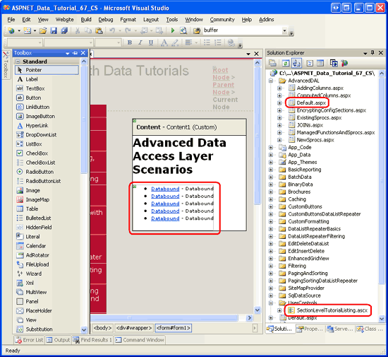
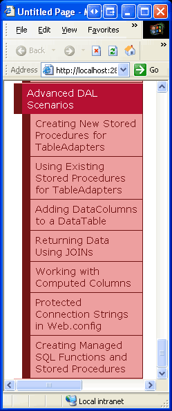
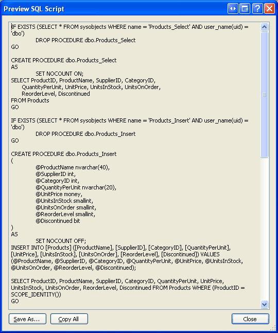
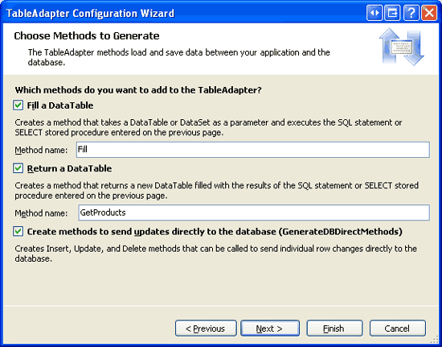
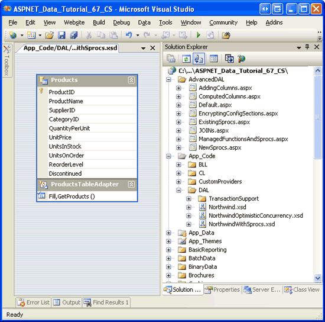
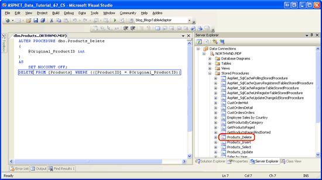
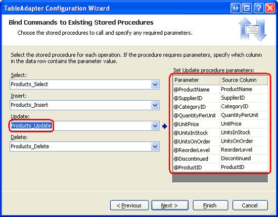
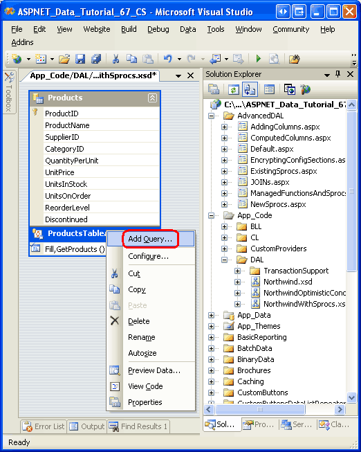
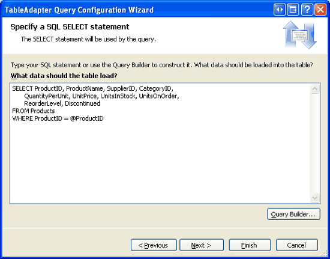

Creating New Stored Procedures for the Typed DataSet's TableAdapters (C#)
====================
by [Scott Mitchell](https://twitter.com/ScottOnWriting)

[Download Code](http://download.microsoft.com/download/3/9/f/39f92b37-e92e-4ab3-909e-b4ef23d01aa3/ASPNET_Data_Tutorial_67_CS.zip) or [Download PDF](creating-new-stored-procedures-for-the-typed-dataset-s-tableadapters-cs/_static/datatutorial67cs1.pdf)

> In earlier tutorials we have created SQL statements in our code and passed the statements to the database to be executed. An alternative approach is to use stored procedures, where the SQL statements are pre-defined at the database. In this tutorial we learn how to have the TableAdapter Wizard generate new stored procedures for us.

## Introduction

The Data Access Layer (DAL) for these tutorials uses Typed DataSets. As discussed in the [Creating a Data Access Layer](../introduction/creating-a-data-access-layer-cs.md) tutorial, Typed DataSets consist of strongly-typed DataTables and TableAdapters. The DataTables represent the logical entities in the system while the TableAdapters interface with the underlying database to perform the data access work. This includes populating the DataTables with data, executing queries that return scalar data, and inserting, updating, and deleting records from the database.

The SQL commands executed by the TableAdapters can be either ad-hoc SQL statements, such as `SELECT columnList FROM TableName`, or stored procedures. The TableAdapters in our architecture use ad-hoc SQL statements. Many developers and database administrators, however, prefer stored procedures over ad-hoc SQL statements for security, maintainability, and updateability reasons. Others ardently prefer ad-hoc SQL statements for their flexibility. In my own work I favor stored procedures over ad-hoc SQL statements, but chose to use ad-hoc SQL statements to simplify the earlier tutorials.

When defining a TableAdapter or adding new methods, the TableAdapter s wizard makes it just as easy to create new stored procedures or use existing stored procedures as it does to use ad-hoc SQL statements. In this tutorial we'll examine how to have the TableAdapter s wizard auto-generate stored procedures. In the next tutorial we will look at how to configure the TableAdapter s methods to use existing or manually-created stored procedures.

> [!NOTE]
> See Rob Howard's blog entry [Don't Use Stored Procedures Yet?](http://grokable.com/2003/11/dont-use-stored-procedures-yet-must-be-suffering-from-nihs-not-invented-here-syndrome/) and [Frans Bouma](https://weblogs.asp.net/fbouma/) s blog entry [Stored Procedures are Bad, M Kay?](https://weblogs.asp.net/fbouma/archive/2003/11/18/38178.aspx) for a lively debate on the pros and cons of stored procedures and ad-hoc SQL.

## Stored Procedure Basics

Functions are a construct common to all programming languages. A function is a collection of statements that are executed when the function is called. Functions can accept input parameters and may optionally return a value. *[Stored procedures](http://en.wikipedia.org/wiki/Stored_procedure)* are database constructs that share many similarities with functions in programming languages. A stored procedure is made up of a set of T-SQL statements that are executed when the stored procedure is called. A stored procedure may accept zero to many input parameters and can return scalar values, output parameters, or, most commonly, result sets from `SELECT` queries.

> [!NOTE]
> Stored procedures are oftentimes referred to as sprocs or SPs .

Stored procedures are created using the [`CREATE PROCEDURE`](https://msdn.microsoft.com/en-us/library/aa258259(SQL.80).aspx) T-SQL statement. For example, the following T-SQL script creates a stored procedure named `GetProductsByCategoryID` that takes in a single parameter named `@CategoryID` and returns the `ProductID`, `ProductName`, `UnitPrice`, and `Discontinued` fields of those columns in the `Products` table that have a matching `CategoryID` value:

[!code-sql[Main](creating-new-stored-procedures-for-the-typed-dataset-s-tableadapters-cs/samples/sample1.sql)]

Once this stored procedure has been created, it can be called using the following syntax:

[!code-sql[Main](creating-new-stored-procedures-for-the-typed-dataset-s-tableadapters-cs/samples/sample2.sql)]

> [!NOTE]
> In the next tutorial we will examine creating stored procedures through the Visual Studio IDE. For this tutorial, however, we are going to let the TableAdapter wizard automatically generate the stored procedures for us.

In addition to simply returning data, stored procedures are often used to perform multiple database commands within the scope of a single transaction. A stored procedure named `DeleteCategory`, for example, might take in a `@CategoryID` parameter and perform two `DELETE` statements: first, one to delete the related products and a second one deleting the specified category. Multiple statements within a stored procedure are *not* automatically wrapped within a transaction. Additional T-SQL commands need to be issued to ensure the stored procedure s multiple commands are treated as an atomic operation. We'll see how to wrap a stored procedure s commands within the scope of a transaction in the subsequent tutorial.

When using stored procedures within an architecture, the Data Access Layer s methods invoke a particular stored procedure rather than issuing an ad-hoc SQL statement. This centralizes the location of the SQL statements executed (on the database) rather than having it defined within the application s architecture. This centralization arguably makes it easier to find, analyze, and tune the queries and provides a much clearer picture as to where and how the database is being used.

For more information on stored procedure fundamentals, consult the resources in the Further Reading section at the end of this tutorial.

## Step 1: Creating the Advanced Data Access Layer Scenarios Web Pages

Before we start our discussion on creating a DAL using stored procedures, let s first take a moment to create the ASP.NET pages in our website project that we will need for this and the next several tutorials. Start by adding a new folder named `AdvancedDAL`. Next, add the following ASP.NET pages to that folder, making sure to associate each page with the `Site.master` master page:

- `Default.aspx`
- `NewSprocs.aspx`
- `ExistingSprocs.aspx`
- `JOINs.aspx`
- `AddingColumns.aspx`
- `ComputedColumns.aspx`
- `EncryptingConfigSections.aspx`
- `ManagedFunctionsAndSprocs.aspx`

**Figure 1**: Add the ASP.NET Pages for the Advanced Data Access Layer Scenarios Tutorials

Like in the other folders, `Default.aspx` in the `AdvancedDAL` folder will list the tutorials in its section. Recall that the `SectionLevelTutorialListing.ascx` User Control provides this functionality. Therefore, add this User Control to `Default.aspx` by dragging it from the Solution Explorer onto the page s Design view.

**Figure 2**: Add the `SectionLevelTutorialListing.ascx` User Control to `Default.aspx` ([Click to view full-size image](creating-new-stored-procedures-for-the-typed-dataset-s-tableadapters-cs/_static/image4.png))

Lastly, add these pages as entries to the `Web.sitemap` file. Specifically, add the following markup after the Working with Batched Data `<siteMapNode>`:

[!code-xml[Main](creating-new-stored-procedures-for-the-typed-dataset-s-tableadapters-cs/samples/sample3.xml)]

After updating `Web.sitemap`, take a moment to view the tutorials website through a browser. The menu on the left now includes items for the advanced DAL scenarios tutorials.

**Figure 3**: The Site Map Now Includes Entries for the Advanced DAL Scenarios Tutorials

## Step 2: Configuring a TableAdapter to Create New Stored Procedures

To demonstrate creating a Data Access Layer that uses stored procedures instead of ad-hoc SQL statements, let s create a new Typed DataSet in the `~/App_Code/DAL` folder named `NorthwindWithSprocs.xsd`. Since we have stepped through this process in detail in previous tutorials, we will proceed quickly through the steps here. If you get stuck or need further step-by-step instructions in creating and configuring a Typed DataSet, refer back to the [Creating a Data Access Layer](../introduction/creating-a-data-access-layer-cs.md) tutorial.

Add a new DataSet to the project by right-clicking on the `DAL` folder, choosing Add New Item, and selecting the DataSet template as shown in Figure 4.

**Figure 4**: Add a New Typed DataSet to the Project Named `NorthwindWithSprocs.xsd` ([Click to view full-size image](creating-new-stored-procedures-for-the-typed-dataset-s-tableadapters-cs/_static/image8.png))

This will create the new Typed DataSet, open its Designer, create a new TableAdapter, and launch the TableAdapter Configuration Wizard. The TableAdapter Configuration Wizard s first step asks us to select the database to work with. The connection string to the Northwind database should be listed in the drop-down list. Select this and click Next.

From this next screen we can choose how the TableAdapter should access the database. In previous tutorials, we selected the first option, Use SQL statements. For this tutorial, select the second option, Create new stored procedures, and click Next.

**Figure 5**: Instruct the TableAdpater to Create New Stored Procedures ([Click to view full-size image](creating-new-stored-procedures-for-the-typed-dataset-s-tableadapters-cs/_static/image11.png))

Just like with using ad-hoc SQL statements, in the following step we are asked to provide the `SELECT` statement for the TableAdapter s main query. But instead of using the `SELECT` statement entered here to perform an ad-hoc query directly, the TableAdapter s wizard will create a stored procedure that contains this `SELECT` query.

Use the following `SELECT` query for this TableAdapter:

[!code-sql[Main](creating-new-stored-procedures-for-the-typed-dataset-s-tableadapters-cs/samples/sample4.sql)]

**Figure 6**: Enter the `SELECT` Query ([Click to view full-size image](creating-new-stored-procedures-for-the-typed-dataset-s-tableadapters-cs/_static/image14.png))

> [!NOTE]
> The query above differs slightly from the main query of the `ProductsTableAdapter` in the `Northwind` Typed DataSet. Recall that the `ProductsTableAdapter` in the `Northwind` Typed DataSet includes two correlated subqueries to bring back the category name and company name for each product s category and supplier. In the upcoming [Updating the TableAdapter to Use JOINs](updating-the-tableadapter-to-use-joins-cs.md) tutorial we will look at adding this related data to this TableAdapter.

Take a moment to click the Advanced Options button. From here we can specify whether the wizard should also generate insert, update, and delete statements for the TableAdapter, whether to use optimistic concurrency, and whether the data table should be refreshed after inserts and updates. The Generate Insert, Update and Delete statements option is checked by default. Leave it checked. For this tutorial, leave the Use optimistic concurrency options unchecked.

When having the stored procedures automatically created by the TableAdapter wizard, it appears that the Refresh the data table option is ignored. Regardless of whether this checkbox is checked, the resulting insert and update stored procedures retrieve the just-inserted or just-updated record, as we will see in Step 3.

**Figure 7**: Leave the Generate Insert, Update and Delete statements Option Checked

> [!NOTE]
> If the Use optimistic concurrency option is checked, the wizard will add additional conditions to the `WHERE` clause that prevent data from being updated if there were changes in other fields. Refer back to the [Implementing Optimistic Concurrency](../editing-inserting-and-deleting-data/implementing-optimistic-concurrency-cs.md) tutorial for more information on using the TableAdapter s built-in optimistic concurrency control feature.

After entering the `SELECT` query and confirming that the Generate Insert, Update and Delete statements option is checked, click Next. This next screen, shown in Figure 8, prompts for the names of the stored procedures the wizard will create for selecting, inserting, updating, and deleting data. Change these stored procedures names to `Products_Select`, `Products_Insert`, `Products_Update`, and `Products_Delete`.

**Figure 8**: Rename the Stored Procedures ([Click to view full-size image](creating-new-stored-procedures-for-the-typed-dataset-s-tableadapters-cs/_static/image18.png))

To see the T-SQL the TableAdapter wizard will use to create the four stored procedures, click the Preview SQL Script button. From the Preview SQL Script dialog box you may save the script to a file or copy it to the clipboard.

**Figure 9**: Preview the SQL Script Used to Generate the Stored Procedures

After naming the stored procedures, click Next to name the TableAdapter s corresponding methods. Just like when using ad-hoc SQL statements, we can create methods that fill an existing DataTable or return a new one. We can also specify whether the TableAdapter should include the DB-Direct pattern for inserting, updating, and deleting records. Leave all three checkboxes checked, but rename the Return a DataTable method to `GetProducts` (as shown in Figure 10).

**Figure 10**: Name the Methods `Fill` and `GetProducts` ([Click to view full-size image](creating-new-stored-procedures-for-the-typed-dataset-s-tableadapters-cs/_static/image22.png))

Click Next to see a summary of the steps the wizard will perform. Complete the wizard by clicking the Finish button. Once the wizard completes, you will be returned to the DataSet s Designer, which should now include the `ProductsDataTable`.

**Figure 11**: The DataSet s Designer Shows the Newly Added `ProductsDataTable` ([Click to view full-size image](creating-new-stored-procedures-for-the-typed-dataset-s-tableadapters-cs/_static/image25.png))

## Step 3: Examining the Newly Created Stored Procedures

The TableAdapter wizard used in Step 2 automatically created the stored procedures for selecting, inserting, updating, and deleting data. These stored procedures can be viewed or modified through Visual Studio by going to the Server Explorer and drilling down into the database s Stored Procedures folder. As Figure 12 shows, the Northwind database contains four new stored procedures: `Products_Delete`, `Products_Insert`, `Products_Select`, and `Products_Update`.

**Figure 12**: The Four Stored Procedures Created in Step 2 Can Be Found in the Database s Stored Procedures Folder

> [!NOTE]
> If you do not see the Server Explorer, go to the View menu and choose the Server Explorer option. If you do not see the product-related stored procedures added from Step 2, try right-clicking on the Stored Procedures folder and choosing Refresh.

To view or modify a stored procedure, double-click its name in the Server Explorer or, alternatively, right-click on the stored procedure and choose Open. Figure 13 shows the `Products_Delete` stored procedure, when opened.

**Figure 13**: Stored Procedures Can Be Opened and Modified From Within Visual Studio ([Click to view full-size image](creating-new-stored-procedures-for-the-typed-dataset-s-tableadapters-cs/_static/image29.png))

The contents of both the `Products_Delete` and `Products_Select` stored procedures are quite straightforward. The `Products_Insert` and `Products_Update` stored procedures, on the other hand, warrant a closer inspection as they both perform a `SELECT` statement after their `INSERT` and `UPDATE` statements. For example, the following SQL makes up the `Products_Insert` stored procedure:

[!code-sql[Main](creating-new-stored-procedures-for-the-typed-dataset-s-tableadapters-cs/samples/sample5.sql)]

The stored procedure accepts as input parameters the `Products` columns that were returned by the `SELECT` query specified in the TableAdapter s wizard and these values are used in an `INSERT` statement. Following the `INSERT` statement, a `SELECT` query is used to return the `Products` column values (including the `ProductID`) of the newly added record. This refresh capability is useful when adding a new record using the Batch Update pattern as it automatically updates the newly added `ProductRow` instances `ProductID` properties with the auto-incremented values assigned by the database.

The following code illustrates this feature. It contains a `ProductsTableAdapter` and `ProductsDataTable` created for the `NorthwindWithSprocs` Typed DataSet. A new product is added to the database by creating a `ProductsRow` instance, supplying its values, and calling the TableAdapter s `Update` method, passing in the `ProductsDataTable`. Internally, the TableAdapter s `Update` method enumerates the `ProductsRow` instances in the passed-in DataTable (in this example there is only one - the one we just added), and performs the appropriate insert, update, or delete command. In this case, the `Products_Insert` stored procedure is executed, which adds a new record to the `Products` table and returns the details of the newly-added record. The `ProductsRow` instance s `ProductID` value is then updated. After the `Update` method has completed, we can access the newly-added record s `ProductID` value through the `ProductsRow` s `ProductID` property.

[!code-csharp[Main](creating-new-stored-procedures-for-the-typed-dataset-s-tableadapters-cs/samples/sample6.cs)]

The `Products_Update` stored procedure similarly includes a `SELECT` statement after its `UPDATE` statement.

[!code-sql[Main](creating-new-stored-procedures-for-the-typed-dataset-s-tableadapters-cs/samples/sample7.sql)]

Note that this stored procedure includes two input parameters for `ProductID`: `@Original_ProductID` and `@ProductID`. This functionality allows for scenarios where the primary key might be changed. For example, in an employee database, each employee record might use the employee s social security number as their primary key. In order to change an existing employee s social security number, both the new social security number and the original one must be supplied. For the `Products` table, such functionality is not needed because the `ProductID` column is an `IDENTITY` column and should never be changed. In fact, the `UPDATE` statement in the `Products_Update` stored procedure doesn t include the `ProductID` column in its column list. So, while `@Original_ProductID` is used in the `UPDATE` statement s `WHERE` clause, it is superfluous for the `Products` table and could be replaced by the `@ProductID` parameter. When modifying a stored procedure s parameters it is important that the TableAdapter method(s) that use that stored procedure are also updated.

## Step 4: Modifying a Stored Procedure s Parameters and Updating the TableAdapter

Since the `@Original_ProductID` parameter is superfluous, let s remove it from the `Products_Update` stored procedure altogether. Open the `Products_Update` stored procedure, delete the `@Original_ProductID` parameter, and, in the `WHERE` clause of the `UPDATE` statement, change the parameter name used from `@Original_ProductID` to `@ProductID`. After making these changes, the T-SQL within the stored procedure should look like the following:

[!code-sql[Main](creating-new-stored-procedures-for-the-typed-dataset-s-tableadapters-cs/samples/sample8.sql)]

To save these changes to the database, click the Save icon in the toolbar or hit Ctrl+S. At this point, the `Products_Update` stored procedure does not expect an `@Original_ProductID` input parameter, but the TableAdapter is configured to pass such a parameter. You can see the parameters the TableAdapter will send to the `Products_Update` stored procedure by selecting the TableAdapter in the DataSet Designer, going to the Properties window, and clicking the ellipses in the `UpdateCommand` s `Parameters` collection. This brings up the Parameters Collection Editor dialog box shown in Figure 14.

**Figure 14**: The Parameters Collection Editor Lists the Parameters Used Passed to the `Products_Update` Stored Procedure

You can remove this parameter from here by simply selecting the `@Original_ProductID` parameter from the list of members and clicking the Remove button.

Alternatively, you can refresh the parameters used for all of the methods by right-clicking on the TableAdapter in the Designer and choosing Configure. This will bring up the TableAdapter Configuration wizard, listing the stored procedures used for selecting, inserting, updating, and deleting, along with the parameters the stored procedures expect to receive. If you click on the Update drop-down list you can see the `Products_Update` stored procedures expected input parameters, which now no longer includes `@Original_ProductID` (see Figure 15). Simply click Finish to automatically update the parameter collection used by the TableAdapter.

**Figure 15**: You Can Alternatively Use the TableAdapter s Configuration Wizard to Refresh Its Methods Parameter Collections ([Click to view full-size image](creating-new-stored-procedures-for-the-typed-dataset-s-tableadapters-cs/_static/image33.png))

## Step 5: Adding Additional TableAdapter Methods

As Step 2 illustrated, when creating a new TableAdapter it is easy to have the corresponding stored procedures automatically generated. The same is true when adding additional methods to a TableAdapter. To illustrate this, let s add a `GetProductByProductID(productID)` method to the `ProductsTableAdapter` created in Step 2. This method will take as input a `ProductID` value and return details about the specified product.

Start by right-clicking on the TableAdapter and choosing Add Query from the context menu.

**Figure 16**: Add a New Query to the TableAdapter

This will start the TableAdapter Query Configuration wizard, which first prompts for how the TableAdapter should access the database. To have a new stored procedure created, choose the Create a new stored procedure option and click Next.

**Figure 17**: Choose the Create a new stored procedure Option ([Click to view full-size image](creating-new-stored-procedures-for-the-typed-dataset-s-tableadapters-cs/_static/image37.png))

The next screen asks us to identify the type of query to execute, whether it will return a set of rows or a single scalar value, or perform an `UPDATE`, `INSERT`, or `DELETE` statement. Since the `GetProductByProductID(productID)` method will return a row, leave the SELECT which returns row option selected and hit Next.

**Figure 18**: Choose the SELECT which returns row Option ([Click to view full-size image](creating-new-stored-procedures-for-the-typed-dataset-s-tableadapters-cs/_static/image40.png))

The next screen displays the TableAdapter s main query, which just lists the name of the stored procedure (`dbo.Products_Select`). Replace the stored procedure name with the following `SELECT` statement, which returns all of the product fields for a specified product:

[!code-sql[Main](creating-new-stored-procedures-for-the-typed-dataset-s-tableadapters-cs/samples/sample9.sql)]

**Figure 19**: Replace the Stored Procedure Name with a `SELECT` Query ([Click to view full-size image](creating-new-stored-procedures-for-the-typed-dataset-s-tableadapters-cs/_static/image43.png))

The subsequent screen asks you to name the stored procedure that will be created. Enter the name `Products_SelectByProductID` and click Next.

**Figure 20**: Name the New Stored Procedure `Products_SelectByProductID` ([Click to view full-size image](creating-new-stored-procedures-for-the-typed-dataset-s-tableadapters-cs/_static/image46.png))

The final step of the wizard allows us to change the method names generated as well as indicate whether to use the Fill a DataTable pattern, Return a DataTable pattern, or both. For this method, leave both options checked, but rename the methods to `FillByProductID` and `GetProductByProductID`. Click Next to view a summary of the steps the wizard will perform and then click Finish to complete the wizard.

**Figure 21**: Rename the TableAdapter s Methods to `FillByProductID` and `GetProductByProductID` ([Click to view full-size image](creating-new-stored-procedures-for-the-typed-dataset-s-tableadapters-cs/_static/image49.png))

After completing the wizard, the TableAdapter has a new method available, `GetProductByProductID(productID)` that, when invoked, will execute the `Products_SelectByProductID` stored procedure that was just created. Take a moment to view this new stored procedure from the Server Explorer by drilling into the Stored Procedures folder and opening `Products_SelectByProductID` (if you do not see it, right-click on the Stored Procedures folder and choose Refresh).

Note that the `SelectByProductID` stored procedure takes `@ProductID` as an input parameter and executes the `SELECT` statement that we entered in the wizard.

[!code-sql[Main](creating-new-stored-procedures-for-the-typed-dataset-s-tableadapters-cs/samples/sample10.sql)]

## Step 6: Creating a Business Logic Layer Class

Throughout the tutorial series we have strived to maintain a layered architecture in which the Presentation Layer made all of its calls to the Business Logic Layer (BLL). In order to adhere to this design decision, we first need to create a BLL class for the new Typed DataSet before we can access product data from the Presentation Layer.

Create a new class file named `ProductsBLLWithSprocs.cs` in the `~/App_Code/BLL` folder and add to it the following code:

[!code-csharp[Main](creating-new-stored-procedures-for-the-typed-dataset-s-tableadapters-cs/samples/sample11.cs)]

This class mimics the `ProductsBLL` class semantics from earlier tutorials, but uses the `ProductsTableAdapter` and `ProductsDataTable` objects from the `NorthwindWithSprocs` DataSet. For example, rather than having a `using NorthwindTableAdapters` statement at the start of the class file as `ProductsBLL` does, the `ProductsBLLWithSprocs` class uses `using NorthwindWithSprocsTableAdapters`. Likewise, the `ProductsDataTable` and `ProductsRow` objects used in this class are prefixed with the `NorthwindWithSprocs` namespace. The `ProductsBLLWithSprocs` class provides two data access methods, `GetProducts` and `GetProductByProductID`, and methods to add, update, and delete a single product instance.

## Step 7: Working with the`NorthwindWithSprocs`DataSet from the Presentation Layer

At this point we have created a DAL that uses stored procedures to access and modify the underlying database data. We have also built a rudimentary BLL with methods to retrieve all products or a particular product along with methods for adding, updating, and deleting products. To round off this tutorial, let s create an ASP.NET page that uses the BLL s `ProductsBLLWithSprocs` class for displaying, updating, and deleting records.

Open the `NewSprocs.aspx` page in the `AdvancedDAL` folder and drag a GridView from the Toolbox onto the Designer, naming it `Products`. From the GridView s smart tag choose to bind it to a new ObjectDataSource named `ProductsDataSource`. Configure the ObjectDataSource to use the `ProductsBLLWithSprocs` class, as shown in Figure 22.

**Figure 22**: Configure the ObjectDataSource to Use the `ProductsBLLWithSprocs` Class ([Click to view full-size image](creating-new-stored-procedures-for-the-typed-dataset-s-tableadapters-cs/_static/image52.png))

The drop-down list in the SELECT tab has two options, `GetProducts` and `GetProductByProductID`. Since we want to display all products in the GridView, choose the `GetProducts` method. The drop-down lists in the UPDATE, INSERT, and DELETE tabs each only have one method. Ensure that each of these drop-down lists has its appropriate method selected and then click Finish.

After the ObjectDataSource wizard has completed, Visual Studio will add BoundFields and a CheckBoxField to the GridView for the product data fields. Turn on the GridView s built-in editing and deleting features by checking the Enable Editing and Enable Deleting options present in the smart tag.

**Figure 23**: The Page Contains a GridView with Editing and Deleting Support Enabled ([Click to view full-size image](creating-new-stored-procedures-for-the-typed-dataset-s-tableadapters-cs/_static/image55.png))

As we ve discussed in previous tutorials, at the completion of the ObjectDataSource s wizard, Visual Studio sets the `OldValuesParameterFormatString` property to original\_{0}. This needs to be reverted to its default value of {0} in order for the data modification features to work properly given the parameters expected by the methods in our BLL. Therefore, be sure to set the `OldValuesParameterFormatString` property to {0} or remove the property altogether from the declarative syntax.

After completing the Configure Data Source wizard, turning on editing and deleting support in the GridView, and returning the ObjectDataSource s `OldValuesParameterFormatString` property to its default value, your page s declarative markup should look similar to the following:

[!code-aspx[Main](creating-new-stored-procedures-for-the-typed-dataset-s-tableadapters-cs/samples/sample12.aspx)]

At this point we could tidy up the GridView by customizing the editing interface to include validation, having the `CategoryID` and `SupplierID` columns render as DropDownLists, and so on. We could also add a client-side confirmation to the Delete button, and I encourage you to take the time to implement these enhancements. Since these topics have been covered in previous tutorials, however, we will not cover them again here.

Regardless of whether you enhance the GridView or not, test out the page s core features in a browser. As Figure 24 shows, the page lists the products in a GridView that provides per-row editing and deleting capabilities.

**Figure 24**: The Products Can Be Viewed, Edited, and Deleted from the GridView ([Click to view full-size image](creating-new-stored-procedures-for-the-typed-dataset-s-tableadapters-cs/_static/image58.png))

## Summary

The TableAdapters in a Typed DataSet can access data from the database using ad-hoc SQL statements or through stored procedures. When working with stored procedures, either existing stored procedures can be used or the TableAdapter wizard can be instructed to create new stored procedures based on a `SELECT` query. In this tutorial we explored how to have the stored procedures automatically created for us.

While having the stored procedures auto-generated helps save time, there are certain cases where the stored procedure created by the wizard doesn t align with what we would have created on our own. One example is the `Products_Update` stored procedure, which expected both `@Original_ProductID` and `@ProductID` input parameters even though the `@Original_ProductID` parameter was superfluous.

In many scenarios, the stored procedures may already have been created, or we may want to build them manually so as to have a finer degree of control over the stored procedure s commands. In either case, we would want to instruct the TableAdapter to use existing stored procedures for its methods. We shall see how to accomplish this in the next tutorial.

Happy Programming!

## Further Reading

For more information on the topics discussed in this tutorial, refer to the following resources:

- [Creating and Maintaining Stored Procedures](https://msdn.microsoft.com/en-us/library/aa214299(SQL.80).aspx)
- [Retrieving Scalar Data from a Stored Procedure](http://aspnet.4guysfromrolla.com/articles/062905-1.aspx)
- [SQL Server Stored Procedure Basics](http://www.awprofessional.com/articles/article.asp?p=25288&amp;rl=1)
- [Stored Procedures: An Overview](http://www.sqlteam.com/item.asp?ItemID=563)
- [Writing a Stored Procedure](http://www.4guysfromrolla.com/webtech/111499-1.shtml)

## About the Author

[Scott Mitchell](http://www.4guysfromrolla.com/ScottMitchell.shtml), author of seven ASP/ASP.NET books and founder of [4GuysFromRolla.com](http://www.4guysfromrolla.com), has been working with Microsoft Web technologies since 1998. Scott works as an independent consultant, trainer, and writer. His latest book is [*Sams Teach Yourself ASP.NET 2.0 in 24 Hours*](https://www.amazon.com/exec/obidos/ASIN/0672327384/4guysfromrollaco). He can be reached at [mitchell@4GuysFromRolla.com.](mailto:mitchell@4GuysFromRolla.com) or via his blog, which can be found at [http://ScottOnWriting.NET](http://ScottOnWriting.NET).

## Special Thanks To

This tutorial series was reviewed by many helpful reviewers. Lead reviewer for this tutorial was Hilton Geisenow. Interested in reviewing my upcoming MSDN articles? If so, drop me a line at [mitchell@4GuysFromRolla.com.](mailto:mitchell@4GuysFromRolla.com)

>[!div class="step-by-step"]
[Next](using-existing-stored-procedures-for-the-typed-dataset-s-tableadapters-cs.md)