Creating Stored Procedures and User-Defined Functions with Managed Code (C#)
====================
by [Scott Mitchell](https://twitter.com/ScottOnWriting)

[Download Code](http://download.microsoft.com/download/3/9/f/39f92b37-e92e-4ab3-909e-b4ef23d01aa3/ASPNET_Data_Tutorial_75_CS.zip) or [Download PDF](creating-stored-procedures-and-user-defined-functions-with-managed-code-cs/_static/datatutorial75cs1.pdf)

> Microsoft SQL Server 2005 integrates with the .NET Common Language Runtime to allow developers to create database objects through managed code. This tutorial shows how to create managed stored procedures and managed user-defined functions with your Visual Basic or C# code. We also see how these editions of Visual Studio allow you to debug such managed database objects.

## Introduction

Databases like Microsoft s SQL Server 2005 use the [Transact-Structured Query Language (T-SQL)](http://en.wikipedia.org/wiki/Transact-SQL) for inserting, modifying, and retrieving data. Most database systems include constructs for grouping a series of SQL statements that can then be executed as a single, reusable unit. Stored procedures are one example. Another is *User-Defined Functions*(UDFs), a construct that we will examine in greater detail in Step 9.

At its core, SQL is designed for working with sets of data. The `SELECT`, `UPDATE`, and `DELETE` statements inherently apply to all records in the corresponding table and are only limited by their `WHERE` clauses. Yet there are many language features designed for working with one record at a time and for manipulating scalar data. [`CURSOR` s](http://www.sqlteam.com/item.asp?ItemID=553) allow for a set of records to be looped through one at a time. String manipulation functions like `LEFT`, `CHARINDEX`, and `PATINDEX` work with scalar data. SQL also includes control flow statements like `IF` and `WHILE`.

Prior to Microsoft SQL Server 2005, stored procedures and UDFs could only be defined as a collection of T-SQL statements. SQL Server 2005, however, was designed to provide integration with the [Common Language Runtime (CLR)](https://msdn.microsoft.com/en-us/netframework/aa497266.aspx), which is the runtime used by all .NET assemblies. Consequently, the stored procedures and UDFs in a SQL Server 2005 database can be created using managed code. That is, you can create a stored procedure or UDF as a method in a C# class. This enables these stored procedures and UDFs to utilize functionality in the .NET Framework and from your own custom classes.

In this tutorial we will examine how to create managed stored procedures and User-Defined Functions and how to integrate them into our Northwind database. Let s get started!

> [!NOTE]
> Managed database objects offer some advantages over their SQL counterparts. Language richness and familiarity and the ability to reuse existing code and logic are the main advantages. But managed database objects are likely to be less efficient when working with sets of data that do not involve much procedural logic. For a more thorough discussion on the advantages of using managed code versus T-SQL, check out the [Advantages of Using Managed Code to Create Database Objects](https://msdn.microsoft.com/en-us/library/k2e1fb36(VS.80).aspx).

## Step 1: Moving the Northwind Database Out of`App_Data`

All of our tutorials thus far have used a Microsoft SQL Server 2005 Express Edition database file in the web application s `App_Data` folder. Placing the database in `App_Data` simplified distributing and running these tutorials as all of the files were located within one directory and required no additional configuration steps to test the tutorial.

For this tutorial, however, let s move the Northwind database out of `App_Data` and explicitly register it with the SQL Server 2005 Express Edition database instance. While we can perform the steps for this tutorial with the database in the `App_Data` folder, a number of the steps are made much simpler by explicitly registering the database with the SQL Server 2005 Express Edition database instance.

The download for this tutorial has the two database files - `NORTHWND.MDF` and `NORTHWND_log.LDF` - placed in a folder named `DataFiles`. If you are following along with your own implementation of the tutorials, close Visual Studio and move the `NORTHWND.MDF` and `NORTHWND_log.LDF` files from the website s `App_Data` folder to a folder outside of the website. Once the database files have been moved to another folder we need to register the Northwind database with the SQL Server 2005 Express Edition database instance. This can be done from SQL Server Management Studio. If you have a non-Express Edition of SQL Server 2005 installed on your computer then you likely already have Management Studio installed. If you only have SQL Server 2005 Express Edition on your computer then take a moment to download and install [Microsoft SQL Server Management Studio Express](https://www.microsoft.com/downloads/details.aspx?displaylang=en&amp;FamilyID=C243A5AE-4BD1-4E3D-94B8-5A0F62BF7796).

Launch SQL Server Management Studio. As Figure 1 shows, Management Studio starts by asking what server to connect to. Enter localhost\SQLExpress for the server name, choose Windows Authentication in the Authentication drop-down list, and click Connect.

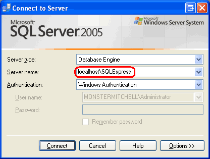

**Figure 1**: Connect to the Appropriate Database Instance

Once you ve connected, the Object Explorer window will list information about the SQL Server 2005 Express Edition database instance, including its databases, security information, management options, and so forth.

We need to attach the Northwind database in the `DataFiles` folder (or wherever you may have moved it) to the SQL Server 2005 Express Edition database instance. Right-click on the Databases folder and choose the Attach option from the context menu. This will bring up the Attach Databases dialog box. Click the Add button, drill down to the appropriate `NORTHWND.MDF` file, and click OK. At this point your screen should look similar to Figure 2.

[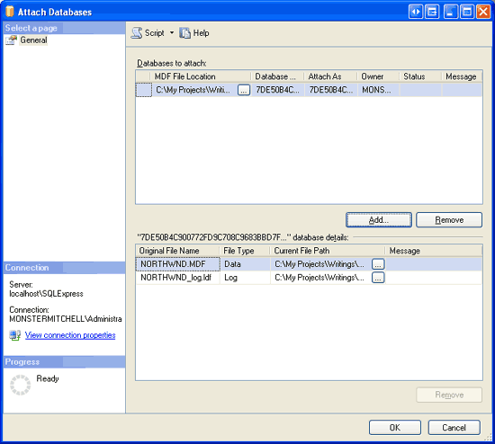](creating-stored-procedures-and-user-defined-functions-with-managed-code-cs/_static/image2.png)

**Figure 2**: Connect to the Appropriate Database Instance ([Click to view full-size image](creating-stored-procedures-and-user-defined-functions-with-managed-code-cs/_static/image4.png))

> [!NOTE]
> When connecting to the SQL Server 2005 Express Edition instance through Management Studio the Attach Databases dialog box does not allow you to drill down into user profile directories, such as My Documents. Therefore, make sure to place the `NORTHWND.MDF` and `NORTHWND_log.LDF` files in a non-user profile directory.

Click the OK button to attach the database. The Attach Databases dialog box will close and the Object Explorer should now list the just-attached database. Chances are the Northwind database has a name like `9FE54661B32FDD967F51D71D0D5145CC_LINE ARTICLES\DATATUTORIALS\VOLUME 3\CSHARP\73\ASPNET_DATA_TUTORIAL_75_CS\APP_DATA\NORTHWND.MDF`. Rename the database to Northwind by right-clicking on the database and choosing Rename.

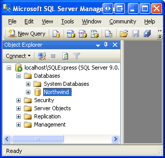

**Figure 3**: Rename the Database to Northwind

## Step 2: Creating a New Solution and SQL Server Project in Visual Studio

To create managed stored procedures or UDFs in SQL Server 2005 we will write the stored procedure and UDF logic as C# code in a class. Once the code has been written, we will need to compile this class into an assembly (a `.dll` file), register the assembly with the SQL Server database, and then create a stored procedure or UDF object in the database that points to the corresponding method in the assembly. These steps can all be performed manually. We can create the code in any text editor, compile it from the command line using the C# compiler ([`csc.exe`](https://msdn.microsoft.com/en-us/library/ms379563(vs.80).aspx)), register it with the database using the [`CREATE ASSEMBLY`](https://msdn.microsoft.com/en-us/library/ms189524.aspx) command or from Management Studio, and add the stored procedure or UDF object through similar means. Fortunately, the Professional and Team Systems versions of Visual Studio include a SQL Server Project type that automates these tasks. In this tutorial we will walk through using the SQL Server Project type to create a managed stored procedure and UDF.

> [!NOTE]
> If you are using Visual Web Developer or the Standard edition of Visual Studio, then you will have to use the manual approach instead. Step 13 provides detailed instructions for performing these steps manually. I encourage you to read Steps 2 through 12 before reading Step 13 since these steps include important SQL Server configuration instructions that must be applied regardless of what version of Visual Studio you are using.

Start by opening Visual Studio. From the File menu, choose New Project to display the New Project dialog box (see Figure 4). Drill down to the Database project type and then, from the Templates listed on the right, choose to create a new SQL Server Project. I have chosen to name this project `ManagedDatabaseConstructs` and placed it within a Solution named `Tutorial75`.

[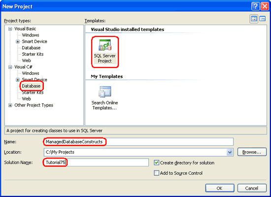](creating-stored-procedures-and-user-defined-functions-with-managed-code-cs/_static/image6.png)

**Figure 4**: Create a New SQL Server Project ([Click to view full-size image](creating-stored-procedures-and-user-defined-functions-with-managed-code-cs/_static/image8.png))

Click the OK button in the New Project dialog box to create the Solution and SQL Server Project.

A SQL Server Project is tied to a particular database. Consequently, after creating the new SQL Server Project we are immediately asked to specify this information. Figure 5 shows the New Database Reference dialog box that has been filled out to point to the Northwind database we registered in the SQL Server 2005 Express Edition database instance back in Step 1.

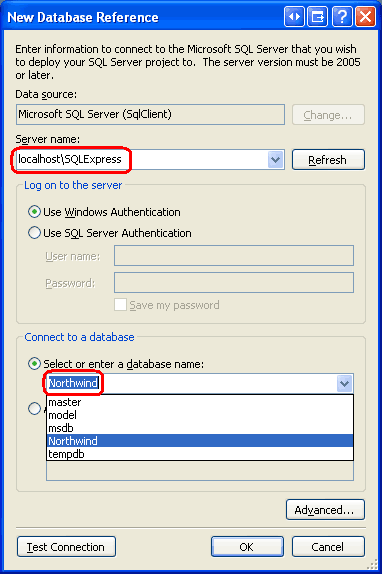

**Figure 5**: Associate the SQL Server Project with the Northwind Database

In order to debug the managed stored procedures and UDFs we will create within this project, we need to enable SQL/CLR debugging support for the connection. Whenever associating a SQL Server Project with a new database (as we did in Figure 5), Visual Studio asks us if we want to enable SQL/CLR debugging on the connection (see Figure 6). Click Yes.

**Figure 6**: Enable SQL/CLR Debugging

At this point the new SQL Server Project has been added to the Solution. It contains a folder named `Test Scripts` with a file named `Test.sql`, which is used for debugging the managed database objects created in the project. We will look at debugging in Step 12.

We can now add new managed stored procedures and UDFs to this project, but before we do let s first include our existing web application in the Solution. From the File menu select the Add option and choose Existing Web Site. Browse to the appropriate website folder and click OK. As Figure 7 shows, this will update the Solution to include two projects: the website and the `ManagedDatabaseConstructs` SQL Server Project.

**Figure 7**: The Solution Explorer Now Includes Two Projects

The `NORTHWNDConnectionString` value in `Web.config` currently references the `NORTHWND.MDF` file in the `App_Data` folder. Since we removed this database from `App_Data` and explicitly registered it in the SQL Server 2005 Express Edition database instance, we need to correspondingly update the `NORTHWNDConnectionString` value. Open the `Web.config` file in the website and change the `NORTHWNDConnectionString` value so that the connection string reads: `Data Source=localhost\SQLExpress;Initial Catalog=Northwind;Integrated Security=True`. After this change, your `<connectionStrings>` section in `Web.config` should look similar to the following:

[!code-xml[Main](creating-stored-procedures-and-user-defined-functions-with-managed-code-cs/samples/sample1.xml)]

> [!NOTE]
> As discussed in the [preceding tutorial](debugging-stored-procedures-cs.md), when debugging a SQL Server object from a client application, such as an ASP.NET website, we need to disable connection pooling. The connection string shown above disables connection pooling ( `Pooling=false` ). If you do not plan on debugging the managed stored procedures and UDFs from the ASP.NET website, enable connection pooling.

## Step 3: Creating a Managed Stored Procedure

To add a managed stored procedure to the Northwind database we first need to create the stored procedure as a method in the SQL Server Project. From the Solution Explorer, right-click on the `ManagedDatabaseConstructs` project name and choose to add a new item. This will display the Add New Item dialog box, which lists the types of managed database objects that can be added to the project. As Figure 8 shows, this includes stored procedures and User-Defined Functions, among others.

Let s start by adding a stored procedure that simply returns all of the products that have been discontinued. Name the new stored procedure file `GetDiscontinuedProducts.cs`.

[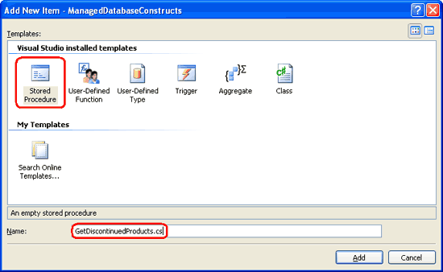](creating-stored-procedures-and-user-defined-functions-with-managed-code-cs/_static/image12.png)

**Figure 8**: Add a New Stored Procedure Named `GetDiscontinuedProducts.cs` ([Click to view full-size image](creating-stored-procedures-and-user-defined-functions-with-managed-code-cs/_static/image14.png))

This will create a new C# class file with the following content:

[!code-csharp[Main](creating-stored-procedures-and-user-defined-functions-with-managed-code-cs/samples/sample2.cs)]

Note that the stored procedure is implemented as a `static` method within a `partial` class file named `StoredProcedures`. Moreover, the `GetDiscontinuedProducts` method is decorated with the `SqlProcedure attribute`, which marks the method as a stored procedure.

The following code creates a `SqlCommand` object and sets its `CommandText` to a `SELECT` query that returns all of the columns from the `Products` table for products whose `Discontinued` field equals 1. It then executes the command and sends the results back to the client application. Add this code to the `GetDiscontinuedProducts` method.

[!code-csharp[Main](creating-stored-procedures-and-user-defined-functions-with-managed-code-cs/samples/sample3.cs)]

All managed database objects have access to a [`SqlContext` object](https://msdn.microsoft.com/en-us/library/ms131108.aspx) that represents the context of the caller. The `SqlContext` provides access to a [`SqlPipe` object](https://msdn.microsoft.com/en-us/library/microsoft.sqlserver.server.sqlpipe.aspx) via its [`Pipe` property](https://msdn.microsoft.com/en-us/library/microsoft.sqlserver.server.sqlcontext.pipe.aspx). This `SqlPipe` object is used to ferry information between the SQL Server database and the calling application. As its name implies, the [`ExecuteAndSend` method](https://msdn.microsoft.com/en-us/library/microsoft.sqlserver.server.sqlpipe.executeandsend.aspx) executes a passed-in `SqlCommand` object and sends the results back to the client application.

> [!NOTE]
> Managed database objects are best suited for stored procedures and UDFs that use procedural logic rather than set-based logic. Procedural logic involves working with sets of data on a row-by-row basis or working with scalar data. The `GetDiscontinuedProducts` method we just created, however, involves no procedural logic. Therefore, it would ideally be implemented as a T-SQL stored procedure. It is implemented as a managed stored procedure to demonstrate the steps necessary for creating and deploying managed stored procedures.

## Step 4: Deploying the Managed Stored Procedure

With this code complete, we are ready to deploy it to the Northwind database. Deploying a SQL Server Project compiles the code into an assembly, registers the assembly with the database, and creates the corresponding objects in the database, linking them to the appropriate methods in the assembly. The exact set of tasks performed by the Deploy option is more precisely spelled out in Step 13. Right-click on the `ManagedDatabaseConstructs` project name in the Solution Explorer and choose the Deploy option. However, deployment fails with the following error: Incorrect syntax near 'EXTERNAL'. You may need to set the compatibility level of the current database to a higher value to enable this feature. See help for the stored procedure `sp_dbcmptlevel`.

This error message occurs when attempting to register the assembly with the Northwind database. In order to register an assembly with a SQL Server 2005 database, the database s compatibility level must be set to 90. By default, new SQL Server 2005 databases have a compatibility level of 90. However, databases created using Microsoft SQL Server 2000 have a default compatibility level of 80. Since the Northwind database was initially a Microsoft SQL Server 2000 database, its compatibility level is currently set to 80 and therefore needs to be increased to 90 in order to register managed database objects.

To update the database s compatibility level, open a New Query window in Management Studio and enter:

[!code-sql[Main](creating-stored-procedures-and-user-defined-functions-with-managed-code-cs/samples/sample4.sql)]

Click the Execute icon in the Toolbar to run the above query.

**Figure 9**: Update the Northwind Database s Compatibility Level ([Click to view full-size image](creating-stored-procedures-and-user-defined-functions-with-managed-code-cs/_static/image17.png))

After updating the compatibility level, redeploy the SQL Server Project. This time the deployment should complete without error.

Return to SQL Server Management Studio, right-click on the Northwind database in the Object Explorer, and choose Refresh. Next, drill down into the Programmability folder and then expand the Assemblies folder. As Figure 10 shows, the Northwind database now includes the assembly generated by the `ManagedDatabaseConstructs` project.

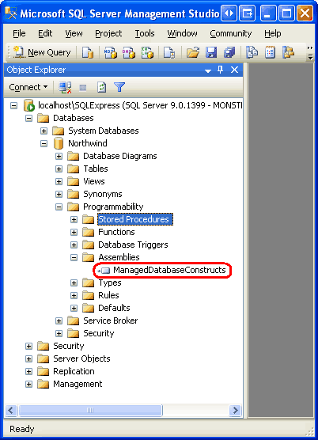

**Figure 10**: The `ManagedDatabaseConstructs` Assembly is Now Registered with the Northwind Database

Also expand the Stored Procedures folder. There you will see a stored procedure named `GetDiscontinuedProducts`. This stored procedure was created by the deployment process and points to the `GetDiscontinuedProducts` method in the `ManagedDatabaseConstructs` assembly. When the `GetDiscontinuedProducts` stored procedure is executed, it, in turn, executes the `GetDiscontinuedProducts` method. Since this is a managed stored procedure it cannot be edited through Management Studio (hence the lock icon next to the stored procedure name).

**Figure 11**: The `GetDiscontinuedProducts` Stored Procedure is Listed in the Stored Procedures Folder

There is still one more hurdle we have to overcome before we can call the managed stored procedure: the database is configured to prevent execution of managed code. Verify this by opening a new query window and executing the `GetDiscontinuedProducts` stored procedure. You will receive the following error message: Execution of user code in the .NET Framework is disabled. Enable �clr enabled configuration option.

To examine the Northwind database s configuration information, enter and execute the command `exec sp_configure` in the query window. This shows that the clr enabled setting is currently set to 0.

**Figure 12**: The clr enabled Setting is Currently Set to 0 ([Click to view full-size image](creating-stored-procedures-and-user-defined-functions-with-managed-code-cs/_static/image22.png))

Note that each configuration setting in Figure 12 has four values listed with it: the minimum and maximum values and the config and run values. To update the config value for the clr enabled setting, execute the following command:

[!code-sql[Main](creating-stored-procedures-and-user-defined-functions-with-managed-code-cs/samples/sample5.sql)]

If you re-run the `exec sp_configure` you will see that the above statement updated the clr enabled setting s config value to 1, but that the run value is still set to 0. For this configuration change to take affect we need to execute the [`RECONFIGURE` command](https://msdn.microsoft.com/en-us/library/ms176069.aspx), which will set the run value to the current config value. Simply enter `RECONFIGURE` in the query window and click the Execute icon in the Toolbar. If you run `exec sp_configure` now you should see a value of 1 for the clr enabled setting s config and run values.

With the clr enabled configuration complete, we are ready to run the managed `GetDiscontinuedProducts` stored procedure. In the query window enter and execute the command `exec` `GetDiscontinuedProducts`. Invoking the stored procedure causes the corresponding managed code in the `GetDiscontinuedProducts` method to execute. This code issues a `SELECT` query to return all products that are discontinued and returns this data to the calling application, which is SQL Server Management Studio in this instance. Management Studio receives these results and displays them in the Results window.

**Figure 13**: The `GetDiscontinuedProducts` Stored Procedure Returns All Discontinued Products ([Click to view full-size image](creating-stored-procedures-and-user-defined-functions-with-managed-code-cs/_static/image25.png))

## Step 5: Creating Managed Stored Procedures that Accept Input Parameters

Many of the queries and stored procedures we have created throughout these tutorials have used *parameters*. For example, in the [Creating New Stored Procedures for the Typed DataSet s TableAdapters](creating-new-stored-procedures-for-the-typed-dataset-s-tableadapters-cs.md) tutorial we created a stored procedure named `GetProductsByCategoryID` that accepted an input parameter named `@CategoryID`. The stored procedure then returned all products whose `CategoryID` field matched the value of the supplied `@CategoryID` parameter.

To create a managed stored procedure that accepts input parameters, simply specify those parameters in the method s definition. To illustrate this, let s add another managed stored procedure to the `ManagedDatabaseConstructs` project named `GetProductsWithPriceLessThan`. This managed stored procedure will accept an input parameter specifying a price and will return all products whose `UnitPrice` field is less than the parameter s value.

To add a new stored procedure to the project, right-click on the `ManagedDatabaseConstructs` project name and choose to add a new stored procedure. Name the file `GetProductsWithPriceLessThan.cs`. As we saw in Step 3, this will create a new C# class file with a method named `GetProductsWithPriceLessThan` placed within the `partial` class `StoredProcedures`.

Update the `GetProductsWithPriceLessThan` method s definition so that it accepts a [`SqlMoney`](https://msdn.microsoft.com/en-us/library/system.data.sqltypes.sqlmoney.aspx) input parameter named `price` and write the code to execute and return the query results:

[!code-csharp[Main](creating-stored-procedures-and-user-defined-functions-with-managed-code-cs/samples/sample6.cs)]

The `GetProductsWithPriceLessThan` method s definition and code closely resembles the definition and code of the `GetDiscontinuedProducts` method created in Step 3. The only differences are that the `GetProductsWithPriceLessThan` method accepts as input parameter (`price`), the `SqlCommand` s query includes a parameter (`@MaxPrice`), and a parameter is added to the `SqlCommand` s `Parameters` collection is and assigned the value of the `price` variable.

After adding this code, redeploy the SQL Server Project. Next, return to SQL Server Management Studio and Refresh the Stored Procedures folder. You should see a new entry, `GetProductsWithPriceLessThan`. From a query window, enter and execute the command `exec GetProductsWithPriceLessThan 25`, which will list all products less than $25, as Figure 14 shows.

**Figure 14**: Products Under $25 are Displayed ([Click to view full-size image](creating-stored-procedures-and-user-defined-functions-with-managed-code-cs/_static/image28.png))

## Step 6: Calling the Managed Stored Procedure from the Data Access Layer

At this point we have added the `GetDiscontinuedProducts` and `GetProductsWithPriceLessThan` managed stored procedures to the `ManagedDatabaseConstructs` project and have registered them with the Northwind SQL Server database. We also invoked these managed stored procedures from SQL Server Management Studio (see Figure s 13 and 14). In order for our ASP.NET application to use these managed stored procedures, however, we need to add them to the Data Access and Business Logic Layers in the architecture. In this step we will add two new methods to the `ProductsTableAdapter` in the `NorthwindWithSprocs` Typed DataSet, which was initially created in the [Creating New Stored Procedures for the Typed DataSet s TableAdapters](creating-new-stored-procedures-for-the-typed-dataset-s-tableadapters-cs.md) tutorial. In Step 7 we will add corresponding methods to the BLL.

Open the `NorthwindWithSprocs` Typed DataSet in Visual Studio and start by adding a new method to the `ProductsTableAdapter` named `GetDiscontinuedProducts`. To add a new method to a TableAdapter, right-click on the TableAdapter s name in the Designer and choose the Add Query option from the context menu.

> [!NOTE]
> Since we moved the Northwind database from the `App_Data` folder to the SQL Server 2005 Express Edition database instance, it is imperative that the corresponding connection string in Web.config be updated to reflect this change. In Step 2 we discussed updating the `NORTHWNDConnectionString` value in `Web.config`. If you forgot to make this update, then you will see the error message Failed to add query. Unable to find connection `NORTHWNDConnectionString` for object `Web.config` in a dialog box when attempting to add a new method to the TableAdapter. To resolve this error, click OK and then go to `Web.config` and update the `NORTHWNDConnectionString` value as discussed in Step 2. Then try re-adding the method to the TableAdapter. This time it should work without error.

Adding a new method launches the TableAdapter Query Configuration wizard, which we have used many times in past tutorials. The first step asks us to specify how the TableAdapter should access the database: through an ad-hoc SQL statement or via a new or existing stored procedure. Since we have already created and registered the `GetDiscontinuedProducts` managed stored procedure with the database, choose the Use existing stored procedure option and hit Next.

**Figure 15**: Choose the Use existing stored procedure Option ([Click to view full-size image](creating-stored-procedures-and-user-defined-functions-with-managed-code-cs/_static/image31.png))

The next screen prompts us for the stored procedure the method will invoke. Choose the `GetDiscontinuedProducts` managed stored procedure from the drop-down list and hit Next.

**Figure 16**: Select the `GetDiscontinuedProducts` Managed Stored Procedure ([Click to view full-size image](creating-stored-procedures-and-user-defined-functions-with-managed-code-cs/_static/image34.png))

We are then asked to specify whether the stored procedure returns rows, a single value, or nothing. Since `GetDiscontinuedProducts` returns the set of discontinued product rows, choose the first option ( Tabular data ) and click Next.

[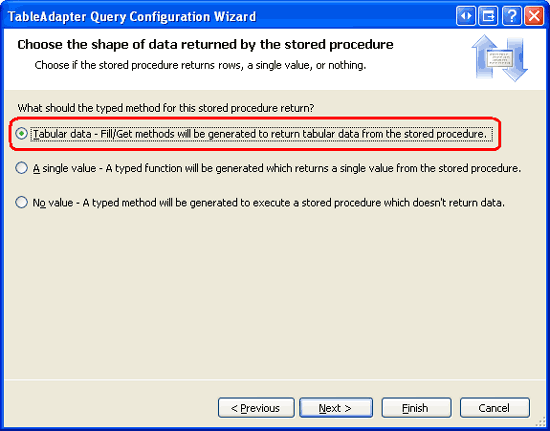](creating-stored-procedures-and-user-defined-functions-with-managed-code-cs/_static/image35.png)

**Figure 17**: Select the Tabular Data Option ([Click to view full-size image](creating-stored-procedures-and-user-defined-functions-with-managed-code-cs/_static/image37.png))

The final wizard screen allows us to specify the data access patterns used and the names of the resulting methods. Leave both checkboxes checked and name the methods `FillByDiscontinued` and `GetDiscontinuedProducts`. Click Finish to complete the wizard.

[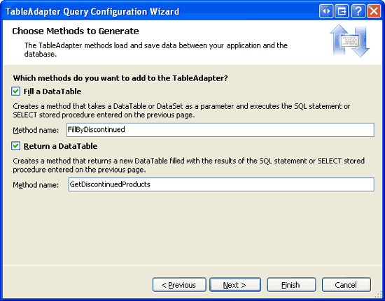](creating-stored-procedures-and-user-defined-functions-with-managed-code-cs/_static/image38.png)

**Figure 18**: Name the Methods `FillByDiscontinued` and `GetDiscontinuedProducts` ([Click to view full-size image](creating-stored-procedures-and-user-defined-functions-with-managed-code-cs/_static/image40.png))

Repeat these steps to create methods named `FillByPriceLessThan` and `GetProductsWithPriceLessThan` in the `ProductsTableAdapter` for the `GetProductsWithPriceLessThan` managed stored procedure.

Figure 19 shows a screenshot of the DataSet Designer after adding the methods to the `ProductsTableAdapter` for the `GetDiscontinuedProducts` and `GetProductsWithPriceLessThan` managed stored procedures.

**Figure 19**: The `ProductsTableAdapter` Includes the New Methods Added in this Step ([Click to view full-size image](creating-stored-procedures-and-user-defined-functions-with-managed-code-cs/_static/image43.png))

## Step 7: Adding Corresponding Methods to the Business Logic Layer

Now that we have updated the Data Access Layer to include methods for calling the managed stored procedures added in Steps 4 and 5, we need to add corresponding methods to the Business Logic Layer. Add the following two methods to the `ProductsBLLWithSprocs` class:

[!code-csharp[Main](creating-stored-procedures-and-user-defined-functions-with-managed-code-cs/samples/sample7.cs)]

Both methods simply call the corresponding DAL method and return the `ProductsDataTable` instance. The `DataObjectMethodAttribute` markup above each method causes these methods to be included in the drop-down list in the SELECT tab of the ObjectDataSource s Configure Data Source wizard.

## Step 8: Invoking the Managed Stored Procedures from the Presentation Layer

With the Business Logic and Data Access Layers augmented to include support for calling the `GetDiscontinuedProducts` and `GetProductsWithPriceLessThan` managed stored procedures, we can now display these stored procedures results through an ASP.NET page.

Open the `ManagedFunctionsAndSprocs.aspx` page in the `AdvancedDAL` folder and, from the Toolbox, drag a GridView onto the Designer. Set the GridView s `ID` property to `DiscontinuedProducts` and, from its smart tag, bind it to a new ObjectDataSource named `DiscontinuedProductsDataSource`. Configure the ObjectDataSource to pull its data from the `ProductsBLLWithSprocs` class s `GetDiscontinuedProducts` method.

**Figure 20**: Configure the ObjectDataSource to Use the `ProductsBLLWithSprocs` Class ([Click to view full-size image](creating-stored-procedures-and-user-defined-functions-with-managed-code-cs/_static/image46.png))

**Figure 21**: Choose the `GetDiscontinuedProducts` Method from the Drop-Down List in the SELECT Tab ([Click to view full-size image](creating-stored-procedures-and-user-defined-functions-with-managed-code-cs/_static/image49.png))

Since this grid will be used to just display product information, set the drop-down lists in the UPDATE, INSERT, and DELETE tabs to (None) and then click Finish.

Upon completing the wizard, Visual Studio will automatically add a BoundField or CheckBoxField for each data field in the `ProductsDataTable`. Take a moment to remove all of these fields except for `ProductName` and `Discontinued`, at which point your GridView and ObjectDataSource s declarative markup should look similar to the following:

[!code-aspx[Main](creating-stored-procedures-and-user-defined-functions-with-managed-code-cs/samples/sample8.aspx)]

Take a moment to view this page through a browser. When the page is visited, the ObjectDataSource calls the `ProductsBLLWithSprocs` class s `GetDiscontinuedProducts` method. As we saw in Step 7, this method calls down to the DAL s `ProductsDataTable` class s `GetDiscontinuedProducts` method, which invokes the `GetDiscontinuedProducts` stored procedure. This stored procedure is a managed stored procedure and executes the code we created in Step 3, returning the discontinued products.

The results returned by the managed stored procedure are packaged up into a `ProductsDataTable` by the DAL and then returned to the BLL, which then returns them to the Presentation Layer where they are bound to the GridView and displayed. As expected, the grid lists those products that have been discontinued.

**Figure 22**: The Discontinued Products are Listed ([Click to view full-size image](creating-stored-procedures-and-user-defined-functions-with-managed-code-cs/_static/image52.png))

For further practice, add a TextBox and another GridView to the page. Have this GridView display the products less than the amount entered into the TextBox by calling the `ProductsBLLWithSprocs` class s `GetProductsWithPriceLessThan` method.

## Step 9: Creating and Calling T-SQL UDFs

User-Defined Functions, or UDFs, are database objects the closely mimic the semantics of functions in programming languages. Like a function in C#, UDFs can include a variable number of input parameters and return a value of a particular type. A UDF can return either scalar data - a string, an integer, and so forth - or tabular data. Let s take a quick look at both types of UDFs, starting with a UDF that returns a scalar data type.

The following UDF calculates the estimated value of the inventory for a particular product. It does so by taking in three input parameters - the `UnitPrice`, `UnitsInStock`, and `Discontinued` values for a particular product - and returns a value of type `money`. It computes the estimated value of the inventory by multiplying the `UnitPrice` by the `UnitsInStock`. For discontinued items, this value is halved.

[!code-sql[Main](creating-stored-procedures-and-user-defined-functions-with-managed-code-cs/samples/sample9.sql)]

Once this UDF has been added to the database, it can be found through Management Studio by expanding the Programmability folder, then Functions, and then Scalar-value Functions. It can be used in a `SELECT` query like so:

[!code-sql[Main](creating-stored-procedures-and-user-defined-functions-with-managed-code-cs/samples/sample10.sql)]

I have added the `udf_ComputeInventoryValue` UDF to the Northwind database; Figure 23 shows the output of the above `SELECT` query when viewed through Management Studio. Also note that the UDF is listed under the Scalar-value Functions folder in the Object Explorer.

[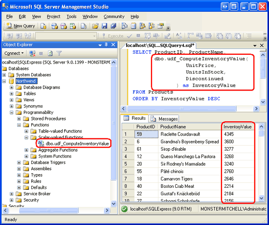](creating-stored-procedures-and-user-defined-functions-with-managed-code-cs/_static/image53.png)

**Figure 23**: Each Product s Inventory Values is Listed ([Click to view full-size image](creating-stored-procedures-and-user-defined-functions-with-managed-code-cs/_static/image55.png))

UDFs can also return tabular data. For example, we can create a UDF that returns products that belong to a particular category:

[!code-sql[Main](creating-stored-procedures-and-user-defined-functions-with-managed-code-cs/samples/sample11.sql)]

The `udf_GetProductsByCategoryID` UDF accepts a `@CategoryID` input parameter and returns the results of the specified `SELECT` query. Once created, this UDF can be referenced in the `FROM` (or `JOIN`) clause of a `SELECT` query. The following example would return the `ProductID`, `ProductName`, and `CategoryID` values for each of the beverages.

[!code-sql[Main](creating-stored-procedures-and-user-defined-functions-with-managed-code-cs/samples/sample12.sql)]

I have added the `udf_GetProductsByCategoryID` UDF to the Northwind database; Figure 24 shows the output of the above `SELECT` query when viewed through Management Studio. UDFs that return tabular data can be found in the Object Explorer s Table-value Functions folder.

**Figure 24**: The `ProductID`, `ProductName`, and `CategoryID` are Listed for Each Beverage ([Click to view full-size image](creating-stored-procedures-and-user-defined-functions-with-managed-code-cs/_static/image58.png))

> [!NOTE]
> For more information on creating and using UDFs, check out [Intro to User-Defined Functions](http://www.sqlteam.com/item.asp?ItemID=1955). Also check out [Advantages and Drawbacks of User-Defined Functions](http://www.samspublishing.com/articles/article.asp?p=31724&amp;rl=1).

## Step 10: Creating a Managed UDF

The `udf_ComputeInventoryValue` and `udf_GetProductsByCategoryID` UDFs created in the above examples are T-SQL database objects. SQL Server 2005 also supports managed UDFs, which can be added to the `ManagedDatabaseConstructs` project just like the managed stored procedures from Steps 3 and 5. For this step, let s implement the `udf_ComputeInventoryValue` UDF in managed code.

To add a managed UDF to the `ManagedDatabaseConstructs` project, right-click on the project name in Solution Explorer and choose to Add a New Item. Select the User-Defined Template from the Add New Item dialog box and name the new UDF file `udf_ComputeInventoryValue_Managed.cs`.

[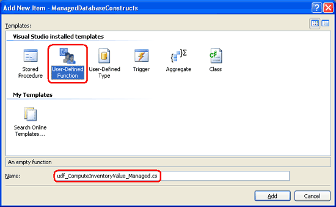](creating-stored-procedures-and-user-defined-functions-with-managed-code-cs/_static/image59.png)

**Figure 25**: Add a New Managed UDF to the `ManagedDatabaseConstructs` Project ([Click to view full-size image](creating-stored-procedures-and-user-defined-functions-with-managed-code-cs/_static/image61.png))

The User-Defined Function template creates a `partial` class named `UserDefinedFunctions` with a method whose name is the same as the class file s name (`udf_ComputeInventoryValue_Managed`, in this instance). This method is decorated using the [`SqlFunction` attribute](https://msdn.microsoft.com/en-us/library/microsoft.sqlserver.server.sqlfunctionattribute.aspx), which flags the method as a managed UDF.

[!code-csharp[Main](creating-stored-procedures-and-user-defined-functions-with-managed-code-cs/samples/sample13.cs)]

The `udf_ComputeInventoryValue` method currently returns a [`SqlString` object](https://msdn.microsoft.com/en-us/library/system.data.sqltypes.sqlstring.aspx) and does not accept any input parameters. We need to update the method definition so that it accepts three input parameters - `UnitPrice`, `UnitsInStock`, and `Discontinued` - and returns a `SqlMoney` object. The logic for calculating the inventory value is identical to that in the T-SQL `udf_ComputeInventoryValue` UDF.

[!code-csharp[Main](creating-stored-procedures-and-user-defined-functions-with-managed-code-cs/samples/sample14.cs)]

Note that the UDF method s input parameters are of their corresponding SQL types: `SqlMoney` for the `UnitPrice` field, [`SqlInt16`](https://msdn.microsoft.com/en-us/library/system.data.sqltypes.sqlint16.aspx) for `UnitsInStock`, and [`SqlBoolean`](https://msdn.microsoft.com/en-us/library/system.data.sqltypes.sqlboolean.aspx) for `Discontinued`. These data types reflect the types defined in the `Products` table: the `UnitPrice` column is of type `money`, the `UnitsInStock` column of type `smallint`, and the `Discontinued` column of type `bit`.

The code starts by creating a `SqlMoney` instance named `inventoryValue` that is assigned a value of 0. The `Products` table allows for database `NULL` values in the `UnitsInPrice` and `UnitsInStock` columns. Therefore, we need to first check to see if these values contain `NULL` s, which we do through the `SqlMoney` object s [`IsNull` property](https://msdn.microsoft.com/en-us/library/system.data.sqltypes.sqlmoney.isnull.aspx). If both `UnitPrice` and `UnitsInStock` contain non-`NULL` values, then we compute the `inventoryValue` to be the product of the two. Then, if `Discontinued` is true, then we halve the value.

> [!NOTE]
> The `SqlMoney` object only allows two `SqlMoney` instances to be multiplied together. It does not allow a `SqlMoney` instance to be multiplied by a literal floating-point number. Therefore, to halve `inventoryValue` we multiply it by a new `SqlMoney` instance that has the value 0.5.

## Step 11: Deploying the Managed UDF

Now that that the managed UDF has been created, we are ready to deploy it to the Northwind database. As we saw in Step 4, the managed objects in a SQL Server Project are deployed by right-clicking on the project name in the Solution Explorer and choosing the Deploy option from the context menu.

Once you have deployed the project, return to SQL Server Management Studio and refresh the Scalar-valued Functions folder. You should now see two entries:

- `dbo.udf_ComputeInventoryValue` - the T-SQL UDF created in Step 9, and
- `dbo.udf ComputeInventoryValue_Managed` - the managed UDF created in Step 10 that was just deployed.

To test this managed UDF, execute the following query from within Management Studio:

[!code-sql[Main](creating-stored-procedures-and-user-defined-functions-with-managed-code-cs/samples/sample15.sql)]

This command uses the managed `udf ComputeInventoryValue_Managed` UDF instead of the T-SQL `udf_ComputeInventoryValue` UDF, but the output is the same. Refer back to Figure 23 to see a screenshot of the UDF s output.

## Step 12: Debugging the Managed Database Objects

In the [Debugging Stored Procedures](debugging-stored-procedures-cs.md) tutorial we discussed the three options for debugging SQL Server through Visual Studio: Direct Database Debugging, Application Debugging, and Debugging from a SQL Server Project. Managed database objects cannot be debugged via Direct Database Debugging, but can be debugged from a client application and directly from the SQL Server Project. In order for debugging to work, however, the SQL Server 2005 database must allow SQL/CLR debugging. Recall that when we first created the `ManagedDatabaseConstructs` project Visual Studio asked us whether we wanted to enable SQL/CLR debugging (see Figure 6 in Step 2). This setting can be modified by right-clicking on the database from the Server Explorer window.

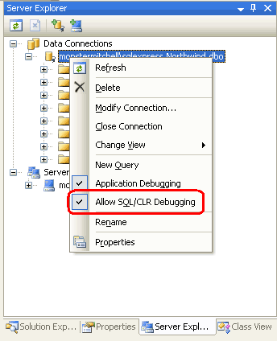

**Figure 26**: Ensure that the Database Allows SQL/CLR Debugging

Imagine that we wanted to debug the `GetProductsWithPriceLessThan` managed stored procedure. We would start by setting a breakpoint within the code of the `GetProductsWithPriceLessThan` method.

[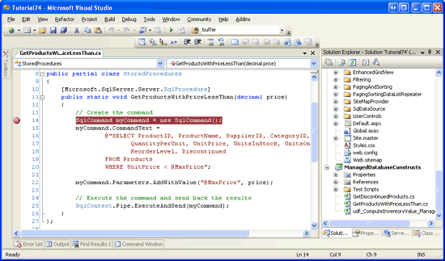](creating-stored-procedures-and-user-defined-functions-with-managed-code-cs/_static/image63.png)

**Figure 27**: Set a Breakpoint in the `GetProductsWithPriceLessThan` Method ([Click to view full-size image](creating-stored-procedures-and-user-defined-functions-with-managed-code-cs/_static/image65.png))

Let s first look at debugging the managed database objects from the SQL Server Project. Since our Solution includes two projects - the `ManagedDatabaseConstructs` SQL Server Project along with our website - in order to debug from the SQL Server Project we need to instruct Visual Studio to launch the `ManagedDatabaseConstructs` SQL Server Project when we start debugging. Right-click the `ManagedDatabaseConstructs` project in Solution Explorer and choose the Set as StartUp Project option from the context menu.

When the `ManagedDatabaseConstructs` project is launched from the debugger it executes the SQL statements in the `Test.sql` file, which is located in the `Test Scripts` folder. For example, to test the `GetProductsWithPriceLessThan` managed stored procedure, replace the existing `Test.sql` file content with the following statement, which invokes the `GetProductsWithPriceLessThan` managed stored procedure passing in the `@CategoryID` value of 14.95:

[!code-sql[Main](creating-stored-procedures-and-user-defined-functions-with-managed-code-cs/samples/sample16.sql)]

Once you ve entered the above script into `Test.sql`, start debugging by going to the Debug menu and choosing Start Debugging or by hitting F5 or the green play icon in the Toolbar. This will build the projects within the Solution, deploy the managed database objects to the Northwind database, and then execute the `Test.sql` script. At this point, the breakpoint will be hit and we can step through the `GetProductsWithPriceLessThan` method, examine the values of the input parameters, and so on.

[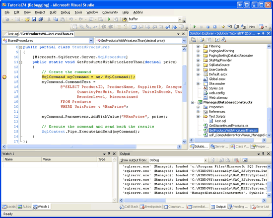](creating-stored-procedures-and-user-defined-functions-with-managed-code-cs/_static/image66.png)

**Figure 28**: The Breakpoint in the `GetProductsWithPriceLessThan` Method Was Hit ([Click to view full-size image](creating-stored-procedures-and-user-defined-functions-with-managed-code-cs/_static/image68.png))

In order for a SQL database object to be debugged through a client application, it is imperative that the database be configured to support application debugging. Right-click on the database in Server Explorer and ensure that the Application Debugging option is checked. Furthermore, we need to configure the ASP.NET application to integrate with the SQL Debugger and to disable connection pooling. These steps were discussed in detail in Step 2 of the [Debugging Stored Procedures](debugging-stored-procedures-cs.md) tutorial.

Once you have configured the ASP.NET application and database, set the ASP.NET website as the startup project and start debugging. If you visit a page that calls one of the managed objects that has a breakpoint, the application will halt and control will be turned over to the debugger, where you can step through the code as shown in Figure 28.

## Step 13: Manually Compiling and Deploying Managed Database Objects

SQL Server Projects make it easy to create, compile, and deploy managed database objects. Unfortunately, SQL Server Projects are only available in the Professional and Team Systems editions of Visual Studio. If you are using Visual Web Developer or the Standard Edition of Visual Studio and want to use managed database objects, you will need to manually create and deploy them. This involves four steps:

1. Create a file that contains the source code for the managed database object,
2. Compile the object into an assembly,
3. Register the assembly with the SQL Server 2005 database, and
4. Create a database object in SQL Server that points to the appropriate method in the assembly.

To illustrate these tasks, let s create a new managed stored procedure that returns those products whose `UnitPrice` is greater than a specified value. Create a new file on your computer named `GetProductsWithPriceGreaterThan.cs` and enter the following code into the file (you can use Visual Studio, Notepad, or any text editor to accomplish this):

[!code-csharp[Main](creating-stored-procedures-and-user-defined-functions-with-managed-code-cs/samples/sample17.cs)]

This code is nearly identical to that of the `GetProductsWithPriceLessThan` method created in Step 5. The only differences are the method names, the `WHERE` clause, and the parameter name used in the query. Back in the `GetProductsWithPriceLessThan` method, the `WHERE` clause read: `WHERE UnitPrice < @MaxPrice`. Here, in `GetProductsWithPriceGreaterThan`, we use: `WHERE UnitPrice > @MinPrice` .

We now need to compile this class into an assembly. From the command line, navigate to the directory where you saved the `GetProductsWithPriceGreaterThan.cs` file and use the C# compiler (`csc.exe`) to compile the class file into an assembly:

[!code-console[Main](creating-stored-procedures-and-user-defined-functions-with-managed-code-cs/samples/sample18.cmd)]

If the folder containing `csc.exe` in not in the system s `PATH`, you will have to fully reference its path, `%WINDOWS%\Microsoft.NET\Framework\version\`, like so:

[!code-console[Main](creating-stored-procedures-and-user-defined-functions-with-managed-code-cs/samples/sample19.cmd)]

[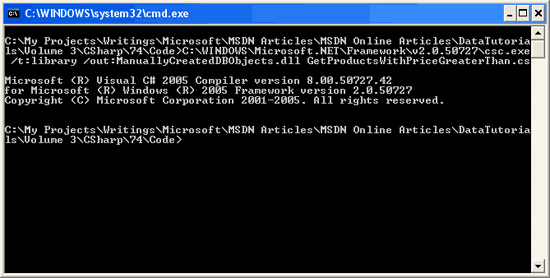](creating-stored-procedures-and-user-defined-functions-with-managed-code-cs/_static/image69.png)

**Figure 29**: Compile `GetProductsWithPriceGreaterThan.cs` Into an Assembly ([Click to view full-size image](creating-stored-procedures-and-user-defined-functions-with-managed-code-cs/_static/image71.png))

The `/t` flag specifies that the C# class file should be compiled into a DLL (rather than an executable). The `/out` flag specifies the name of the resulting assembly.

> [!NOTE]
> Rather than compiling the `GetProductsWithPriceGreaterThan.cs` class file from the command line you could alternatively use [Visual C# Express Edition](https://msdn.microsoft.com/vstudio/express/visualcsharp/) or create a separate Class Library project in Visual Studio Standard Edition. S ren Jacob Lauritsen has kindly provided such a Visual C# Express Edition project with code for the `GetProductsWithPriceGreaterThan` stored procedure and the two managed stored procedures and UDF created in Steps 3, 5, and 10. S ren s project also includes the T-SQL commands needed to add the corresponding database objects.

With the code compiled into an assembly, we are ready to register the assembly within the SQL Server 2005 database. This can be performed through T-SQL, using the command `CREATE ASSEMBLY`, or through SQL Server Management Studio. Let s focus on using Management Studio.

From Management Studio, expand the Programmability folder in the Northwind database. One of its subfolder is Assemblies. To manually add a new Assembly to the database, right-click on the Assemblies folder and choose New Assembly from the context menu. This displays the New Assembly dialog box (see Figure 30). Click on the Browse button, select the `ManuallyCreatedDBObjects.dll` assembly we just compiled, and then click OK to add the Assembly to the database. You should not see the `ManuallyCreatedDBObjects.dll` assembly in the Object Explorer.

[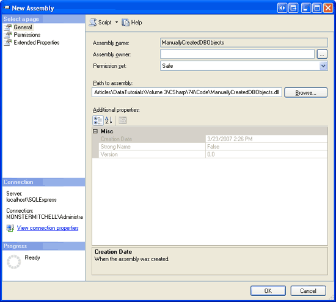](creating-stored-procedures-and-user-defined-functions-with-managed-code-cs/_static/image72.png)

**Figure 30**: Add the `ManuallyCreatedDBObjects.dll` Assembly to the Database ([Click to view full-size image](creating-stored-procedures-and-user-defined-functions-with-managed-code-cs/_static/image74.png))

**Figure 31**: The `ManuallyCreatedDBObjects.dll` is Listed in the Object Explorer

While we have added the assembly to the Northwind database, we have yet to associate a stored procedure with the `GetProductsWithPriceGreaterThan` method in the assembly. To accomplish this, open a new query window and execute the following script:

[!code-sql[Main](creating-stored-procedures-and-user-defined-functions-with-managed-code-cs/samples/sample20.sql)]

This creates a new stored procedure in the Northwind database named `GetProductsWithPriceGreaterThan` and associates it with the managed method `GetProductsWithPriceGreaterThan` (which is in the class `StoredProcedures`, which is in the assembly `ManuallyCreatedDBObjects`).

After executing the above script, refresh the Stored Procedures folder in the Object Explorer. You should see a new stored procedure entry - `GetProductsWithPriceGreaterThan` - which has a lock icon next to it. To test this stored procedure, enter and execute the following script in the query window:

[!code-sql[Main](creating-stored-procedures-and-user-defined-functions-with-managed-code-cs/samples/sample21.sql)]

As Figure 32 shows, the above command displays information for those products with a `UnitPrice` greater than $24.95.

**Figure 32**: The `ManuallyCreatedDBObjects.dll` is Listed in the Object Explorer ([Click to view full-size image](creating-stored-procedures-and-user-defined-functions-with-managed-code-cs/_static/image78.png))

## Summary

Microsoft SQL Server 2005 provides integration with the Common Language Runtime (CLR), which allows database objects to be created using managed code. Previously, these database objects could only be created using T-SQL, but now we can create these objects using .NET programming languages like C#. In this tutorial we created two managed stored procedures and a managed User-Defined Function.

Visual Studio s SQL Server Project type facilitates creating, compiling, and deploying managed database objects. Moreover, it offers rich debugging support. However, SQL Server Project types are only available in the Professional and Team Systems editions of Visual Studio. For those using Visual Web Developer or the Standard Edition of Visual Studio, the creation, compilation, and deployment steps must be performed manually, as we saw in Step 13.

Happy Programming!

## Further Reading

For more information on the topics discussed in this tutorial, refer to the following resources:

- [Advantages and Drawbacks of User-Defined Functions](http://www.samspublishing.com/articles/article.asp?p=31724&amp;rl=1)
- [Creating SQL Server 2005 Objects in Managed Code](https://channel9.msdn.com/Showpost.aspx?postid=142413)
- [Creating Triggers Using Managed Code in SQL Server 2005](http://www.15seconds.com/issue/041006.htm)
- [How To: Create and Run a CLR SQL Server Stored Procedure](https://msdn.microsoft.com/en-us/library/5czye81z(VS.80).aspx)
- [How To: Create and Run a CLR SQL Server User-Defined Function](https://msdn.microsoft.com/en-us/library/w2kae45k(VS.80).aspx)
- [How To: Edit the `Test.sql` Script to Run SQL Objects](https://msdn.microsoft.com/en-us/library/ms233682(VS.80).aspx)
- [Intro to User Defined Functions](http://www.sqlteam.com/item.asp?ItemID=1955)
- [Managed Code and SQL Server 2005 (Video)](https://channel9.msdn.com/Showpost.aspx?postid=142413)
- [Transact-SQL Reference](https://msdn.microsoft.com/en-us/library/aa299742(SQL.80).aspx)
- [Walkthrough: Creating a Stored Procedure in Managed Code](https://msdn.microsoft.com/en-us/library/zxsa8hkf(VS.80).aspx)

## About the Author

[Scott Mitchell](http://www.4guysfromrolla.com/ScottMitchell.shtml), author of seven ASP/ASP.NET books and founder of [4GuysFromRolla.com](http://www.4guysfromrolla.com), has been working with Microsoft Web technologies since 1998. Scott works as an independent consultant, trainer, and writer. His latest book is [*Sams Teach Yourself ASP.NET 2.0 in 24 Hours*](https://www.amazon.com/exec/obidos/ASIN/0672327384/4guysfromrollaco). He can be reached at [mitchell@4GuysFromRolla.com.](mailto:mitchell@4GuysFromRolla.com) or via his blog, which can be found at [http://ScottOnWriting.NET](http://ScottOnWriting.NET).

## Special Thanks To

This tutorial series was reviewed by many helpful reviewers. Lead reviewer for this tutorial was S ren Jacob Lauritsen. In addition to reviewing this article, S ren also created the Visual C# Express Edition project included in this article s download for manually compiling the managed database objects. Interested in reviewing my upcoming MSDN articles? If so, drop me a line at [mitchell@4GuysFromRolla.com.](mailto:mitchell@4GuysFromRolla.com)

>[!div class="step-by-step"]
[Previous](debugging-stored-procedures-cs.md)
[Next](creating-new-stored-procedures-for-the-typed-dataset-s-tableadapters-vb.md)