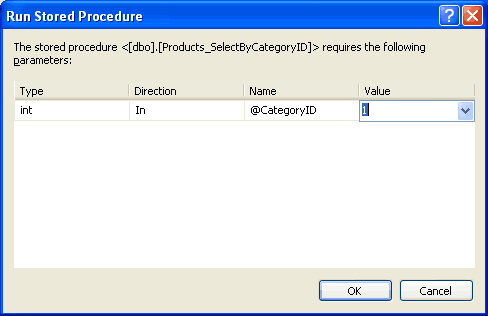
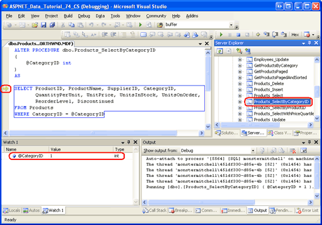
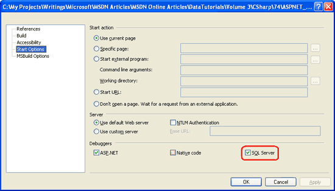
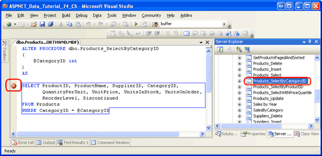
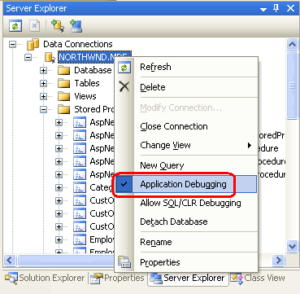
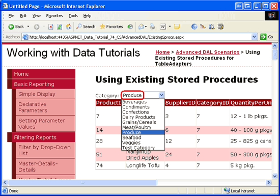

Debugging Stored Procedures (C#)
====================
by [Scott Mitchell](https://twitter.com/ScottOnWriting)

[Download Code](http://download.microsoft.com/download/3/9/f/39f92b37-e92e-4ab3-909e-b4ef23d01aa3/ASPNET_Data_Tutorial_74_CS.zip) or [Download PDF](debugging-stored-procedures-cs/_static/datatutorial74cs1.pdf)

> Visual Studio Professional and Team System editions allow you to set breakpoints and step in to stored procedures within SQL Server, making debugging stored procedures as easy as debugging application code. This tutorial demonstrates direct database debugging and application debugging of stored procedures.

## Introduction

Visual Studio provides a rich debugging experience. With a few keystrokes or clicks of the mouse, it s possible to use breakpoints to stop execution of a program and examine its state and control flow. Along with debugging application code, Visual Studio offers support for debugging stored procedures from within SQL Server. Just like breakpoints can be set within the code of an ASP.NET code-behind class or Business Logic Layer class, so too can they be placed within stored procedures.

In this tutorial we will look at stepping into stored procedures from the Server Explorer within Visual Studio as well as how to set breakpoints that are hit when the stored procedure is called from the running ASP.NET application.

> [!NOTE]
> Unfortunately, stored procedures can only be stepped into and debugged through the Professional and Team Systems versions of Visual Studio. If you are using Visual Web Developer or the standard version of Visual Studio, you are welcome to read along as we walk through the steps necessary to debug stored procedures, but you will not be able to replicate these steps on your machine.

## SQL Server Debugging Concepts

Microsoft SQL Server 2005 was designed to provide integration with the [Common Language Runtime (CLR)](https://msdn.microsoft.com/en-us/netframework/aa497266.aspx), which is the runtime used by all .NET assemblies. Consequently, SQL Server 2005 supports managed database objects. That is, you can create database objects like stored procedures and User-Defined Functions (UDFs) as methods in a C# class. This enables these stored procedures and UDFs to utilize functionality in the .NET Framework and from your own custom classes. Of course, SQL Server 2005 also provides support for T-SQL database objects.

SQL Server 2005 offers debugging support for both T-SQL and managed database objects. However, these objects can only be debugged through Visual Studio 2005 Professional and Team Systems editions. In this tutorial we will examine debugging T-SQL database objects. The subsequent tutorial looks at debugging managed database objects.

The [Overview of T-SQL and CLR Debugging in SQL Server 2005](https://blogs.msdn.com/sqlclr/archive/2006/06/29/651644.aspx) blog entry from the [SQL Server 2005 CLR Integration team](https://blogs.msdn.com/sqlclr/default.aspx) highlights the three ways to debug SQL Server 2005 objects from Visual Studio:

- **Direct Database Debugging (DDD)** - from Server Explorer we can step into any T-SQL database object, such as stored procedures and UDFs. We will examine DDD in Step 1.
- **Application Debugging** - we can set breakpoints within a database object and then run our ASP.NET application. When the database object is executed, the breakpoint will be hit and control turned over to the debugger. Note that with application debugging we cannot step into a database object from application code. We must explicitly set breakpoints in those stored procedures or UDFs where we want the debugger to stop. Application debugging is examined starting in Step 2.
- **Debugging from a SQL Server Project** - Visual Studio Professional and Team Systems editions include a SQL Server Project type that is commonly used to create managed database objects. We will examine using SQL Server Projects and debugging their contents in the next tutorial.

Visual Studio can debug stored procedures on local and remote SQL Server instances. A local SQL Server instance is one that is installed on the same machine as Visual Studio. If the SQL Server database you are using is not located on your development machine, then it is considered a remote instance. For these tutorials we have been using local SQL Server instances. Debugging stored procedures on a remote SQL server instance requires more configuration steps than when debugging stored procedures on a local instance.

If you are using a local SQL Server instance, you can start with Step 1 and work through this tutorial to the end. If you are using a remote SQL Server instance, however, you will first need to ensure that when debugging you are logged to your development machine with a Windows user account that has a SQL Server login on the remote instance. Moveover, both this database login and the database login used to connect to the database from the running ASP.NET application must be members of the `sysadmin` role. See the Debugging T-SQL Database Objects on Remote Instances section at the end of this tutorial for more information on configuring Visual Studio and SQL Server to debug a remote instance.

Finally, understand that debugging support for T-SQL database objects is not as feature rich as debugging support for .NET applications. For example, breakpoint conditions and filters are not supported, only a subset of the debugging windows are available, you cannot use Edit and Continue, the Immediate window is rendered useless, and so forth. See [Limitations on Debugger Commands and Features](https://msdn.microsoft.com/en-us/library/ms165035(VS.80).aspx) for more information.

## Step 1: Directly Stepping Into a Stored Procedure

Visual Studio makes it easy to directly debug a database object. Let s look at how to use the Direct Database Debugging (DDD) feature to step into the `Products_SelectByCategoryID` stored procedure in the Northwind database. As its name implies, `Products_SelectByCategoryID` returns product information for a particular category; it was created in the [Using Existing Stored Procedures for the Typed DataSet s TableAdapters](using-existing-stored-procedures-for-the-typed-dataset-s-tableadapters-cs.md) tutorial. Start by going to the Server Explorer and expand the Northwind database node. Next, drill down into the Stored Procedures folder, right-click on the `Products_SelectByCategoryID` stored procedure, and choose the Step Into Stored Procedure option from the context menu. This will start the debugger.

Since the `Products_SelectByCategoryID` stored procedure expects a `@CategoryID` input parameter, we are asked to provide this value. Enter 1, which will return information about the beverages.

**Figure 1**: Use the Value 1 for the `@CategoryID` Parameter

After supplying the value for the `@CategoryID` parameter, the stored procedure is executed. Rather than running to completion, though, the debugger halts execution on the first statement. Note the yellow arrow in the margin, indicating the current location in the stored procedure. You can view and edit parameter values through the Watch window or by hovering over the parameter name in the stored procedure.

**Figure 2**: The Debugger has Halted on the First Statement of the Stored Procedure ([Click to view full-size image](debugging-stored-procedures-cs/_static/image4.png))

To step through the stored procedure one statement at a time, click the Step Over button in the Toolbar or hit the F10 key. The `Products_SelectByCategoryID` stored procedure contains a single `SELECT` statement, so hitting F10 will Step over the single statement and complete the execution of the stored procedure. After the stored procedure has completed, its output will appear in the Output window and the debugger will terminate.

> [!NOTE]
> T-SQL debugging occurs at the statement level; you cannot Step into a `SELECT` statement.

## Step 2: Configuring the Website for Application Debugging

While debugging a stored procedure directly from the Server Explorer is handy, in many scenarios we are more interested in debugging the stored procedure when it is called from our ASP.NET application. We can add breakpoints to a stored procedure from within Visual Studio and then start debugging the ASP.NET application. When a stored procedure with breakpoints is invoked from the application, execution will halt at the breakpoint and we can view and change the stored procedure s parameter values and step through its statements, just like we did in Step 1.

Before we can start debugging stored procedures called from the application, we need to instruct the ASP.NET web application to integrate with the SQL Server debugger. Start by right-clicking on the website name in the Solution Explorer (`ASPNET_Data_Tutorial_74_CS`). Choose the Property Pages option from the context menu, select the Start Options item on the left, and check the SQL Server checkbox in the Debuggers section (see Figure 3).

**Figure 3**: Check the SQL Server Checkbox in the Application s Property Pages ([Click to view full-size image](debugging-stored-procedures-cs/_static/image7.png))

Additionally, we need to update the database connection string used by the application so that connection pooling is disabled. When a connection to a database is closed, the corresponding `SqlConnection` object is placed in a pool of available connections. When establishing a connection to a database, an available connection object can be retrieved from this pool rather than having to create and establish a new connection. This pooling of connection objects is a performance enhancement and is enabled by default. However, when debugging we want to turn off connection pooling because the debugging infrastructure is not correctly reestablished when working with a connection that was taken from the pool.

To disabled connection pooling, update the `NORTHWNDConnectionString` in `Web.config` so that it includes the setting `Pooling=false` .

[!code-xml[Main](debugging-stored-procedures-cs/samples/sample1.xml)]

> [!NOTE]
> Once you have finished debugging SQL Server through the ASP.NET application be sure to reinstate connection pooling by removing the `Pooling` setting from the connection string (or by setting it to `Pooling=true` ).

At this point the ASP.NET application has been configured to allow Visual Studio to debug SQL Server database objects when invoked through the web application. All that remains now is to add a breakpoint to a stored procedure and start debugging!

## Step 3: Adding a Breakpoint and Debugging

Open the `Products_SelectByCategoryID` stored procedure and set a breakpoint at the start of the `SELECT` statement by clicking in the margin at the appropriate place or by placing your cursor at the start of the `SELECT` statement and hitting F9. As Figure 4 illustrates, the breakpoint appears as a red circle in the margin.

**Figure 4**: Set a Breakpoint in the `Products_SelectByCategoryID` Stored Procedure ([Click to view full-size image](debugging-stored-procedures-cs/_static/image10.png))

In order for a SQL database object to be debugged through a client application, it is imperative that the database be configured to support application debugging. When you first set a breakpoint, this setting should automatically be switched on, but it is prudent to double-check. Right-click on the `NORTHWND.MDF` node in the Server Explorer. The context menu should include a checked menu item named Application Debugging .

**Figure 5**: Ensure that the Application Debugging Option is Enabled

With the breakpoint set and the Application Debugging option enabled, we are ready to debug the stored procedure when called from the ASP.NET application. Start the debugger by going to the Debug menu and choosing Start Debugging, by hitting F5, or by clicking the green play icon in the Toolbar. This will start the debugger and launch the website.

The `Products_SelectByCategoryID` stored procedure was created in the [Using Existing Stored Procedures for the Typed DataSet s TableAdapters](using-existing-stored-procedures-for-the-typed-dataset-s-tableadapters-cs.md) tutorial. Its corresponding web page (`~/AdvancedDAL/ExistingSprocs.aspx`) contains a GridView that displays the results returned by this stored procedure. Visit this page through the browser. Upon reaching the page, the breakpoint in the `Products_SelectByCategoryID` stored procedure will be hit and control returned to Visual Studio. Just like in Step 1, you can step through the stored procedure s statements and view and modify the parameter values.

**Figure 6**: The `ExistingSprocs.aspx` Page Initially Displays the Beverages ([Click to view full-size image](debugging-stored-procedures-cs/_static/image14.png))

**Figure 7**: The Stored Procedure s Breakpoint has been Reached ([Click to view full-size image](debugging-stored-procedures-cs/_static/image17.png))

As the Watch window in Figure 7 shows, the value of the `@CategoryID` parameter is 1. This is because the `ExistingSprocs.aspx` page initially displays products in the beverages category, which has a `CategoryID` value of 1. Choose a different category from the drop-down list. Doing so causes a postback and re-executes the `Products_SelectByCategoryID` stored procedure. The breakpoint is hit again, but this time the `@CategoryID` parameter s value reflects the selected drop-down list item s `CategoryID`.

**Figure 8**: Choose a Different Category from the Drop-Down List ([Click to view full-size image](debugging-stored-procedures-cs/_static/image20.png))

**Figure 9**: The `@CategoryID` Parameter Reflects the Category Selected from the Web Page ([Click to view full-size image](debugging-stored-procedures-cs/_static/image23.png))

> [!NOTE]
> If the breakpoint in the `Products_SelectByCategoryID` stored procedure is not hit when visiting the `ExistingSprocs.aspx` page, make sure that the SQL Server checkbox has been checked in the Debuggers section of the ASP.NET application s Properties Page, that connection pooling has been disabled, and that the database s Application Debugging option is enabled. If you re still having problems, restart Visual Studio and try again.

## Debugging T-SQL Database Objects on Remote Instances

Debugging database objects through Visual Studio is fairly straightforward when the SQL Server database instance is on the same machine as Visual Studio. However, if SQL Server and Visual Studio reside on different machines then some careful configuration is required to get everything working properly. There are two core tasks we are faced with:

- Ensure that the login used to connect to the database via ADO.NET belongs to the `sysadmin` role.
- Ensure that the Windows user account used by Visual Studio on the development machine is a valid SQL Server login account that belongs to the `sysadmin` role.

The first step is relatively straightforward. First, identify the user account used to connect to the database from the ASP.NET application and then, from SQL Server Management Studio, add that login account to the `sysadmin` role.

The second task requires that the Windows user account you use to debug the application be a valid login on the remote database. However, chances are the Windows account you logged on to your workstation with is not a valid login on SQL Server. Rather than adding your particular login account to SQL Server, a better choice would be to designate some Windows user account as the SQL Server debugging account. Then, to debug the database objects of a remote SQL Server instance, you would run Visual Studio using that Windows login account s credentials.

An example should help clarify things. Imagine that there is a Windows account named `SQLDebug` within the Windows domain. This account would need to be added to the remote SQL Server instance as a valid login and as a member of the `sysadmin` role. Then, to debug the remote SQL Server instance from Visual Studio, we would need to run Visual Studio as the `SQLDebug` user. This could be done by logging out of our workstation, logging back in as `SQLDebug`, and then launching Visual Studio, but a simpler approach would be to login to our workstation using our own credentials and then use `runas.exe` to launch Visual Studio as the `SQLDebug` user. `runas.exe` allows a particular application to be executed under the guise of a different user account. To launch Visual Studio as `SQLDebug`, you could enter the following statement at the command line:

[!code-console[Main](debugging-stored-procedures-cs/samples/sample2.cmd)]

For a more detailed explanation on this process, see [William R. Vaughn](http://betav.com/BLOG/billva/) s *Hitchhiker s Guide to Visual Studio and SQL Server, Seventh Edition* as well as [How To: Set SQL Server Permissions for Debugging](https://msdn.microsoft.com/en-us/library/w1bhybwz(VS.80).aspx).

> [!NOTE]
> If your development machine is running Windows XP Service Pack 2 you will need to configure the Internet Connection Firewall to allow remote debugging. [The How To: Enable SQL Server 2005 Debugging](https://msdn.microsoft.com/en-us/library/s0fk6z6e(VS.80).aspx) article notes that this involves two steps: (a) On the Visual Studio host machine, you must add `Devenv.exe` to the Exceptions list and open the TCP 135 port; and (b) On the remote (SQL) machine, you must open the TCP 135 port and add `sqlservr.exe` to the Exceptions list. If your domain policy requires network communication to be done through IPSec, you must open the UDP 4500 and UDP 500 ports.

## Summary

In addition to providing debugging support for .NET application code, Visual Studio also provides a variety of debugging options for SQL Server 2005. In this tutorial we looked at two of those options: Direct Database Debugging and application debugging. To directly debug a T-SQL database object, locate the object through the Server Explorer then right-click on it and choose Step Into. This starts the debugger and halts on the first statement in the database object, at which point you can step through the object s statements and view and modify parameter values. In Step 1 we used this approach to step into the `Products_SelectByCategoryID` stored procedure.

Application debugging allows breakpoints to be set directly within the database objects. When a database object with breakpoints is invoked from a client application (such as an ASP.NET web application), the program halts as the debugger takes over. Application debugging is useful because it more clearly shows what application action causes a particular database object to be invoked. However, it requires a bit more configuration and setup than Direct Database Debugging.

Database objects can also be debugged through SQL Server Projects. We will look at using SQL Server Projects and how to use them to create and debug managed database objects in the next tutorial.

Happy Programming!

## About the Author

[Scott Mitchell](http://www.4guysfromrolla.com/ScottMitchell.shtml), author of seven ASP/ASP.NET books and founder of [4GuysFromRolla.com](http://www.4guysfromrolla.com), has been working with Microsoft Web technologies since 1998. Scott works as an independent consultant, trainer, and writer. His latest book is [*Sams Teach Yourself ASP.NET 2.0 in 24 Hours*](https://www.amazon.com/exec/obidos/ASIN/0672327384/4guysfromrollaco). He can be reached at [mitchell@4GuysFromRolla.com.](mailto:mitchell@4GuysFromRolla.com) or via his blog, which can be found at [http://ScottOnWriting.NET](http://ScottOnWriting.NET).

>[!div class="step-by-step"]
[Previous](protecting-connection-strings-and-other-configuration-information-cs.md)
[Next](creating-stored-procedures-and-user-defined-functions-with-managed-code-cs.md)