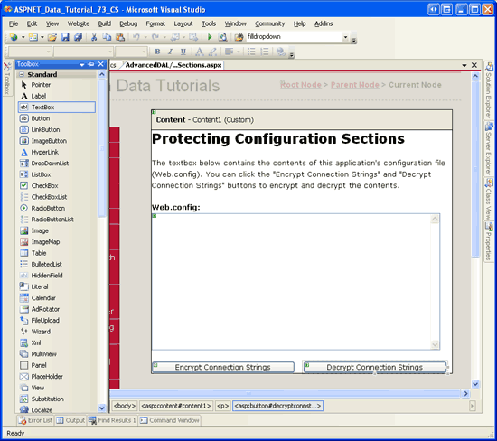
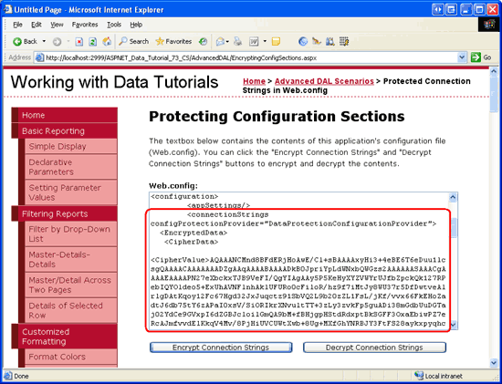

Protecting Connection Strings and Other Configuration Information (VB)
====================
by [Scott Mitchell](https://twitter.com/ScottOnWriting)

[Download Code](http://download.microsoft.com/download/3/9/f/39f92b37-e92e-4ab3-909e-b4ef23d01aa3/ASPNET_Data_Tutorial_73_VB.zip) or [Download PDF](protecting-connection-strings-and-other-configuration-information-vb/_static/datatutorial73vb1.pdf)

> An ASP.NET application typically stores configuration information in a Web.config file. Some of this information is sensitive and warrants protection. By default this file will not be served to a Web site visitor, but an administrator or a hacker may gain access to the Web server's file system and view the contents of the file. In this tutorial we learn that ASP.NET 2.0 allows us to protect sensitive information by encrypting sections of the Web.config file.

## Introduction

Configuration information for ASP.NET applications is commonly stored in an XML file named `Web.config`. Over the course of these tutorials we have updated the `Web.config` a handful of times. When creating the `Northwind` Typed DataSet in the [first tutorial](../introduction/creating-a-data-access-layer-vb.md), for example, connection string information was automatically added to `Web.config` in the `<connectionStrings>` section. Later, in the [Master Pages and Site Navigation](../introduction/master-pages-and-site-navigation-vb.md) tutorial, we manually updated `Web.config`, adding a `<pages>` element indicating that all of the ASP.NET pages in our project should use the `DataWebControls` Theme.

Since `Web.config` may contain sensitive data such as connection strings, it is important that the contents of `Web.config` be kept safe and hidden from unauthorized viewers. By default, any HTTP request to a file with the `.config` extension is handled by the ASP.NET engine, which returns the *This type of page is not served* message shown in Figure 1. This means that visitors cannot view your `Web.config` file s contents by simply entering http://www.YourServer.com/Web.config into their browser s Address bar.

**Figure 1**: Visiting `Web.config` Through a Browser Returns a This type of page is not served Message ([Click to view full-size image](protecting-connection-strings-and-other-configuration-information-vb/_static/image3.png))

But what if an attacker is able to find some other exploit that allows her to view your `Web.config` file s contents? What could an attacker do with this information, and what steps can be taken to further protect the sensitive information within `Web.config`? Fortunately, most sections in `Web.config` do not contain sensitive information. What harm can an attacker perpetrate if they know the name of the default Theme used by your ASP.NET pages?

Certain `Web.config` sections, however, contain sensitive information that may include connection strings, user names, passwords, server names, encryption keys, and so forth. This information is typically found in the following `Web.config` sections:

- `<appSettings>`
- `<connectionStrings>`
- `<identity>`
- `<sessionState>`

In this tutorial we will look at techniques for protecting such sensitive configuration information. As we will see, the .NET Framework version 2.0 includes a protected configurations system that makes programmatically encrypting and decrypting selected configuration sections a breeze.

> [!NOTE]
> This tutorial concludes with a look at Microsoft s recommendations for connecting to a database from an ASP.NET application. In addition to encrypting your connection strings, you can help harden your system by ensuring that you are connecting to the database in a secure fashion.

## Step 1: Exploring ASP.NET 2.0 s Protected Configuration Options

ASP.NET 2.0 includes a protected configuration system for encrypting and decrypting configuration information. This includes methods in the .NET Framework that can be used to programmatically encrypt or decrypt configuration information. The protected configuration system uses the [provider model](http://aspnet.4guysfromrolla.com/articles/101905-1.aspx), which allows developers to choose what cryptographic implementation is used.

The .NET Framework ships with two protected configuration providers:

- [`RSAProtectedConfigurationProvider`](https://msdn.microsoft.com/en-us/library/system.configuration.rsaprotectedconfigurationprovider.aspx) - uses the asymmetric [RSA algorithm](http://en.wikipedia.org/wiki/Rsa) for encryption and decryption.
- [`DPAPIProtectedConfigurationProvider`](https://msdn.microsoft.com/en-us/system.configuration.dpapiprotectedconfigurationprovider.aspx) - uses the Windows [Data Protection API (DPAPI)](https://msdn.microsoft.com/en-us/library/ms995355.aspx) for encryption and decryption.

Since the protected configuration system implements the provider design pattern, it is possible to create your own protected configuration provider and plug it into your application. See [Implementing a Protected Configuration Provider](https://msdn.microsoft.com/en-us/library/wfc2t3az(VS.80).aspx) for more information on this process.

The RSA and DPAPI providers use keys for their encryption and decryption routines, and these keys can be stored at the machine- or user-level. Machine-level keys are ideal for scenarios where the web application runs on its own dedicated server or if there are multiple applications on a server that need to share encrypted information. User-level keys are a more secure option in shared hosting environments where other applications on the same server should not be able to decrypt your application s protected configuration sections.

In this tutorial our examples will use the DPAPI provider and machine-level keys. Specifically, we will look at encrypting the `<connectionStrings>` section in `Web.config`, although the protected configuration system can be used to encrypt most any `Web.config` section. For information on using user-level keys or using the RSA provider, consult the resources in the Further Readings section at the end of this tutorial.

> [!NOTE]
> The `RSAProtectedConfigurationProvider` and `DPAPIProtectedConfigurationProvider` providers are registered in the `machine.config` file with the provider names `RsaProtectedConfigurationProvider` and `DataProtectionConfigurationProvider`, respectively. When encrypting or decrypting configuration information we will need to supply the appropriate provider name (`RsaProtectedConfigurationProvider` or `DataProtectionConfigurationProvider`) rather than the actual type name (`RSAProtectedConfigurationProvider` and `DPAPIProtectedConfigurationProvider`). You can find the `machine.config` file in the `$WINDOWS$\Microsoft.NET\Framework\version\CONFIG` folder.

## Step 2: Programmatically Encrypting and Decrypting Configuration Sections

With a few lines of code we can encrypt or decrypt a particular configuration section using a specified provider. The code, as we will see shortly, simply needs to programmatically reference the appropriate configuration section, call its `ProtectSection` or `UnprotectSection` method, and then call the `Save` method to persist the changes. Moreover, the .NET Framework includes a helpful command line utility that can encrypt and decrypt configuration information. We will explore this command line utility in Step 3.

To illustrate programmatically protecting configuration information, let s create an ASP.NET page that includes buttons for encrypting and decrypting the `<connectionStrings>` section in `Web.config`.

Start by opening the `EncryptingConfigSections.aspx` page in the `AdvancedDAL` folder. Drag a TextBox control from the Toolbox onto the Designer, setting its `ID` property to `WebConfigContents`, its `TextMode` property to `MultiLine`, and its `Width` and `Rows` properties to 95% and 15, respectively. This TextBox control will display the contents of `Web.config` allowing us to quickly see if the contents are encrypted or not. Of course, in a real application you would never want to display the contents of `Web.config`.

Beneath the TextBox, add two Button controls named `EncryptConnStrings` and `DecryptConnStrings`. Set their Text properties to Encrypt Connection Strings and Decrypt Connection Strings .

At this point your screen should look similar to Figure 2.

**Figure 2**: Add a TextBox and Two Button Web Controls to the Page ([Click to view full-size image](protecting-connection-strings-and-other-configuration-information-vb/_static/image6.png))

Next, we need to write code that loads and displays the contents of `Web.config` in the `WebConfigContents` TextBox when the page is first loaded. Add the following code to the page s code-behind class. This code adds a method named `DisplayWebConfig` and calls it from the `Page_Load` event handler when `Page.IsPostBack` is `False`:

[!code-vb[Main](protecting-connection-strings-and-other-configuration-information-vb/samples/sample1.vb)]

The `DisplayWebConfig` method uses the [`File` class](https://msdn.microsoft.com/en-us/library/system.io.file.aspx) to open the application s `Web.config` file, the [`StreamReader` class](https://msdn.microsoft.com/en-us/library/system.io.streamreader.aspx) to read its contents into a string, and the [`Path` class](https://msdn.microsoft.com/en-us/library/system.io.path.aspx) to generate the physical path to the `Web.config` file. These three classes are all found in the [`System.IO` namespace](https://msdn.microsoft.com/en-us/library/system.io.aspx). Consequently, you will need to add a `Imports``System.IO` statement to the top of the code-behind class or, alternatively, prefix these class names with `System.IO.`

Next, we need to add event handlers for the two Button controls `Click` events and add the necessary code to encrypt and decrypt the `<connectionStrings>` section using a machine-level key with the DPAPI provider. From the Designer, double-click each of the Buttons to add a `Click` event handler in the code-behind class and then add the following code:

[!code-vb[Main](protecting-connection-strings-and-other-configuration-information-vb/samples/sample2.vb)]

The code used in the two event handlers is nearly identical. They both start by getting information about the current application s `Web.config` file via the [`WebConfigurationManager` class](https://msdn.microsoft.com/en-us/library/system.web.configuration.webconfigurationmanager.aspx) s [`OpenWebConfiguration` method](https://msdn.microsoft.com/en-us/library/system.web.configuration.webconfigurationmanager.openwebconfiguration.aspx). This method returns the web configuration file for the specified virtual path. Next, the `Web.config` file s `<connectionStrings>` section is accessed via the [`Configuration` class](https://msdn.microsoft.com/en-us/library/system.configuration.configuration.aspx) s [`GetSection(sectionName)` method](https://msdn.microsoft.com/en-us/library/system.configuration.configuration.getsection.aspx), which returns a [`ConfigurationSection`](https://msdn.microsoft.com/en-us/library/system.configuration.configurationsection.aspx) object.

The `ConfigurationSection` object includes a [`SectionInformation` property](https://msdn.microsoft.com/en-us/library/system.configuration.configurationsection.sectioninformation.aspx) that provides additional information and functionality regarding the configuration section. As the code above shows, we can determine whether the configuration section is encrypted by checking the `SectionInformation` property s `IsProtected` property. Moreover, the section can be encrypted or decrypted via the `SectionInformation` property s `ProtectSection(provider)` and `UnprotectSection` methods.

The `ProtectSection(provider)` method accepts as input a string specifying the name of the protected configuration provider to use when encrypting. In the `EncryptConnString` Button s event handler we pass DataProtectionConfigurationProvider into the `ProtectSection(provider)` method so that the DPAPI provider is used. The `UnprotectSection` method can determine the provider that was used to encrypt the configuration section and therefore does not require any input parameters.

After calling the `ProtectSection(provider)` or `UnprotectSection` method, you must call the `Configuration` object s [`Save` method](https://msdn.microsoft.com/en-us/library/system.configuration.configuration.save.aspx) to persist the changes. Once the configuration information has been encrypted or decrypted and the changes saved, we call `DisplayWebConfig` to load the updated `Web.config` contents into the TextBox control.

Once you have entered the above code, test it by visiting the `EncryptingConfigSections.aspx` page through a browser. You should initially see a page that lists the contents of `Web.config` with the `<connectionStrings>` section displayed in plain-text (see Figure 3).

**Figure 3**: Add a TextBox and Two Button Web Controls to the Page ([Click to view full-size image](protecting-connection-strings-and-other-configuration-information-vb/_static/image9.png))

Now click the Encrypt Connection Strings button. If request validation is enabled, the markup posted back from the `WebConfigContents` TextBox will produce an `HttpRequestValidationException`, which displays the message, A potentially dangerous `Request.Form` value was detected from the client. Request validation, which is enabled by default in ASP.NET 2.0, prohibits postbacks that include un-encoded HTML and is designed to help prevent script-injection attacks. This check can be disabled at the page- or application-level. To turn it off for this page, set the `ValidateRequest` setting to `False` in the `@Page` directive. The `@Page` directive is found at the top of the page s declarative markup.

[!code-aspx[Main](protecting-connection-strings-and-other-configuration-information-vb/samples/sample3.aspx)]

For more information on request validation, its purpose, how to disable it at the page- and application-level, as well as how to HTML encode markup, see [Request Validation - Preventing Script Attacks](../../../../whitepapers/request-validation.md).

After disabling request validation for the page, try clicking the Encrypt Connection Strings button again. On postback, the configuration file will be accessed and its `<connectionStrings>` section encrypted using the DPAPI provider. The TextBox is then updated to display the new `Web.config` content. As Figure 4 shows, the `<connectionStrings>` information is now encrypted.

**Figure 4**: Clicking the Encrypt Connection Strings Button Encrypts the `<connectionString>` Section ([Click to view full-size image](protecting-connection-strings-and-other-configuration-information-vb/_static/image12.png))

The encrypted `<connectionStrings>` section generated on my computer follows, although some of the content in the `<CipherData>` element has been removed for brevity:

[!code-xml[Main](protecting-connection-strings-and-other-configuration-information-vb/samples/sample4.xml)]

> [!NOTE]
> The `<connectionStrings>` element specifies the provider used to perform the encryption (`DataProtectionConfigurationProvider`). This information is used by the `UnprotectSection` method when the Decrypt Connection Strings button is clicked.

When the connection string information is accessed from `Web.config` - either by code we write, from a SqlDataSource control, or the auto-generated code from the TableAdapters in our Typed DataSets - it is automatically decrypted. In short, we do not need to add any extra code or logic to decrypt the encrypted `<connectionString>` section. To demonstrate this, visit one of the earlier tutorials at this time, such as the Simple Display tutorial from the Basic Reporting section (`~/BasicReporting/SimpleDisplay.aspx`). As Figure 5 shows, the tutorial works exactly as we would expect it, indicating that the encrypted connection string information is being automatically decrypted by the ASP.NET page.

**Figure 5**: The Data Access Layer Automatically Decrypts the Connection String Information ([Click to view full-size image](protecting-connection-strings-and-other-configuration-information-vb/_static/image15.png))

To revert the `<connectionStrings>` section back to its plain-text representation, click the Decrypt Connection Strings button. On postback you should see the connection strings in `Web.config` in plain-text. At this point your screen should look like it did when first visiting this page (see in Figure 3).

## Step 3: Encrypting Configuration Sections Using`aspnet_regiis.exe`

The .NET Framework includes a variety of command line tools in the `$WINDOWS$\Microsoft.NET\Framework\version\` folder. In the [Using SQL Cache Dependencies](../caching-data/using-sql-cache-dependencies-vb.md) tutorial, for instance, we looked at using the `aspnet_regsql.exe` command line tool to add the infrastructure necessary for SQL cache dependencies. Another useful command line tool in this folder is the [ASP.NET IIS Registration tool (`aspnet_regiis.exe`)](https://msdn.microsoft.com/en-us/library/k6h9cz8h(VS.80).aspx). As its name implies, the ASP.NET IIS Registration tool is primarily used to register an ASP.NET 2.0 application with Microsoft s professional-grade Web server, IIS. In addition to its IIS-related features, the ASP.NET IIS Registration tool can also be used to encrypt or decrypt specified configuration sections in `Web.config`.

The following statement shows the general syntax used to encrypt a configuration section with the `aspnet_regiis.exe` command line tool:

[!code-console[Main](protecting-connection-strings-and-other-configuration-information-vb/samples/sample5.cmd)]

*section* is the configuration section to encrypt (like connectionStrings ), the *physical\_directory* is the full, physical path to the web application s root directory, and *provider* is the name of the protected configuration provider to use (such as DataProtectionConfigurationProvider ). Alternatively, if the web application is registered in IIS you can enter the virtual path instead of the physical path using the following syntax:

[!code-console[Main](protecting-connection-strings-and-other-configuration-information-vb/samples/sample6.cmd)]

The following `aspnet_regiis.exe` example encrypts the `<connectionStrings>` section using the DPAPI provider with a machine-level key:

[!code-console[Main](protecting-connection-strings-and-other-configuration-information-vb/samples/sample7.cmd)]

Similarly, the `aspnet_regiis.exe` command line tool can be used to decrypt configuration sections. Instead of using the `-pef` switch, use `-pdf` (or instead of `-pe`, use `-pd`). Also, note that the provider name is not necessary when decrypting.

[!code-console[Main](protecting-connection-strings-and-other-configuration-information-vb/samples/sample8.cmd)]

> [!NOTE]
> Since we are using the DPAPI provider, which uses keys specific to the computer, you must run `aspnet_regiis.exe` from the same machine from which the web pages are being served. For example, if you run this command line program from your local development machine and then upload the encrypted Web.config file to the production server, the production server will not be able to decrypt the connection string information since it was encrypted using keys specific to your development machine. The RSA provider does not have this limitation as it is possible to export the RSA keys to another machine.

## Understanding Database Authentication Options

Before any application can issue `SELECT`, `INSERT`, `UPDATE`, or `DELETE` queries to a Microsoft SQL Server database, the database first must identify the requestor. This process is known as *authentication* and SQL Server provides two methods of authentication:

- **Windows Authentication** - the process under which the application is running is used to communicate with the database. When running an ASP.NET application through Visual Studio 2005 s ASP.NET Development Server, the ASP.NET application assumes the identity of the currently logged on user. For ASP.NET applications on Microsoft Internet Information Server (IIS), ASP.NET applications usually assume the identity of `domainName``\MachineName` or `domainName``\NETWORK SERVICE`, although this can be customized.
- **SQL Authentication** - a user ID and password values are supplied as credentials for authentication. With SQL authentication, the user ID and password are provided in the connection string.

Windows authentication is preferred over SQL authentication because it is more secure. With Windows authentication the connection string is free from a username and password and if the web server and database server reside on two different machines, the credentials are not sent over the network in plain-text. With SQL authentication, however, the authentication credentials are hard-coded in the connection string and are transmitted from the web server to the database server in plain-text.

These tutorials have used Windows authentication. You can tell what authentication mode is being used by inspecting the connection string. The connection string in `Web.config` for our tutorials has been:

`Data Source=.\SQLEXPRESS; AttachDbFilename=|DataDirectory|\NORTHWND.MDF; Integrated Security=True; User Instance=True`

The Integrated Security=True and lack of a username and password indicate that Windows authentication is being used. In some connection strings the term Trusted Connection=Yes or Integrated Security=SSPI is used instead of Integrated Security=True, but all three indicate the use of Windows authentication.

The following example shows a connection string that uses SQL authentication. Note the credentials embedded within the connection string:

`Server=serverName; Database=Northwind; uid=userID; pwd=password`

Imagine that an attacker is able to view your application s `Web.config` file. If you use SQL authentication to connect to a database that is accessible over the Internet, the attacker can use this connection string to connect to your database through SQL Management Studio or from ASP.NET pages on their own website. To help mitigate this threat, encrypt the connection string information in `Web.config` using the protected configuration system.

> [!NOTE]
> For more information on the different types of authentication available in SQL Server, see [Building Secure ASP.NET Applications: Authentication, Authorization, and Secure Communication](https://msdn.microsoft.com/en-us/library/aa302392.aspx). For further connection string examples illustrating the differences between Windows and SQL authentication syntax, refer to [ConnectionStrings.com](http://www.connectionstrings.com/).

## Summary

By default, files with a `.config` extension in an ASP.NET application cannot be accessed through a browser. These types of files are not returned because they may contain sensitive information, such as database connection strings, usernames and passwords, and so on. The protected configuration system in .NET 2.0 helps further protect sensitive information by allowing specified configuration sections to be encrypted. There are two built-in protected configuration providers: one that uses the RSA algorithm and one that uses the Windows Data Protection API (DPAPI).

In this tutorial we looked at how to encrypt and decrypt configuration settings using the DPAPI provider. This can be accomplished both programmatically, as we saw in Step 2, as well as through the `aspnet_regiis.exe` command line tool, which was covered in Step 3. For more information on using user-level keys or using the RSA provider instead, see the resources in the Further Reading section.

Happy Programming!

## Further Reading

For more information on the topics discussed in this tutorial, refer to the following resources:

- [Building Secure ASP.NET Application: Authentication, Authorization, and Secure Communication](https://msdn.microsoft.com/en-us/library/aa302392.aspx)
- [Encrypting Configuration Information in ASP.NET 2.0 Applications](http://aspnet.4guysfromrolla.com/articles/021506-1.aspx)
- [Encrypting `Web.config` Values in ASP.NET 2.0](https://weblogs.asp.net/scottgu/archive/2006/01/09/434893.aspx)
- [How To: Encrypt Configuration Sections in ASP.NET 2.0 Using DPAPI](https://msdn.microsoft.com/en-us/library/ms998280.aspx)
- [How To: Encrypt Configuration Sections in ASP.NET 2.0 Using RSA](https://msdn.microsoft.com/en-us/library/ms998283.aspx)
- [The Configuration API in .NET 2.0](http://www.odetocode.com/Articles/418.aspx)
- [Windows Data Protection](https://msdn.microsoft.com/en-us/library/ms995355.aspx)

## About the Author

[Scott Mitchell](http://www.4guysfromrolla.com/ScottMitchell.shtml), author of seven ASP/ASP.NET books and founder of [4GuysFromRolla.com](http://www.4guysfromrolla.com), has been working with Microsoft Web technologies since 1998. Scott works as an independent consultant, trainer, and writer. His latest book is [*Sams Teach Yourself ASP.NET 2.0 in 24 Hours*](https://www.amazon.com/exec/obidos/ASIN/0672327384/4guysfromrollaco). He can be reached at [mitchell@4GuysFromRolla.com.](mailto:mitchell@4GuysFromRolla.com) or via his blog, which can be found at [http://ScottOnWriting.NET](http://ScottOnWriting.NET).

## Special Thanks To

This tutorial series was reviewed by many helpful reviewers. Lead reviewers for this tutorial were Teresa Murphy and Randy Schmidt. Interested in reviewing my upcoming MSDN articles? If so, drop me a line at [mitchell@4GuysFromRolla.com.](mailto:mitchell@4GuysFromRolla.com)

>[!div class="step-by-step"]
[Previous](configuring-the-data-access-layer-s-connection-and-command-level-settings-vb.md)
[Next](debugging-stored-procedures-vb.md)