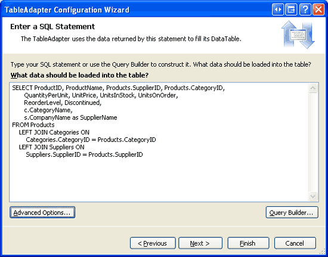
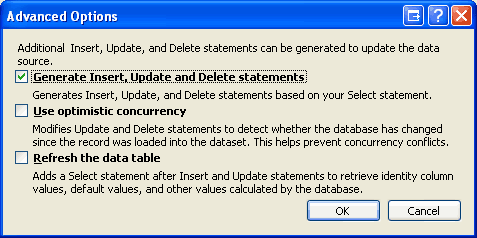
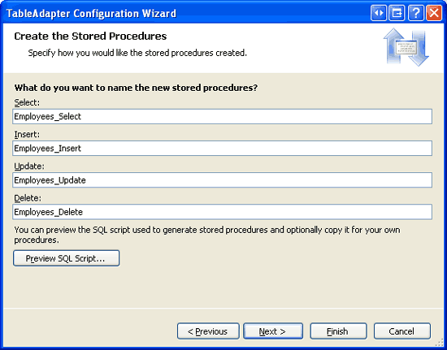
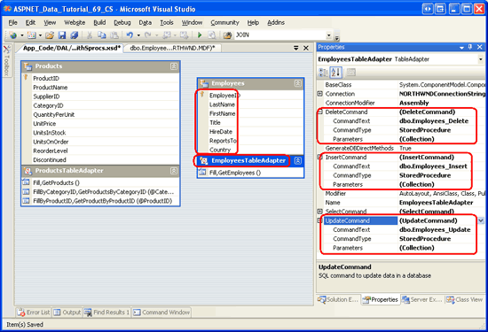
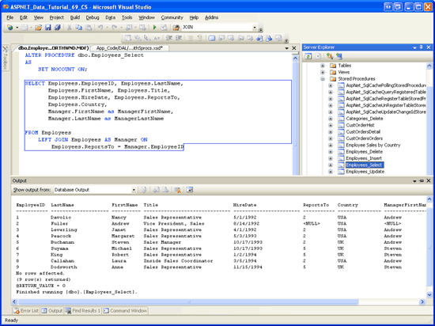
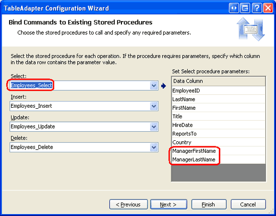
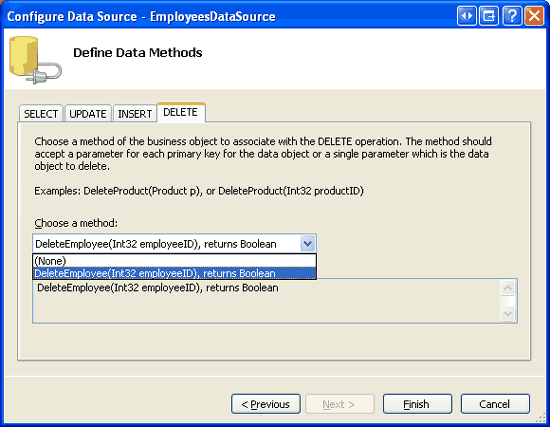
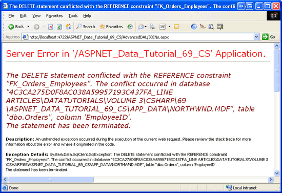

Updating the TableAdapter to Use JOINs (C#)
====================
by [Scott Mitchell](https://twitter.com/ScottOnWriting)

[Download Code](http://download.microsoft.com/download/3/9/f/39f92b37-e92e-4ab3-909e-b4ef23d01aa3/ASPNET_Data_Tutorial_69_CS.zip) or [Download PDF](updating-the-tableadapter-to-use-joins-cs/_static/datatutorial69cs1.pdf)

> When working with a database it is common to request data that is spread across multiple tables. To retrieve data from two different tables we can use either a correlated subquery or a JOIN operation. In this tutorial we compare correlated subqueries and the JOIN syntax before looking at how to create a TableAdapter that includes a JOIN in its main query.

## Introduction

With relational databases the data we are interested in working with is often spread across multiple tables. For example, when displaying product information we likely want to list each product s corresponding category and supplier s names. The `Products` table has `CategoryID` and `SupplierID` values, but the actual category and supplier names are in the `Categories` and `Suppliers` tables, respectively.

To retrieve information from another, related table, we can either use *correlated subqueries* or `JOIN`*s*. A correlated subquery is a nested `SELECT` query that references columns in the outer query. For example, in the [Creating a Data Access Layer](../introduction/creating-a-data-access-layer-cs.md) tutorial we used two correlated subqueries in the `ProductsTableAdapter` s main query to return the category and supplier names for each product. A `JOIN` is a SQL construct that merges related rows from two different tables. We used a `JOIN` in the [Querying Data with the SqlDataSource Control](../accessing-the-database-directly-from-an-aspnet-page/querying-data-with-the-sqldatasource-control-cs.md) tutorial to display category information alongside each product.

The reason we have abstained from using `JOIN` s with the TableAdapters is because of limitations in the TableAdapter s wizard to auto-generate corresponding `INSERT`, `UPDATE`, and `DELETE` statements. More specifically, if the TableAdapter s main query contains any `JOIN` s, the TableAdapter cannot auto-create the ad-hoc SQL statements or stored procedures for its `InsertCommand`, `UpdateCommand`, and `DeleteCommand` properties.

In this tutorial we will briefly compare and contrast correlated subqueries and `JOIN` s before exploring how to create a TableAdapter that includes `JOIN` s in its main query.

## Comparing and Contrasting Correlated Subqueries and`JOIN` s

Recall that the `ProductsTableAdapter` created in the first tutorial in the `Northwind` DataSet uses correlated subqueries to bring back each product s corresponding category and supplier name. The `ProductsTableAdapter` s main query is shown below.

[!code-sql[Main](updating-the-tableadapter-to-use-joins-cs/samples/sample1.sql)]

The two correlated subqueries - `(SELECT CategoryName FROM Categories WHERE Categories.CategoryID = Products.CategoryID)` and `(SELECT CompanyName FROM Suppliers WHERE Suppliers.SupplierID = Products.SupplierID)` - are `SELECT` queries that return a single value per product as an additional column in the outer `SELECT` statement s column list.

Alternatively, a `JOIN` can be used to return each product s supplier and category name. The following query returns the same output as the above one, but uses `JOIN` s in place of subqueries:

[!code-sql[Main](updating-the-tableadapter-to-use-joins-cs/samples/sample2.sql)]

A `JOIN` merges the records from one table with records from another table based on some criteria. In the above query, for example, the `LEFT JOIN Categories ON Categories.CategoryID = Products.CategoryID` instructs SQL Server to merge each product record with the category record whose `CategoryID` value matches the product s `CategoryID` value. The merged result allows us to work with the corresponding category fields for each product (such as `CategoryName`).

> [!NOTE]
> `JOIN` s are commonly used when querying data from relational databases. If you are new to the `JOIN` syntax or need to brush up a bit on its usage, I d recommend the [SQL Join tutorial](http://www.w3schools.com/sql/sql_join.asp) at [W3 Schools](http://www.w3schools.com/). Also worth reading are the [`JOIN` Fundamentals](https://msdn.microsoft.com/en-us/library/ms191517.aspx) and [Subquery Fundamentals](https://msdn.microsoft.com/en-us/library/ms189575.aspx) sections of the [SQL Books Online](https://msdn.microsoft.com/en-us/library/ms130214.aspx).

Since `JOIN` s and correlated subqueries can both be used to retrieve related data from other tables, many developers are left scratching their heads and wondering which approach to use. All of the SQL gurus I ve talked to have said roughly the same thing, that it doesn t really matter performance-wise as SQL Server will produce roughly identical execution plans. Their advice, then, is to use the technique that you and your team are most comfortable with. It merits noting that after imparting this advice these experts immediately express their preference of `JOIN` s over correlated subqueries.

When building a Data Access Layer using Typed DataSets, the tools work better when using subqueries. In particular, the TableAdapter s wizard will not auto-generate corresponding `INSERT`, `UPDATE`, and `DELETE` statements if the main query contains any `JOIN` s, but will auto-generate these statements when correlated subqueries are used.

To explore this shortcoming, create a temporary Typed DataSet in the `~/App_Code/DAL` folder. During the TableAdapter Configuration wizard, choose to use ad-hoc SQL statements and enter the following `SELECT` query (see Figure 1):

[!code-sql[Main](updating-the-tableadapter-to-use-joins-cs/samples/sample3.sql)]

**Figure 1**: Enter a Main Query that Contains `JOIN` s ([Click to view full-size image](updating-the-tableadapter-to-use-joins-cs/_static/image3.png))

By default, the TableAdapter will automatically create `INSERT`, `UPDATE`, and `DELETE` statements based on the main query. If you click the Advanced button you can see that this feature is enabled. Despite this setting, the TableAdapter will not be able to create the `INSERT`, `UPDATE`, and `DELETE` statements because the main query contains a `JOIN`.

**Figure 2**: Enter a Main Query that Contains `JOIN` s

Click Finish to complete the wizard. At this point your DataSet s Designer will include a single TableAdapter with a DataTable with columns for each of the fields returned in the `SELECT` query s column list. This includes the `CategoryName` and `SupplierName`, as Figure 3 shows.

**Figure 3**: The DataTable Includes a Column for Each Field Returned in the Column List

While the DataTable has the appropriate columns, the TableAdapter lacks values for its `InsertCommand`, `UpdateCommand`, and `DeleteCommand` properties. To confirm this, click on the TableAdapter in the Designer and then go to the Properties window. There you will see that the `InsertCommand`, `UpdateCommand`, and `DeleteCommand` properties are set to (None) .

**Figure 4**: The `InsertCommand`, `UpdateCommand`, and `DeleteCommand` Properties are Set to (None) ([Click to view full-size image](updating-the-tableadapter-to-use-joins-cs/_static/image8.png))

To work around this shortcoming, we can manually provide the SQL statements and parameters for the `InsertCommand`, `UpdateCommand`, and `DeleteCommand` properties via the Properties window. Alternatively, we could start by configuring the TableAdapter s main query to *not* include any `JOIN` s. This will allow the `INSERT`, `UPDATE`, and `DELETE` statements to be auto-generated for us. After completing the wizard, we could then manually update the TableAdapter s `SelectCommand` from the Properties window so that it includes the `JOIN` syntax.

While this approach works, it is very brittle when using ad-hoc SQL queries because any time the TableAdapter s main query is re-configured through the wizard, the auto-generated `INSERT`, `UPDATE`, and `DELETE` statements are recreated. That means all of the customizations we later made would be lost if we right-clicked on the TableAdapter, chose Configure from the context menu, and completed the wizard again.

The brittleness of the TableAdapter s auto-generated `INSERT`, `UPDATE`, and `DELETE` statements is, fortunately, limited to ad-hoc SQL statements. If your TableAdapter uses stored procedures, you can customize the `SelectCommand`, `InsertCommand`, `UpdateCommand`, or `DeleteCommand` stored procedures and re-run the TableAdapter Configuration wizard without having to fear that the stored procedures will be modified.

Over the next several steps we will create a TableAdapter that, initially, uses a main query that omits any `JOIN` s so that the corresponding insert, update, and delete stored procedures will be auto-generated. We will then update the `SelectCommand` so that uses a `JOIN` that returns additional columns from related tables. Finally, we'll create a corresponding Business Logic Layer class and demonstrate using the TableAdapter in an ASP.NET web page.

## Step 1: Creating the TableAdapter Using a Simplified Main Query

For this tutorial we will add a TableAdapter and strongly-typed DataTable for the `Employees` table in the `NorthwindWithSprocs` DataSet. The `Employees` table contains a `ReportsTo` field that specified the `EmployeeID` of the employee s manager. For example, employee Anne Dodsworth has a `ReportTo` value of 5, which is the `EmployeeID` of Steven Buchanan. Consequently, Anne reports to Steven, her manager. Along with reporting each employee s `ReportsTo` value, we might also want to retrieve the name of their manager. This can be accomplished using a `JOIN`. But using a `JOIN` when initially creating the TableAdapter precludes the wizard from automatically generating the corresponding insert, update, and delete capabilities. Therefore, we will start by creating a TableAdapter whose main query does not contain any `JOIN` s. Then, in Step 2, we will update the main query stored procedure to retrieve the manager s name via a `JOIN`.

Start by opening the `NorthwindWithSprocs` DataSet in the `~/App_Code/DAL` folder. Right-click on the Designer, select the Add option from the context menu, and pick the TableAdapter menu item. This will launch the TableAdapter Configuration wizard. As Figure 5 depicts, have the wizard create new stored procedures and click Next. For a refresher on creating new stored procedures from the TableAdapter s wizard, consult the [Creating New Stored Procedures for the Typed DataSet s TableAdapters](creating-new-stored-procedures-for-the-typed-dataset-s-tableadapters-cs.md) tutorial.

**Figure 5**: Select the Create new stored procedures Option ([Click to view full-size image](updating-the-tableadapter-to-use-joins-cs/_static/image11.png))

Use the following `SELECT` statement for the TableAdapter s main query:

[!code-sql[Main](updating-the-tableadapter-to-use-joins-cs/samples/sample4.sql)]

Since this query does not include any `JOIN` s, the TableAdapter wizard will automatically create stored procedures with corresponding `INSERT`, `UPDATE`, and `DELETE` statements, as well as a stored procedure for executing the main query.

The following step allows us to name the TableAdapter s stored procedures. Use the names `Employees_Select`, `Employees_Insert`, `Employees_Update`, and `Employees_Delete`, as shown in Figure 6.

**Figure 6**: Name the TableAdapter s Stored Procedures ([Click to view full-size image](updating-the-tableadapter-to-use-joins-cs/_static/image14.png))

The final step prompts us to name the TableAdapter s methods. Use `Fill` and `GetEmployees` as the method names. Also be sure to leave the Create methods to send updates directly to the database (GenerateDBDirectMethods) checkbox checked.

**Figure 7**: Name the TableAdapter s Methods `Fill` and `GetEmployees` ([Click to view full-size image](updating-the-tableadapter-to-use-joins-cs/_static/image17.png))

After completing the wizard, take a moment to examine the stored procedures in the database. You should see four new ones: `Employees_Select`, `Employees_Insert`, `Employees_Update`, and `Employees_Delete`. Next, inspect the `EmployeesDataTable` and `EmployeesTableAdapter` just created. The DataTable contains a column for each field returned by the main query. Click on the TableAdapter and then go to the Properties window. There you will see that the `InsertCommand`, `UpdateCommand`, and `DeleteCommand` properties are correctly configured to call the corresponding stored procedures.

**Figure 8**: The TableAdapter Includes Insert, Update, and Delete Capabilities ([Click to view full-size image](updating-the-tableadapter-to-use-joins-cs/_static/image20.png))

With the insert, update, and delete stored procedures automatically created and the `InsertCommand`, `UpdateCommand`, and `DeleteCommand` properties correctly configured, we are ready to customize the `SelectCommand` s stored procedure to return additional information about each employee s manager. Specifically, we need to update the `Employees_Select` stored procedure to use a `JOIN` and return the manager s `FirstName` and `LastName` values. After the stored procedure has been updated, we will need to update the DataTable so that it includes these additional columns. We'll tackle these two tasks in Steps 2 and 3.

## Step 2: Customizing the Stored Procedure to Include a`JOIN`

Start by going to the Server Explorer, drilling down into the Northwind database s Stored Procedures folder, and opening the `Employees_Select` stored procedure. If you do not see this stored procedure, right-click on the Stored Procedures folder and choose Refresh. Update the stored procedure so that it uses a `LEFT JOIN` to return the manager s first and last name:

[!code-sql[Main](updating-the-tableadapter-to-use-joins-cs/samples/sample5.sql)]

After updating the `SELECT` statement, save the changes by going to the File menu and choosing Save `Employees_Select`. Alternatively, you can click the Save icon in the toolbar or hit Ctrl+S. After saving your changes, right-click on the `Employees_Select` stored procedure in the Server Explorer and choose Execute. This will run the stored procedure and show its results in the Output window (see Figure 9).

**Figure 9**: The Stored Procedures Results are Displayed in the Output Window ([Click to view full-size image](updating-the-tableadapter-to-use-joins-cs/_static/image23.png))

## Step 3: Updating the DataTable s Columns

At this point, the `Employees_Select` stored procedure returns `ManagerFirstName` and `ManagerLastName` values, but the `EmployeesDataTable` is missing these columns. These missing columns can be added to the DataTable in one of two ways:

- **Manually** - right-click on the DataTable in the DataSet Designer and, from the Add menu, choose Column. You can then name the column and set its properties accordingly.
- **Automatically** - the TableAdapter Configuration wizard will update the DataTable s columns to reflect the fields returned by the `SelectCommand` stored procedure. When using ad-hoc SQL statements, the wizard will also remove the `InsertCommand`, `UpdateCommand`, and `DeleteCommand` properties since the `SelectCommand` now contains a `JOIN`. But when using stored procedures, these command properties remain intact.

We have explored manually adding DataTable columns in previous tutorials, including [Master/Detail Using a Bulleted List of Master Records with a Details DataList](../filtering-scenarios-with-the-datalist-and-repeater/master-detail-using-a-bulleted-list-of-master-records-with-a-details-datalist-cs.md) and [Uploading Files](../working-with-binary-files/uploading-files-cs.md), and we will look at this process again in more detail in our next tutorial. For this tutorial, however, let s use the automatic approach via the TableAdapter Configuration wizard.

Start by right-clicking on the `EmployeesTableAdapter` and selecting Configure from the context menu. This brings up the TableAdapter Configuration wizard, which lists the stored procedures used for selecting, inserting, updating, and deleting, along with their return values and parameters (if any). Figure 10 shows this wizard. Here we can see that the `Employees_Select` stored procedure now returns the `ManagerFirstName` and `ManagerLastName` fields.

**Figure 10**: The Wizard Shows the Updated Column List for the `Employees_Select` Stored Procedure ([Click to view full-size image](updating-the-tableadapter-to-use-joins-cs/_static/image26.png))

Complete the wizard by clicking Finish. Upon returning to the DataSet Designer, the `EmployeesDataTable` includes two additional columns: `ManagerFirstName` and `ManagerLastName`.

**Figure 11**: The `EmployeesDataTable` Contains Two New Columns ([Click to view full-size image](updating-the-tableadapter-to-use-joins-cs/_static/image29.png))

To illustrate that the updated `Employees_Select` stored procedure is in effect and that the insert, update, and delete capabilities of the TableAdapter are still functional, let s create a web page that allows users to view and delete employees. Before we create such a page, however, we need to first create a new class in the Business Logic Layer for working with employees from the `NorthwindWithSprocs` DataSet. In Step 4, we will create an `EmployeesBLLWithSprocs` class. In Step 5, we will use this class from an ASP.NET page.

## Step 4: Implementing the Business Logic Layer

Create a new class file in the `~/App_Code/BLL` folder named `EmployeesBLLWithSprocs.cs`. This class mimics the semantics of the existing `EmployeesBLL` class, only this new one provides fewer methods and uses the `NorthwindWithSprocs` DataSet (instead of the `Northwind` DataSet). Add the following code to the `EmployeesBLLWithSprocs` class.

[!code-csharp[Main](updating-the-tableadapter-to-use-joins-cs/samples/sample6.cs)]

The `EmployeesBLLWithSprocs` class s `Adapter` property returns an instance of the `NorthwindWithSprocs` DataSet s `EmployeesTableAdapter`. This is used by the class s `GetEmployees` and `DeleteEmployee` methods. The `GetEmployees` method calls the `EmployeesTableAdapter` s corresponding `GetEmployees` method, which invokes the `Employees_Select` stored procedure and populates its results in an `EmployeeDataTable`. The `DeleteEmployee` method similarly calls the `EmployeesTableAdapter` s `Delete` method, which invokes the `Employees_Delete` stored procedure.

## Step 5: Working with the Data in the Presentation Layer

With the `EmployeesBLLWithSprocs` class complete, we re ready to work with employee data through an ASP.NET page. Open the `JOINs.aspx` page in the `AdvancedDAL` folder and drag a GridView from the Toolbox onto the Designer, setting its `ID` property to `Employees`. Next, from the GridView s smart tag, bind the grid to a new ObjectDataSource control named `EmployeesDataSource`.

Configure the ObjectDataSource to use the `EmployeesBLLWithSprocs` class and, from the SELECT and DELETE tabs, ensure that the `GetEmployees` and `DeleteEmployee` methods are selected from the drop-down lists. Click Finish to complete the ObjectDataSource s configuration.

**Figure 12**: Configure the ObjectDataSource to Use the `EmployeesBLLWithSprocs` Class ([Click to view full-size image](updating-the-tableadapter-to-use-joins-cs/_static/image32.png))

**Figure 13**: Have the ObjectDataSource Use the `GetEmployees` and `DeleteEmployee` Methods ([Click to view full-size image](updating-the-tableadapter-to-use-joins-cs/_static/image35.png))

Visual Studio will add a BoundField to the GridView for each of the `EmployeesDataTable` s columns. Remove all of these BoundFields except for `Title`, `LastName`, `FirstName`, `ManagerFirstName`, and `ManagerLastName` and rename the `HeaderText` properties for the last four BoundFields to Last Name, First Name, Manager s First Name, and Manager s Last Name, respectively.

To allow users to delete employees from this page we need to do two things. First, instruct the GridView to provide deleting capabilities by checking the Enable Deleting option from its smart tag. Second, change the ObjectDataSource s `OldValuesParameterFormatString` property from the value set by the ObjectDataSource wizard (`original_{0}`) to its default value (`{0}`). After making these changes, your GridView and ObjectDataSource s declarative markup should look similar to the following:

[!code-aspx[Main](updating-the-tableadapter-to-use-joins-cs/samples/sample7.aspx)]

Test out the page by visiting it through a browser. As Figure 14 shows, the page will list each employee and his or her manager s name (assuming they have one).

**Figure 14**: The `JOIN` in the `Employees_Select` Stored Procedure Returns the Manager s Name ([Click to view full-size image](updating-the-tableadapter-to-use-joins-cs/_static/image38.png))

Clicking the Delete button starts the deleting workflow, which culminates in the execution of the `Employees_Delete` stored procedure. However, the attempted `DELETE` statement in the stored procedure fails because of a foreign key constraint violation (see Figure 15). Specifically, each employee has one or more records in the `Orders` table, causing the delete to fail.

**Figure 15**: Deleting an Employee That has Corresponding Orders Results in a Foreign Key Constraint Violation ([Click to view full-size image](updating-the-tableadapter-to-use-joins-cs/_static/image41.png))

To allow an employee to be deleted you could:

- Update the foreign key constraint to cascade deletes,
- Manually delete the records from the `Orders` table for the employee(s) you want to delete, or
- Update the `Employees_Delete` stored procedure to first delete the related records from the `Orders` table before deleting the `Employees` record. We discussed this technique in the [Using Existing Stored Procedures for the Typed DataSet s TableAdapters](using-existing-stored-procedures-for-the-typed-dataset-s-tableadapters-cs.md) tutorial.

I leave this as an exercise for the reader.

## Summary

When working with relational databases, it is common for queries to pull their data from multiple, related tables. Correlated subqueries and `JOIN` s provide two different techniques for accessing data from related tables in a query. In previous tutorials we most commonly made use of correlated subqueries because the TableAdapter cannot auto-generate `INSERT`, `UPDATE`, and `DELETE` statements for queries involving `JOIN` s. While these values can be provided manually, when using ad-hoc SQL statements any customizations will be overwritten when the TableAdapter Configuration wizard is completed.

Fortunately, TableAdapters created using stored procedures do not suffer from the same brittleness as those created using ad-hoc SQL statements. Therefore, it is feasible to create a TableAdapter whose main query uses a `JOIN` when using stored procedures. In this tutorial we saw how to create such a TableAdapter. We started by using a `JOIN`-less `SELECT` query for the TableAdapter s main query so that the corresponding insert, update, and delete stored procedures would be auto-created. With the TableAdapter s initial configuration complete, we augmented the `SelectCommand` stored procedure to use a `JOIN` and re-ran the TableAdapter Configuration wizard to update the `EmployeesDataTable` s columns.

Re-running the TableAdapter Configuration wizard automatically updated the `EmployeesDataTable` columns to reflect the data fields returned by the `Employees_Select` stored procedure. Alternatively, we could have added these columns manually to the DataTable. We will explore manually adding columns to the DataTable in the next tutorial.

Happy Programming!

## About the Author

[Scott Mitchell](http://www.4guysfromrolla.com/ScottMitchell.shtml), author of seven ASP/ASP.NET books and founder of [4GuysFromRolla.com](http://www.4guysfromrolla.com), has been working with Microsoft Web technologies since 1998. Scott works as an independent consultant, trainer, and writer. His latest book is [*Sams Teach Yourself ASP.NET 2.0 in 24 Hours*](https://www.amazon.com/exec/obidos/ASIN/0672327384/4guysfromrollaco). He can be reached at [mitchell@4GuysFromRolla.com.](mailto:mitchell@4GuysFromRolla.com) or via his blog, which can be found at [http://ScottOnWriting.NET](http://ScottOnWriting.NET).

## Special Thanks To

This tutorial series was reviewed by many helpful reviewers. Lead reviewers for this tutorial were Hilton Geisenow, David Suru, and Teresa Murphy. Interested in reviewing my upcoming MSDN articles? If so, drop me a line at [mitchell@4GuysFromRolla.com.](mailto:mitchell@4GuysFromRolla.com)

>[!div class="step-by-step"]
[Previous](using-existing-stored-procedures-for-the-typed-dataset-s-tableadapters-cs.md)
[Next](adding-additional-datatable-columns-cs.md)