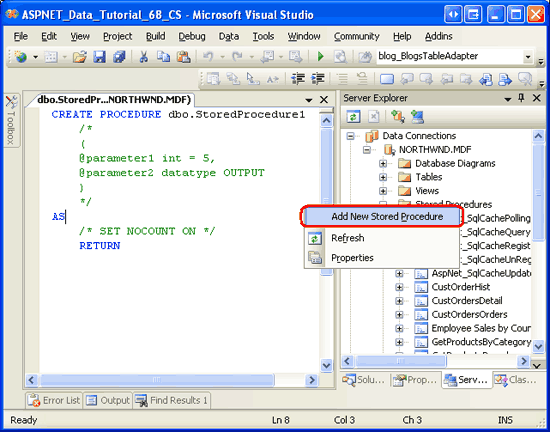
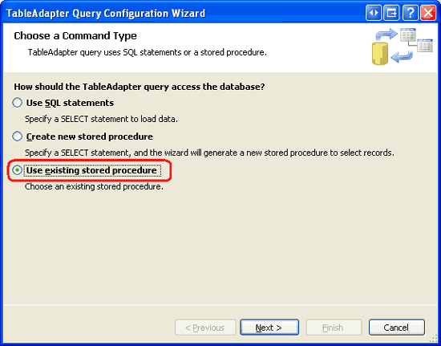
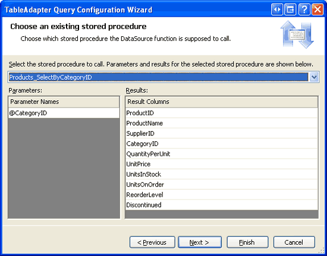
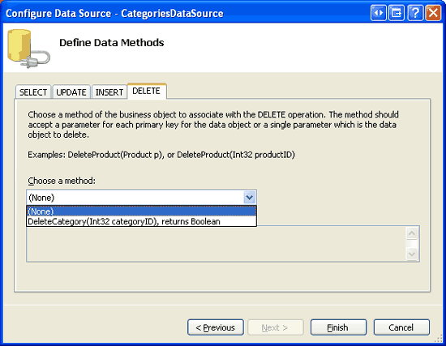
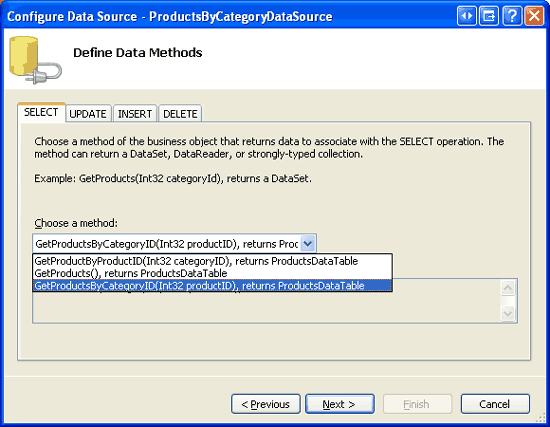
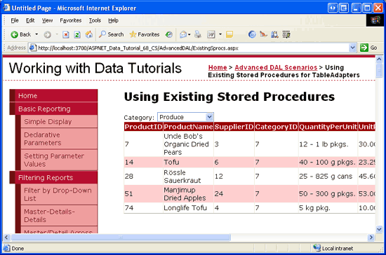
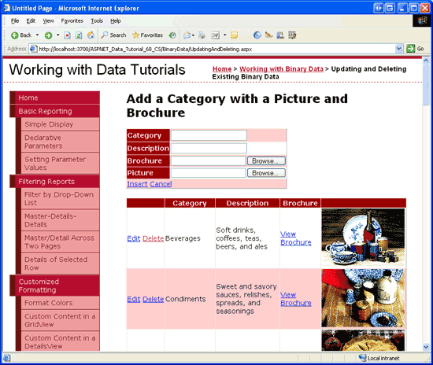
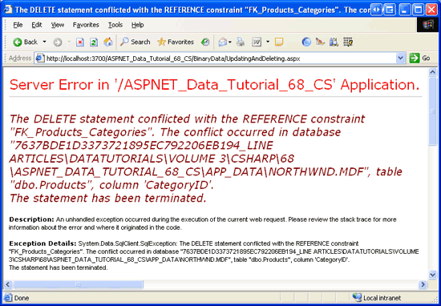
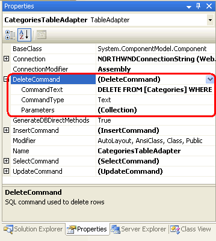

Using Existing Stored Procedures for the Typed DataSet's TableAdapters (VB)
====================
by [Scott Mitchell](https://twitter.com/ScottOnWriting)

[Download Code](http://download.microsoft.com/download/3/9/f/39f92b37-e92e-4ab3-909e-b4ef23d01aa3/ASPNET_Data_Tutorial_68_VB.zip) or [Download PDF](using-existing-stored-procedures-for-the-typed-dataset-s-tableadapters-vb/_static/datatutorial68vb1.pdf)

> In the previous tutorial we learned how to use the TableAdapter Wizard to generate new stored procedures. In this tutorial we learn how the same TableAdapter Wizard can work with existing stored procedures. We also learn how to manually add new stored procedures to our database.

## Introduction

In the [preceding tutorial](creating-new-stored-procedures-for-the-typed-dataset-s-tableadapters-vb.md) we saw how the Typed DataSet s TableAdapters could be configured to use stored procedures to access data rather than ad-hoc SQL statements. In particular, we examined how to have the TableAdapter wizard automatically create these stored procedures. When porting a legacy application to ASP.NET 2.0 or when building an ASP.NET 2.0 website around an existing data model, chances are that the database already contains the stored procedures we need. Alternatively, you may prefer to create your stored procedures by hand or through some tool other than the TableAdapter wizard that auto-generates your stored procedures.

In this tutorial we will look at how to configure the TableAdapter to use existing stored procedures. Since the Northwind database only has a small set of built-in stored procedures, we will also look at the steps needed to manually add new stored procedures to the database through the Visual Studio environment. Let s get started!

> [!NOTE]
> In the [Wrapping Database Modifications within a Transaction](creating-new-stored-procedures-for-the-typed-dataset-s-tableadapters-vb.md) tutorial we added methods to the TableAdapter to support transactions (`BeginTransaction`, `CommitTransaction`, and so on). Alternatively, transactions can be managed entirely within a stored procedure, which requires no modifications to the Data Access Layer code. In this tutorial we'll explore the T-SQL commands used to execute a stored procedure s statements within the scope of a transaction.

## Step 1: Adding Stored Procedures to the Northwind Database

Visual Studio makes it easy to add new stored procedures to a database. Let s add a new stored procedure to the Northwind database that returns all columns from the `Products` table for those that have a particular `CategoryID` value. From the Server Explorer window, expand the Northwind database so that its folders - Database Diagrams, Tables, Views, and so forth - are displayed. As we saw in the preceding tutorial, the Stored Procedures folder contains the database s existing stored procedures. To add a new stored procedure, simply right-click the Stored Procedures folder and choose the Add New Stored Procedure option from the context menu.

**Figure 1**: Right-Click the Stored Procedures Folder and Add a New Stored Procedure ([Click to view full-size image](using-existing-stored-procedures-for-the-typed-dataset-s-tableadapters-vb/_static/image3.png))

As Figure 1 shows, selecting the Add New Stored Procedure option opens a script window in Visual Studio with the outline of the SQL script needed to create the stored procedure. It is our job to flesh out this script and execute it, at which point the stored procedure will be added to the database.

Enter the following script:

[!code-sql[Main](using-existing-stored-procedures-for-the-typed-dataset-s-tableadapters-vb/samples/sample1.sql)]

This script, when executed, will add a new stored procedure to the Northwind database named `Products_SelectByCategoryID`. This stored procedure accepts a single input parameter (`@CategoryID`, of type `int`) and it returns all of the fields for those products with a matching `CategoryID` value.

To execute this `CREATE PROCEDURE` script and add the stored procedure to the database, click the Save icon in the toolbar or hit Ctrl+S. After doing so, the Stored Procedures folder refreshes, showing the newly created stored procedure. Also, the script in the window will change subtlety from `CREATE PROCEDURE dbo.Products_SelectProductByCategoryID` to `ALTER PROCEDURE` `dbo.Products_SelectProductByCategoryID`. `CREATE PROCEDURE` adds a new stored procedure to the database, while `ALTER PROCEDURE` updates an existing one. Since the start of the script has changed to `ALTER PROCEDURE`, changing the stored procedures input parameters or SQL statements and clicking the Save icon will update the stored procedure with these changes.

Figure 2 shows Visual Studio after the `Products_SelectByCategoryID` stored procedure has been saved.

**Figure 2**: The Stored Procedure `Products_SelectByCategoryID` Has Been Added to the Database ([Click to view full-size image](using-existing-stored-procedures-for-the-typed-dataset-s-tableadapters-vb/_static/image6.png))

## Step 2: Configuring the TableAdapter to Use an Existing Stored Procedure

Now that the `Products_SelectByCategoryID` stored procedure has been added to the database, we can configure our Data Access Layer to use this stored procedure when one of its methods is invoked. In particular, we will add a `GetProducstByCategoryID(<_i22_>categoryID)<!--_i22_-->` method to the `ProductsTableAdapter` in the `NorthwindWithSprocs` Typed DataSet that calls the `Products_SelectByCategoryID` stored procedure we just created.

Start by opening the `NorthwindWithSprocs` DataSet. Right-click on the `ProductsTableAdapter` and choose Add Query to launch the TableAdapter Query Configuration wizard. In the [preceding tutorial](creating-new-stored-procedures-for-the-typed-dataset-s-tableadapters-vb.md) we opted to have the TableAdapter create a new stored procedure for us. For this tutorial, however, we want to wire the new TableAdapter method to the existing `Products_SelectByCategoryID` stored procedure. Therefore, choose the Use existing stored procedure option from the wizard s first step and then click Next.

**Figure 3**: Choose the Use existing stored procedure Option ([Click to view full-size image](using-existing-stored-procedures-for-the-typed-dataset-s-tableadapters-vb/_static/image9.png))

The following screen provides a drop-down list populated with the database s stored procedures. Selecting a stored procedure lists its input parameters on the left and the data fields returned (if any) on the right. Choose the `Products_SelectByCategoryID` stored procedure from the list and click Next.

**Figure 4**: Pick the `Products_SelectByCategoryID` Stored Procedure ([Click to view full-size image](using-existing-stored-procedures-for-the-typed-dataset-s-tableadapters-vb/_static/image12.png))

The next screen asks us what kind of data is returned by the stored procedure and our answer here determines the type returned by the TableAdapter s method. For example, if we indicate that tabular data is returned, the method will return a `ProductsDataTable` instance populated with the records returned by the stored procedure. In contrast, if we indicate that this stored procedure returns a single value the TableAdapter will return an `Object` that is assigned the value in the first column of the first record returned by the stored procedure.

Since the `Products_SelectByCategoryID` stored procedure returns all products that belong to a particular category, choose the first answer - Tabular data - and click Next.

**Figure 5**: Indicate that the Stored Procedure Returns Tabular Data ([Click to view full-size image](using-existing-stored-procedures-for-the-typed-dataset-s-tableadapters-vb/_static/image15.png))

All that remains is to indicate what method patterns to use followed by the names for these methods. Leave both the Fill a DataTable and Return a DataTable options checked, but rename the methods to `FillByCategoryID` and `GetProductsByCategoryID`. Then click Next to review a summary of the tasks the wizard will perform. If everything looks correct, click Finish.

**Figure 6**: Name the Methods `FillByCategoryID` and `GetProductsByCategoryID` ([Click to view full-size image](using-existing-stored-procedures-for-the-typed-dataset-s-tableadapters-vb/_static/image18.png))

> [!NOTE]
> The TableAdapter methods we just created, `FillByCategoryID` and `GetProductsByCategoryID`, expect an input parameter of type `Integer`. This input parameter value is passed into the stored procedure via its `@CategoryID` parameter. If you modify the `Products_SelectByCategory` stored procedure s parameters, you'll need to also update the parameters for these TableAdapter methods. As discussed in the [previous tutorial](creating-new-stored-procedures-for-the-typed-dataset-s-tableadapters-vb.md), this can be done in one of two ways: by manually adding or removing parameters from the parameters collection or by rerunning the TableAdapter wizard.

## Step 3: Adding a`GetProductsByCategoryID(categoryID)`Method to the BLL

With the `GetProductsByCategoryID` DAL method complete, the next step is to provide access to this method in the Business Logic Layer. Open the `ProductsBLLWithSprocs` class file and add the following method:

[!code-vb[Main](using-existing-stored-procedures-for-the-typed-dataset-s-tableadapters-vb/samples/sample2.vb)]

This BLL method simply returns the `ProductsDataTable` returned from the `ProductsTableAdapter` s `GetProductsByCategoryID` method. The `DataObjectMethodAttribute` attribute provides metadata used by the ObjectDataSource s Configure Data Source wizard. In particular, this method will appear in the SELECT tab s drop-down list.

## Step 4: Displaying Products by Category

To test the newly added `Products_SelectByCategoryID` stored procedure and the corresponding DAL and BLL methods, let s create an ASP.NET page that contains a DropDownList and a GridView. The DropDownList will list all of the categories in the database while the GridView will display the products belonging to the selected category.

> [!NOTE]
> We ve created master/detail interfaces using DropDownLists in previous tutorials. For a more in-depth look at implementing such a master/detail report, refer to the [Master/Detail Filtering With a DropDownList](../masterdetail/master-detail-filtering-with-a-dropdownlist-vb.md) tutorial.

Open the `ExistingSprocs.aspx` page in the `AdvancedDAL` folder and drag a DropDownList from the Toolbox onto the Designer. Set the DropDownList s `ID` property to `Categories` and its `AutoPostBack` property to `True`. Next, from its smart tag, bind the DropDownList to a new ObjectDataSource named `CategoriesDataSource`. Configure the ObjectDataSource so that it retrieves its data from the `CategoriesBLL` class s `GetCategories` method. Set the drop-down lists in the UPDATE, INSERT, and DELETE tabs to (None) .

**Figure 7**: Retrieve Data from the `CategoriesBLL` Class s `GetCategories` Method ([Click to view full-size image](using-existing-stored-procedures-for-the-typed-dataset-s-tableadapters-vb/_static/image21.png))

**Figure 8**: Set the Drop-Down Lists in the UPDATE, INSERT, and DELETE Tabs to (None) ([Click to view full-size image](using-existing-stored-procedures-for-the-typed-dataset-s-tableadapters-vb/_static/image24.png))

After completing the ObjectDataSource wizard, configure the DropDownList to display the `CategoryName` data field and to use the `CategoryID` field as the `Value` for each `ListItem`.

At this point, the DropDownList and ObjectDataSource s declarative markup should similar to the following:

[!code-aspx[Main](using-existing-stored-procedures-for-the-typed-dataset-s-tableadapters-vb/samples/sample3.aspx)]

Next, drag a GridView onto the Designer, placing it beneath the DropDownList. Set the GridView s `ID` to `ProductsByCategory` and, from its smart tag, bind it to a new ObjectDataSource named `ProductsByCategoryDataSource`. Configure the `ProductsByCategoryDataSource` ObjectDataSource to use the `ProductsBLLWithSprocs` class, having it retrieve its data using the `GetProductsByCategoryID(categoryID)` method. Since this GridView will only be used to display data, set the drop-down lists in the UPDATE, INSERT, and DELETE tabs to (None) and click Next.

**Figure 9**: Configure the ObjectDataSource to Use the `ProductsBLLWithSprocs` Class ([Click to view full-size image](using-existing-stored-procedures-for-the-typed-dataset-s-tableadapters-vb/_static/image27.png))

**Figure 10**: Retrieve Data from the `GetProductsByCategoryID(categoryID)` Method ([Click to view full-size image](using-existing-stored-procedures-for-the-typed-dataset-s-tableadapters-vb/_static/image30.png))

The method chosen in the SELECT tab expects a parameter, so the final step of the wizard prompts us for the parameter s source. Set the Parameter source drop-down list to Control and choose the `Categories` control from the ControlID drop-down list. Click Finish to complete the wizard.

**Figure 11**: Use the `Categories` DropDownList as the Source of the `categoryID` Parameter ([Click to view full-size image](using-existing-stored-procedures-for-the-typed-dataset-s-tableadapters-vb/_static/image33.png))

Upon completing the ObjectDataSource wizard, Visual Studio will add BoundFields and a CheckBoxField for each of the product data fields. Feel free to customize these fields as you see fit.

Visit the page through a browser. When visiting the page the Beverages category is selected and the corresponding products listed in the grid. Changing the drop-down list to an alternative category, as Figure 12 shows, causes a postback and reloads the grid with the products of the newly selected category.

**Figure 12**: The Products in the Produce Category are Displayed ([Click to view full-size image](using-existing-stored-procedures-for-the-typed-dataset-s-tableadapters-vb/_static/image36.png))

## Step 5: Wrapping a Stored Procedure s Statements Within the Scope of a Transaction

In the [Wrapping Database Modifications within a Transaction](../working-with-batched-data/wrapping-database-modifications-within-a-transaction-vb.md) tutorial we discussed techniques for performing a series of database modification statements within the scope of a transaction. Recall that the modifications performed under the umbrella of a transaction either all succeed or all fail, guaranteeing atomicity. Techniques for using transactions include:

- Using the classes in the `System.Transactions` namespace,
- Having the Data Access Layer use ADO.NET classes like `SqlTransaction`, and
- Adding the T-SQL transaction commands directly within the stored procedure

The *Wrapping Database Modifications within a Transaction* tutorial used the ADO.NET classes in the DAL. The remainder of this tutorial examines how to manage a transaction using T-SQL commands from within a stored procedure.

The three key SQL commands for manually starting, committing, and rolling back a transaction are `BEGIN TRANSACTION`, `COMMIT TRANSACTION`, and `ROLLBACK TRANSACTION`, respectively. Like with the ADO.NET approach, when using transactions from within a stored procedure we need to apply the following pattern:

1. Indicate the start of a transaction.
2. Execute the SQL statements that comprise the transaction.
3. If there is an error in any one of the statements from Step 2, rollback the transaction.
4. If all of the statements from Step 2 complete without error, commit the transaction.

This pattern can be implemented in T-SQL syntax using the following template:

[!code-sql[Main](using-existing-stored-procedures-for-the-typed-dataset-s-tableadapters-vb/samples/sample4.sql)]

The template starts by defining a `TRY...CATCH` block, a construct new to SQL Server 2005. Like with `Try...Catch` blocks in Visual Basic, the SQL `TRY...CATCH` block executes the statements in the `TRY` block. If any statement raises an error, control is immediately transferred to the `CATCH` block.

If there are no errors executing the SQL statements that makeup the transaction, the `COMMIT TRANSACTION` statement commits the changes and completes the transaction. If, however, one of the statements results in an error, the `ROLLBACK TRANSACTION` in the `CATCH` block returns the database to its state prior to the start of the transaction. The stored procedure also raises an error using the [RAISERROR command](https://msdn.microsoft.com/en-us/library/ms178592.aspx), which causes a `SqlException` to be raised in the application.

> [!NOTE]
> Since the `TRY...CATCH` block is new to SQL Server 2005, the above template will not work if you are using older versions of Microsoft SQL Server. If you are not using SQL Server 2005, consult [Managing Transactions in SQL Server Stored Procedures](http://www.4guysfromrolla.com/webtech/080305-1.shtml) for a template that will work with other versions of SQL Server.

Let s look at a concrete example. A foreign key constraint exists between the `Categories` and `Products` tables, meaning that each `CategoryID` field in the `Products` table must map to a `CategoryID` value in the `Categories` table. Any action that would violate this constraint, such as attempting to delete a category that has associated products, results in a foreign key constraint violation. To verify this, revisit the Updating and Deleting Existing Binary Data example in the Working with Binary Data section (`~/BinaryData/UpdatingAndDeleting.aspx`). This page lists each category in the system along with Edit and Delete buttons (see Figure 13), but if you attempt to delete a category that has associated products - such as Beverages - the delete fails due to a foreign key constraint violation (see Figure 14).

**Figure 13**: Each Category is Displayed in a GridView with Edit and Delete Buttons ([Click to view full-size image](using-existing-stored-procedures-for-the-typed-dataset-s-tableadapters-vb/_static/image39.png))

**Figure 14**: You Cannot Delete a Category that has Existing Products ([Click to view full-size image](using-existing-stored-procedures-for-the-typed-dataset-s-tableadapters-vb/_static/image42.png))

Imagine, though, that we want to allow categories to be deleted regardless of whether they have associated products. Should a category with products be deleted, imagine that we want to also delete its existing products (although another option would be to simply set its products `CategoryID` values to `NULL`). This functionality could be implemented through the cascade rules of the foreign key constraint. Alternatively, we could create a stored procedure that accepts a `@CategoryID` input parameter and, when invoked, explicitly deletes all of the associated products and then the specified category.

Our first attempt at such a stored procedure might look like the following:

[!code-sql[Main](using-existing-stored-procedures-for-the-typed-dataset-s-tableadapters-vb/samples/sample5.sql)]

While this will definitely delete the associated products and category, it does not do so under the umbrella of a transaction. Imagine that there is some other foreign key constraint on `Categories` that would prohibit the deletion of a particular `@CategoryID` value. The problem is that in such a case all of the products will be deleted before we attempt to delete the category. The net result is that for such a category, this stored procedure would remove all of its products while the category remained since it still has related records in some other table.

If the stored procedure were wrapped within the scope of a transaction, however, the deletes to the `Products` table would be rolled back in the face of a failed delete on `Categories`. The following stored procedure script uses a transaction to assure atomicity between the two `DELETE` statements:

[!code-sql[Main](using-existing-stored-procedures-for-the-typed-dataset-s-tableadapters-vb/samples/sample6.sql)]

Take a moment to add the `Categories_Delete` stored procedure to the Northwind database. Refer back to Step 1 for instructions on adding stored procedures to a database.

## Step 6: Updating the`CategoriesTableAdapter`

While we ve added the `Categories_Delete` stored procedure to the database, the DAL is currently configured to use ad-hoc SQL statements to perform the delete. We need to update the `CategoriesTableAdapter` and instruct it to use the `Categories_Delete` stored procedure instead.

> [!NOTE]
> Earlier in this tutorial we were working with the `NorthwindWithSprocs` DataSet. But that DataSet only has a single entity, `ProductsDataTable`, and we need to work with categories. Therefore, for the remainder of this tutorial when I talk about the Data Access Layer I m referring to the `Northwind` DataSet, the one that we first created in the [Creating a Data Access Layer](../introduction/creating-a-data-access-layer-vb.md) tutorial.

Open the Northwind DataSet, select the `CategoriesTableAdapter`, and go to the Properties window. The Properties window lists the `InsertCommand`, `UpdateCommand`, `DeleteCommand`, and `SelectCommand` used by the TableAdapter, as well as its name and connection information. Expand the `DeleteCommand` property to see its details. As Figure 15 shows, the `DeleteCommand` s `ComamndType` property is set to Text, which instructs it to send the text in the `CommandText` property as an ad-hoc SQL query.

**Figure 15**: Select the `CategoriesTableAdapter` in the Designer to View Its Properties in the Properties Window

To change these settings, select the (DeleteCommand) text in the Properties window and choose (New) from the drop-down list. This will clear out the settings for the `CommandText`, `CommandType`, and `Parameters` properties. Next, set the `CommandType` property to `StoredProcedure` and then type in the name of the stored procedure for the `CommandText` (`dbo.Categories_Delete`). If you make sure to enter the properties in this order - first the `CommandType` and then the `CommandText` - Visual Studio will automatically populate the Parameters collection. If you do not enter these properties in this order, you will have to manually add the parameters through the Parameters Collection Editor. In either case, it s prudent to click on the ellipses in the Parameters property to bring up the Parameters Collection Editor to verify that the correct parameter settings changes have been made (see Figure 16). If you do not see any parameters in the dialog box, add the `@CategoryID` parameter manually (you do not need to add the `@RETURN_VALUE` parameter).

**Figure 16**: Ensure That the Parameters Settings are Correct

Once the DAL has been updated, deleting a category will automatically delete all of its associated products and do so under the umbrella of a transaction. To verify this, return to the Updating and Deleting Existing Binary Data page and click the Delete button for one of the categories. With one single click of the mouse, the category and all of its associated products will be deleted.

> [!NOTE]
> Before testing the `Categories_Delete` stored procedure, which will delete a number of products along with the selected category, it might be prudent to make a backup copy of your database. If you are using the `NORTHWND.MDF` database in `App_Data`, simply close Visual Studio and copy the MDF and LDF files in `App_Data` to some other folder. After testing the functionality, you can restore the database by closing Visual Studio and replacing the current MDF and LDF files in `App_Data` with the backup copies.

## Summary

While the TableAdapter s wizard will automatically generate stored procedures for us, there are times when we might already have such stored procedures created or want to create them manually or with other tools instead. To accommodate such scenarios, the TableAdapter can also be configured to point to an existing stored procedure. In this tutorial we looked at how to manually add stored procedures to a database through the Visual Studio environment and how to wire the TableAdapter s methods to these stored procedures. We also examined the T-SQL commands and script pattern used for starting, committing, and rolling back transactions from within a stored procedure.

Happy Programming!

## About the Author

[Scott Mitchell](http://www.4guysfromrolla.com/ScottMitchell.shtml), author of seven ASP/ASP.NET books and founder of [4GuysFromRolla.com](http://www.4guysfromrolla.com), has been working with Microsoft Web technologies since 1998. Scott works as an independent consultant, trainer, and writer. His latest book is [*Sams Teach Yourself ASP.NET 2.0 in 24 Hours*](https://www.amazon.com/exec/obidos/ASIN/0672327384/4guysfromrollaco). He can be reached at [mitchell@4GuysFromRolla.com.](mailto:mitchell@4GuysFromRolla.com) or via his blog, which can be found at [http://ScottOnWriting.NET](http://ScottOnWriting.NET).

## Special Thanks To

This tutorial series was reviewed by many helpful reviewers. Lead reviewers for this tutorial were Hilton Geisenow, S ren Jacob Lauritsen, and Teresa Murphy. Interested in reviewing my upcoming MSDN articles? If so, drop me a line at [mitchell@4GuysFromRolla.com.](mailto:mitchell@4GuysFromRolla.com)

>[!div class="step-by-step"]
[Previous](creating-new-stored-procedures-for-the-typed-dataset-s-tableadapters-vb.md)
[Next](updating-the-tableadapter-to-use-joins-vb.md)